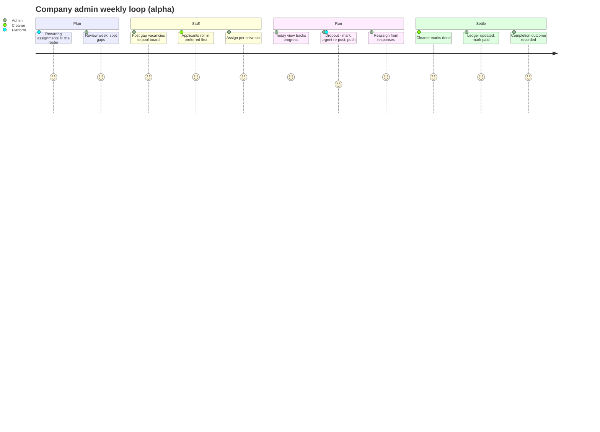
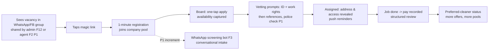

# Product Strategy & Requirements — Cleaning Operations & Recruitment Platform (v1)

**Working title:** CleanerApp (TBD; the co-founders' prototype ships as "Clean App")
**Status:** Draft v0.3 — 2026-08-04
**Owners:** Leonardo Pinheiro (product/engineering), Thiago (industry partner); prototype by two
prospective co-founders (developer + PM), collaboration not yet formalised (Appendix B)
**Market:** Commercial cleaning companies, Gold Coast QLD (initial), Australia (later)

Revision v0.2 (2026-08-04) incorporates the deep-research report, the founder voice notes of
3 August 2026, and the prototype review (Appendix A). Headline changes: the
scheduling/CRM core moves from the future paid tier into the free v1 base; the pool/dispatch loop
from the co-founders' prototype is adopted as the chassis; a WhatsApp share-link bridge precedes the
group automation agent (which moves to P1, accepted risk unchanged); urgent backfill becomes a
first-class flow; the north star changes from placements to jobs run through the platform.
Renamed from `PRD.md` (2026-08-08): the document now spans strategy (thesis, monetisation,
release framing) as well as requirements; per-journey build specs will carry the spec role.
Revision v0.3 (2026-08-04) restructures §3: user journeys organised by job-lifecycle phase, each
with persona, stages, touchpoints, and emotions/pain points (for non-technical readers and as the
roadmap unit), a feature ↔ journey cross-reference (§3.3), and the internal **alpha** definition —
a minimal CRM built directly on the prototype (§3.4).

---

## 1. Objective and Purpose

### 1.1 Problem

Commercial cleaning companies cannot reliably find, screen, schedule, and communicate with cleaners.
Today the process runs through WhatsApp and Facebook job groups plus spreadsheets and memory: a
supervisor posts a job, replies arrive at all hours across multiple threads, promising candidates
are missed or go cold, and there is no structured way to check a candidate's skills, work history,
right to work, or criminal record before a trial shift. The roster is rebuilt by phone at the end of
each day. When an assigned cleaner drops out hours before a deadline job, the company adds labour at
its own cost to deliver on time; this is the sharpest recurring loss event reported in discovery.
Sector evidence confirms this is not one company's problem: staffing shortage and cleaner
reliability are the industry's dominant operational constraints (76% of hotels reported staffing
shortages in the AHLA May 2024 survey; nearly 40% of hosts in a 2025 survey of 554 hosts and
property managers struggled to find dependable local cleaners — see Appendix A). The workforce
is
transient by structure (largely international students who cycle to better jobs), so candidate
acquisition is a permanent need and any pool decays quickly.

Primary discovery sources: the discovery interview with Thiago and the founder voice notes of
3 August 2026 (Appendix A). Key signals:

- Candidate communication (WhatsApp) is the sharpest day-to-day pain: missed replies, poor timing.
- Last-minute dropouts force paid backfill and destroy job margin; fast replacement is where money
  is lost.
- End-of-day roster building ("who is and isn't available tomorrow") is manual and repeated.
- Strong demand for vetting: skills, past issues, criminal record, reviews of cleaners.
- No willingness to pay a subscription for job-management CRM; low job margins; property managers
  bargain rates down, so commission-per-job pricing is judged unworkable.
- No incumbent CRM in use; job flow arrives via Breezeway from property managers.

### 1.2 Product thesis and business alignment

**Become the system of record for cleaning jobs.** v1 is a **free operations-and-recruitment
platform**: a scheduling/CRM core (clients, sites, recurring assignments, rosters) plus the pool,
dispatch, and recruitment funnel that keep it staffed. The two engines share one spine — the
schedule. Once clients, recurring assignments, and preferred cleaners live in the product, every
outbound action is derivable from it: a roster gap, an uncovered job instance, or a dropout each
produce a fully specified **vacancy** (site, time, duration, rate, preferred-cleaner order), and
pool offers, push notifications, WhatsApp posts, and recruitment notices are consumers of
vacancies rather than separate workflows. Job registration and scheduling come first; notifications
and recruitment notices then follow almost for free.

v1 therefore has two jobs:

1. Deliver standalone value on operations and recruitment at zero cost to the company (retention
   driver, word-of-mouth in a small regional market).
2. Accumulate the assets the paid tier needs: company accounts, clients and schedules, the
   candidate pool, job and pay records, and communication history — the data that makes AI
   automation possible and measurable.

**Monetisation: paid AI-assisted automation tier.** The paid tier automates the admin that sits on
top of the free system of record: invoicing, ingestion of jobs from Breezeway/email/calendars,
completion verification, award-rate compliance assistance, reminders and chasing, multi-site
features. The pitch is cost reduction for thin-margin operators who already live in the platform.
Pricing model to be tested with design partners; candidates include per-seat and **outcome-based
pricing tied to measured admin-hours saved** (baseline admin time is measured during the
design-partner phase so the savings claim has evidence).

**Second expansion path: B2B lead generation (future).** Beyond the automation tier, the platform
can monetise the demand side by recommending member cleaning companies to high-value end clients
(hotels, construction firms, property managers) for a per-lead or success fee — the intermediary
role identified as valuable in discovery (Appendix A).
The differentiator is evidence: platform data (vetted-pool size, vetting-tier mix, fill rates,
structured reviews) lets a company be pitched with verifiable credentials no generic lead-gen
service can match, positioned as *compliance-verified suppliers* in a market where underpricing and
non-compliance are systemic. v1 keeps this path open with two hooks: candidate consent wording at
registration covers matching with end clients of the platform (APP 6 secondary use), and
company-level aggregates (fill rate, vetting-tier mix) are derivable from the `Placement`/`Review`
entities.

**Labour hire is gated, not excluded.** Supplying workers directly is a long-term option the
founders want kept open (voice notes, 3 Aug 2026): intermediaries in this market take a large
margin, and the platform's data asset is the credential to enter. It is out of scope for v1 and for
the leads phase, and any entry is gated on a QLD labour-hire licence, employer obligations, a
channel-conflict assessment (it would compete with our own customers), and legal review. Until that
deliberate decision, the platform recommends companies and never supplies workers.

Monetisation sequence: free operations + recruitment (v1) → paid AI-automation tier → leads
marketplace → (optional, gated) licensed supply. Recruitment and the operations core remain free
throughout (§5.4).

### 1.3 Target users

| User | Description | v1 role |
|---|---|---|
| **Company admin** (primary) | Owner/supervisor at an SME commercial cleaning company (1–50 cleaners), Gold Coast | Manages clients and rosters, posts vacancies, reviews candidates, assigns and backfills, records outcomes |
| **Cleaner / candidate** (primary) | Cleaner seeking or doing work; reached via WhatsApp/Facebook job groups; often multilingual, mobile-only | Registers via share link or WhatsApp bot, completes vetting, joins company pools, takes jobs from the board, confirms completion |
| **Platform operator** (internal) | Us | Oversees agent behaviour, vetting ops, group distribution |

### 1.4 Explicitly out of scope for v1 (future paid tier)

Invoicing, payroll, completion verification (photo checklists), Breezeway/PMS/calendar ingestion,
award-rate compliance assistant, customer-lead generation, any money movement (payments,
platform-mediated pay). These are the paid tier's candidates — see §5.4. Nothing in v1 may block
them architecturally. (Rostering and recurring scheduling are **no longer** out of scope; they are
the v1 base, F10.)

---

## 2. Features and Requirements

Priorities: **P0** = required for launch; **P1** = fast follow (≤3 months post-launch); **P2** =
later in v1 life. Agent autonomy levels reference the 0–4 scale in §4.4. F1–F9 keep their v0.1
numbering; F10–F13 are new in v0.2. Reading order for the build: F10 → F11 → F12 → F13 → F1, F4,
F5, F6 → then P1 items (F2, F3, F7, F8 extensions).

### F10 — Scheduling and client CRM core (P0) *(new in v0.2)*

- As a company admin, I can manage **clients and sites** as first-class records: contacts, address,
  access notes, default service type/duration/rate, and an ordered list of **preferred cleaners**
  per client/site.
- As a company admin, I can create **recurring assignments** ("every Tuesday 8:00, 6 h, site X,
  Maria first") that generate job instances, alongside one-off jobs.
- Jobs support **crew size ≥ 1** with per-slot assignment (discovery example: a job priced for two
  cleaners).
- **Roster view**: week-ahead per cleaner and per site, with unfilled slots highlighted.
- **Vacancy** is a core entity: a roster gap, a job instance with no available preferred cleaner,
  or a dropout each produce a vacancy carrying site, time, duration, rate, crew slot, and
  preferred-cleaner order. All distribution features (F11–F13, F2) consume vacancies.
- Requirement: job records use the shared `Job` entity lifecycle (draft → published → shortlisting
  → trialling → filled/closed for recruitment jobs; scheduled → offered → assigned → in progress →
  completed for operational jobs) with margin fields (cleaner pay, optional client charge).

### F11 — Pool and dispatch board (P0) *(new in v0.2; adopted from the co-founders' prototype)*

- Each company has a **private cleaner pool** joined via invite code or share link; a cleaner can
  belong to multiple pools.
- Vacancies post to the pool board; cleaners **apply with one tap**; the admin assigns (or assigns
  directly, skipping the board); applicants see "waiting" state and can withdraw.
- Site address and access notes are revealed to the assigned cleaner only.
- Cleaner marks **job done**; completion feeds the pay ledger, reviews (F6), and metrics (§6).
- **Pay ledger**: the agreed amount is recorded per job; owed/settled state per cleaner
  ("mark paid"). No money movement in v1 — the ledger is a neutral record of agreed amounts, a
  trust feature in a sector with documented pay disputes.
- Cleaner surface is a **PWA with push notifications** (no native app in v1).

### F12 — WhatsApp share-link bridge (P0) *(new in v0.2; precedes F2)*

- Posting a vacancy generates group-ready copy plus a **magic link**; the admin shares it into
  their existing WhatsApp/Facebook groups in one tap from their own phone. No automation of
  WhatsApp itself; zero ToS exposure at this stage.
- A candidate who taps the link registers in under a minute (name, phone, suburb) and lands in that
  company's pool with the job open; full screening/vetting is deferred and prompted afterwards
  (F3/F4).
- The admin sees link performance (taps, registrations, applications) per share.
- Requirement: registration consent (all paths — F12 and F3) covers matching the candidate with
  work opportunities *including with end clients of the platform* — keeps the future leads
  expansion (§1.2) APP-6-compliant without re-consenting the pool.

### F13 — Urgent backfill (P0) *(new in v0.2)*

- As a company admin, I can mark an assigned cleaner as **dropped**; the slot becomes an urgent
  vacancy.
- The platform runs an **offer cascade**: push offers ordered by client preference, then rating,
  then confirmed availability; first-accept wins; the admin confirms the assignment (autonomy:
  offers Level 3, assignment confirmation Level 2).
- If the pool exhausts without acceptance, the admin gets a one-tap re-share pack for their groups
  (F12) and the vacancy opens to recruitment.
- Time-to-backfill is instrumented from day one (§6.2); this flow is the product's hero moment and
  the standard demo.

### F1 — Company onboarding and job posting (P0)

- As a company admin, I can create a company account (ABN, contact, service areas, logo) in under
  10 minutes on mobile or desktop.
- As a company admin, I can create a recruitment job post from a template: role type, suburb(s),
  shift pattern, start date, pay range (with award-rate hint, see F4), required experience/certs,
  crew size, trial-shift details.
- The job post generates: (a) a public candidate-facing landing page, (b) a short share link
  (F12), (c) group-ready post copy.
- Requirement: recruitment posts and operational vacancies share the `Job`/`Vacancy` model (F10).

### F2 — Group distribution agent (P1) — *accepted business risk, see §5.2*

*(v0.2: moved P0 → P1. The share-link bridge (F12) carries acquisition at launch; the agent is the
next increment once the loop is proven. The accepted-risk decision of 2026-08-02 stands.)*

- As a company admin, I can select target WhatsApp groups and Facebook job groups and have the
  platform post vacancies on my behalf, at times I approve.
- The distribution agent monitors group replies and DMs to the posting number, identifies
  responders, and moves each into a 1:1 conversation that redirects to registration (F3/F12).
- As a company admin, I receive a digest ("posted to 6 groups, 23 responses, 11 registered,
  4 passed screening") rather than raw group noise.
- Autonomy: posting is **Level 2** (drafted by agent, sent after admin approval of copy and
  schedule); reply monitoring and 1:1 redirection is **Level 3** (automatic within rules).
- Operational requirements: dedicated number pool, per-company sender identity where feasible,
  rate limits, ban detection with automatic failover to manual-posting mode (the admin falls back
  to F12 share packs and the funnel continues from the landing page). The funnel must degrade
  gracefully: group automation is an acquisition accelerant, not a single point of failure.

### F3 — Candidate intake via WhatsApp screening bot (P1)

*(v0.2: moved P0 → P1. At launch, intake is the F12 magic-link registration with a short form;
the conversational bot deepens screening in the fast follow.)*

- As a candidate, I can start a 1:1 WhatsApp conversation (from a group redirect, QR code, or
  link) and be screened conversationally by an AI agent: name, suburb, transport, experience,
  certifications, languages, availability pattern, work-rights self-declaration.
- The bot operates in the candidate's language where possible (English, others per demand) and at
  any hour — the core fix for "replies with poor timing".
- Screening completes with account creation; the candidate continues in the cleaner PWA (F11).
- Autonomy: **Level 3–4** for intake (fully automatic; escalates to human on abuse, distress,
  ambiguous work-rights answers, or explicit request).
- Requirement: every conversation is logged against the candidate record (audit + future comms
  history).

### F4 — Vetting pipeline (P0 core, P1 extensions)

- **P0 — Identity and right to work:** candidate uploads ID; work rights verified (VEVO check for
  visa holders) before the candidate is marked "ID-verified". Visa work-hour limits captured.
  Manual back-office processing is acceptable at launch; the badge, not the automation, is the
  product.
- **P1 — Structured references:** bot collects up to two past-employer referees and runs a short
  structured reference check conversation (WhatsApp/SMS/call-script for a human); results stored
  as structured fields, not free text.
- **P1 — Police check:** optional Nationally Coordinated Criminal History Check via an
  ACIC-accredited partner, initiated with explicit candidate consent; result stored as a
  pass/flag status + expiry, never the raw record. Cost borne by the requesting company at cost
  (platform does not mark up in v1).
- **P1 — Certifications:** upload and expiry-tracking of relevant certs (e.g. police check,
  Blue Card if applicable, chemical-handling training).
- Vetting status is a tiered badge on the profile: *Registered → ID-verified → Reference-checked →
  Police-checked*. Companies see the tier, and which checks are pending, at a glance — on the
  board, in candidate lists, and in the backfill cascade.
- Compliance requirements: criminal-history data is sensitive information under the Privacy Act —
  explicit consent, minimum retention, no free-text company annotations about criminal history.
  The platform never charges candidates any fee (QLD private-employment-agent rules).
- Company-side trust: company accounts require an ABN before they can operate a pool (prevents
  arbitrary accounts collecting worker data).

### F5 — Candidate database, search, and availability (P0)

- As a company admin, I can search the pool by suburb/radius, availability window, vetting tier,
  experience, and language.
- **Availability capture** (v0.2): cleaners maintain a weekly availability grid plus an
  "available today" toggle; availability surfaces in candidate lists, the roster (F10), and the
  backfill cascade (F13).
- Availability is treated as perishable: any profile whose availability is older than 14 days is
  flagged "stale"; before surfacing a stale candidate in a shortlist or cascade, the platform
  re-confirms availability automatically (Level 3). Freshness comes from re-confirmation at match
  time, not from trusting stored profiles.
- Candidates control visibility (open to offers / paused) and can delete their account (APP
  compliance; hard delete of profile, retention of minimal legal audit records).

### F6 — Shortlisting, AI recommendations, and review workflow (P0 core, P1 extensions)

- For each recruitment job, the platform generates a ranked shortlist with a plain-language
  rationale per candidate (distance, availability match, experience, vetting tier, reference
  summary) and explicit flags for gaps ("availability unconfirmed", "no references yet").
- As a company admin, I review candidates in a pipeline view (new → screened → shortlisted →
  trial booked → hired/rejected), with an AI summary of screening once F3 ships.
- Recommendations are **Level 1** (recommend only — the admin always chooses).
- **P0 — Structured post-job reviews** *(v0.2: promoted from P1, simplified)*: after a completed
  job, the admin completes a three-tap structured review (punctuality, quality, would-rehire) —
  no free-text public ratings. Reviews accumulate **per client–cleaner pair** as well as per
  cleaner; pair history powers preferred-cleaner suggestions (Level 1) and is the data asset
  discovery asked for. Candidates can respond/dispute; disputed reviews are hidden pending
  operator moderation. (Defamation/blacklist risk control — see §5.2.)

### F7 — Messaging (P1)

*(v0.2: moved P0 → P1. At launch, communication runs through structured job events and push
notifications (F11/F13); the unified thread follows.)*

- Unified per-candidate message thread in the company dashboard; delivery via the candidate's
  channel (WhatsApp) with in-app fallback.
- AI assist: drafted replies and translations at **Level 1–2** (draft → admin approves/sends);
  routine logistics (trial reminders, directions, confirmations) at **Level 3** within templates.
- All messages logged to the shared comms history.

### F8 — Trial scheduling and placement (P0 minimal, P1 full)

- **P0**: the first job a cleaner takes with a company is marked as such ("first job with this
  company"); its outcome (completed / no-show) is captured and feeds reviews (F6) and metrics
  (§6). Marking a recruitment job *filled* records a `Placement` — the entity the future paid tier
  meters and the basis for any later placement-fee experiments.
- **P1**: full trial workflow — proposed trial slots, bot-negotiated confirmation, reminders at
  T-24h and T-2h to both sides (the highest-leverage no-show reducer available at this stage).

### F9 — Operator console (P0 minimal)

- Internal dashboard: vetting-ops queue, share-link abuse monitoring, escalation queue, audit log
  search; agent conversation monitoring/takeover, autonomy-level configuration, and WhatsApp
  number-pool health (ban detection) arrive with F2/F3.

### Future tier (not in v1; informs data model only)

AI-assisted automation on the system of record: invoicing, job ingestion from Breezeway/email/
calendars (likely the first paid item for booking-driven operators), completion verification
(photo checklists), award-rate compliance assistant, reminder/chasing automation, multi-site
features, customer-lead marketplace. Freemium gate concept: operations and recruitment stay free;
automation, integrations, and verification are paid (§5.4).

---

## 3. User Experience and Flow

### 3.1 Personas

Journeys in §3.2 reference these personas by name.

- **Thiago — the operator (company admin).** 34, co-owner/supervisor of a Gold Coast commercial
  cleaning company (~12 cleaners; hotel, short-term-rental, and bond cleans). Runs the business
  from his phone between site visits. WhatsApp power user; keeps the roster in his head and a
  spreadsheet; has never used a CRM and is sceptical of software subscriptions. Expects tools to
  be faster than what he does today or he will stop using them. Modelled on our design partner.
- **Ana — the pool cleaner.** 26, international student on a part-time work visa. Cleans for 2–3
  companies; phone-only; English is her second language. Juggles a study timetable, values
  predictable pay, and fears unpaid work and wasted travel. Will install nothing that does not
  visibly lead to work.
- **Priya — the newcomer candidate.** 23, recently arrived in Australia, searching WhatsApp and
  Facebook job groups for cleaning work. No local references, limited local documents knowledge,
  needs income this week. Wary of forms that ask for a lot before showing any jobs.
- **The ops teammate — platform operator (internal).** One of the founding team wearing the
  operations hat: onboarding partners, processing vetting, moderating disputes, and (later)
  supervising agents.

### 3.2 User journeys by job-lifecycle phase

Three release stages structure v1 delivery: **Alpha** (internal test — a minimal CRM layered
directly on the co-founders' prototype, invite-only, run with the founding team's own companies
and their real cleaners; a strict subset of P0), **MVP** (public Gold Coast launch; all P0), and
**P1** (fast follow). Each journey carries its stage badge.

**Journeys are the roadmap unit.** A build cycle implements one or more journeys end-to-end,
releases them to the test cohort, and the next cycle starts; a stage supports a journey completely
or not at all. The phases below follow the cleaning-job lifecycle (the same chain as the research
report: demand → assignment → readiness → execution → verification → closure), with adoption at
the front and relationship-deepening at the back.

#### Phase A — Getting started (adoption)

**CA-1 · Set up the company** — Alpha (concierge) / MVP (self-serve) —
*Persona:* Thiago.
*What he can do:* get his real business into the app in one sitting — company details, clients and
sites, the recurring schedule, and his existing cleaners — so the app is useful on day one.
*Stages:* (1) discovery: hears about the app through the founding team or another operator;
(2) onboarding session: account and ABN, then clients and sites with addresses, access notes,
default service/duration/rate, and preferred cleaners; (3) recurring assignments entered from his
spreadsheet; (4) workforce invite: pool link posted into his existing WhatsApp group; (5) first
look: next morning the roster shows his actual week.
*Touchpoints:* onboarding call or visit (alpha), web dashboard, his WhatsApp group (invite link).
*Emotions & pain points:* sceptical ("I already have a system that sort of works") and allergic to
data entry; the concierge exists because the make-or-break moment is seeing his real week in the
roster without having typed it in himself. Drops out if setup feels like homework.
*Features:* F1, F10, F11.

**CL-1 · Join a company's pool** — Alpha —
*Persona:* Ana.
*What she can do:* join her employer's pool from a link in the group chat and start seeing work,
in under two minutes.
*Stages:* (1) invite link appears in the company WhatsApp group; (2) one-minute signup (name,
phone, suburb); (3) PWA install prompt and push opt-in; (4) the board shows open jobs immediately.
*Touchpoints:* WhatsApp message, mobile browser → PWA, push notifications.
*Emotions & pain points:* wary of another app and of handing over details; converts only because
open jobs are visible straight after signup. Known friction: PWA install and push permissions on
iPhone — must be tested early (§5.3).
*Features:* F11, F5.

**OP-1 · Concierge onboarding** — Alpha —
*Persona:* the ops teammate.
*What they can do:* turn a partner company's spreadsheet and group chat into seeded clients,
recurring assignments, and pool invites; sit with the admin during week one and log every point of
friction.
*Stages:* (1) collect the company's current artefacts; (2) seed data (direct tooling — no console
in alpha); (3) week-one support; (4) friction log feeds the self-serve onboarding backlog (MVP
CA-1).
*Touchpoints:* spreadsheets/chat exports, admin tooling, calls and visits.
*Emotions & pain points:* deliberate manual toil; the pain log is the deliverable.
*Features:* F1, F9, F10.

#### Phase B — Planning the work (demand → schedule)

**CA-2 · Plan the week** — Alpha —
*Persona:* Thiago.
*What he can do:* open the roster and see the whole week — who is on which site, which slots have
nobody — without building it by hand each evening.
*Stages:* (1) recurring assignments generate the week's job instances automatically; (2) he adds
one-off jobs (client, service, time, crew size) faster than typing them into the group; (3) roster
review: gaps are highlighted as vacancies; (4) for each vacancy he chooses a fill route — pool
board (CA-3), direct assign (CA-4), or, from MVP, share to groups (CA-7).
*Touchpoints:* roster and new-job screens (web dashboard or phone).
*Emotions & pain points:* replaces the end-of-day phone-around ("who is and who isn't available")
named in discovery. The bar the new-job form must clear is the prototype's own tagline — faster
than typing it in the group; if it is slower, he reverts.
*Features:* F10, F1.

#### Phase C — Staffing the work (vacancy → assigned)

**CA-3 · Fill a vacancy from the pool** — Alpha —
*Persona:* Thiago.
*What he can do:* post a vacancy to his own pool and pick from cleaners who actually want the job,
instead of messaging people one by one.
*Stages:* (1) vacancy posted to the board; (2) applications arrive with one tap from cleaners —
preferred cleaners for that client listed first, availability shown; (3) he assigns per crew slot;
(4) the cleaner is notified and the roster gap closes.
*Touchpoints:* dashboard, push notifications.
*Emotions & pain points:* control without broadcasting to strangers. The failure feeling is
silence — an empty or unresponsive pool — which is what the recruitment journeys (CA-7, CL-7)
exist to fix; from MVP, vetting badges and ranking (F4/F6) reduce the "who is this person?"
hesitation.
*Features:* F10, F11, F5; F6 from MVP.

**CA-4 · Assign a known cleaner directly** — Alpha —
*Persona:* Thiago.
*What he can do:* give a job straight to the regular ("Maria always does that site") without the
board round-trip.
*Stages:* (1) pick the job; (2) pick the cleaner (preferred list first); (3) assigned and
notified.
*Touchpoints:* dashboard.
*Emotions & pain points:* speed and keeping promises to regulars; this is where client–cleaner
continuity — the reason clients stay — is honoured.
*Features:* F10, F11.

**CL-2 · Find work on the board** — Alpha —
*Persona:* Ana.
*What she can do:* see every open job from every pool she belongs to and apply with one tap,
instead of racing to reply in three group chats.
*Stages:* (1) push or a board glance surfaces a job (time, suburb, service, pay); (2) one-tap
"I'll take it"; (3) waiting state — she can withdraw; (4) assigned (or the job closes).
*Touchpoints:* PWA board, push notifications.
*Emotions & pain points:* the group-chat scramble becomes a fair queue; the anxious spot is the
waiting state, so applications must resolve visibly and quickly. Applying and hearing nothing is
the fastest way to lose her.
*Features:* F11, F5.

**CL-5 · Stay available** — Alpha (toggle) / MVP (weekly grid) —
*Persona:* Ana.
*What she can do:* tell every company she works for, once, when she can work — and be offered jobs
that fit.
*Stages:* (1) alpha: an "available today" toggle; (2) MVP: a weekly availability grid;
(3) staleness handling: if untouched for 14 days, availability is re-confirmed automatically at
match time rather than trusted.
*Touchpoints:* PWA profile, push re-confirmation prompts.
*Emotions & pain points:* control around a shifting study timetable; annoyance if nagged — so
re-confirmation happens only when a real job is at stake.
*Features:* F5, F13.

#### Phase D — Growing and trusting the pool (recruitment & vetting)

**CA-7 · Recruit through his own groups** — MVP —
*Persona:* Thiago.
*What he can do:* turn the WhatsApp groups he already posts in into a structured hiring channel —
without the platform touching WhatsApp itself.
*Stages:* (1) a vacancy generates a share pack: group-ready text plus a magic link; (2) he shares
it to chosen groups from his own phone in one tap; (3) candidates tap through and register
straight into his pool (CL-7); (4) he watches taps → registrations → applications instead of
scrolling 40 unthreaded replies.
*Touchpoints:* his WhatsApp/Facebook groups (his identity, his phone), dashboard funnel view.
*Emotions & pain points:* protective of his reputation in those groups — the post looks exactly
like the ones he writes today. The relief moment: replies stop arriving at 11pm across three
threads and start arriving as structured applicants.
*Features:* F12, F1, F11.

**CL-7 · Register from a group post** — MVP —
*Persona:* Priya.
*What she can do:* go from seeing a job post in a group to being an applicant in that company's
pool in about a minute, at any hour.
*Stages:* (1) sees the vacancy post; (2) taps the magic link; (3) one-minute registration — the
minimum first ask; (4) lands in the pool with the job open and applies; (5) prompted afterwards to
add availability and start vetting (CL-8).
*Touchpoints:* WhatsApp/Facebook group, mobile web → PWA, push.
*Emotions & pain points:* urgency (needs work this week) plus low trust in long forms — so the
first ask is minimal and the reward (a real job, application sent) is immediate. Replaces
messaging into a void and hoping for a timely reply.
*Features:* F12, F11, F4 (consent wording at registration).

**CA-8 · Screen and shortlist candidates** — MVP —
*Persona:* Thiago.
*What he can do:* compare applicants on evidence — vetting badges, distance, availability,
history with his clients — with a ranked shortlist that explains itself.
*Stages:* (1) shortlist ranked with plain-language rationale and explicit gaps ("availability
unconfirmed"); (2) profile view: badges, structured references (P1), pair history; (3) invite to a
first job (marked as such) or book a trial (full workflow in P1).
*Touchpoints:* dashboard pipeline and profile screens.
*Emotions & pain points:* replaces gut-feel hiring of strangers; discovery's ask for "past issues
and criminal record" is answered with structured signals (badges, would-rehire history) — never
free-text gossip, which is a legal boundary (§5.2), and the shortlist only recommends: he always
chooses (autonomy Level 1).
*Features:* F6, F4, F5, F8.

**CL-8 · Get vetted, earn badges** — MVP core; references and police check P1 —
*Persona:* Priya.
*What she can do:* prove she is legitimate once — ID and work rights — and carry that badge to
every company on the platform.
*Stages:* (1) prompted after first registration or application; (2) uploads ID and visa details;
(3) work rights verified (VEVO; manual back-office in MVP); (4) badge appears on her profile;
(5) later tiers: structured references, optional police check with explicit consent (P1).
*Touchpoints:* PWA upload flow; operator-processed checks behind the scenes.
*Emotions & pain points:* motivation — badges visibly unlock more offers; privacy worry handled
with explicit consent, status-only storage (never raw records), and no fees to her, ever.
*Features:* F4, F9.

**CL-10 · Be screened conversationally** — P1 —
*Persona:* Priya.
*What she can do:* complete her whole profile by chatting with an assistant on WhatsApp, in her
own language, at midnight if that is when she is free.
*Stages:* (1) starts a 1:1 chat from a group redirect, QR, or link; (2) the bot asks one question
at a time (experience, transport, certificates, availability, work rights); (3) account created,
profile structured; (4) any moment she can type "human" and a person takes over.
*Touchpoints:* WhatsApp 1:1 chat, escalation to the ops teammate.
*Emotions & pain points:* chat feels natural where forms feel like paperwork; trust requires the
bot to identify itself as an AI assistant and escalation to be real.
*Features:* F3, F7, F9.

**CA-10 · Let the agent do the posting** — P1 (accepted business risk, §5.2) —
*Persona:* Thiago.
*What he can do:* approve a posting plan once and receive a morning digest ("posted to 6 groups,
23 responses, 11 registered, 4 passed screening") instead of doing the rounds himself.
*Stages:* (1) selects target groups; (2) approves agent-drafted copy and schedule (Level 2);
(3) the agent posts and watches replies, moving responders into 1:1 intake (Level 3); (4) digest.
*Touchpoints:* dashboard approval sheet and digest; WhatsApp groups via platform number pool.
*Emotions & pain points:* time back, control retained through approval; trust builds gradually —
which is why this follows the share-link journey rather than launching first.
*Features:* F2, F9.

**OP-2 · Run vetting operations** — MVP —
*Persona:* the ops teammate.
*What they can do:* work a queue of submitted IDs and VEVO checks, issue badges, and leave an
audit trail.
*Stages:* (1) queue item arrives; (2) verify document and work rights; (3) badge issued or
follow-up requested; (4) every decision logged.
*Touchpoints:* operator console (minimal), VEVO workflow, provider portals (P1).
*Emotions & pain points:* accuracy over speed — a wrong badge is a liability (§5.2); the queue and
audit trail exist so this scales past one person.
*Features:* F4, F9.

#### Phase E — Running the job day (execution & disruption)

**CA-5 · Run the day** — Alpha —
*Persona:* Thiago.
*What he can do:* see today's jobs move from scheduled to in-progress to done from wherever he is,
without status-check calls.
*Stages:* (1) today view lists the day's jobs and assignees; (2) cleaners' "job done" taps update
status live; (3) completions flow into the ledger (CL-4) and outcome capture (CA-9).
*Touchpoints:* dashboard today view, push.
*Emotions & pain points:* visibility without nagging; the remaining gap — proof of *quality*, not
just completion — is deliberately a paid-tier feature (photo verification), stated so
expectations are set.
*Features:* F10, F11.

**CA-6 · Recover from a dropout** — Alpha (manual re-post + push blast) / MVP (ordered cascade) —
*Persona:* Thiago.
*What he can do:* turn the worst moment of his week — a cleaner pulling out hours before a
deadline job — into a two-tap drill instead of a panicked phone-around that eats the margin.
*Stages:* (1) dropout message arrives; (2) he marks the cleaner dropped — the slot becomes an
urgent vacancy; (3) alpha: urgent re-post to the board plus a push blast to available pool
members; MVP: an automatic offer cascade ordered by client preference, then rating, then confirmed
availability — first accept wins, he confirms (Level 2/3); (4) if the pool exhausts, a one-tap
share pack re-opens recruitment (CA-7); (5) time-to-backfill is recorded.
*Touchpoints:* dashboard, push; WhatsApp groups as fallback.
*Emotions & pain points:* this is the money-loss moment from discovery (a $500 two-cleaner job
going late) and the product's hero journey; the emotional promise is that panic becomes routine.
*Features:* F13, F10, F11, F5, F12.

**CL-3 · Work an assigned job** — Alpha —
*Persona:* Ana.
*What she can do:* have everything the job needs — address, buzzer code, parking note, map link,
special instructions — in one place, revealed when she is assigned.
*Stages:* (1) assignment push; (2) job card shows site address and access notes (visible to her
only); (3) navigate via maps link; (4) does the work; (5) taps "job done".
*Touchpoints:* PWA job card, push, Google Maps handoff.
*Emotions & pain points:* certainty replaces scrolling chat history for a gate code at 6am;
client privacy is protected by revealing site details only on assignment (§4.3).
*Features:* F11, F10.

**CL-6 · Take an urgent job** — Alpha (push + board) / MVP (first-accept offer) —
*Persona:* Ana.
*What she can do:* pick up same-day paid work the moment someone else drops out.
*Stages:* (1) urgent offer push with pay, time, suburb; (2) one tap to accept (MVP: first accept
wins and she sees win/lose immediately); (3) job card and access details follow.
*Touchpoints:* push, PWA.
*Emotions & pain points:* opportunity — extra income today; fairness matters, so the offer
ordering (preferred → rating → availability) is disclosed rather than mysterious.
*Features:* F13, F5, F11.

#### Phase F — Getting paid and closing the loop (verification & closure)

**CL-4 · Get paid, on record** — Alpha —
*Persona:* Ana.
*What she can do:* see the agreed amount before she starts, what each company owes her, and what
has been settled — a neutral record both sides can point to.
*Stages:* (1) agreed pay is on the job card before acceptance; (2) completion moves it to "to
receive"; (3) the company marks it paid; (4) history accumulates per company.
*Touchpoints:* PWA money screen, push on settlement.
*Emotions & pain points:* directly addresses the sector's documented underpayment and dispute
problem — her biggest fear. The boundary is stated plainly: the app records money, it does not
move it (v1); misunderstanding that would sour trust.
*Features:* F11.

**CA-9 · Close the loop on a job** — Alpha (outcome only) / MVP (three-tap review) —
*Persona:* Thiago.
*What he can do:* in three taps, record how the job went — and get that effort back later as
better shortlists and preferred-cleaner suggestions.
*Stages:* (1) completion prompts an outcome (done / no-show); (2) MVP: three-tap structured
review — punctuality, quality, would-rehire; (3) history builds per cleaner and per
client–cleaner pair; (4) a recruit who sticks is recorded as a `Placement`.
*Touchpoints:* dashboard/PWA prompt after completion.
*Emotions & pain points:* must feel effortless or it will be skipped; the payoff (smarter
suggestions) is deferred, so the ask is kept to seconds. No free-text venting by design — that is
the defamation boundary (§5.2).
*Features:* F6, F8, F10.

**CL-9 · See and answer reviews** — MVP —
*Persona:* Ana.
*What she can do:* see exactly what was recorded about her work, in structured form, and dispute
anything unfair before it affects her offers.
*Stages:* (1) notified of a new review; (2) views the structured ratings; (3) can respond or
dispute; (4) disputed reviews are hidden pending operator moderation (OP-3).
*Touchpoints:* PWA, push.
*Emotions & pain points:* fairness and a right of reply — protection against the informal
blacklisting the current market runs on.
*Features:* F6, F9.

**OP-3 · Moderate disputes and abuse** — MVP —
*Persona:* the ops teammate.
*What they can do:* resolve review disputes and act on share-link abuse within the 48-hour
complaint SLA (§6.5).
*Stages:* (1) dispute or report lands in the queue; (2) evidence review; (3) decision logged,
parties notified.
*Touchpoints:* operator console.
*Emotions & pain points:* consistency and defensibility — every decision is auditable.
*Features:* F9, F6, F12.

#### Phase G — Deepening the relationship (P1)

**CA-11 · One thread per cleaner** — P1 —
*Persona:* Thiago. *What he can do:* see every exchange with a cleaner in one thread, send
AI-drafted replies and translations, and let routine logistics (reminders, directions) go out
automatically from templates.
*Touchpoints:* dashboard messaging; WhatsApp delivery with in-app fallback.
*Emotions & pain points:* ends channel-juggling and "did I reply to her?"; drafts are approved by
him (Level 1–2), so the voice stays his.
*Features:* F7, F3.

**CA-12 · Book trials that show up** — P1 —
*Persona:* Thiago. *What he can do:* propose trial slots, let the assistant negotiate confirmation
with the candidate, and have both sides reminded at T-24h and T-2h — the strongest no-show
reducer available.
*Touchpoints:* dashboard, WhatsApp/push reminders.
*Emotions & pain points:* trial no-shows are wasted site time and lost hope; reminders and
confirmed slots make trials feel less like gambles.
*Features:* F8, F7.

**OP-4 · Supervise the agents** — P1 —
*Persona:* the ops teammate. *What they can do:* watch live agent conversations, take over any of
them, tune autonomy levels per capability, monitor WhatsApp number health, and hit the
kill-switch that drops the platform to manual mode.
*Touchpoints:* operator console.
*Emotions & pain points:* confidence that automation is bounded; the kill-switch (§4.5) is the
control that makes the accepted risk operable.
*Features:* F9, F2, F3.

### 3.3 Feature ↔ journey cross-reference

Read this table to slice the roadmap: shipping a journey requires the listed features at that
journey's stage; a feature is "done" when every journey it touches works end-to-end.

| Feature | Journeys it touches |
|---|---|
| F1 — Onboarding & job posting | CA-1, CA-2, CA-7 |
| F2 — Group distribution agent (P1) | CA-10, OP-4 |
| F3 — Screening bot (P1) | CL-10, CA-11, OP-4 |
| F4 — Vetting pipeline | CL-8, CA-8, CL-7 (consent), OP-2 |
| F5 — Candidate DB & availability | CL-5, CL-2, CA-3, CA-8, CL-6, CA-6 |
| F6 — Shortlists & reviews | CA-8, CA-9, CL-9, OP-3 |
| F7 — Messaging (P1) | CA-11, CA-12, CL-10 |
| F8 — Trials & placement | CA-8, CA-9, CA-12 |
| F9 — Operator console | OP-1, OP-2, OP-3, OP-4, CL-8, CL-9 |
| F10 — Scheduling & client CRM core | CA-1, CA-2, CA-3, CA-4, CA-5, CA-6, CA-9, CL-3 |
| F11 — Pool & dispatch board | CA-1, CA-3, CA-4, CA-5, CA-6, CL-1, CL-2, CL-3, CL-4, CL-6, CL-7 |
| F12 — WhatsApp share-link bridge | CA-7, CL-7, CA-6 (fallback), OP-3 |
| F13 — Urgent backfill | CA-6, CL-6, CL-5 |

### 3.4 Alpha release definition (internal test)

**Purpose.** Prove that a cleaning company will run a real week of operations through the app —
before any acquisition, vetting, or AI is built. The alpha tests the riskiest assumption in §5.1
(roster migration) with the cheapest possible build.

**Users.** 2–3 companies from the founding team's network (Thiago's employer, the co-founders'
employers) and their real cleaners. Invite-only; no public signup.

**Build delta on the prototype** (the entire alpha backlog):

1. Clients and sites as records — extend the prototype's client chips with address, access notes,
   default service/duration/rate, and an ordered preferred-cleaners list (F10).
2. Recurring assignments generating job instances, with crew size ≥ 1 (F10).
3. Roster week view per cleaner/site with unfilled slots as vacancies (F10).
4. Dropout handling: mark dropped → urgent re-post to board + push blast to the pool (F13 minimal).
5. "Available today" toggle on the cleaner profile, shown on applicant lists (F5 minimal).
6. First-job marker and completion outcome capture, including no-show (F8 minimal).

**Kept from the prototype as-is**: auth and roles, pools and invite codes, job creation and the
post/assign/draft flow, one-tap apply, address gating, job-done, pay ledger, PWA push.

**Explicitly absent from the alpha**: public signup, share links, vetting, structured reviews,
shortlisting, messaging, all AI features, all WhatsApp features. Operator journeys are manual
(OP-1 is a person with database access, not a console).

**Exit criteria** (gate to building the MVP layer):

- Two or more companies each run at least two consecutive real weeks with ≥ 80% of their actual
  jobs in the app.
- Schedule depth ≥ 50%: at least half of completed jobs came from recurring assignments, showing
  the app holds operations, not overflow.
- At least one real dropout recovered in-app, with time-to-backfill recorded.
- Cleaners act on push: most offers receive a response (accept or pass) within 2 hours.
- Qualitative: admins report abandoning the spreadsheet / end-of-day phone-around; the recurring
  vs booking-driven vs ad hoc mix is measured from real data (feeds Appendix B q3).

### 3.5 Journey diagrams

**Company admin, weekly loop (alpha: CA-2…CA-6, CA-9).**



**Candidate acquisition flow (MVP: CL-7…CL-9 layered onto the alpha loop).**



### 3.6 Key screens (low-fi wireframe notes)

Wireframes to be produced before build; the prototype supplies working versions of the board, job
detail, pool, and money screens. The roster and job-detail extensions below are alpha scope; the
job pipeline and post-approval sheet are MVP/P1. Intent below.

**Roster (company dashboard, default screen)** *(new in v0.2)*

```
+----------------------------------------------------------------------+
| [Logo]  Roster  Jobs  Clients  Pool  Money            [+ New job]    |
+----------------------------------------------------------------------+
| Week of 3 Aug      Mon      Tue      Wed      Thu      Fri           |
|----------------------------------------------------------------------|
| Emma Brown (office)| Maria  | Maria  |  ---   | Maria  |  GAP (!)    |
| James Wilson (STR) | Ana    |  ---   | Juliana|  ---   | Ana         |
| Olivia Davis       |  GAP(!)| Ana    |  ---   |  ---   |  ---        |
|----------------------------------------------------------------------|
| 2 unfilled slots this week  → [Offer to pool] [Share to groups]      |
+----------------------------------------------------------------------+
```

**Job pipeline (recruitment jobs)** — as v0.1: kanban new → screened → shortlisted → trial →
hired, candidate cards with vetting badges, distance, availability freshness.

**Job detail (from prototype)**: client, address, access notes; cleaner pay / client charge /
margin; applicant list with badges and pair history; assign per crew slot; cancel.

**Cleaner board (PWA, from prototype)**: open vacancies from joined pools; one-tap "I'll take it";
my jobs with address, access notes, maps link, "job done"; money (to receive / received); profile
with pools, availability grid, vetting badges, PWA install prompt.

**Candidate profile (company view):** header (name, suburb, distance, vetting-tier badges,
availability freshness chip) → pair history with this company's clients → structured reference
results → availability grid → conversation history (post-F7) → actions (message / book trial /
pass).

**Post-approval sheet (admin):** generated group copy per group, editable, schedule picker,
per-group toggle — the Level-2 approval surface for F2 (P1).

### 3.7 UX principles

- **The schedule is the source of truth**: every outbound action (offer, post, notification)
  derives from a vacancy; no feature asks the admin to re-describe work the schedule already
  knows.
- **Mobile-first for cleaners, WhatsApp-native**: registration must never require an app
  download; each step survives interruption; the PWA is an upgrade, not a gate.
- **The admin sees signal, not noise**: rosters, digests, and pipelines, never raw group threads.
- **Agent transparency**: bots identify as AI assistants of the platform on first contact; every
  AI recommendation shows its rationale; every automated send is visible in the thread.
- **Trust surfaces**: vetting badges and structured (not free-text) reviews everywhere candidates
  are compared; the pay ledger is visible to both sides.

---

## 4. Technical Specifications

### 4.1 Architecture (proposed)

- **Web app**: responsive SPA/SSR company dashboard + cleaner-facing **PWA with push
  notifications** + public job landing pages. The co-founders' prototype (Vercel-deployed,
  boss/cleaner PWA) is the candidate starting codebase, subject to technical due diligence
  (Appendix B).
- **API + core services**: single backend (modular monolith) with Postgres. Core entities:
  `Company`, `Client`, `Site`, `Job`, `RecurringAssignment`, `Vacancy`, `Pool`, `PoolMembership`,
  `Candidate`, `Conversation`, `VettingCheck`, `Reference`, `Trial`, `Placement`, `PayRecord`,
  `Review`, `AgentAction` (audit). Reviews are queryable per client–cleaner pair; preferred-cleaner
  ordering lives on the client/site relationship; `Job` carries crew size. Entity lifecycle
  designed for the paid automation tier (jobs, schedules, comms history, pay records are shared
  assets).
- **Agent layer**: LLM-driven agents (Anthropic Claude API) for screening, summarisation,
  drafting, ranking rationale; tool-use pattern with typed tools; all actions written to
  `AgentAction` with inputs, model/version, confidence, approval state, and outcome.
- **Messaging gateway**: abstraction over channels — push (PWA), and for F2/F3: (a) WhatsApp
  *unofficial* client pool (group posting + monitoring; Baileys-class library) and (b) WhatsApp
  Business Cloud API where usable for 1:1 — behind one interface so channels can be swapped as
  risk dictates (§5.2). Queue-based (jobs/retries) with idempotent sends.
- **Vetting integrations**: VEVO workflow (manual ops acceptable at launch); ACIC-accredited
  check provider API (P1).

### 4.2 Performance and reliability targets

| Metric | Target |
|---|---|
| Backfill offer dispatch (dropout marked → first push offers sent) | < 60 s |
| Bot reply latency (candidate messages, post-F3) | p50 < 15 s, p95 < 60 s |
| Digest generation | Within 15 min of scheduled time |
| Dashboard page load | p95 < 2 s |
| Platform availability | 99.5% (v1; no on-call theatre for a free product) |
| Message/push delivery | At-least-once with dedupe; zero silent drops (undeliverable → surfaced to operator queue) |
| Scale envelope (v1) | ≤200 companies, ≤10k candidates, ≤500 concurrent bot conversations |

### 4.3 Security, privacy, and compliance rules

- **Privacy Act / APP compliance**: privacy policy + collection notices at intake; candidate data
  used only for recruitment and job-coordination purposes; export and deletion self-service for
  candidates.
- **Sensitive information**: criminal-history status requires explicit, purpose-specific consent;
  store outcome status + expiry only (never raw record contents); access restricted to the
  requesting company and operator vetting role; auto-purge on expiry/withdrawal.
- **PII handling**: encryption in transit and at rest; ID documents in restricted object storage
  with short-lived signed URLs; role-based access (company admins see only their pipeline's and
  pool's candidates' full profiles; pool search shows limited profiles until candidate consents to
  share with that company). **Client addresses and access notes** are PII/security-sensitive:
  revealed only to the assigned cleaner, only for the assignment window, and access is logged.
- **No fees to workers, ever** (QLD private employment agent code of conduct). Enforced at the
  product level: no candidate-side payment surface exists.
- **AI guardrails**: autonomy levels enforced server-side per capability (§4.4); outbound
  messages from templates or approved drafts only; pay figures in any message must come from the
  job record, never model-generated; prompt-injection posture — candidate/group messages are
  untrusted input, never instructions; abuse/PII-leak filters on both directions.
- **Auditability**: every agent action, override, approval, vetting decision, assignment, and
  ledger change is logged and queryable (also the trust basis for the paid tier).
- **Data residency**: Australian region hosting preferred; document any offshore LLM processing
  in the privacy policy; no candidate PII in model fine-tuning.

### 4.4 Agent autonomy matrix (enforced configuration)

| Capability | Level | Meaning |
|---|---|---|
| Backfill offer cascade (F13) | 3 | Offers sent automatically within rules (preference → rating → availability) |
| Backfill assignment confirmation | 2 | Admin confirms the winning acceptance |
| Preferred-cleaner suggestions (F6) | 1 | Recommend only |
| Group post drafting/scheduling (F2) | 2 | Send only after admin approval |
| Group reply monitoring → 1:1 redirect (F2) | 3 | Automatic within rules |
| Candidate screening conversation (F3) | 3–4 | Autonomous; escalate on defined triggers |
| Availability re-confirmation (F5) | 3 | Automatic, templated |
| Shortlist ranking + rationale (F6) | 1 | Recommend only |
| Reply drafting/translation to candidates (F7) | 1–2 | Draft; admin sends (routine templates: 3) |
| Trial/job reminders (F8, F11) | 3 | Automatic, templated |
| Reference-check conversation (F4) | 3 | Autonomous; human review of results |
| Anything involving pay negotiation, rejection messages, review publication | 2 | Always human-approved |

Escalation triggers (to operator/admin): abuse or distress cues, work-rights ambiguity, low
confidence, candidate requests a human, legal/complaint language, repeated misunderstanding.

### 4.5 WhatsApp risk engineering (accepted risk, contained; applies from F2 in P1)

- Dedicated number pool isolated from any business-critical numbers; warm-up schedules;
  per-number rate limits and human-like send pacing.
- Ban detection (health checks, delivery anomalies) → automatic quarantine of the number,
  re-route conversations through the pool, operator alert.
- **Kill-switch and degraded mode**: one flag disables all group automation; product remains
  fully functional via the F12 share packs + link/QR intake. Target: no more than 20%
  funnel-volume loss in degraded mode.
- Candidate 1:1 threads migrated to official Business API numbers where template/opt-in
  constraints allow, shrinking the unofficial surface over time.

---

## 5. Assumptions and Constraints

### 5.1 Assumptions (to validate continuously)

- Companies will move their roster into the app if migration is concierge'd (clients, recurring
  assignments, and cleaner invites seeded for them during onboarding). A dispatch board without
  client memory competes with a WhatsApp message; the roster competes with the spreadsheet and the
  end-of-day phone-around, which is where switching cost pays back.
- Cleaners will tap a share link from a group and complete the 1-minute registration (target ≥40%
  tap → registered; measured from day one), and will accept PWA push as the offer channel.
- The share-link loop recruits enough candidates that the agent automation (F2) is an accelerant,
  not a prerequisite.
- Group admins tolerate member-shared vacancy posts (they look like today's manual posts because
  the admin sends them).
- Availability re-confirmation at match time is sufficient to keep the pool useful despite decay.
- The free tier generates enough engagement data (schedules, jobs, pay records, comms) to make the
  automation upsell natural rather than a cold cross-sell, and to ground savings-based pricing.
- Discovery beyond n=1: the requirements-discovery questionnaire (Appendix A) is run
  with 5–10 more operators during the build; findings may reprioritise P1/P2 items — in
  particular the recurring vs booking-driven vs ad hoc mix, which sizes F10 (Appendix B).

### 5.2 Risks

| Risk | Severity | Position / mitigation |
|---|---|---|
| **Meta ToS violation** (unofficial WhatsApp group automation; FB Groups API is closed) | High | **Accepted business risk** by decision 2026-08-02; unchanged in v0.2, now entering at P1 (F2) after the zero-exposure share-link bridge (F12). Contained per §4.5: number-pool isolation, ban detection, kill-switch, degraded manual mode. Re-review if ban cadence makes CAC unsustainable or Meta escalates beyond number bans (legal contact). |
| Worker-classification / regulatory drift (labour-hire licensing QLD; digital-platform "employee-like worker" reforms) | High | v1 remains an introduction/coordination platform: no engagement of workers by the platform, no commission on hours, no platform-mediated pay (the ledger records, never moves, money). **v0.2 widens the legal-review scope**: confirm that dispatch + pay ledger for companies' own workers does not constitute labour-hire "arranging" under the QLD Act. Any future placement-fee, pay-mediation, or supply feature triggers legal review first (§1.2 gate). |
| Defamation/blacklist exposure from cleaner reviews | Medium | Structured-only reviews, dispute flow, moderation (F6). No free-text public ratings in v1. |
| Vetting liability (wrong or stale check results) | Medium | Checks via accredited provider; show status+date, never platform judgements ("safe"); disclaimers; expiry tracking. |
| Cold start / thin pool | High | **Largely mitigated in v0.2**: private pools are useful with the company's existing workforce on day one; share links recruit from existing groups; seed via Thiago's and the co-founders' companies; Gold Coast only until liquidity. |
| MVP scope creep (scheduling core is a bigger build than dispatch-only) | Medium | F10 is the deliberate trade (see the prototype review, Appendix A); contain by shipping the roster read-model first (recurring assignments + gaps) and deferring drag-and-drop niceties; validate the recurring share with design partners before deepening (Appendix B). |
| Co-founder alignment (two visions, one codebase; ownership unresolved) | Medium | Explicit alignment discussion before build (prototype review, Appendix A); technical due diligence on the prototype; formalise roles/equity/IP before significant joint work. |
| Free-tier cost burn (LLM + infra + checks) | Medium | Police checks at cost pass-through; LLM cost budget per funnel stage monitored (§6 guardrails); model-tier down-shift for routine turns; the P0 build is deliberately light on LLM usage (agents concentrate in P1). |
| Stale availability undermines trust | Medium | Freshness flag + Level-3 re-confirmation (F5); shortlist/cascade never shows unconfirmed availability as confirmed. |
| Single-source discovery bias | Medium | Structured interviews with 5–10 operators in parallel (§5.1); cleaner-side interviews too (prototype review, Appendix A). |
| Paid tier never converts (freemium trap) | Medium | Instrument upsell signals from day one (§6.4); measure baseline admin hours at design partners for savings-based pricing; revisit monetisation at month 6 with real data (placement-fee experiment is the fallback, gated on legal review). |

### 5.3 Constraints and dependencies

- **Team**: Leonardo (product/AI engineering), Thiago (industry partner), plus two prospective
  co-founders (developer + PM) with a deployed prototype; collaboration, roles, and code ownership
  not yet formalised — a build dependency, not just a governance question (Appendix B). Commercial/
  sales capacity is the unfilled function. Scope discipline remains the primary constraint — the
  P0 list must fit roughly a quarter of part-time build effort across the team. No native mobile
  apps in v1.
- **Dependencies**: prototype technical due diligence; ACIC-accredited check provider agreement
  (P1 blocker); WhatsApp number acquisition pipeline (P1, F2); Anthropic API; Australian-region
  hosting; legal review of terms, privacy policy, candidate consent flows, and the labour-hire
  "arranging" question before public launch.
- **Technical constraints**: Facebook group posting has no API — manual share packs only in v1;
  WhatsApp Business API cannot initiate contact without opt-in templates (hence
  candidate-initiated design); PWA push has platform quirks on iOS (test early — it is the offer
  channel); LLM latency budget bounds conversational UX (§4.2).
- **Budget guardrail**: free tier must run at < a defined cost per active company per month
  (set target after first month's telemetry; instrument from day one).

### 5.4 Freemium boundary (forward constraint)

Everything in §2 stays free permanently: the operations core (clients, rosters, recurring
assignments, pool, dispatch, pay ledger) **and** the recruitment funnel (share links, vetting
badges, shortlists, reviews). "Free to run your cleaning operation and hire" is the market
promise — retracting it would burn trust in a small community, and the free core is what captures
the data the paid tier needs. The paid tier is built from *new automation surfaces on top*:
invoicing, Breezeway/email/calendar ingestion, completion verification, award-rate assistance,
reminder/chasing automation, multi-site features, and later the leads marketplace. v1 must not
accidentally give away flagship paid features: the ledger records amounts but never generates
invoices; job instances come from in-app recurring assignments, not from external ingestion.

---

## 6. Success Metrics

North-star (v1, revised v0.2): **completed jobs run through the platform per week** — the direct
measure of the system-of-record thesis. Placements (trial → hired) become an input metric (§6.2).

### 6.1 Acquisition and activation

| Metric | Target (month 3 post-launch) |
|---|---|
| Registered companies (Gold Coast) | ≥ 25 |
| Activation: companies with ≥1 client + ≥1 recurring assignment + ≥3 pool members in first 14 days | ≥ 60% |
| Candidate registrations | ≥ 500 |
| Share-link funnel: tap → completed registration | ≥ 40% |
| % of new cleaners arriving via share links (vs direct invite) | ≥ 30% (measures the bridge) |

### 6.2 Funnel and operations effectiveness (the product promise)

| Metric | Target |
|---|---|
| Registered candidates per posted recruitment job | ≥ 8 |
| Time from job posted → first shortlist of ≥3 vetted candidates | ≤ 48 h |
| **Median time-to-backfill (urgent vacancies)** | < 2 h during design-partner phase (hedged until measured) |
| First-job no-show rate (with reminders) | ≤ 15% |
| Jobs filled through platform | ≥ 40% of posted vacancies within 14 days |
| Placements (trial → hired) per month | tracked; input to north star |

### 6.3 Retention, trust, and data depth

| Metric | Target |
|---|---|
| Weekly active companies (≥1 job run through the platform) | ≥ 60% of registered companies |
| **Schedule depth: % of completed jobs generated from recurring assignments** | ≥ 50% by month 3 (else the app holds overflow work, not operations) |
| % of completed jobs with client charge recorded (margin data) | ≥ 40% |
| % of completed jobs with a structured review | ≥ 60% |
| % of active cleaners at ID-verified tier or above | ≥ 50% |
| Candidate pool freshness (availability confirmed ≤14 days) | ≥ 60% of active pool |
| Company NPS / qualitative check-ins | ≥ 30 / monthly interviews logged |
| Review disputes upheld against companies | < 10% of reviews (else review design is broken) |

### 6.4 Freemium leading indicators (automation-tier upsell readiness)

- % of companies using post-hire surfaces (roster, ledger, reviews) weekly after their first fill.
- Volume of job records per company per month (proxy for automation value).
- Measured admin hours per week at design partners (baseline for savings-based pricing).
- Explicit willingness-to-pay signals from monthly interviews (logged, not anecdotal).
- Decision gate: revisit monetisation at month 6 with this data.

### 6.5 Guardrail metrics (must not breach)

| Guardrail | Threshold |
|---|---|
| WhatsApp number ban rate (from F2, P1) | < 1 ban / number / month sustained; breach → degraded mode + risk re-review (§5.2) |
| Agent escalation SLA (human response to escalated conversation) | ≤ 4 business hours |
| Complaints (candidates or group admins) | Any complaint reviewed within 48 h; pattern → posting-frequency change |
| LLM + infra cost per active company per month | Within budget guardrail (§5.3) |
| Privacy incidents | 0 tolerated; any incident triggers stop-ship review |

---

## Appendix A — Source material

Research source files live in the founders' private research repository; they are summarised
here rather than linked.

- Discovery interview with Thiago (industry partner) — CRM willingness-to-pay, vetting and leads
  demand, WhatsApp communication pain.
- Deep research report on job-management issues across hotel, STR, post-construction, and
  commercial cleaning (sources: BLS, OSHA/NIOSH, AHLA, FWO, CAF, Labour Hire Authority, vendor
  docs, forums).
- Requirements-discovery questionnaire (used for the 5–10 operator interviews, §5.1), including
  the 0–4 agent-autonomy scale (§4.4).
- Founder voice notes, 3 August 2026 (private) — origin story, dropout economics, monetisation
  reasoning, labour-hire ambition, co-founders.
- Co-founders' prototype — [clean-app-gamma-inky.vercel.app](https://clean-app-gamma-inky.vercel.app)
  (two-sided pool/dispatch PWA).
- Prototype and strategy review, 3 August 2026 — prototype walkthrough and assessment, MVP
  definition, north star, and go-to-market underlying the v0.2 revision.

## Appendix B — Open questions

1. **Co-founder alignment**: shared vision (chassis + scheduling core + growth layer, per the
   prototype review), roles, equity, and ownership of the prototype code — before significant joint
   build.
2. **Prototype due diligence**: stack, code quality, data model distance from §4.1 — determines
   extend vs rebuild.
3. **Sizing the scheduling core** with design partners: recurring vs booking-driven vs ad hoc mix,
   crew-size frequency, and how the roster is run today (spreadsheet, group chat, memory). If
   partners are mostly booking-driven, calendar/Breezeway ingestion may move ahead of deeper
   recurring features.
4. Which ACIC-accredited check provider (pricing, API, turnaround)?
5. Reference checks: fully bot-run vs. human-assisted (cost vs. trust trade-off)?
6. Candidate-side value adds worth v1 effort (e.g. profile shareable outside the platform)?
7. Naming/brand ("Clean App" vs new), and whether F2 posts under the platform's identity or the
   company's in groups.
8. Legal review scope and budget — terms, privacy, vetting consent flows, **dispatch + pay ledger
   vs labour-hire "arranging" (QLD)**, client-address privacy — before public launch.
9. Does Thiago's company serve as design partner with a formalised arrangement (feedback cadence,
   early access, case study)? Can the co-founders' employers join as design partners too?
