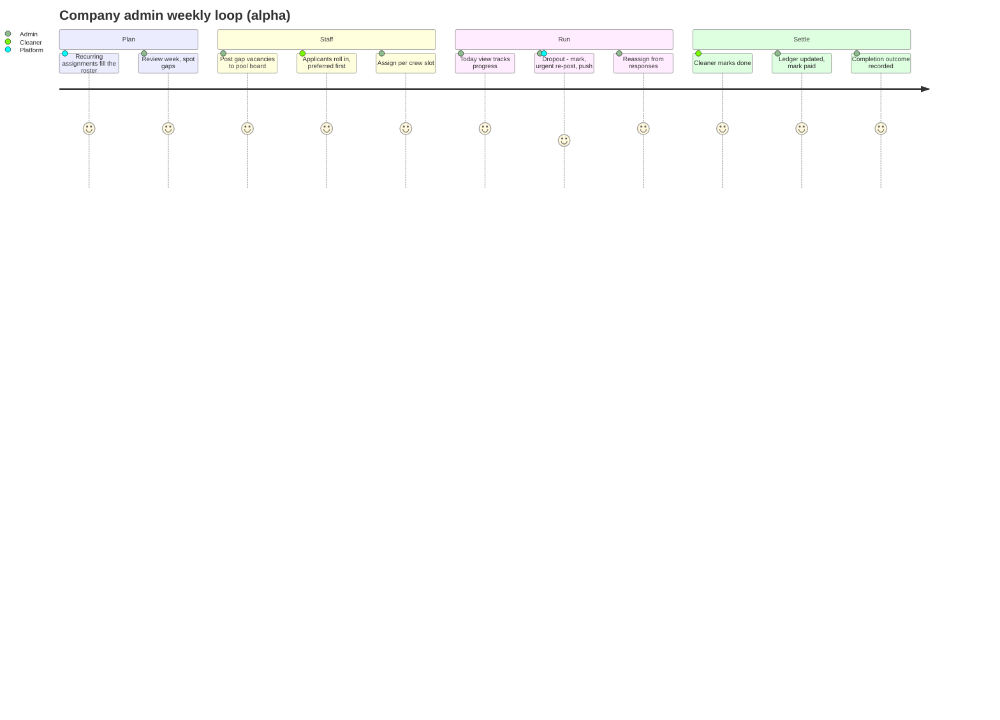
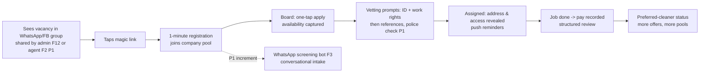

# Product Strategy & Requirements — Cleaning Operations & Recruitment Platform (v1)

**Working title:** The Clean Crew (the co-founders' prototype ships as "Clean App")
**Status:** Draft v0.4 — 2026-08-12
**Owners:** Leonardo Pinheiro (product/engineering), Thiago (industry partner); prototype by two
prospective co-founders (developer + PM), collaboration not yet formalised (Appendix B)
**Market:** Commercial cleaning companies, Gold Coast QLD (initial), Australia (later)

**Revision v0.2 (2026-08-04)** incorporates the deep-research report, the founder voice notes of
3 August 2026, and the prototype review (Appendix A). Headline changes:

- The scheduling/CRM core moves from the future paid tier into the free v1 base.
- The pool/dispatch loop from the co-founders' prototype becomes the platform base.
- A WhatsApp share-link bridge precedes the group automation agent. The agent moves to P1; the
  accepted risk is unchanged.
- Urgent backfill becomes a first-class flow.
- The north-star metric changes from placements to jobs run through the platform.

**Rename (2026-08-08)** from `PRD.md`: the document now covers strategy (thesis, monetisation,
release framing) as well as requirements. Per-journey build specs carry the spec role.

**Revision v0.3 (2026-08-04)** restructures §3:

- User journeys are organised by job-lifecycle phase. Each journey lists persona, stages,
  touchpoints, and emotions/pain points. The journey is the roadmap unit, written for
  non-technical readers as well.
- A feature ↔ journey cross-reference (§3.3).
- The internal **alpha** definition — a minimal CRM built directly on the prototype (§3.4).

**Revision v0.4 (2026-08-12)** incorporates the founder conversation of 9 August 2026 (the group
approved the proposal without comments):

- New feature **F14 — job chat and field events**. Structured events enter with the alpha dropout
  cycle. The per-job thread is MVP P0. AI assist merges with F7 in P1.
- New journeys CL-11/CA-13 (Phase E) and CL-12 (Phase B).
- The cleaner weekly agenda (F11), and job-type preferences with a typed board (F5/F11).
- F7 is re-scoped as aggregation + AI over job threads.
- This document is now canonical in this repository. The `personal_website` sync is retired.
- §3.2/§3.4/§4.1/§5.3 and Appendix B q2 now align with two recorded decisions: the alpha runs
  entirely on the monorepo apps, with the prototype as reference material only and never a
  starting codebase (decisions 0001/0002); qualitative partner validation replaces the alpha
  exit-criteria gate (product decision 2026-08-10).
- v0.4 also records the cleaner surface strategy in §4.1/§5.3: a wrapper-ready PWA, with a
  Capacitor store shell only on alpha push evidence (decision 0004).

---

## 1. Objective and Purpose

### 1.1 Problem

Commercial cleaning companies cannot reliably find, screen, schedule, and communicate with
cleaners. Today the process runs through WhatsApp and Facebook job groups plus spreadsheets and
memory. A supervisor posts a job. Replies arrive at all hours across multiple threads. The
supervisor misses promising candidates, or the candidates go cold. There is no structured way to
check a candidate's skills, work history, right to work, or criminal record before a trial shift.
The company rebuilds the roster by phone at the end of each day. When an assigned cleaner drops
out hours before a deadline job, the company adds labour at its own cost to deliver on time. This
is the sharpest recurring loss event reported in discovery.

Sector evidence confirms this is not one company's problem. Staffing shortage and cleaner
reliability are the industry's dominant operational constraints. In the AHLA May 2024 survey, 76%
of hotels reported staffing shortages. In a 2025 survey of 554 hosts and property managers,
nearly 40% struggled to find dependable local cleaners (Appendix A). The workforce is transient
by structure: it is largely international students who move on to better jobs. Candidate
acquisition is therefore a permanent need, and any pool decays quickly.

Primary discovery sources: the discovery interview with Thiago and the founder voice notes of
3 August 2026 (Appendix A). Key signals:

- Candidate communication (WhatsApp) is the sharpest day-to-day pain: missed replies, poor timing.
- Last-minute dropouts force paid backfill and destroy job margin. Slow replacement is where the
  company loses money.
- Roster construction at the end of each day ("who is and isn't available tomorrow") is manual
  and repeated.
- Strong demand for vetting: skills, past issues, criminal record, reviews of cleaners.
- Companies will not pay a subscription for a job-management CRM. Job margins are low. Property
  managers bargain rates down, so commission-per-job pricing is judged unworkable.
- No incumbent CRM is in use; job flow arrives via Breezeway from property managers.

### 1.2 Product thesis and business alignment

**Become the system of record for cleaning jobs.** v1 is a **free operations-and-recruitment
platform**. It combines a scheduling/CRM core (clients, sites, recurring assignments, rosters)
with the pool, dispatch, and recruitment funnel that keep the schedule staffed. The two engines
share one backbone: the schedule. Once clients, recurring assignments, and preferred cleaners
live in the product, the platform can derive every outbound action from them. A roster gap, an
uncovered job instance, or a dropout each produce a fully specified **vacancy** (site, time,
duration, rate, preferred-cleaner order). Pool offers, push notifications, WhatsApp posts, and
recruitment notices consume vacancies; they are not separate workflows. Job registration and
scheduling come first. Notifications and recruitment notices then follow with little extra work.

v1 therefore has two jobs:

1. Deliver standalone value on operations and recruitment at zero cost to the company. This
   drives retention and word-of-mouth in a small regional market.
2. Accumulate the assets the paid tier needs: company accounts, clients and schedules, the
   candidate pool, job and pay records, and communication history. This data makes AI automation
   possible and measurable.

**Monetisation: paid AI-assisted automation tier.** The paid tier automates the admin work that
sits on top of the free system of record: invoicing, ingestion of jobs from
Breezeway/email/calendars, completion verification, award-rate compliance assistance, reminders
and chasing, and multi-site features. The pitch is cost reduction for thin-margin operators who
already live in the platform. The pricing model will be tested with design partners. Candidates
include per-seat pricing and **outcome-based pricing tied to measured admin-hours saved**. The
team measures baseline admin time during the design-partner phase, so the savings claim has
evidence.

**Second expansion path: B2B lead generation (future).** Beyond the automation tier, the platform
can monetise the demand side. It can recommend member cleaning companies to high-value end
clients (hotels, construction firms, property managers) for a per-lead or success fee — the
intermediary role identified as valuable in discovery (Appendix A). The differentiator is
evidence. Platform data (vetted-pool size, vetting-tier mix, fill rates, structured reviews) lets
the platform pitch a company with verifiable credentials that no generic lead-generation service
can match. The pitch positions members as *compliance-verified suppliers* in a market where
underpricing and non-compliance are systemic. v1 keeps this path open with two hooks: candidate
consent wording at registration covers matches with end clients of the platform (APP 6 secondary
use); and company-level aggregates (fill rate, vetting-tier mix) are derivable from the
`Placement`/`Review` entities.

**Labour hire is gated, not excluded.** Direct supply of workers is a long-term option the
founders want to keep open (voice notes, 3 Aug 2026). Intermediaries in this market take a large
margin, and the platform's data asset is the credential to enter. Direct supply is out of scope
for v1 and for the leads phase. Any entry is gated on four items: a QLD labour-hire licence,
employer obligations, a channel-conflict assessment (it would compete with our own customers),
and legal review. Until that deliberate decision, the platform recommends companies and never
supplies workers.

Monetisation sequence: free operations + recruitment (v1) → paid AI-automation tier → leads
marketplace → (optional, gated) licensed supply. Recruitment and the operations core stay free
throughout (§5.4).

### 1.3 Target users

| User | Description | v1 role |
|---|---|---|
| **Company admin** (primary) | Owner/supervisor at an SME commercial cleaning company (1–50 cleaners), Gold Coast | Manages clients and rosters, posts vacancies, reviews candidates, assigns and backfills, records outcomes |
| **Cleaner / candidate** (primary) | Cleaner who seeks or does work; reached via WhatsApp/Facebook job groups; often multilingual, mobile-only | Registers via share link or WhatsApp bot, completes vetting, joins company pools, takes jobs from the board, confirms completion |
| **Platform operator** (internal) | Us | Oversees agent behaviour, vetting ops, group distribution |

### 1.4 Explicitly out of scope for v1 (future paid tier)

Out of scope: invoicing, payroll, completion verification (photo checklists),
Breezeway/PMS/calendar ingestion, the award-rate compliance assistant, customer-lead generation,
and any money movement (payments, platform-mediated pay). These are candidates for the paid
tier — see §5.4. Nothing in v1 may block them architecturally. Rosters and recurring schedules
are **no longer** out of scope; they are the v1 base (F10).

---

## 2. Features and Requirements

Priorities: **P0** = required for launch; **P1** = fast follow (3 months or less after launch);
**P2** = later in v1 life. Agent autonomy levels reference the 0–4 scale in §4.4. F1–F9 keep
their v0.1 numbers. F10–F13 are new in v0.2; F14 is new in v0.4. Reading order for the build:
F10 → F11 → F12 → F13 → F14 → F1, F4, F5, F6 → then the P1 items (F2, F3, F7, F8 extensions).

### F10 — Scheduling and client CRM core (P0) *(new in v0.2)*

- As a company admin, I can manage **clients and sites** as first-class records: contacts,
  address, access notes, default service type/duration/rate, and an ordered list of **preferred
  cleaners** per client/site.
- As a company admin, I can create **recurring assignments** ("every Tuesday 8:00, 6 h, site X,
  Maria first") and one-off jobs. Recurring assignments generate job instances.
- Jobs support **crew size ≥ 1** with per-slot assignment. Discovery example: a job priced for
  two cleaners.
- **Roster view**: a week-ahead view per cleaner and per site. The view highlights unfilled
  slots.
- **Vacancy** is a core entity. A roster gap, a job instance with no available preferred cleaner,
  or a dropout each produce a vacancy. The vacancy carries site, time, duration, rate, crew slot,
  and preferred-cleaner order. All distribution features (F11–F13, F2) consume vacancies.
- Requirement: job records use the shared `Job` entity lifecycle, with margin fields (cleaner
  pay, optional client charge). Recruitment jobs: draft → published → shortlisting → trialling →
  filled/closed. Operational jobs: scheduled → offered → assigned → in progress → completed.

### F11 — Pool and dispatch board (P0) *(new in v0.2; adopted from the co-founders' prototype)*

- Each company has a **private cleaner pool**. Cleaners join via invite code or share link. A
  cleaner can belong to multiple pools.
- Vacancies post to the pool board. Cleaners **apply with one tap**. The admin assigns from the
  applicants, or assigns directly and skips the board. Applicants see a "waiting" state and can
  withdraw.
- Board vacancies carry their **service type**. The board lists first the jobs that match the
  cleaner's job-type preferences (F5) and availability *(v0.4)*.
- **Cleaner weekly agenda** *(v0.4)*: assignments from every joined pool assemble automatically
  into a single week view. The cleaner's schedule builds itself from accepted jobs. Each entry
  opens the job card.
- The platform reveals site address and access notes to the assigned cleaner only.
- The cleaner marks a **job done**. Completion feeds the pay ledger, reviews (F6), and metrics
  (§6).
- **Pay ledger**: the platform records the agreed amount per job, with owed/settled state per
  cleaner ("mark paid"). No money movement in v1. The ledger is a neutral record of agreed
  amounts — a trust feature in a sector with documented pay disputes.
- The cleaner surface is a **PWA with push notifications** (no native app in v1).

### F12 — WhatsApp share-link bridge (P0) *(new in v0.2; precedes F2)*

- When the admin posts a vacancy, the platform generates group-ready copy plus a **magic link**.
  The admin shares it into their existing WhatsApp/Facebook groups in one tap from their own
  phone. The platform does not automate WhatsApp itself; ToS exposure is zero at this stage.
- A candidate who taps the link registers in under a minute (name, phone, suburb). The candidate
  lands in that company's pool with the job open. The platform defers full screening/vetting and
  prompts for it afterwards (F3/F4).
- The admin sees link performance (taps, registrations, applications) per share.
- Requirement: registration consent (all paths — F12 and F3) covers matches between the candidate
  and work opportunities, *including with end clients of the platform*. This keeps the future
  leads expansion (§1.2) APP-6-compliant without new consent from the pool.

### F13 — Urgent backfill (P0) *(new in v0.2)*

- As a company admin, I can mark an assigned cleaner as **dropped**. The slot becomes an urgent
  vacancy.
- The platform runs an **offer cascade**: push offers ordered by client preference, then rating,
  then confirmed availability. The first cleaner to accept wins. The admin confirms the
  assignment. Autonomy: offers at Level 3; assignment confirmation at Level 2.
- If the pool exhausts without an acceptance, the admin gets a one-tap re-share pack for their
  groups (F12), and the vacancy opens to recruitment.
- The platform instruments time-to-backfill from day one (§6.2). This flow is the product's
  showcase moment and the standard demo.

### F14 — Job chat and field events (P0 core, P1 extensions) *(new in v0.4; events enter in alpha)*

- Every job carries its own **thread** between the assigned cleaner and the company. The thread
  opens at assignment and becomes read-only a few days after completion. The read-only tail
  covers lost property and pay follow-ups. The platform logs messages, photos, and events on the
  job record.
- **Structured field events come first** — one-tap buttons, with a photo attached where relevant:
  **can't attend** (the slot becomes an urgent vacancy and triggers F13); **report issue**
  (damage / missing supplies / access problem); **lost & found**; and the admin-side **extra
  charge** (a structured amount — the platform updates the ledger entry, notifies the cleaner,
  and audits the change fully).
- Design principle: the job card answers logistics (address, time, duration, pay, access notes,
  instructions); the thread exists for exceptions. Schedule-shaped messages are events that
  trigger flows — never free text an admin can miss.
- Guardrails: assignment gates the participants (the assigned cleaner and company admins only).
  Pay figures are always structured, never negotiated in prose (human-approved per §4.4). Photos
  go to restricted storage on the job record. Client contact details never appear in the thread.
  Abuse reports escalate to the operator queue (OP-3).
- Staging: structured events land with the alpha dropout cycle (§3.4). The free-text per-job
  thread is MVP P0. AI assist (drafted replies, translations, inbound "can't come" detection) is
  P1 and merges with F7's unified view.

### F1 — Company onboarding and job posting (P0)

- As a company admin, I can create a company account (ABN, contact, service areas, logo) in
  under 10 minutes on mobile or desktop.
- As a company admin, I can create a recruitment job post from a template: role type, suburbs,
  shift pattern, start date, pay range (with an award-rate hint, see F4), required
  experience/certs, crew size, and trial-shift details.
- The job post generates three artefacts: (a) a public candidate-facing landing page; (b) a short
  share link (F12); (c) group-ready post copy.
- Requirement: recruitment posts and operational vacancies share the `Job`/`Vacancy` model (F10).

### F2 — Group distribution agent (P1) — *accepted business risk, see §5.2*

*(v0.2: moved P0 → P1. The share-link bridge (F12) carries acquisition at launch. The agent is
the next increment once the loop is proven. The accepted-risk decision of 2026-08-02 stands.)*

- As a company admin, I can select target WhatsApp groups and Facebook job groups. The platform
  posts vacancies on my behalf, at times I approve.
- The distribution agent monitors group replies and DMs to the posting number, identifies
  responders, and moves each into a 1:1 conversation. The conversation redirects to registration
  (F3/F12).
- As a company admin, I receive a digest ("posted to 6 groups, 23 responses, 11 registered,
  4 passed screening") instead of raw group noise.
- Autonomy: **Level 2** for posts (the agent drafts; the admin approves copy and schedule before
  send). **Level 3** for reply monitoring and 1:1 redirection (automatic within rules).
- Operational requirements: a dedicated number pool; per-company sender identity where feasible;
  rate limits; ban detection with automatic failover to manual-posting mode. In manual mode the
  admin falls back to F12 share packs, and the funnel continues from the landing page. The funnel
  must degrade gracefully: group automation is an acquisition accelerant, not a single point of
  failure.

### F3 — Candidate intake via WhatsApp screening bot (P1)

*(v0.2: moved P0 → P1. At launch, intake is the F12 magic-link registration with a short form.
The conversational bot deepens screening in the fast follow.)*

- As a candidate, I can start a 1:1 WhatsApp conversation (from a group redirect, a QR code, or
  a link). An AI agent screens me conversationally: name, suburb, transport, experience,
  certifications, languages, availability pattern, and a work-rights self-declaration.
- The bot operates in the candidate's language where possible (English first, other languages per
  demand) and at any hour. This is the core fix for "replies with poor timing".
- Screening ends with account creation. The candidate continues in the cleaner PWA (F11).
- Autonomy: **Level 3–4** for intake (fully automatic). The bot escalates to a human on abuse,
  distress, ambiguous work-rights answers, or explicit request.
- Requirement: the platform logs every conversation against the candidate record (audit + future
  comms history).

### F4 — Vetting pipeline (P0 core, P1 extensions)

- **P0 — Identity and right to work:** the candidate uploads ID. The platform verifies work
  rights (a VEVO check for visa holders) before it marks the candidate "ID-verified". It captures
  visa work-hour limits. Manual back-office processes are acceptable at launch; the badge, not
  the automation, is the product.
- **P1 — Structured references:** the bot collects up to two past-employer referees and runs a
  short structured reference-check conversation (WhatsApp/SMS, or a call script for a human).
  The platform stores results as structured fields, not free text.
- **P1 — Police check:** an optional Nationally Coordinated Criminal History Check via an
  ACIC-accredited partner, started with explicit candidate consent. The platform stores the
  result as a pass/flag status plus expiry — never the raw record. The company that requests the
  check bears the cost, at cost price; the platform adds no mark-up in v1.
- **P1 — Certifications:** upload and expiry tracking of relevant certs (for example a police
  check, a Blue Card if applicable, chemical-handling training).
- Vetting status is a tiered badge on the profile: *Registered → ID-verified →
  Reference-checked → Police-checked*. Companies see the tier, and which checks are pending, at
  a glance — on the board, in candidate lists, and in the backfill cascade.
- Compliance requirements: criminal-history data is sensitive information under the Privacy Act.
  It requires explicit consent, minimum retention, and no free-text company annotations about
  criminal history. The platform never charges candidates any fee (QLD private-employment-agent
  rules).
- Company-side trust: a company account requires an ABN before it can operate a pool. This
  prevents arbitrary accounts that collect worker data.

### F5 — Candidate database, search, and availability (P0)

- As a company admin, I can search the pool by suburb/radius, availability window, vetting tier,
  experience, language, and job-type preference *(preference facet v0.4)*.
- **Availability capture** (v0.2): cleaners maintain a weekly availability grid plus an
  "available today" toggle. Availability appears in candidate lists, the roster (F10), and the
  backfill cascade (F13).
- **Job-type preferences** *(v0.4)*: cleaners set preferred service types (for example
  residential, bond, hotel/STR, post-construction) on the same profile surface. Preferences order
  the board (F11) from alpha. They become a search facet and a shortlist signal (F6) from MVP.
  Cleaners specialise — a match on preference makes an offer feel "perfect for me" instead of
  noise.
- Availability is perishable. The platform flags as "stale" any profile whose availability is
  older than 14 days. Before it shows a stale candidate in a shortlist or cascade, the platform
  re-confirms availability automatically (Level 3). Freshness comes from re-confirmation at match
  time, not from trust in stored profiles.
- Candidates control visibility (open to offers / paused) and can delete their account. This is
  APP compliance: a hard delete of the profile, with retention of minimal legal audit records.

### F6 — Shortlisting, AI recommendations, and review workflow (P0 core, P1 extensions)

- For each recruitment job, the platform generates a ranked shortlist with a plain-language
  rationale per candidate (distance, availability match, experience, vetting tier, reference
  summary). It flags gaps explicitly ("availability unconfirmed", "no references yet").
- As a company admin, I review candidates in a pipeline view (new → screened → shortlisted →
  trial booked → hired/rejected), with an AI summary of screening once F3 ships.
- Recommendations are **Level 1**: the platform only recommends, and the admin always chooses.
- **P0 — Structured post-job reviews** *(v0.2: promoted from P1, simplified)*: after a completed
  job, the admin completes a three-tap structured review (punctuality, quality, would-rehire).
  There are no free-text public ratings. Reviews accumulate **per client–cleaner pair** as well
  as per cleaner. Pair history powers preferred-cleaner suggestions (Level 1) and is the data
  asset discovery asked for. Candidates can respond to or dispute a review. The platform hides a
  disputed review until operator moderation completes. (This controls the defamation/blacklist
  risk — see §5.2.)

### F7 — Messaging (P1)

*(v0.2: moved P0 → P1. At launch, communication runs through structured job events and push
notifications (F11/F13). The unified thread follows.)*

- A unified per-candidate message thread in the company dashboard. Delivery uses the candidate's
  channel (WhatsApp) with in-app fallback. *(v0.4: the unified view aggregates the F14 job
  threads — one communication history with two views — rather than a parallel channel.)*
- AI assist: drafted replies and translations at **Level 1–2** (the AI drafts; the admin approves
  and sends). Routine logistics (trial reminders, directions, confirmations) run at **Level 3**
  within templates.
- The platform logs all messages to the shared comms history.

### F8 — Trial scheduling and placement (P0 minimal, P1 full)

- **P0**: the platform marks the first job a cleaner takes with a company ("first job with this
  company"). It captures the outcome (completed / no-show); the outcome feeds reviews (F6) and
  metrics (§6). When an admin marks a recruitment job *filled*, the platform records a
  `Placement` — the entity the future paid tier meters, and the basis for any later
  placement-fee experiments.
- **P1**: the full trial workflow — proposed trial slots, bot-negotiated confirmation, and
  reminders at T-24h and T-2h to both sides. Reminders are the strongest no-show reducer
  available at this stage.

### F9 — Operator console (P0 minimal)

- An internal dashboard: the vetting-ops queue, share-link abuse monitoring, the escalation
  queue, and audit-log search. Agent conversation monitoring/takeover, autonomy-level
  configuration, and WhatsApp number-pool health (ban detection) arrive with F2/F3.

### Future tier (not in v1; informs data model only)

AI-assisted automation on the system of record: invoicing; job ingestion from
Breezeway/email/calendars (likely the first paid item for booking-driven operators); completion
verification (photo checklists); the award-rate compliance assistant; reminder/chasing
automation; multi-site features; the customer-lead marketplace. Freemium gate concept: operations
and recruitment stay free; automation, integrations, and verification are paid (§5.4).

---

## 3. User Experience and Flow

### 3.1 Personas

Journeys in §3.2 reference these personas by name.

- **Thiago — the operator (company admin).** 34, co-owner/supervisor of a Gold Coast commercial
  cleaning company (~12 cleaners; hotel, short-term-rental, and bond cleans). He runs the
  business from his phone between site visits. He is a WhatsApp power user. He keeps the roster
  in his head and a spreadsheet. He has never used a CRM and is sceptical of software
  subscriptions. He expects tools to be faster than what he does today; if they are not, he stops
  using them. Modelled on our design partner.
- **Ana — the pool cleaner.** 26, an international student on a part-time work visa. She cleans
  for 2–3 companies. She is phone-only, and English is her second language. She juggles a study
  timetable, values predictable pay, and fears unpaid work and wasted travel. She installs
  nothing that does not visibly lead to work.
- **Priya — the newcomer candidate.** 23, recently arrived in Australia. She searches WhatsApp
  and Facebook job groups for cleaning work. She has no local references, limited knowledge of
  local documents, and needs income this week. She is wary of forms that ask for a lot before
  they show any jobs.
- **The ops teammate — platform operator (internal).** One of the founding team in the
  operations role: onboards partners, processes vetting, moderates disputes, and (later)
  supervises agents.

### 3.2 User journeys by job-lifecycle phase

Three release stages structure v1 delivery:

- **Alpha** — internal test. A minimal CRM and cleaner app run entirely on the monorepo apps;
  the co-founders' prototype is reference material only (decision 0002). Invite-only, run with
  the founding team's own companies and their real cleaners. A strict subset of P0.
- **MVP** — public Gold Coast launch; all P0.
- **P1** — fast follow.

Each journey carries its stage badge.

**Journeys are the roadmap unit.** A build cycle implements one or more journeys end-to-end and
releases them to the test cohort. Then the next cycle starts. A stage supports a journey
completely or not at all. The phases below follow the cleaning-job lifecycle — the same chain as
the research report: demand → assignment → readiness → execution → verification → closure — with
adoption at the front and relationship growth at the back.

#### Phase A — Adoption

**CA-1 · Set up the company** — Alpha (self-serve) —
*Persona:* Thiago.
*What he can do:* put his real business into the app in one sitting — company details, clients
and sites, the recurring schedule, and his existing cleaners — so the app is useful on day one.
He can start with a small sample of jobs and cleaners.
*Stages:* (1) discovery: he hears about the app through the founding team or another operator;
(2) he creates the account (company + ABN), then clients and sites with addresses, access notes,
default service/duration/rate, and preferred cleaners; (3) he enters recurring assignments from
his spreadsheet — one by one, or through a bulk CSV import with a clear column format;
(4) workforce invite: he posts the pool link into his existing WhatsApp group; (5) first look:
the next morning the roster shows his actual week.
*Touchpoints:* web dashboard, his WhatsApp group (invite link).
*Emotions & pain points:* he is sceptical ("I already have a system that sort of works") and he
resists data entry. The decisive moment is when he sees his real week in the roster; a small
first sample and bulk import keep the entry short. If setup demands long manual effort, he drops
out.
*Features:* F1, F10, F11.

**CL-1 · Join a company's pool** — Alpha —
*Persona:* Ana.
*What she can do:* join her employer's pool from a link in the group chat and start to see work,
in under two minutes.
*Stages:* (1) the invite link appears in the company WhatsApp group; (2) one-minute signup (name,
phone, suburb); (3) PWA install prompt and push opt-in; (4) the board shows open jobs
immediately.
*Touchpoints:* WhatsApp message, mobile browser → PWA, push notifications.
*Emotions & pain points:* she is wary of another app and wary of a request for her details. She
converts only because open jobs are visible straight after signup. Known friction: PWA install
and push permissions on iPhone — test these early (§5.3).
*Features:* F11, F5.

#### Phase B — Plan the work (demand → schedule)

**CA-2 · Plan the week** — Alpha —
*Persona:* Thiago.
*What he can do:* open the roster and see the whole week — who is on which site, and which slots
have nobody — without a manual rebuild each evening.
*Stages:* (1) recurring assignments generate the week's job instances automatically; (2) he adds
one-off jobs (client, service, time, crew size) faster than he could type them into the group;
(3) roster review: the roster highlights gaps as vacancies; (4) for each vacancy he chooses a
fill route — the pool board (CA-3), direct assignment (CA-4), or, from MVP, a share to groups
(CA-7).
*Touchpoints:* roster and new-job screens (web dashboard or phone).
*Emotions & pain points:* this replaces the end-of-day round of phone calls ("who is and who
isn't available") named in discovery. The new-job form must clear the bar in the prototype's own
tagline: "faster than typing it in the group". If it is slower, he reverts.
*Features:* F10, F1.

**CL-12 · See my week in one place** — Alpha — *(new in v0.4)*
*Persona:* Ana.
*What she can do:* see every assignment from every company she works for in one weekly agenda
that the app builds for her. She no longer reconstructs her week from three chats.
*Stages:* (1) accepted jobs from all her pools land in her agenda automatically; (2) the week
view shows day, time, suburb, and company per entry; (3) gaps sit visibly next to her
availability (CL-5); (4) a tap on an entry opens the job card (CL-3).
*Touchpoints:* PWA agenda view, push.
*Emotions & pain points:* the app repays her for the jobs she takes through it — her schedule
assembles itself. Cleaners who juggle 2–3 companies rebuild their week by hand today (9 Aug 2026
conversation). If the agenda is stale or incomplete, she reverts to chat history.
*Features:* F11, F5.

#### Phase C — Staff the work (vacancy → assigned)

**CA-3 · Fill a vacancy from the pool** — Alpha —
*Persona:* Thiago.
*What he can do:* post a vacancy to his own pool and pick from cleaners who actually want the
job, instead of one-by-one messages.
*Stages:* (1) he posts the vacancy to the board; (2) applications arrive with one tap from
cleaners — preferred cleaners for that client are listed first, with availability shown; (3) he
assigns per crew slot; (4) the platform notifies the cleaner, and the roster gap closes.
*Touchpoints:* dashboard, push notifications.
*Emotions & pain points:* control without a broadcast to strangers. The failure feeling is
silence — an empty or unresponsive pool. The recruitment journeys (CA-7, CL-7) exist to fix
that. From MVP, vetting badges and ranking (F4/F6) reduce the "who is this person?" hesitation.
*Features:* F10, F11, F5; F6 from MVP.

**CA-4 · Assign a known cleaner directly** — Alpha —
*Persona:* Thiago.
*What he can do:* give a job straight to the regular cleaner ("Maria always does that site")
without the board round-trip.
*Stages:* (1) he picks the job; (2) he picks the cleaner (preferred list first); (3) the platform
sends the offer; the cleaner accepts in one tap, which completes the assignment. One
acceptance of a recurring series covers all its follow-up instances — the admin never
re-offers the series.
*Touchpoints:* dashboard.
*Emotions & pain points:* speed, and kept promises to regulars. This is where client–cleaner
continuity — the reason clients stay — is honoured.
*Features:* F10, F11.

**CL-2 · Find work on the board** — Alpha —
*Persona:* Ana.
*What she can do:* see every open job from every pool she belongs to, and apply with one tap,
instead of a race to reply first in three group chats.
*Stages:* (1) a push or a board glance shows a job (time, suburb, service, pay) — jobs that match
her preferences and availability are listed first (v0.4); (2) one-tap "I'll take it"; (3) a
waiting state — she can withdraw; (4) assigned (or the job closes).
*Touchpoints:* PWA board, push notifications.
*Emotions & pain points:* the group-chat scramble becomes a fair queue. The anxious spot is the
waiting state, so applications must resolve visibly and quickly. If she applies and hears
nothing, the product loses her fast.
*Features:* F11, F5.

**CL-5 · Stay available** — Alpha (toggle) / MVP (weekly grid) —
*Persona:* Ana.
*What she can do:* tell every company she works for, once, when she can work — and receive
offers that fit.
*Stages:* (1) alpha: an "available today" toggle and job-type preferences (v0.4); (2) MVP: a
weekly availability grid; (3) staleness: if availability is untouched for 14 days, the platform
re-confirms it automatically at match time instead of trusting it.
*Touchpoints:* PWA profile, push re-confirmation prompts.
*Emotions & pain points:* control around a study timetable that shifts; annoyance if the app nags
her. Re-confirmation therefore happens only when a real job is at stake.
*Features:* F5, F13.

#### Phase D — Grow and trust the pool (recruitment & vetting)

**CA-7 · Recruit through his own groups** — MVP —
*Persona:* Thiago.
*What he can do:* turn the WhatsApp groups he already posts in into a structured hiring
channel — and the platform never touches WhatsApp itself.
*Stages:* (1) a vacancy generates a share pack: group-ready text plus a magic link; (2) he shares
it to chosen groups from his own phone in one tap; (3) candidates tap through and register
straight into his pool (CL-7); (4) he watches taps → registrations → applications instead of a
scroll through 40 unthreaded replies.
*Touchpoints:* his WhatsApp/Facebook groups (his identity, his phone), dashboard funnel view.
*Emotions & pain points:* he protects his reputation in those groups — the post looks exactly
like the posts he writes today. The relief moment: replies stop arriving at 11pm across three
threads and start arriving as structured applicants.
*Features:* F12, F1, F11.

**CL-7 · Register from a group post** — MVP —
*Persona:* Priya.
*What she can do:* go from a job post in a group to applicant status in that company's pool in
about a minute, at any hour.
*Stages:* (1) she sees the vacancy post; (2) she taps the magic link; (3) one-minute
registration — the minimum first ask; (4) she lands in the pool with the job open, and applies;
(5) the app then prompts her to add availability and start vetting (CL-8).
*Touchpoints:* WhatsApp/Facebook group, mobile web → PWA, push.
*Emotions & pain points:* urgency (she needs work this week) plus low trust in long forms. So the
first ask is minimal, and the reward — a real job, an application sent — is immediate. This
replaces a message into a silent group and a hope for a timely reply.
*Features:* F12, F11, F4 (consent wording at registration).

**CA-8 · Screen and shortlist candidates** — MVP —
*Persona:* Thiago.
*What he can do:* compare applicants on evidence — vetting badges, distance, availability,
history with his clients — with a ranked shortlist that explains itself.
*Stages:* (1) the shortlist is ranked, with a plain-language rationale and explicit gaps
("availability unconfirmed"); (2) profile view: badges, structured references (P1), pair
history; (3) he invites the candidate to a first job (marked as such) or books a trial (the full
workflow is P1).
*Touchpoints:* dashboard pipeline and profile screens.
*Emotions & pain points:* this replaces hires of strangers on intuition. Discovery asked for
"past issues and criminal record"; the answer is structured signals (badges, would-rehire
history) — never free-text comments, which are a legal boundary (§5.2). The shortlist only
recommends: he always chooses (autonomy Level 1).
*Features:* F6, F4, F5, F8.

**CL-8 · Get vetted, earn badges** — MVP core; references and police check P1 —
*Persona:* Priya.
*What she can do:* prove once that she is legitimate — ID and work rights — and carry that badge
to every company on the platform.
*Stages:* (1) the app prompts her after first registration or application; (2) she uploads ID
and visa details; (3) the operator verifies work rights (VEVO; manual back-office in MVP);
(4) the badge appears on her profile; (5) later tiers: structured references, and an optional
police check with explicit consent (P1).
*Touchpoints:* PWA upload flow; operator-processed checks behind the scenes.
*Emotions & pain points:* motivation — badges visibly unlock more offers. Explicit consent,
status-only storage (never raw records), and zero fees to her answer the privacy worry.
*Features:* F4, F9.

**CL-10 · Be screened conversationally** — P1 —
*Persona:* Priya.
*What she can do:* complete her whole profile in a chat with an assistant on WhatsApp, in her own
language, at midnight if that is when she is free.
*Stages:* (1) she starts a 1:1 chat from a group redirect, a QR code, or a link; (2) the bot asks
one question at a time (experience, transport, certificates, availability, work rights);
(3) account created, profile structured; (4) at any moment she can type "human" and a person
takes over.
*Touchpoints:* WhatsApp 1:1 chat, escalation to the ops teammate.
*Emotions & pain points:* chat feels natural where forms feel like paperwork. Trust requires two
things: the bot identifies itself as an AI assistant, and escalation is real.
*Features:* F3, F7, F9.

**CA-10 · Let the agent do the posting** — P1 (accepted business risk, §5.2) —
*Persona:* Thiago.
*What he can do:* approve a posting plan once and receive a morning digest ("posted to 6 groups,
23 responses, 11 registered, 4 passed screening") instead of manual rounds of the groups.
*Stages:* (1) he selects target groups; (2) he approves agent-drafted copy and schedule
(Level 2); (3) the agent posts, watches replies, and moves responders into 1:1 intake (Level 3);
(4) digest.
*Touchpoints:* dashboard approval sheet and digest; WhatsApp groups via the platform number pool.
*Emotions & pain points:* time back, control retained through approval. Trust builds gradually —
which is why this journey follows the share-link journey instead of launching first.
*Features:* F2, F9.

**OP-2 · Run vetting operations** — MVP —
*Persona:* the ops teammate.
*What they can do:* work a queue of submitted IDs and VEVO checks, issue badges, and leave an
audit trail.
*Stages:* (1) a queue item arrives; (2) they verify the document and work rights; (3) badge
issued, or follow-up requested; (4) they log every decision.
*Touchpoints:* operator console (minimal), VEVO workflow, provider portals (P1).
*Emotions & pain points:* accuracy over speed — a wrong badge is a liability (§5.2). The queue
and audit trail exist so this work scales past one person.
*Features:* F4, F9.

#### Phase E — Run the job day (execution & disruption)

**CA-5 · Run the day** — Alpha —
*Persona:* Thiago.
*What he can do:* see today's jobs move from scheduled to in-progress to done, from wherever he
is, without status-check calls.
*Stages:* (1) the today view lists the day's jobs and assignees; (2) cleaners' "job done" taps
update status live; (3) completions flow into the ledger (CL-4) and outcome capture (CA-9).
*Touchpoints:* dashboard today view, push.
*Emotions & pain points:* visibility without nags. The remaining gap — proof of *quality*, not
just completion — is deliberately a paid-tier feature (photo verification). The document states
this so that expectations are set.
*Features:* F10, F11.

**CA-6 · Recover from a dropout** — Alpha (manual re-post + push blast) / MVP (ordered cascade) —
*Persona:* Thiago.
*What he can do:* turn the worst moment of his week — a cleaner who pulls out hours before a
deadline job — into a two-tap procedure instead of a panicked round of phone calls that consumes
the margin.
*Stages:* (1) the cleaner taps "can't attend" on the job (F14) — or the message arrives on
WhatsApp as the unstructured fallback; (2) he marks the cleaner dropped (one tap from the
event), and the slot becomes an urgent vacancy; (3) alpha: an urgent re-post to the board plus a
push blast to available pool members; MVP: an automatic offer cascade ordered by client
preference, then rating, then confirmed availability — the first cleaner to accept wins, and he
confirms (Level 2/3); (4) if the pool exhausts, a one-tap share pack re-opens recruitment
(CA-7); (5) the platform records time-to-backfill.
*Touchpoints:* dashboard, push; WhatsApp groups as fallback.
*Emotions & pain points:* this is the money-loss moment from discovery (a $500 two-cleaner job
that runs late) and the product's flagship journey. The emotional promise: panic becomes
routine.
*Features:* F13, F14, F10, F11, F5, F12.

**CL-3 · Work an assigned job** — Alpha —
*Persona:* Ana.
*What she can do:* have everything the job needs — address, buzzer code, parking note, map link,
special instructions — in one place, revealed when she is assigned.
*Stages:* (1) assignment push; (2) the job card shows the site address and access notes (visible
to her only); (3) she navigates via the maps link; (4) she does the work; (5) she taps
"job done".
*Touchpoints:* PWA job card, push, Google Maps handoff.
*Emotions & pain points:* certainty replaces a 6am scroll through chat history for a gate code.
Client privacy is protected because site details appear only on assignment (§4.3).
*Features:* F11, F10.

**CL-6 · Take an urgent job** — Alpha (push + board) / MVP (first-accept offer) —
*Persona:* Ana.
*What she can do:* pick up same-day paid work the moment someone else drops out.
*Stages:* (1) an urgent offer push with pay, time, suburb; (2) one tap to accept (MVP: first
accept wins, and she sees win/lose immediately); (3) the job card and access details follow.
*Touchpoints:* push, PWA.
*Emotions & pain points:* opportunity — extra income today. Fairness matters, so the offer order
(preferred → rating → availability) is disclosed, not a mystery.
*Features:* F13, F5, F11.

**CL-11 · Sort it out from the site** — Alpha (events) / MVP (thread) — *(new in v0.4)*
*Persona:* Ana.
*What she can do:* when the site does not match the job card — linen missing, a damaged area,
forgotten valuables — resolve it in the job's own thread. She does not leave the app or fall
back to WhatsApp.
*Stages:* (1) she opens the job's thread from the job card; (2) she taps a structured event
instead of typed text — report issue (photo + category), lost & found (photo), can't attend;
(3) the company's reply lands as push while she continues the work; (4) any pay change arrives
as a structured, audited adjustment, with a notification to her — never a promise in prose;
(5) the thread stays readable for a few days after completion, for follow-ups.
*Touchpoints:* PWA job thread, push.
*Emotions & pain points:* certainty that the message reached the right person and is on the
record. This replaces a 6am message to a group and hope. "Can't attend" carries guilt, so one
honest tap must feel safer than silence.
*Features:* F14, F11, F13.

**CA-13 · Handle the field without the phone-around** — Alpha (events) / MVP (thread) — *(new in v0.4)*
*Persona:* Thiago.
*What he can do:* see every on-site exception as a job-scoped event instead of a WhatsApp
scroll; resolve it with a quick reply; add an audited extra charge that updates the ledger and
notifies the cleaner.
*Stages:* (1) an event push arrives tied to the job ("missing supplies — Emma Brown, today
8:00"); (2) quick-reply templates, with free text from MVP; (3) extras entered as structured
amounts — never negotiated in prose (§4.4); (4) a "can't attend" event flows straight into the
dropout procedure (CA-6); (5) weeks later, the job's history — photos, messages, adjustments —
is still on the job record.
*Touchpoints:* dashboard event inbox and job thread, push.
*Emotions & pain points:* structured signal, not noise — the 60-messages-in-4-hours problem,
applied to the job day. The audit trail is what makes pay adjustments feel fair instead of
contested.
*Features:* F14, F13, F11, F10.

#### Phase F — Settlement and closure (verification & closure)

**CL-4 · Get paid, on record** — Alpha —
*Persona:* Ana.
*What she can do:* see the agreed amount before she starts, what each company owes her, and what
has been settled — a neutral record both sides can point to.
*Stages:* (1) the agreed pay is on the job card before acceptance; (2) completion moves it to
"to receive"; (3) the company marks it paid; (4) history accumulates per company.
*Touchpoints:* PWA money screen, push on settlement.
*Emotions & pain points:* this directly addresses the sector's documented underpayment and
dispute problem — her biggest fear. The boundary is stated plainly: the app records money, it
does not move it (v1). A misunderstanding there would damage trust.
*Features:* F11.

**CA-9 · Close the loop on a job** — Alpha (outcome only) / MVP (three-tap review) —
*Persona:* Thiago.
*What he can do:* record in three taps how the job went — and get that effort back later as
better shortlists and preferred-cleaner suggestions.
*Stages:* (1) completion prompts an outcome (done / no-show); (2) MVP: a three-tap structured
review — punctuality, quality, would-rehire; (3) history builds per cleaner and per
client–cleaner pair; (4) a recruit who stays is recorded as a `Placement`.
*Touchpoints:* dashboard/PWA prompt after completion.
*Emotions & pain points:* this must feel effortless, or he will skip it. The payoff (smarter
suggestions) is deferred, so the ask is kept to seconds. No free-text comments, by design — that
is the defamation boundary (§5.2).
*Features:* F6, F8, F10.

**CL-9 · See and answer reviews** — MVP —
*Persona:* Ana.
*What she can do:* see exactly what was recorded about her work, in structured form, and dispute
anything unfair before it affects her offers.
*Stages:* (1) the app notifies her of a new review; (2) she views the structured ratings;
(3) she can respond or dispute; (4) the platform hides a disputed review until operator
moderation completes (OP-3).
*Touchpoints:* PWA, push.
*Emotions & pain points:* fairness and a right of reply — protection against the informal
blacklists the current market runs on.
*Features:* F6, F9.

**OP-3 · Moderate disputes and abuse** — MVP —
*Persona:* the ops teammate.
*What they can do:* resolve review disputes and act on share-link abuse within the 48-hour
complaint SLA (§6.5).
*Stages:* (1) a dispute or report lands in the queue; (2) they review the evidence; (3) they log
the decision and notify the parties.
*Touchpoints:* operator console.
*Emotions & pain points:* consistency and defensibility — every decision is auditable.
*Features:* F9, F6, F12.

#### Phase G — Deepen the relationship (P1)

**CA-11 · One thread per cleaner** — P1 —
*Persona:* Thiago. *What he can do:* see every exchange with a cleaner in one thread, send
AI-drafted replies and translations, and let routine logistics (reminders, directions) go out
automatically from templates.
*Touchpoints:* dashboard messaging; WhatsApp delivery with in-app fallback.
*Emotions & pain points:* this ends the switch between channels and the question "did I reply to
her?". He approves the drafts (Level 1–2), so the voice stays his.
*Features:* F7, F3.

**CA-12 · Book trials that show up** — P1 —
*Persona:* Thiago. *What he can do:* propose trial slots, let the assistant negotiate
confirmation with the candidate, and have both sides reminded at T-24h and T-2h — the strongest
no-show reducer available.
*Touchpoints:* dashboard, WhatsApp/push reminders.
*Emotions & pain points:* trial no-shows waste site time and hope. Reminders and confirmed slots
make trials dependable.
*Features:* F8, F7.

**OP-4 · Supervise the agents** — P1 —
*Persona:* the ops teammate. *What they can do:* watch live agent conversations, take over any
of them, tune autonomy levels per capability, monitor WhatsApp number health, and activate the
kill-switch that drops the platform to manual mode.
*Touchpoints:* operator console.
*Emotions & pain points:* confidence that automation is bounded. The kill-switch (§4.5) is the
control that makes the accepted risk operable.
*Features:* F9, F2, F3.

### 3.3 Feature ↔ journey cross-reference

Read this table to slice the roadmap. A journey ships only when the listed features exist at
that journey's stage. A feature is "done" when every journey it touches works end-to-end.

| Feature | Journeys it touches |
|---|---|
| F1 — Onboarding & job posting | CA-1, CA-2, CA-7 |
| F2 — Group distribution agent (P1) | CA-10, OP-4 |
| F3 — Screening bot (P1) | CL-10, CA-11, OP-4 |
| F4 — Vetting pipeline | CL-8, CA-8, CL-7 (consent), OP-2 |
| F5 — Candidate DB & availability | CL-5, CL-2, CA-3, CA-8, CL-6, CA-6, CL-12 |
| F6 — Shortlists & reviews | CA-8, CA-9, CL-9, OP-3 |
| F7 — Messaging (P1) | CA-11, CA-12, CL-10 |
| F8 — Trials & placement | CA-8, CA-9, CA-12 |
| F9 — Operator console | OP-2, OP-3, OP-4, CL-8, CL-9 |
| F10 — Scheduling & client CRM core | CA-1, CA-2, CA-3, CA-4, CA-5, CA-6, CA-9, CL-3 |
| F11 — Pool & dispatch board | CA-1, CA-3, CA-4, CA-5, CA-6, CL-1, CL-2, CL-3, CL-4, CL-6, CL-7, CL-12 |
| F12 — WhatsApp share-link bridge | CA-7, CL-7, CA-6 (fallback), OP-3 |
| F13 — Urgent backfill | CA-6, CL-6, CL-5, CL-11 |
| F14 — Job chat & field events | CL-11, CA-13, CA-6 (can't-attend trigger), OP-3 |

### 3.4 Alpha release definition (internal test)

**Purpose.** Prove that a cleaning company will run a real week of operations through the app —
before any acquisition, vetting, or AI is built. The alpha tests the riskiest assumption in §5.1
(roster migration) with the cheapest possible build.

**Users.** 2–3 companies from the founding team's network (Thiago's employer, the co-founders'
employers) and their real cleaners. Invite-only; no public signup.

**Build delta beyond prototype parity.** This list is the entire alpha backlog. The alpha runs
entirely on the monorepo apps; the prototype is reference material, never runtime (decision
0002).

1. Clients and sites as first-class records — address, access notes, default
   service/duration/rate, and an ordered preferred-cleaners list (F10). This splits the
   prototype's merged client/site rows.
2. Recurring assignments that generate job instances, with crew size ≥ 1 (F10).
3. The roster week view per cleaner/site, with unfilled slots as vacancies (F10).
4. The dropout flow: the cleaner-side "can't attend" event (F14) → mark dropped → urgent
   re-post to the board + a push blast to the pool (F13 minimal).
5. The "available today" toggle and job-type preferences on the cleaner profile, shown on
   applicant lists and used to order the board (F5/F11 minimal).
6. The first-job marker and completion outcome capture, including no-show (F8 minimal).
7. Structured field events on the job (the F14 events layer, v0.4): report issue and
   lost & found with photo; the admin extra charge, which updates the ledger entry and notifies
   the cleaner. The free-text thread stays MVP.
8. The cleaner weekly agenda: assignments across joined pools in one week view (F11, v0.4).

**Kept at prototype parity.** These capabilities are re-housed in the monorepo apps with visual
fidelity preserved — not shared code: auth and roles, pools and invite codes, job creation and
the post/assign/draft flow, one-tap apply, address gating, job-done, the pay ledger, PWA push.

**Explicitly absent from the alpha:** public signup, share links, vetting, structured reviews,
shortlisting, free-text messaging (structured F14 field events only — the per-job thread arrives
at MVP), all AI features, all WhatsApp features. No operator journeys and no operator console
exist in the alpha: company onboarding is self-serve by the founder-admins, and the operator
journeys start at MVP (OP-2, vetting).

**Validation** (product decision 2026-08-10 — replaces the earlier exit-criteria gate): the
alpha has no metric exit criteria. The partner companies' lived experience validates it:
qualitative feedback from real weeks run through the app, which supports the design of the next
cycles. Instrumentation (activation and schedule-depth events, §6) still records from day one,
as design input rather than a gate. The recurring / booking-driven / ad hoc mix continues to
feed Appendix B q3.

### 3.5 Journey diagrams

**Company admin, weekly loop (alpha: CA-2…CA-6, CA-9).**



**Candidate acquisition flow (MVP: CL-7…CL-9 layered onto the alpha loop).**



### 3.6 Key screens (low-fi wireframe notes)

Wireframes will be produced before the build. The prototype supplies working versions of the
board, job detail, pool, and money screens. The roster and job-detail extensions below are alpha
scope; the job pipeline and post-approval sheet are MVP/P1. The notes below record intent.

**Roster (company dashboard, default screen)** *(new in v0.2)*

```
+----------------------------------------------------------------------+
| [Logo]  Roster  Jobs  Clients  Pool  Money            [+ New job]    |
+----------------------------------------------------------------------+
| Week of 3 Aug      Mon      Tue      Wed      Thu      Fri           |
|----------------------------------------------------------------------|
| Emma Brown (office)| Maria  | Maria  |  ---   | Maria  |  GAP (!)    |
| James Wilson (STR) | Ana    |  ---   | Juliana|  ---   | Ana         |
| Olivia Davis       |  GAP(!)| Ana    |  ---   |  ---   |  ---        |
|----------------------------------------------------------------------|
| 2 unfilled slots this week  → [Offer to pool] [Share to groups]      |
+----------------------------------------------------------------------+
```

**Job pipeline (recruitment jobs)** — as v0.1: kanban new → screened → shortlisted → trial →
hired, with candidate cards that show vetting badges, distance, and availability freshness.

**Job detail (from prototype)**: client, address, access notes; cleaner pay / client charge /
margin; applicant list with badges and pair history; assign per crew slot; cancel; job thread
with field events and audited extra charges (v0.4).

**Cleaner board (PWA, from prototype)**: open vacancies from joined pools, preference-matched
first; one-tap "I'll take it"; weekly agenda across pools (v0.4); my jobs with address, access
notes, maps link, job thread with event buttons (v0.4), "job done"; money (to receive /
received); profile with pools, availability grid, job-type preferences, vetting badges, PWA
install prompt.

**Candidate profile (company view):** header (name, suburb, distance, vetting-tier badges,
availability freshness chip) → pair history with this company's clients → structured reference
results → availability grid → conversation history (post-F7) → actions (message / book trial /
pass).

**Post-approval sheet (admin):** generated group copy per group, editable, with a schedule
picker and a per-group toggle — the Level-2 approval surface for F2 (P1).

### 3.7 UX principles

- **The schedule is the source of truth.** Every outbound action (offer, post, notification)
  derives from a vacancy. No feature asks the admin to re-describe work the schedule already
  knows.
- **The job card answers; the thread absorbs exceptions** *(v0.4)*. Logistics (address, time,
  pay, access, instructions) are structured data on the job. Chat exists for the unpredictable.
  Schedule-shaped messages ("can't attend") are events that trigger flows — never free text an
  admin can miss.
- **Mobile-first for cleaners, WhatsApp-native.** Registration must never require an app
  download. Each step survives interruption. The PWA is an upgrade, not a gate.
- **The admin sees structured signal, not noise.** Rosters, digests, and pipelines — never raw
  group threads.
- **Agent transparency.** Bots identify themselves as AI assistants of the platform on first
  contact. Every AI recommendation shows its rationale. Every automated send is visible in the
  thread.
- **Trust surfaces.** Vetting badges and structured (not free-text) reviews appear everywhere
  candidates are compared. The pay ledger is visible to both sides.

---

## 4. Technical Specifications

### 4.1 Architecture (proposed)

- **Web app**: a responsive SPA/SSR company dashboard, a cleaner-facing **PWA with push
  notifications**, and public job landing pages, built as monorepo apps (`apps/crm` +
  `apps/cleaner`). The co-founders' prototype (Vercel-deployed, a two-sided company/cleaner PWA)
  is reference material for mechanics and parity-screen fidelity — never runtime (decision
  0002). `apps/cleaner` is **client-first and static-exportable**: the client Supabase SDK
  against the cleaner views/RPCs, PKCE client auth, push behind one abstraction, and app-shell
  offline. If alpha push evidence demands store distribution, a Capacitor shell wraps the same
  app; the codebase does not fork (decision 0004). Acquisition and registration always stay web;
  a store app is a retention surface only. *(2026-08-16)* Admins often run their business from
  their phones, so the dashboard's responsiveness is a requirement, not a preference. A
  mobile-focused CRM surface is on the roadmap beyond Phase A. It centres on the fundamentals:
  messages with the roster and pool (F7/F14), the view and confirmation of schedules, and the
  primary notification surface for the admin.
- **API + core services**: a single backend (modular monolith) with Postgres. Core entities:
  `Company`, `Client`, `Site`, `Job`, `RecurringAssignment`, `Vacancy`, `Pool`, `PoolMembership`,
  `Candidate`, `Conversation`, `VettingCheck`, `Reference`, `Trial`, `Placement`, `PayRecord`,
  `Review`, `AgentAction` (audit). Reviews are queryable per client–cleaner pair. Preferred-cleaner
  order lives on the client/site relationship. `Job` carries crew size. The entity lifecycle is
  designed for the paid automation tier: jobs, schedules, comms history, and pay records are
  shared assets.
- **Agent layer**: LLM-driven agents (Anthropic Claude API) for screening, summarisation,
  drafts, and ranking rationale. Agents use the tool-use pattern with typed tools. The platform
  writes every action to `AgentAction` with inputs, model/version, confidence, approval state,
  and outcome.
- **Messaging gateway**: an abstraction over channels — push (PWA), and for F2/F3: (a) a
  WhatsApp *unofficial* client pool (group posts + reply monitoring; a Baileys-class library)
  and (b) the WhatsApp Business Cloud API where usable for 1:1. Both sit behind one interface,
  so channels can be swapped as risk dictates (§5.2). The gateway is queue-based (jobs/retries)
  with idempotent sends.
- **Vetting integrations**: the VEVO workflow (manual ops acceptable at launch); the
  ACIC-accredited check provider API (P1).

### 4.2 Performance and reliability targets

| Metric | Target |
|---|---|
| Backfill offer dispatch (dropout marked → first push offers sent) | < 60 s |
| Bot reply latency (candidate messages, post-F3) | p50 < 15 s, p95 < 60 s |
| Digest generation | Within 15 min of scheduled time |
| Dashboard page load | p95 < 2 s |
| Platform availability | 99.5% (v1; no on-call process for a free product) |
| Message/push delivery | At-least-once with dedupe; zero silent drops (undeliverable → surfaced to operator queue) |
| Scale envelope (v1) | ≤200 companies, ≤10k candidates, ≤500 concurrent bot conversations |

### 4.3 Security, privacy, and compliance rules

- **Privacy Act / APP compliance**: a privacy policy and collection notices at intake. The
  platform uses candidate data only for recruitment and job coordination. Candidates can export
  and delete their data self-service.
- **Sensitive information**: criminal-history status requires explicit, purpose-specific
  consent. The platform stores outcome status + expiry only — never raw record contents. Access
  is restricted to the requesting company and the operator vetting role. Data auto-purges on
  expiry or withdrawal.
- **PII rules**: encryption in transit and at rest. ID documents live in restricted object
  storage with short-lived signed URLs. Access is role-based: company admins see full profiles
  only for their pipeline's and pool's candidates; pool search shows limited profiles until the
  candidate consents to share with that company. **Client addresses and access notes** are
  PII/security-sensitive: the platform reveals them only to the assigned cleaner, only for the
  assignment window, and it logs each access.
- **No fees to workers, ever** (QLD private employment agent code of conduct). This is enforced
  at the product level: no candidate-side payment surface exists.
- **AI guardrails**: autonomy levels are enforced server-side per capability (§4.4). Outbound
  messages come from templates or approved drafts only. Pay figures in any message must come
  from the job record, never from the model. Prompt-injection posture: candidate/group messages
  are untrusted input, never instructions. Abuse/PII-leak filters run in both directions.
- **Auditability**: the platform logs every agent action, override, approval, vetting decision,
  assignment, and ledger change, and each is queryable. This is also the trust basis for the
  paid tier.
- **Data residency**: Australian-region hosting preferred. The privacy policy documents any
  offshore LLM processing. No candidate PII goes into model fine-tuning.

### 4.4 Agent autonomy matrix (enforced configuration)

| Capability | Level | Meaning |
|---|---|---|
| Backfill offer cascade (F13) | 3 | Offers sent automatically within rules (preference → rating → availability) |
| Backfill assignment confirmation | 2 | Admin confirms the winning acceptance |
| Preferred-cleaner suggestions (F6) | 1 | Recommend only |
| Group post drafts/schedule (F2) | 2 | Send only after admin approval |
| Group reply monitoring → 1:1 redirect (F2) | 3 | Automatic within rules |
| Candidate screening conversation (F3) | 3–4 | Autonomous; escalate on defined triggers |
| Availability re-confirmation (F5) | 3 | Automatic, templated |
| Shortlist ranking + rationale (F6) | 1 | Recommend only |
| Reply drafts/translation to candidates (F7) | 1–2 | Draft; admin sends (routine templates: 3) |
| Trial/job reminders (F8, F11) | 3 | Automatic, templated |
| Reference-check conversation (F4) | 3 | Autonomous; human review of results |
| Anything that involves pay negotiation, rejection messages, or review publication | 2 | Always human-approved |

Escalation triggers (to operator/admin): abuse or distress cues, work-rights ambiguity, low
confidence, a candidate request for a human, legal/complaint language, repeated
misunderstanding.

### 4.5 WhatsApp risk engineering (accepted risk, contained; applies from F2 in P1)

- A dedicated number pool isolated from any business-critical numbers; warm-up schedules;
  per-number rate limits; send pacing similar to a human sender.
- Ban detection (health checks, delivery anomalies) triggers automatic quarantine of the number,
  re-routes conversations through the pool, and alerts the operator.
- **Kill-switch and degraded mode**: one flag disables all group automation. The product remains
  fully functional via the F12 share packs + link/QR intake. Target: no more than 20%
  funnel-volume loss in degraded mode.
- Candidate 1:1 threads migrate to official Business API numbers where template/opt-in
  constraints allow. This shrinks the unofficial surface over time.

---

## 5. Assumptions and Constraints

### 5.1 Assumptions (to validate continuously)

- Companies will move their roster into the app if onboarding is light: the admin can register
  clients, cleaners, and the roster himself in one sitting, with a small first sample and bulk
  CSV import for larger sets. A dispatch board without client memory competes with a WhatsApp
  message. The roster competes with the spreadsheet and the end-of-day round of phone calls;
  that is where the switch cost pays back.
- Cleaners will tap a share link from a group and complete the 1-minute registration (target
  ≥40% tap → registered; measured from day one). They will accept PWA push as the offer channel.
- The share-link loop recruits enough candidates that the agent automation (F2) is an
  accelerant, not a prerequisite.
- Group admins tolerate vacancy posts shared by members. The posts look like today's manual
  posts because the admin sends them.
- Availability re-confirmation at match time is sufficient to keep the pool useful despite
  decay.
- The free tier generates enough engagement data (schedules, jobs, pay records, comms) that the
  automation upsell follows from real use, not from a cold sales approach, and that
  savings-based pricing has a factual base.
- Discovery beyond n=1: the requirements-discovery questionnaire (Appendix A) runs with 5–10
  more operators during the build. Findings may reprioritise P1/P2 items — in particular the
  recurring / booking-driven / ad hoc mix, which sizes F10 (Appendix B).

### 5.2 Risks

| Risk | Severity | Position / mitigation |
|---|---|---|
| **Meta ToS violation** (unofficial WhatsApp group automation; the FB Groups API is closed) | High | **Accepted business risk** by decision 2026-08-02; unchanged in v0.2, now entering at P1 (F2) after the zero-exposure share-link bridge (F12). Contained per §4.5: number-pool isolation, ban detection, kill-switch, degraded manual mode. Re-review if the ban cadence makes CAC unsustainable, or if Meta escalates beyond number bans (legal contact). |
| Worker-classification / regulatory drift (labour-hire licensing QLD; digital-platform "employee-like worker" reforms) | High | v1 remains an introduction/coordination platform: the platform engages no workers, takes no commission on hours, and mediates no pay (the ledger records money; it never moves money). **v0.2 widens the legal-review scope**: confirm that dispatch + pay ledger for companies' own workers does not constitute labour-hire "arranging" under the QLD Act. Any future placement-fee, pay-mediation, or supply feature triggers legal review first (§1.2 gate). |
| Defamation/blacklist exposure from cleaner reviews | Medium | Structured-only reviews, a dispute flow, and moderation (F6). No free-text public ratings in v1. |
| Vetting liability (wrong or stale check results) | Medium | Checks run via an accredited provider. The platform shows status + date, never its own judgements ("safe"); disclaimers; expiry records. |
| Cold start / thin pool | High | **Largely mitigated in v0.2**: private pools are useful with the company's existing workforce on day one; share links recruit from existing groups; seed via Thiago's and the co-founders' companies; Gold Coast only until liquidity. |
| MVP scope creep (the scheduling core is a bigger build than dispatch-only) | Medium | F10 is the deliberate trade (see the prototype review, Appendix A). Contain it: ship the roster read-model first (recurring assignments + gaps) and defer drag-and-drop refinements; validate the recurring share with design partners before the build deepens (Appendix B). |
| Co-founder alignment (two visions; roles and ownership unresolved) | Medium | An explicit alignment discussion before the build (prototype review, Appendix A). Decisions 0001/0002 remove the shared-codebase question, but the prototype's adapted schema/UI patterns belong in the IP conversation. Formalise roles/equity/IP before significant joint work. |
| Free-tier cost burn (LLM + infra + checks) | Medium | Police checks at cost pass-through. The LLM cost budget per funnel stage is monitored (§6 guardrails). Model-tier down-shift for routine turns. The P0 build is deliberately light on LLM usage (agents concentrate in P1). |
| Stale availability undermines trust | Medium | A freshness flag + Level-3 re-confirmation (F5). The shortlist/cascade never shows unconfirmed availability as confirmed. |
| Single-source discovery bias | Medium | Structured interviews with 5–10 operators in parallel (§5.1); cleaner-side interviews too (prototype review, Appendix A). |
| The paid tier never converts (the freemium trap) | Medium | Instrument upsell signals from day one (§6.4). Measure baseline admin hours at design partners for savings-based pricing. Revisit monetisation at month 6 with real data (the placement-fee experiment is the fallback, gated on legal review). |

### 5.3 Constraints and dependencies

- **Team**: Leonardo (product/AI engineering), Thiago (industry partner), plus two prospective
  co-founders (developer + PM) with a deployed prototype. Collaboration, roles, and code
  ownership are not yet formalised — a build dependency, not just a governance question
  (Appendix B). Commercial/sales capacity is the unfilled function. Scope discipline remains the
  primary constraint: the P0 list must fit roughly a quarter of part-time build effort across
  the team. No separate native codebase exists in v1: if evidence demands store distribution, a
  shell wraps the web app (decision 0004).
- **Dependencies**: the ACIC-accredited check provider agreement (P1 blocker); the WhatsApp
  number acquisition pipeline (P1, F2); the Anthropic API; Australian-region hosting; legal
  review of the terms, the privacy policy, the candidate consent flows, and the labour-hire
  "arranging" question before public launch.
- **Technical constraints**: Facebook group posts have no API — manual share packs only in v1.
  The WhatsApp Business API cannot start contact without opt-in templates; hence the
  candidate-initiated design. PWA push has platform quirks on iOS; test it early — it is the
  offer channel. The LLM latency budget bounds conversational UX (§4.2).
- **Budget guardrail**: the free tier must run below a defined cost per active company per
  month. Set the target after the first month's telemetry; instrument from day one.

### 5.4 Freemium boundary (forward constraint)

Everything in §2 stays free permanently: the operations core (clients, rosters, recurring
assignments, pool, dispatch, pay ledger) **and** the recruitment funnel (share links, vetting
badges, shortlists, reviews). "Free to run your cleaning operation and hire" is the market
promise. A retraction would damage trust in a small community, and the free core is what
captures the data the paid tier needs. The paid tier is built from *new automation surfaces on
top*: invoicing, Breezeway/email/calendar ingestion, completion verification, award-rate
assistance, reminder/chasing automation, multi-site features, and later the leads marketplace.
v1 must not accidentally give away flagship paid features: the ledger records amounts but never
generates invoices; job instances come from in-app recurring assignments, not from external
ingestion.

---

## 6. Success Metrics

North-star metric (v1, revised v0.2): **completed jobs run through the platform per week** — the
direct measure of the system-of-record thesis. Placements (trial → hired) become an input metric
(§6.2).

### 6.1 Acquisition and activation

| Metric | Target (month 3 post-launch) |
|---|---|
| Registered companies (Gold Coast) | ≥ 25 |
| Activation: companies with ≥1 client + ≥1 recurring assignment + ≥3 pool members in first 14 days | ≥ 60% |
| Candidate registrations | ≥ 500 |
| Share-link funnel: tap → completed registration | ≥ 40% |
| % of new cleaners who arrive via share links (compared with direct invite) | ≥ 30% (measures the bridge) |

### 6.2 Funnel and operations effectiveness (the product promise)

| Metric | Target |
|---|---|
| Registered candidates per posted recruitment job | ≥ 8 |
| Time from job posted → first shortlist of ≥3 vetted candidates | ≤ 48 h |
| **Median time-to-backfill (urgent vacancies)** | < 2 h during the design-partner phase (hedged until measured) |
| First-job no-show rate (with reminders) | ≤ 15% |
| Jobs filled through the platform | ≥ 40% of posted vacancies within 14 days |
| Placements (trial → hired) per month | recorded; input to the north-star metric |

### 6.3 Retention, trust, and data depth

| Metric | Target |
|---|---|
| Weekly active companies (≥1 job run through the platform) | ≥ 60% of registered companies |
| **Schedule depth: % of completed jobs generated from recurring assignments** | ≥ 50% by month 3 (else the app holds overflow work, not operations) |
| % of completed jobs with client charge recorded (margin data) | ≥ 40% |
| % of completed jobs with a structured review | ≥ 60% |
| % of active cleaners at ID-verified tier or above | ≥ 50% |
| Candidate pool freshness (availability confirmed ≤14 days) | ≥ 60% of active pool |
| Company NPS / qualitative check-ins | ≥ 30 / monthly interviews logged |
| Review disputes upheld against companies | < 10% of reviews (else the review design is broken) |

### 6.4 Freemium leading indicators (automation-tier upsell readiness)

- % of companies that use post-hire surfaces (roster, ledger, reviews) weekly after their first
  fill.
- Volume of job records per company per month (a proxy for automation value).
- Measured admin hours per week at design partners (the baseline for savings-based pricing).
- Explicit willingness-to-pay signals from monthly interviews (logged, not anecdotal).
- Decision gate: revisit monetisation at month 6 with this data.

### 6.5 Guardrail metrics (must not breach)

| Guardrail | Threshold |
|---|---|
| WhatsApp number ban rate (from F2, P1) | < 1 ban / number / month sustained; on breach → degraded mode + risk re-review (§5.2) |
| Agent escalation SLA (human response to an escalated conversation) | ≤ 4 business hours |
| Complaints (candidates or group admins) | Review any complaint within 48 h; on a pattern → change the post frequency |
| LLM + infra cost per active company per month | Within the budget guardrail (§5.3) |
| Privacy incidents | 0 tolerated; any incident triggers a stop-ship review |

---

## Appendix A — Source material

Research source files live in the founders' private research repository. They are summarised
here, not linked.

- Discovery interview with Thiago (industry partner) — CRM willingness-to-pay, vetting and leads
  demand, WhatsApp communication pain.
- Deep research report on job-management issues across hotel, STR, post-construction, and
  commercial cleaning (sources: BLS, OSHA/NIOSH, AHLA, FWO, CAF, Labour Hire Authority, vendor
  docs, forums).
- Requirements-discovery questionnaire (used for the 5–10 operator interviews, §5.1), which
  includes the 0–4 agent-autonomy scale (§4.4).
- Founder voice notes, 3 August 2026 (private) — origin story, dropout economics, monetisation
  reasons, the labour-hire ambition, the co-founders.
- Founder group conversation, 9 August 2026 (recorded, with a working cleaner present) — field
  communication pain, job chat and field events (F14), the cleaner weekly agenda, job-type
  preferences, invoicing and pay-mediation ideas (future-tier candidates), a competitor sighted
  (Op10 marketing in Gold Coast cleaner groups).
- Co-founders' prototype — [clean-app-gamma-inky.vercel.app](https://clean-app-gamma-inky.vercel.app)
  (two-sided pool/dispatch PWA).
- Prototype and strategy review, 3 August 2026 — prototype walkthrough and assessment, MVP
  definition, north-star metric, and the go-to-market that underlies the v0.2 revision.

## Appendix B — Open questions

1. **Co-founder alignment**: shared vision (platform base + scheduling core + growth layer, per
   the prototype review), roles, equity, and ownership of the prototype code — before
   significant joint build.
2. **Prototype due diligence** — resolved by decisions 0001/0002: the alpha runs on a fresh
   Supabase project and monorepo apps; the prototype's schema and UI patterns are adapted as
   reference material, never extended as a codebase.
3. **Size the scheduling core** with design partners: the recurring / booking-driven / ad hoc
   mix, crew-size frequency, and how the roster is run today (spreadsheet, group chat, memory).
   If partners are mostly booking-driven, calendar/Breezeway ingestion may move ahead of deeper
   recurring features.
4. Which ACIC-accredited check provider (pricing, API, turnaround)?
5. Reference checks: fully bot-run or human-assisted (the cost / trust trade-off)?
6. Candidate-side value adds worth v1 effort (for example, a profile the candidate can share
   outside the platform)?
7. Name/brand ("The Clean Crew" or new), and whether F2 posts under the platform's identity or the
   company's in groups.
8. Legal review scope and budget — terms, privacy, vetting consent flows, **dispatch + pay
   ledger against labour-hire "arranging" (QLD)**, client-address privacy — before public
   launch.
9. Does Thiago's company serve as a design partner with a formalised arrangement (feedback
   cadence, early access, case study)? Can the co-founders' employers join as design partners
   too?
