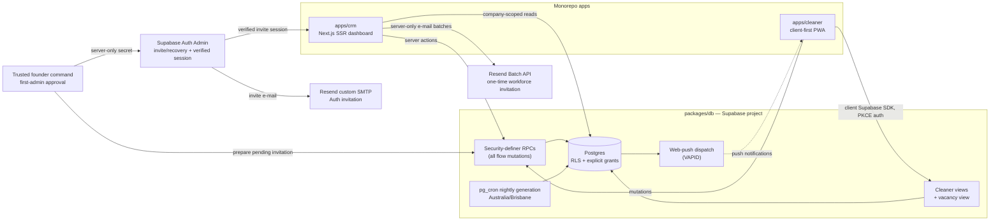
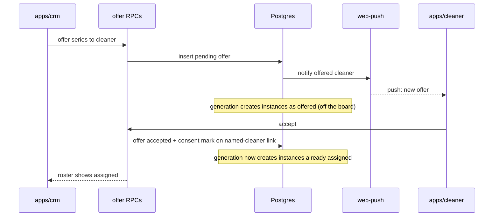

# Phase A — company onboarding and cleaner adoption (alpha) — HLD

## Overview

This design delivers the [Phase A PRD](prd.md) on the monorepo: a fresh Supabase project
owned by `packages/db`, a company-admin CRM (`apps/crm`), and a minimal cleaner PWA
(`apps/cleaner`). The deployed prototype (`../clean-app`) supplied reference mechanics and
visual fidelity targets; it never runs against the alpha database
([ADR 0002](../../decisions/0002-alpha-runs-on-monorepo-apps-only.md)).

Split from the original single Phase A document on 2026-08-15; the decisions below are
from the 2026-08-08 grilling session unless dated otherwise.

## Current state

The delivered system on `origin/main` (2026-08-15) is a partial build of this design. It
is work in progress: where it deviates from the PRD, this design wins and the code
changes. Delivered:

- Foundation tables, company identity, clients/sites with defaults and preferred
  cleaners, and the `service_catalogue` (platform-owned, seeded — already aligned with
  PRD decision #7).
- Recurring assignments with generation (pg_cron pattern, 28-day horizon, idempotent).
  Named cleaners are auto-assigned with no acceptance step — the superseded decision #1
  behaviour; PRD decision #11 (offers) is not yet built.
- Jobs, crew slots, applications (`applied`/`assigned`/`not_selected`/`withdrawn`), the
  `vacancies` view, and the cleaner views (`cleaner_job_board`, `cleaner_my_jobs`) with
  the audited address RPC.
- Cleaner invite: one active 16-character code per company with rotate-in-place — the model
  PRD decision #8 rejected. No registration cap, no per-link attribution, no offer
  details on the link.
- Cleaner join: a new account signs up with e-mail + password, while an existing account
  signs in and returns to the invitation; both paths complete through `join_company_pool`.
  No Google OAuth (PRD decision #9 not yet built).
- Pay: a single `cleaner_pay_cents` amount per slot on sites, recurring assignments, and
  jobs — no pay basis (PRD decision #10 not yet built).
- Notifications are rows in a `notifications` table only; web-push, `product_events`
  (S26), and bulk CSV import (S30) are absent.
- Identity is the superseded global-role model: `profiles.role` is the single
  authority, `company_members` holds both the admin link and cleaner memberships, and one
  company has exactly one admin. PRD decisions #16–#20 (2026-08-19) replace this with
  the membership model below.

At the 2026-08-08 session the repo was scaffold-only; the prototype findings that shaped
the first design round (schema-only `job_series`, merged client/site rows, single-cleaner
assignment, code-entry join) are kept in the decision log context.

## Proposed architecture

Component responsibilities:

- **`packages/db`** — owns the canonical schema, migrations, RLS policies, grants, RPCs,
  views, and the generation job. Seeded by adaptation of the prototype's migrations, then
  evolved freely ([ADR 0001](../../decisions/0001-alpha-database-fresh-supabase-project.md)).
- **`apps/crm`** — the company-admin dashboard (Next.js, SSR): roster, clients/sites,
  recurring assignments, cleaners, company settings (employees list, S34), minimal
  dispatch, and the bulk CSV import (S30). Every screen operates in one active company
  (S33): the layout resolves it from the session account's employee memberships, shows
  the active company in a persistent header switcher for one or many memberships,
  persists the last-active company on the profile, and routes membership-less accounts
  to the no-access screen. The switcher owns the authenticated S35 company-creation entry
  point; the personal account menu remains account-scoped.
  Route guards derive authority from the active employee membership's role. Every active
  employee reaches Settings for self-only preferences and read-only Business Identity;
  owner capability checks expose company identity editing, employee records, and invitations.
  Owner-only server actions remain the mutation boundary. Bulk CSV import
  (S30): the browser parses and validates the file against the published column
  format, shows a preview with per-row errors, and submits confirmed rows through the
  same server actions and RPCs as one-by-one entry. Reads are company-scoped;
  state-changing mutations go through RPCs. The Cleaners route also accepts directly entered
  cleaner e-mail addresses or parses an optional cleaner CSV in the browser, previews the
  one-time invitation, and submits a confirmed send list
  to a server-only Resend adapter. The adapter never exposes its API key to the browser.
- **First-admin bootstrap** — a repository-local command uses a Supabase secret in a
  trusted environment. A command-only root environment file isolates this secret from
  the Next.js process. The command creates one pending application invitation and calls
  Supabase Auth Admin. Supabase sends an invite or recovery e-mail through Resend custom
  SMTP. The public CRM confirmation route verifies the Auth token and establishes an SSR
  session. A security-definer RPC then matches the verified e-mail. The RPC creates the approved company
  and its first active owner employee membership in one transaction. No browser path
  can call Auth Admin or choose a role or company.
- **Resend** — the alpha provider for one-time workforce invitation e-mails. The CRM
  sends no more than 100 messages per provider batch. Stable idempotency keys prevent a
  repeated confirmation from sending a second copy.
- **Locale presentation** — both apps share the `en-AU`/`pt-BR` locale contract and the
  per-profile preference. The CRM uses canonical locale-prefixed routes, complete
  app-owned catalogues, device-language negotiation before sign-in, and explicit
  selection on sign-in and in settings. Locale changes presentation only: AUD,
  `Australia/Brisbane`, stored values, and user-authored content remain unchanged.
- **`apps/cleaner`** — the cleaner surface: client-first and static-exportable, so a
  Capacitor store shell stays a bolt-on if alpha iOS push evidence demands it
  ([ADR 0004](../../decisions/0004-cleaner-surface-wrapper-ready-pwa.md)). Client Supabase
  SDK against the cleaner views/RPCs, PKCE client auth (not the SSR cookie pattern), push
  registration behind one abstraction module, app-shell offline caching via the service
  worker. Cleaner credential (PRD decision #9): Supabase Auth with the Google OAuth
  provider and email + password; a client-side PKCE callback route completes OAuth and
  stays compatible with static export. The join screen owns webview detection: inside an
  in-app browser it steers Google users to the system browser (the invite context
  travels in the URL) and always offers email + password; expired, revoked, or
  limit-reached links show the "invite no longer active" state.
- **Recurrence generation** — nightly pg_cron run in `Australia/Brisbane`, plus immediate
  generation on create/edit.
- **Web-push infrastructure** — VAPID keys, service worker, dispatch route (pattern ported
  from the prototype).

## Data flow

- A founder command creates one pending first-admin invitation before it asks Supabase
  Auth Admin to send the account invitation. A repeated command finds the pending record
  and sends no duplicate. If a confirmed Auth user has an expired application invitation,
  the command creates new application state and sends a recovery e-mail. The e-mail link
  enters a public locale route. The route verifies the Auth token and establishes a cookie
  session. The acceptance RPC locks the pending record,
  matches it to the verified Auth e-mail, and atomically creates the approved company
  and its first active owner employee membership, and consumes the invitation. Failed,
  expired, revoked, used, or mismatched invitations create no company or membership.
- An existing CRM employee can create another company through the persistent header
  switcher. The server action validates the company name and ABN, then one authenticated
  security-definer RPC verifies that the caller already has an active employee membership,
  rejects an existing ABN, and atomically creates the approved company, its first Owner
  membership, and the caller's last-active-company preference. Staff authority in the
  previous company does not limit this account-level capability. Failed calls create no
  partial tenant, and no-company or pool-only accounts cannot call it successfully.
- Authority derives from memberships only (HLD decision 19). An account holds employee
  memberships (role `owner` or `staff`) and cleaner memberships; no global account role
  exists. RLS policies and the cleaner views ask "does this account hold an active
  membership of the required kind in this company", never "what is this profile".
  A platform-internal admin marker exists outside the product model.
- Employee invitations (S32) reuse the first-admin pattern: an owner-called RPC
  records a pending invitation (invited e-mail, chosen role, 7-day expiry) and a
  server action asks Supabase Auth to invite a new e-mail or the sign-in path serves
  an existing account. The public acceptance route verifies the session e-mail; the
  acceptance RPC locks the invitation, matches the verified e-mail, and creates the
  active employee membership atomically. Owners see and revoke pending invitations.
  Role change and removal (S34) are owner-called RPCs; every mutation refuses a result
  that leaves the company with zero owners. A removal ends the membership but keeps
  the row.
- Admin writes enter through `apps/crm` server actions, which call security-definer RPCs;
  reads are scoped to the active company under RLS, checked against the caller's
  employee membership.
- Cleaners read only through dedicated views and mutate only through RPCs — never direct
  selects on company tables. The assignment-gated address/access-notes boundary keys on
  the cleaner's slot assignment.
- The generation job materialises job instances from recurring assignments: 28-day
  horizon; idempotent per (assignment, service date). Edits regenerate future instances
  that are still untouched; started, completed, or manually edited instances are never
  touched. Instances of an **accepted** series with a named cleaner are created already
  assigned — the series acceptance is standing consent, and the generation job only
  reads the consent mark. Instances of a series the named cleaner has not accepted show
  as **offered** — not assigned, not on the board. Instances with no named cleaner are
  created as `posted` — these are the vacancies the board and roster consume, via the
  vacancy view ([ADR 0003](../../decisions/0003-vacancy-as-projection.md)).
- Directed offers (S28/S29) are one entity with two target kinds — a job or a recurring
  assignment — and one lifecycle: pending → accepted / declined / revoked. Offer
  mutations are RPCs. Acceptance of a job offer completes the slot assignment;
  acceptance of a series offer writes the consent mark on the named-cleaner link, which
  the generation job consumes. A slot with a pending offer is not a vacancy: the board
  and vacancy view exclude it. "Offered" is a projection, not a stored status — a slot is
  offered exactly while a pending offer targets it, the same way a vacancy is a
  projection of an unfilled slot. The cleaner reads pending offers from one in-app
  surface backed by this entity. A decline notifies the admin and ends the pending
  offer, so the projection makes the slot a vacancy on the board immediately; the admin
  can direct a new offer at any time, which takes it off the board again (decision 14).
- Cleaner staff invitation links (S8) are self-contained outreach records: many links per company, each
  carrying admin-authored offer details — a title/description and a pay shape (hourly
  rate or fixed amount, with its value) stated at creation — plus optional expiry,
  optional maximum registrations, and revocation. The pre-registration preview renders
  from the link itself; a link references no job record, and registration through it
  produces a cleaner membership only. Each registration attributes to the link that
  admitted it, and the CRM Staff screen shows per-link state (active / expired /
  revoked / limit reached) and registration count. The delivered one-active-code-with-rotation model
  (`rotate_company_invite`) gives way to this multi-link model.
- Cleaner e-mail invitations (S8/S30) use one selected active invite. The browser accepts
  one or more directly entered e-mail addresses or an optional CSV with `email` plus
  optional `name`, then validates, normalises, and deduplicates the combined list. It shows the
  exact count and localised copy before confirmation. A server action re-authorises the
  company admin, resolves the active invite, creates company-scoped batch state through
  RPCs, and calls Resend in chunks of at most 100, with at most 500 unique recipients in
  one confirmed alpha send. The provider result updates each recipient to accepted or
  failed. An explicit retry selects failed recipients only. No step creates a Supabase
  Auth user or a cleaner membership.
- Pay flows as a (basis, value) pair: fixed amount per slot, or hourly rate. Site
  defaults seed the pair; recurring assignments carry it; generated jobs inherit it;
  one-off jobs prefill it from the site default. Every surface shows pay as the admin
  stated it. No surface computes a total. For an hourly job, the admin states the
  settled amount at mark-paid; that amount is what `ledger_entries` records.
- Only manually posted jobs trigger push notifications to the company's cleaners (PRD
  decision log #2); generated instances and auto-assignments are silent in this cycle.
- Instrumentation events land in `product_events` at each funnel step (PRD S26).

The critical path across components — a directed series offer:

### Data model outline (first migration set)

Entity-level outline; table detail belongs to migrations (no LLD exists for this cycle).

`companies` (+ ABN), `profiles` (no role — authority is membership-only; platform
admin is a separate internal marker; `last_active_company` for S33),
`employee_memberships` (company + profile + role `owner`/`staff` + status; a partial
unique index guarantees at least one owner via the guard RPCs),
`employee_invitations` (invited e-mail, chosen role, 7-day expiry, state:
pending/accepted/expired/revoked), `company_members` (cleaner memberships only — the
cleaner side; each membership attributes to its admitting invite),
`company_invites` (multi-link: admin-authored offer details, pay shape, optional expiry
and registration cap, revocation), `clients`, `sites` (address, access notes, defaults,
ordered preferred cleaners), `service_catalogue` (platform-owned, seeded), `recurring_assignments` (one row per weekday,
weekly/fortnightly, `crew_size`, pay basis + value; named cleaners in a side table filled
in slot order at generation), `jobs` (site FK, `crew_size`, pay basis + value), `job_assignments` (per-slot; cleaner-overlap
exclusion; assignment history timestamps), `job_applications`, `offers` (one row per
directed offer; target is a job or a recurring assignment; lifecycle state; the accepted
series offer projects a consent mark onto the named-cleaner link), `ledger_entries` (one per
job + cleaner — per slot, not per job; the amount is always admin-stated — at creation
for fixed jobs, at mark-paid for hourly jobs), `notifications` + web-push infrastructure,
`product_events`, `pool_invite_email_batches` + `pool_invite_email_recipients` (submission
state only), and the vacancy view.

## Requirement mapping

| PRD stories | Components |
|---|---|
| S1 (invite first admin; company + ABN) | trusted founder command, Supabase Auth + Resend custom SMTP, public `apps/crm` acceptance route, atomic `packages/db` bootstrap RPC, then CRM settings |
| S2–S4 (clients, sites, defaults, preferred cleaners) | `apps/crm` clients, `packages/db` `clients`/`sites` |
| S5 (recurring assignments) | `apps/crm`, `packages/db` `recurring_assignments` + named-cleaner side table |
| S6 (generated instances: consent-gated assignment, offered, posted vacancies) | generation job (pg_cron + on-edit, reads series consent), `offers`, vacancy view |
| S7 (roster week view) | `apps/crm` roster, vacancy view |
| S8 (cleaner invite link with offer details, limits, revocation, and confirmed delivery) | `apps/crm` cleaners, server-only Resend adapter, `packages/db` `company_invites` + company-scoped e-mail batch state |
| S9–S12 (link-first join, automatic cleaner membership, PWA + push opt-in, board) | `apps/cleaner` join + board, cleaner views, RPCs |
| S27 (cleaner sign-in: Google OAuth / email + password) | Supabase Auth (Google provider + email/password, PKCE callback route in `apps/cleaner`) |
| S28–S29 (directed offers with accept/decline) | `offers` entity + offer RPCs, `apps/crm` job detail + recurring assignment, `apps/cleaner` offers surface, generation job (consent-gated), notifications |
| S30 (bulk CSV for company data; direct entry or CSV for cleaner send lists) | `apps/crm` client-side validation + preview; existing write RPCs for company data; Resend adapter and batch RPCs for cleaner invitations |
| S31 (CRM jobs list) | `apps/crm` jobs |
| S32 (employee invitation with role) | `apps/crm` company settings, Supabase Auth invite + Resend custom SMTP, `employee_invitations` + acceptance RPC |
| S33 (active company + switcher + no-access screen) | `apps/crm` layout/session, `profiles.last_active_company` |
| S34 (employees list, role change, removal, last-owner guard) | `apps/crm` company settings, `employee_memberships` RPCs |
| S16 (board apply/withdraw) | `apps/cleaner` board, `job_applications` RPCs |
| S17–S18 (my jobs, gated address, status taps) | `apps/cleaner`, cleaner views, assignment-gated boundary |
| S19, S24 (money views, mark-paid) | `apps/cleaner` money, `apps/crm` money, `ledger_entries`, mark-paid RPC (amount stated for hourly jobs) |
| S20 (push delivery) | web-push infrastructure, push abstraction module |
| S21 (profile with joined companies) | `apps/cleaner`, cleaner views |
| S22–S23, S25 (job detail + per-slot assign, one-off creation, cancel) | `apps/crm` jobs, `create_one_off_job`/`assign_job_slot`/`cancel_job` RPCs |
| S26 (instrumentation) | `product_events` writes from both apps and RPCs |

## Non-functional requirements

- **Security and product law** (root `AGENTS.md`): every table gets explicit grants to
  `authenticated` and `service_role` (missing grants surface as silent 42501 failures) and
  company-scoped RLS for company admins. Cleaners never see client phone, client charge,
  or internal notes. The pay ledger records and never moves money. No candidate-side
  payment surface and no free-text review surface exists. Vacancy remains the connecting
  object: the view is the only gap interface the roster and board consume.
- **Privacy**: site address and access notes are revealed only to the assigned cleaner,
  keyed on the slot assignment.
- **Reliability of generation**: idempotent per (assignment, service date); safe to re-run.
- **Free-tier discipline**: select only needed columns; push over e-mail; small payloads.
- **Timezone**: all schedule computation in `Australia/Brisbane`.
- **E-mail boundary**: `RESEND_API_KEY` and the verified sender address are server-only.
  The RFC-quoted sender display name is "{company name} via The Clean Crew". Reply-To
  uses the authenticated admin e-mail. Stored provider failures contain no credentials
  or raw provider internals.

## Open questions

- Generation horizon (28 days) and the notification discipline are to be sanity-checked
  against the founders' week-one feedback.
- No LLD exists for this cycle; migrations and tests are the table-level authority.
- PRD decisions #7–#12 (2026-08-15) are all absorbed: the service-type catalogue (#7,
  delivered aligned — see Current state), invite links (#8, decision 11), the cleaner
  credential (#9, written into the `apps/cleaner` component — the PRD decision fixed
  the trade-offs), the pay basis (#10, decision 12), the directed-offer flow (#11,
  decisions 9–10), and the bulk CSV import replacing seed tooling (#12, decision 13).
- PRD decisions #22–#29 (2026-08-25) are **not** absorbed. A cleaner invitation link now
  creates a join request, and a company admin admits or rejects that request before a
  cleaner membership exists. This HLD still describes S9–S12 as "automatic cleaner
  membership", and its data model outline holds no record for a waiting or a rejected
  request. An HLD session must settle: whether the join request is a state on the cleaner
  membership or its own entity; the RLS boundary that keeps a waiting person away from
  every company view; the change to `join_company_pool`; how a rejection blocks a new
  request from any link; and the new notification type for admit and reject. That type
  must land in its own migration, after the `application_received` value that the
  `codex/cle-86-application-approval-flow` branch adds, because `alter type … add value`
  needs a migration of its own.
- An audit of `origin/main` on 2026-08-25 read all 40 references to `company_members` in
  the migration set. 31 filter on `status`, 5 are table definition or grants, and 2 are
  one-time data steps in `cle_81`. Two reads decide the entity question above:
  - `cleaner_pool_memberships` (`cle_26`) already returns `(profile_id, company_id,
    company_name, status)` for `auth.uid()`. If the join request is a state on the
    cleaner membership, the S10 waiting screen has a data source already built, and the
    app layer filters the state. This is the strongest evidence for that option.
  - `accept_first_admin_invitation` (`cle_80`) refuses any caller that holds **any**
    `company_members` row, with no filter on `status`. If a waiting join request creates
    such a row, a person who is waiting at one company is silently refused when a founder
    invites them to bootstrap their own company. The entity choice must either avoid the
    row or fix this call site.

## Decision log

The standalone ADRs 0001–0004 predate this document and are frozen in `docs/decisions/`;
entries 1–4 summarise them for this cycle's context.

### 1. Fresh Supabase project; `packages/db` owns the schema (2026-08-08)

[ADR 0001](../../decisions/0001-alpha-database-fresh-supabase-project.md): the alpha runs
on a fresh Supabase project. `packages/db` owns the canonical schema, seeded by adaptation
of the prototype's migrations, then evolved freely.

### 2. The alpha runs on monorepo apps only (2026-08-08)

[ADR 0002](../../decisions/0002-alpha-runs-on-monorepo-apps-only.md): `apps/crm` plus a
minimal `apps/cleaner`; the prototype never runs against the alpha database. This
mid-session pivot dissolved the compatibility constraints earlier decisions had worked
around.

### 3. Vacancy is a view, not a table (2026-08-08)

[ADR 0003](../../decisions/0003-vacancy-as-projection.md): vacancy is a projection over
unfilled crew slots. The roster and the board consume the same view; no separate vacancy
persistence object exists.

### 4. `apps/cleaner` is a wrapper-ready PWA (2026-08-12)

[ADR 0004](../../decisions/0004-cleaner-surface-wrapper-ready-pwa.md): client-first and
static-exportable, so a Capacitor store shell stays a bolt-on if alpha iOS push evidence
demands it. Acquisition always stays web.

### 5. Clients and sites are separate tables; jobs reference the site (2026-08-08)

Clean vocabulary from the first migration: `clients` (the commercial party) and `sites`
(address, access notes, defaults) as separate tables, with jobs FK to the site. This
splits the prototype's merged client/site rows before any data exists.

### 6. Crew slots and a per-slot ledger from day one (2026-08-08)

`jobs.crew_size ≥ 1` plus a per-slot `job_assignments` table (product law, `AGENTS.md`).
The cleaner-overlap exclusion and the pay ledger key on (job, cleaner) — one ledger entry
per slot, not per job. Admin assignment from applicants stays admin-picks;
first-accept-wins enters with the cascade (cycle 2).

### 7. Recurring assignment shape: one row per weekday (2026-08-08)

Weekly/fortnightly; "Mon/Wed/Fri" is three rows. `crew_size` on the assignment; named
cleaners in a side table, filled in slot order at generation.

### 8. Generation mechanics (2026-08-08)

Nightly pg_cron in `Australia/Brisbane` plus immediate generation on create/edit; 28-day
horizon; idempotent per (assignment, service date). Edits regenerate only future,
untouched instances. Instances with no named cleaner generate as `posted` — they are the
vacancies on the board.

### 9. Offers are one entity with two target kinds (2026-08-15)

Delivers PRD decision #11. One `offers` entity covers both directed-offer shapes: the
target is a job or a recurring assignment, with one lifecycle (pending → accepted /
declined / revoked). Acceptance of a series offer writes a consent mark on the
named-cleaner link; the generation job is a pure reader of that mark — consented
instances generate assigned, unconsented instances generate as offered. A slot with a
pending offer is excluded from the vacancy view and the board. Considered option: a
separate mechanism per shape (offer records for jobs, a bare consent flag for series) —
rejected because the cleaner's pending-offers surface, the notification hook, and the
decline history would each need two sources. The delivered generation RPC auto-assigns
named cleaners without consent; it changes to consent-gated.

### 10. "Offered" is a projection, not a stored status (2026-08-15)

The job status model gains no `offered` value. A slot is offered exactly while a pending
offer targets it; the roster and the board derive the state from the `offers` entity.
This extends vacancy-as-projection ([ADR 0003](../../decisions/0003-vacancy-as-projection.md))
and removes a class of drift: an offer transition cannot leave a stale status behind,
because the state is the offer row. Trade-off accepted: roster and board queries join
against pending offers — the same join the board needs anyway to exclude offered slots.

### 11. Invite links are self-contained outreach records (2026-08-15)

Delivers PRD decision #8. `company_invites` becomes a multi-link table: each link
carries admin-authored offer details — title/description and a pay shape with its
value — plus optional expiry, an optional registration cap, and revocation; each
registration attributes to its admitting link. A link references no job or recurring
assignment: the preview renders from the link itself, and registration produces pool
membership only. Considered option: the link references a job record so the preview is
always current — rejected because an edited or deleted job would silently change or
break sent links, and a job-referencing link reads as an application to that job, which
contradicts the settled boundary (link → pool membership; assignment is a directed
offer or a board application). The delivered one-active-code-with-rotation model is
replaced.

### 12. The ledger records admin-stated amounts only (2026-08-15)

Delivers PRD decision #10 at the ledger. Pay travels as a (basis, value) pair — fixed
amount per slot, or hourly rate — from site defaults through recurring assignments to
jobs. No surface computes a pay total. A fixed job's ledger amount is set at creation.
An hourly job's ledger row shows the rate until settlement; the admin states the
settled amount at mark-paid, and the ledger records that amount. Considered option: an
estimate of rate × duration shown before settlement — rejected because a computed
number the admin did not state reads as a promise, and flexible hourly work makes it
wrong in both directions. The delivered single `cleaner_pay_cents` model gains the pay
basis.

### 13. Bulk import parses in the browser and reuses the write RPCs (2026-08-15)

Delivers PRD decision #12 (S30). The CRM parses and validates the CSV client-side
against the published column format, shows a preview with per-row errors, and submits
confirmed rows through the same server actions and RPCs as one-by-one entry; duplicate
re-imports are rejected per row. Considered option: a server-side import RPC that
inserts the batch in one transaction — rejected because it creates a second write path
with security-definer insert rights to defend, and its all-or-nothing failure mode is
worse for the admin than per-row results. Cost of many small calls is irrelevant at
alpha scale. No seed or concierge tooling exists.

### 14. A declined slot becomes a vacancy immediately (2026-08-15)

Found by the validation walk. When a cleaner declines an offer, the pending offer ends,
and the projection (decision 10) makes the slot a vacancy on the board with no admin
action. The decline notification tells the admin, who can direct a new offer at any
time — a new pending offer takes the slot off the board again. Considered option: hold
the declined slot off the board until the admin acts — rejected because it needs a
third state and hides unfilled work from every cleaner while the admin is away; the
vacancy model exists to make gaps visible. Refines the PRD's S29 wording (PRD decision
log #13).

### 15. Locale is a presentation and profile concern (2026-08-17)

F15 uses canonical `en-AU` and `pt-BR` URL prefixes plus a nullable profile preference.
An explicit URL controls the current rendering; the saved profile choice controls later
visits and sign-ins; device language is only the pre-auth fallback. This keeps links
deterministic and gives both roles one preference contract without making language a
company property. The app name remains `The Clean Crew` in both locales.

### 16. Resend delivers confirmed one-time workforce invitations (2026-08-17)

Resend is the alpha provider for cleaner send lists. The browser owns direct-entry and CSV
validation and preview, while the CRM server re-authorises the admin, persists company-scoped submission
state through RPCs, derives the logical confirmation key from the selected invite, locale,
and normalised recipient e-mails, and sends provider batches of at most 100 messages. One
confirmed alpha send is limited to 500 unique recipients. Each provider batch has a stable
idempotency key. The alternative, Supabase Auth invitations, was rejected because the
send list is contact input for the existing link-first registration flow, not an account import.

### 17. Supabase Auth invites the first admin; application data grants access (2026-08-18)

The founder command calls Supabase Auth Admin from a trusted environment. Supabase sends
the identity e-mail through Resend custom SMTP. The verified Auth session does not grant a
CRM role. One application RPC matches the verified e-mail to a pending invitation and then
creates the approved company, privileged profile, and active membership atomically. The
alternative, a platform operator application, adds an alpha surface that the founders did
not request. Auth metadata is not an authorisation source because the invite caller and the
browser can supply it.

### 18. Supabase Auth recovers a confirmed invitee without account deletion (2026-08-18)

If a confirmed invitee has an expired application invitation, the trusted command sends
a Supabase recovery e-mail. The same public route verifies the recovery token before the
application RPC grants access. This avoids account deletion and keeps Resend behind
Supabase custom SMTP.

### 19. Authority derives from memberships only (2026-08-19)

Delivers PRD decisions #16–#17. The global `profiles.role` is removed. An account
holds employee memberships (role `owner` or `staff` per company) and pool memberships
(cleaner in a company's pool); every RLS policy, view, and route guard asks for an
active membership of the required kind, never for an account role. A
platform-internal admin marker lives outside the product model. Considered option:
keep `profiles.role` beside memberships — rejected because two authority sources must
be kept consistent forever, and the divergence bug class never closes. Consequence:
the delivered policies, cleaner views, and the bootstrap/join RPCs that set
`profiles.role` all change; AGENTS.md's role-enum sentence needs the matching edit.

### 20. Employee identity reuses the first-admin invitation machinery (2026-08-19)

Delivers PRD decision #18. `employee_invitations` + an acceptance RPC follow the
first-admin pattern: pending record first, Supabase Auth invite (or plain sign-in for
an existing account), public route verifies the session e-mail, atomic acceptance
creates the membership. As amended by decision 22, a first Owner comes from either the
founder bootstrap or the authenticated S35 company-creation RPC; employee invitations
never create a first Owner. Pool membership stays a separate table with its
own lifecycle (`company_members`, link-attributed) — PRD decision #17's two kinds are two
tables.

### 21. The active company is session state persisted on the profile (2026-08-19)

Delivers PRD decision #19 / S33, as amended by PRD decision #21.
`profiles.last_active_company` stores the last choice; the CRM layout resolves the active
company from it and falls back to the first active membership. Company scoping in
queries always uses the resolved active company. RLS remains the enforcement layer —
the active-company value is a convenience, not an authority: a request scoped to a
company where the caller holds no active employee membership returns nothing.

### 23. An invitation is readable before the invitee has an account (2026-08-27)

Three people hit dead ends on one employee invitation. `get_employee_invitation_context`
requires a confirmed session whose e-mail matches the invitation and returns zero rows
otherwise, so "not signed in", "signed in as somebody else", "revoked" and "expired" were one
indistinguishable empty result — and the acceptance page had one message for all four. Worse,
a brand-new invitee was sent to sign in: the CRM has no sign-up, no magic link and no password
reset, and their account carries a generated password nobody ever saw.

`employee_invitation_preview` is `anon`-callable and follows `cleaner_invite_preview` with the
disclosure rule its entropy migration set (decision 11's neighbourhood): the state is always
readable, the tenant is named only for an invitation that can still be used. The invitee's
address is masked even then, which is stricter than the cleaner preview — a cleaner's invite
code is held only by the invitee, while an invitation id is also held by the admin and travels
in a forwardable e-mail, so holding it does not prove you are the invitee. That is what lets
the page say "this invitation is for somebody else" without saying who.

Considered option: widen `get_employee_invitation_context` to answer without a session —
rejected because its whole value is that it answers only for the invitee, and the page needs
both answers to tell a wrong account from a dead invitation.

### 24. The seven-day invitation stays usable for seven days (2026-08-27)

The record lives seven days; the auth token in the e-mail is single-use and dies on the first
GET, so a link scanner, a prefetch or a reload spends it. `prepare_employee_invitation` refuses
while an invitation is open, leaving revoke-and-reinvite as the only recourse — which mints a
new id and orphans the link already in the invitee's inbox.

`claim_employee_invitation_link` re-sends the invitation that already exists. It is one
statement, so the row is the lock and two taps cannot both send, and it carries the project's
own sixty-second `smtp_max_frequency` rather than trusting an unauthenticated caller. Granted
to `service_role` alone: an `anon` grant would let anyone holding a link id drain an e-mail
allowance shared with every other auth e-mail the product sends. A refusal returns no address
and no reason, and the action answers the same way either way, so holding a link id cannot be
used to discover which invitations are live.

### 25. Auth redirects carry no query string (2026-08-27)

The employee confirmation redirect carried `?employeeInvitation=`, which forced the employee
branch of `invite.html` to join the token with `&` while every other branch used `?`. A
literal allow-list entry does not permit a query string, so Auth refused the redirect and
substituted `site_url` — and the invitee received
`https://cleaner.thecleancrew.app&token_hash=…`: wrong app, no path, not a valid URL.

The invitation id moved into the path (`/{locale}/auth/confirm/{id}`), so no auth redirect
carries a query and every template joins with `?`. This also unblocks `recovery.html`, which
cannot branch on invitation kind because `resetPasswordForEmail` takes no `data`. The hosted
allow-list gained wildcard entries the same day, and `scripts/check-hosted-auth.mjs` now fails
a release when the allow-list stops permitting the redirects the apps actually ask for.

### 22. Additional company creation is an account-level atomic bootstrap (2026-08-21)

Delivers PRD decision #21 / S35. An authenticated account that already holds any active
employee membership may create another company from the CRM workspace switcher. The
security-definer RPC derives the caller from `auth.uid()`, creates the company and its
first `owner` membership, and updates `profiles.last_active_company` in one transaction.
The source company's membership and role are unchanged; no request field can choose the
new owner. An ABN remains globally unique. Accounts without an active employee membership
still enter through the founder-invitation S1 boundary, so S35 does not become public
company signup.
