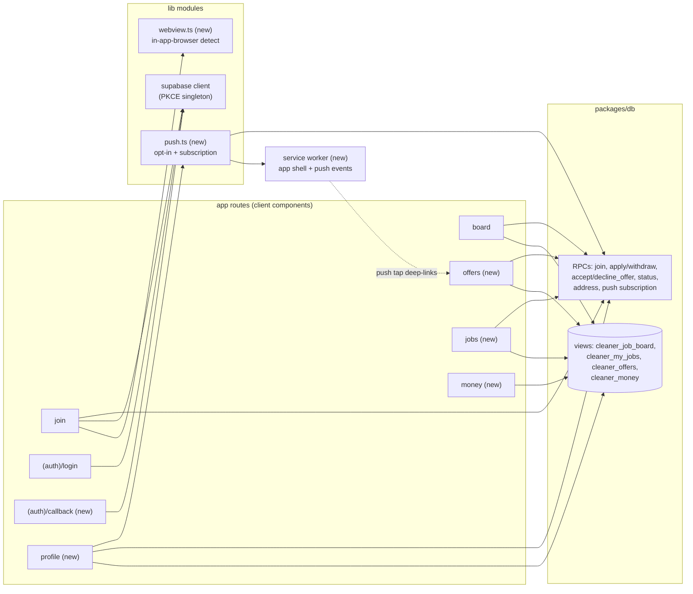
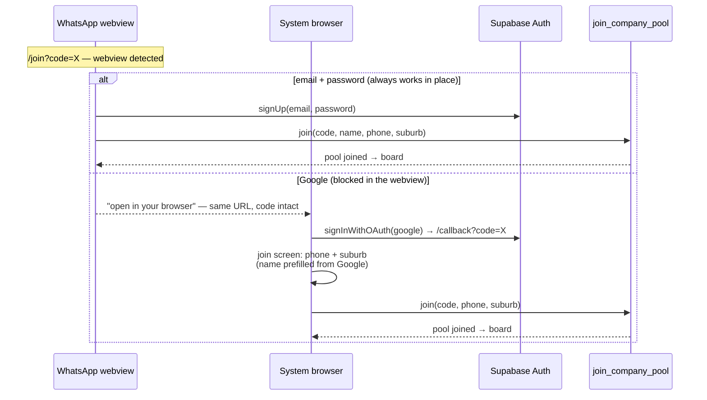

# Phase A — `apps/cleaner` — LLD

## Scope

The cleaner PWA of the [Phase A HLD](hld.md), against the db contract in
[lld-db.md](lld-db.md). Stories: S9 (register: Google OAuth or email + password,
webview steering, dead-link states), S10 (pool join — delivered), S11 (PWA install +
push opt-in), S12/S16 (board — delivered view, apply/withdraw wiring and ordering
new), S17 (my jobs + gated address), S18 (status taps), S19 (money), S20 (push
receipt), S21 (profile), S27 (return sign-in), S29 (offers surface). Delivered
internals (client-only Supabase singleton with PKCE, ADR 0004 static-export
constraint, feature-module convention, views-only reads) are the authority for
anything this file does not change.

## Interfaces

Reads: `cleaner_job_board` (+ new pay columns), `cleaner_my_jobs`, `cleaner_offers`,
`cleaner_money`. Mutations: delivered `apply_to_job`, `withdraw_application`,
`update_job_status`, `get_cleaner_job_access`, `join_company_pool`; new
`accept_offer`, `decline_offer`, `save_push_subscription`,
`delete_push_subscription`. All RPC error messages surface through per-feature
describe-failure mappers (delivered `describeJoinFailure` pattern).

## Internal structure — changes by area

The app's module map after this cycle (plain boxes delivered, the rest new; every read
is a view, every mutation an RPC — the client never selects a company table):

*The PKCE singleton is the only auth surface; the service worker's push handler routes
by notification type (offers → `/offers`, otherwise `/jobs` or `/board`).*

- **Join (`app/join`)** — renders the link content from the extended
  `cleaner_invite_preview` (title, description, pay shape) with the bare-link
  fallback (company name + pool size); new `limit_reached` dead state joins
  revoked/expired. Credential block: "Continue with Google" plus the delivered
  email + password form. New `lib/webview.ts` detects an in-app browser
  (user-agent heuristic); inside one, the Google button becomes "open in your
  browser" guidance and email + password stays primary. The invite code always
  travels in the URL, so the system-browser hop and the OAuth redirect both land on
  `/join?code=…` with context intact.
- **Login (`(auth)/login`)** — gains "Continue with Google" beside the delivered
  email + password form (S27: return sign-in with the same credential), and the
  standard email-based password reset.
- **OAuth callback (`app/(auth)/callback`)** — client component; the PKCE exchange
  is handled by the singleton (`detectSessionInUrl`), then it routes back to the
  pending join (code from the redirect URL) or to the board. After a first Google
  sign-in, the join screen still collects phone and suburb (required profile fields,
  PRD decision #9) before calling `join_company_pool`; the name prefills from the
  Google profile and stays editable.
- **Board (`(cleaner)/board`)** — wires the delivered `apply_to_job` /
  `withdraw_application` into the vacancy card with the visible waiting state
  (`my_application_status`). Ordering: `scheduled_start` ascending (delivered) plus a
  client-side drop of rows whose start has passed (S16). Pay renders per basis:
  "$180" or "$35/h", never a computed total.
- **Offers (`(cleaner)/offers`)** — new surface over `cleaner_offers`: pending first
  with accept/decline, resolved history below. Accept/decline errors ("Offer is no
  longer pending") refresh the list. A push tap deep-links here.
- **My jobs (`(cleaner)/jobs`)** — new surface over `cleaner_my_jobs`: status taps
  (on the way / in progress / done) through `update_job_status`; address and access
  notes fetched on demand through `get_cleaner_job_access` with a maps handoff
  (S17 gating — never cached beyond the session).
- **Money (`(cleaner)/money`)** — over `cleaner_money`: "to receive" (unpaid) and
  "received" (paid); hourly unpaid rows show the rate.
- **Profile (`(cleaner)/profile`)** — name, phone, suburb, joined pools; push
  subscription toggle.
- **PWA (`lib/push.ts`, service worker, manifest)** — app-shell caching (ADR 0004),
  `beforeinstallprompt`-driven install prompt and push opt-in offered after the first
  board render; both skippable, re-offered from the profile (PRODUCT.md §3.7 "the
  PWA is an upgrade, not a gate"). Opt-in registers the service-worker subscription
  and calls `save_push_subscription`; the service worker shows the notification and
  deep-links by type (offers → `/offers`, else `/jobs` or `/board`).

## Interaction sequences

**Webview join (S9).** WhatsApp opens `/join?code=X` in the in-app browser → preview
renders the offer → Ana picks email + password (primary there) → registers → phone +
suburb → `join_company_pool` → board. Had she wanted Google: guidance opens the same
URL in the system browser; the flow restarts there with the code intact.

*The invite code lives in the URL on every hop, so no state survives-the-browser-switch
machinery is needed; a dead link shows its state instead of either form.*

**Offer from the lock screen (S29, S20).** Push `offer_received` → tap →
`/offers` → accept → `accept_offer` → my jobs shows the assignment. Failure: offer
already revoked → "Offer is no longer pending" and the list refreshes without it.

## Error handling

Delivered pattern: describe-failure mappers per feature; session errors route to
login (`lib/auth/session-error.ts`). Push registration failure is silent to the flow
(the notification row remains the durable record); the profile toggle shows the
unsubscribed state.

## Performance

Alpha scale. The board's client-side past-start filter runs on already-small result
sets; views carry the ordering. Offline: app shell only — data reads require the
network (ADR 0004 scope).

## Open questions

- The webview-detection heuristic (user-agent list) needs periodic upkeep; the
  implementer starts from the known WhatsApp/Instagram/Facebook tokens.
  Recommendation: keep the check in `lib/webview.ts` with its own unit test so
  additions are one-line.

## Decision log

*(none yet — the credential and steering decisions live in the PRD (#9) and the db
contract in lld-db.md.)*
