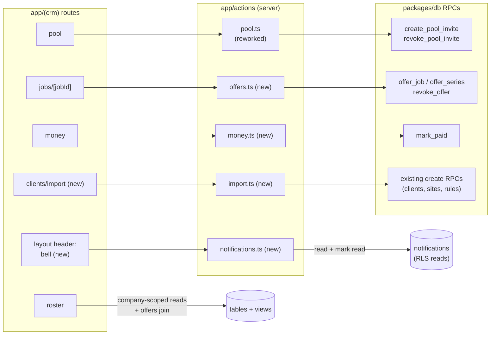
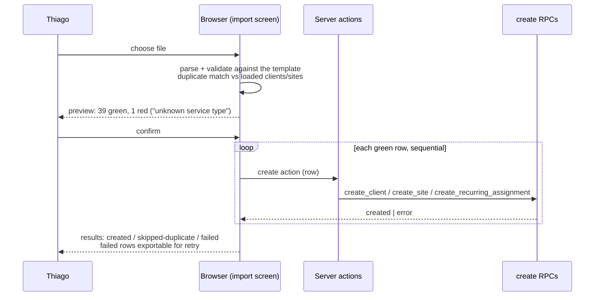

# Phase A — `apps/crm` — LLD

## Scope

The company-admin app of the [Phase A HLD](hld.md), against the db contract in
[lld-db.md](lld-db.md). Stories: S1–S8 (delivered screens gaining pay basis and the
new pool), S22 (job detail + offers), S23 (pay basis picker), S24 (money), S25
(cancel — delivered), S28 (send/revoke offers), S30 (bulk import), S31 (jobs list —
delivered). Delivered internals (route layout, server-action pattern, zod convention,
`requireCompanyAdmin`) are the authority for anything this file does not change.

## Interfaces

Consumes the new/changed RPCs from [lld-db.md](lld-db.md): `create_pool_invite`,
`revoke_pool_invite`, `offer_job`, `offer_series`, `revoke_offer`, `mark_paid`, the
pay-basis parameters on the job/rule RPCs, and the changed `assign_job_slot` error
("Revoke the pending offer first"). Every call follows the delivered server-action
pattern: zod `safeParse` → `requireCompanyAdmin` → `supabase.rpc` → verbatim error
mapping → `revalidatePath` → discriminated result.

## Internal structure — changes by area

New and reworked modules in the delivered layout (route → server action → RPC; the
delivered pattern is unchanged, plain boxes are delivered modules gaining behaviour):

*Reads keep the delivered pattern (company-scoped selects under RLS, the roster gaining
the pending-offers join); every mutation stays a server action calling one RPC.*

- **Pool (`(crm)/pool`, `actions/pool.ts`)** — reworked: a link list (state chip,
  registration count, age, revoke button) and a creation form. The form leads with the
  offer-details path (title, description, pay basis + value) and offers "bare link" as
  the secondary path (LLD-db decision 3); optional expiry and registration cap.
  `rotate` action is deleted with its RPC. Link URL format is unchanged
  (`<CLEANER_APP_URL>/join?code=…`).
- **Job detail (`(crm)/jobs/[jobId]`)** — gains the directed route: an "offer to…"
  picker over active pool members not already assigned, applied, or offered; pending
  offers listed with age and a revoke action; the assign path shows the new invariant
  error verbatim. New `actions/offers.ts`.
- **Recurring assignments (site detail)** — per named cleaner, the offer/consent state
  chip: offered (age) / accepted. Removing a named cleaner surfaces as revoking the
  pending offer (db cascade).
- **Roster (`(crm)/roster`)** — the week view renders the **offered** projection as
  its own visual state between vacancy and assigned (per HLD decision 10 the state
  derives from pending offers; the roster read adds the offers join).
- **Money (`(crm)/money`)** — the placeholder becomes the settlement list over
  `ledger_entries` (admin RLS walk): unpaid first, then paid. Mark-paid opens a
  dialog; the amount input renders only for `hourly` rows and is required there
  (`mark_paid` contract). New `actions/money.ts`.
- **Notifications (`(crm)/layout` header, `features/notifications`)** — a bell with
  an unread count over the `notifications` table (recipient = the signed-in admin),
  newest first; opening the list marks rows read (the delivered
  `grant update (read_at)` is the write path); each row links to its job. Renders
  `offer_declined` and future admin-addressed types. No preferences, no e-mail
  (LLD-crm decision 2).
- **Forms with pay** — new job and recurring-assignment forms gain the basis picker
  (fixed amount / hourly rate) prefilled from the site default; site defaults form
  gains the same pair. Zod schemas transform to `pay_basis` + `pay_value_cents`.
- **Bulk import (`(crm)/clients/import`, `actions/import.ts`)** — HLD decision 13:
  parse in the browser, preview with per-row validation, submit confirmed rows
  sequentially through the existing create actions. Duplicate guard is a
  client-side case-insensitive name match against the company's loaded clients/sites
  (no db uniqueness exists); matched rows are flagged "already exists" and skipped.
  The published column format ships as a downloadable template CSV linked from the
  import screen, one file per entity (clients, sites, recurring assignments).

## Interaction sequences

**Import (S30).** Choose file → parse → validation table (green/red rows with
reasons) → confirm → sequential submits with a progress count → result list (created
/ skipped-duplicate / failed with the action's error) → failed rows exportable for
fix-and-retry.

*Nothing is written before confirm; a mid-batch failure is a per-row outcome, never an
abort.*

**Mark paid, hourly (S24).** Money list → unpaid hourly row → dialog demands amount →
`mark_paid` → list refreshes; error "Amount is required for hourly jobs" surfaces on
the dialog field.

## Error handling

Delivered pattern throughout (`fieldErrors`/`formError`, `status === 0` "could not be
confirmed", verbatim RPC message matching). Import treats a mid-batch failure as a
per-row outcome, never an abort: the remaining rows still submit.

## Performance

Alpha scale; nothing hot. The import submits sequentially by design (LLD-db decision
— free-tier discipline; a 40-row import is 40 fast calls).

## Open questions

- None. The CSV template columns follow the create-RPC parameters; the implementer
  freezes them in the template files.

## Decision log

### 1. Import duplicate detection is a client-side name match (2026-08-16)

The preview flags rows whose client or site name matches an existing record
(case-insensitive) and skips them on submit. No database uniqueness constraint is
added: company data entry (S2) legitimately allows similar names, and the import is a
convenience layer, not a data authority. Considered option: unique indexes on names —
rejected as a constraint on hand-entry that only the import wanted.

### 2. The CRM gains a minimal notification bell (2026-08-16)

Found by the LLD validation walk: flows that "notify the admin" (S29 decline) wrote
`notifications` rows nobody rendered — admins hold no push subscriptions and the CRM
had no surface. The bell is the smallest fix: count, list, mark-read, job link;
nothing more. The delivered schema anticipated it (`read_at` + the column-level
update grant). Considered option: no surface, rely on the roster/board showing the
returned vacancy — rejected as exactly the silent state the notification exists to
prevent. Founder note (2026-08-16): admins often work from their phones; a mobile
CRM centred on pool messaging, schedule confirmation, and notifications is a
roadmap item beyond Phase A (recorded in PRODUCT.md §4.1).
