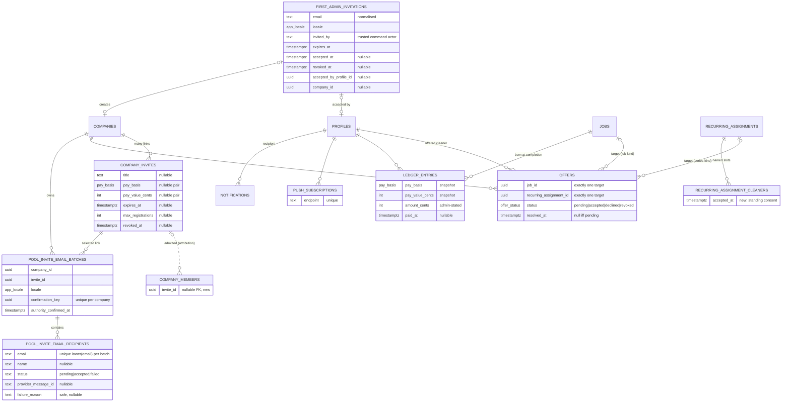
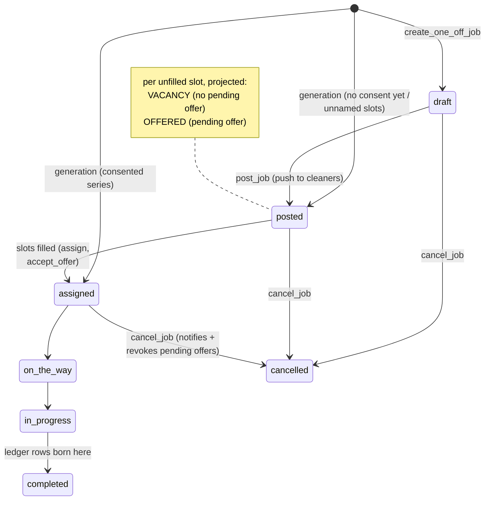
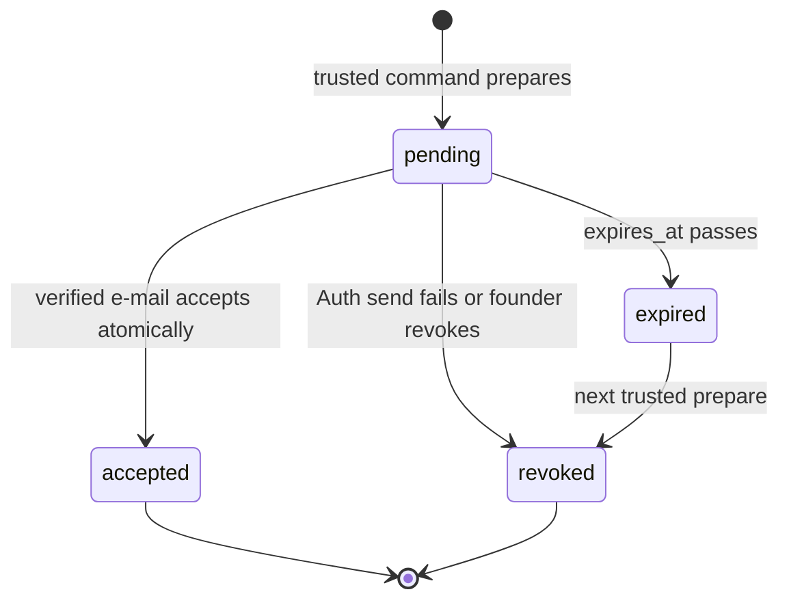
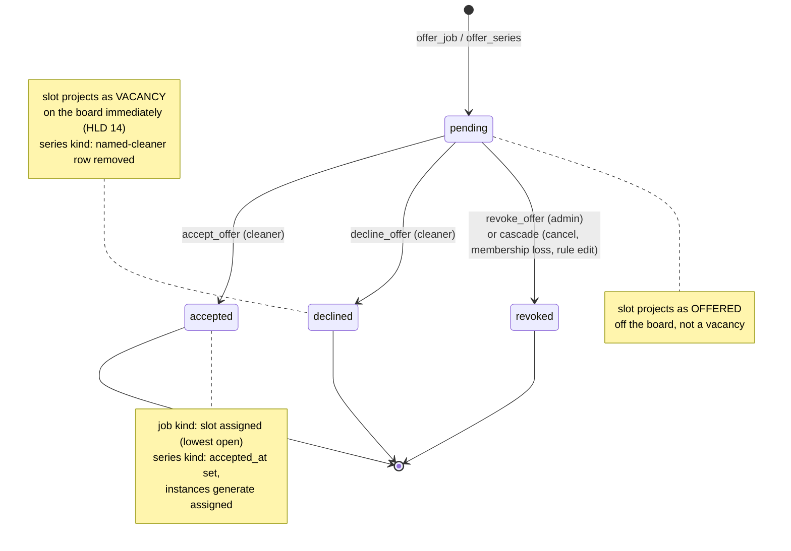
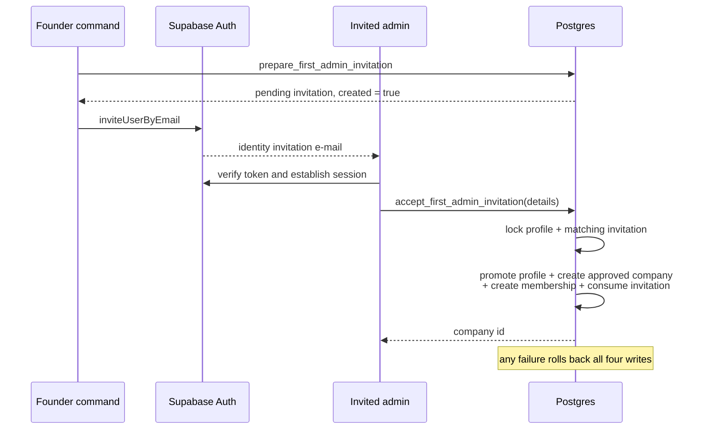
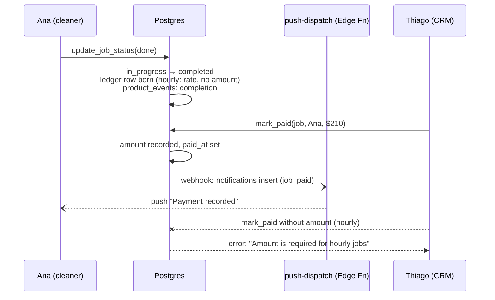

# Phase A — `packages/db` — LLD

## Scope

The database component of the [Phase A HLD](hld.md): schema, security-definer RPCs,
views, and the generation job. This file specifies the **new and changed** contracts
that fill the [gap map](lld.md#gap-map--delivered-vs-design); for delivered behaviour
the migration set `cle_5`–`cle_49` and its pgTAP suites are the authority, and this file
repeats delivered detail only where a change touches it.

Constraints from the HLD: all flow mutations are security-definer RPCs with explicit
grants; cleaners read through views only; "offered" and "vacancy" are projections (HLD
decisions 10, 14); amounts are always admin-stated (HLD decision 12); forward
migrations only (LLD decision 2).

Stories with a db surface in this file: S1 (first-admin invitation and company bootstrap),
S6 (consent-gated generation), S8 (multi-link
invites), S9/S10 (join attribution), S16 (board projection changes), S19/S24 (ledger,
mark-paid), S23 (pay basis), S20 (push, notification types), S26 (`product_events`),
S28/S29 (offers), and S30 (company-scoped cleaner invitation batches).

F15 adds one shared profile preference used by both company admins and cleaners:
`public.app_locale` has exactly `en-AU` and `pt-BR`; `profiles.preferred_locale` is
nullable so existing users retain cookie/device fallback until they choose explicitly.
Authenticated users still cannot update `profiles` directly. The self-only
`set_preferred_locale(app_locale)` security-definer RPC derives the profile from
`auth.uid()` and has explicit authenticated/service-role grants. The auth bootstrap
trigger accepts only valid locale metadata, treating missing or invalid metadata as
null so sign-up cannot fail on presentation data.

Conventions every new object follows (delivered pattern, `cle_5`–`cle_49`): `set
search_path = ''` with qualified names; `revoke all` then explicit `grant execute` to
`authenticated, service_role` on RPCs; `revoke` + `grant select` to `authenticated` and
`grant all` to `service_role` on tables; RLS select policies per audience with
`public.is_company_admin(...)` as the authorisation primitive; guard idiom "lock target
row `for update`, check admin, raise `insufficient_privilege` / `check_violation` with a
human-readable message the app matches verbatim"; pgTAP test file plus a concurrency
harness where a race exists.

## Entity-relationship overview

The new and changed entities of this cycle and how they attach to the delivered core
(delivered entities carry only their linking keys here):



*`product_events` is omitted: it references everything weakly (nullable, set-null) and
nothing references it. Jobs, sites, and recurring assignments additionally gain the
`pay_basis` + `pay_value_cents` pair (see the pay-basis section).*

The delivered job lifecycle, unchanged by this cycle, with the two projections and the
new completion hook overlaid:



*No `offered` status exists on the job — the note is the projection rule (HLD decision
10). Completion is the only state that creates ledger rows (LLD-db decision 5).*

## Data model — first company admin invitation (S1)

`first_admin_invitations` is application-owned approval state. It contains `id`, a
normalised `email`, `locale`, `invited_by`, `expires_at`, `created_at`, `accepted_at`,
`revoked_at`, `accepted_by_profile_id`, and `company_id`. The last four columns are null
until the related transition. A partial unique index on `lower(email)` permits only one
record with no accepted or revoked timestamp. The table has RLS with no browser policy.
Only `service_role` has direct table access.

`prepare_first_admin_invitation(email, locale, invited_by, expires_at)` is available only
to `service_role`. It normalises and validates the e-mail, actor, locale, and future
expiry. It returns the existing pending record with `created = false`, so a repeated
command sends no second e-mail. It revokes an expired pending record before it creates a
new record. The result includes `confirmed_auth_user`. The command uses this value to send
a recovery e-mail instead of a second Auth invitation. The function rejects `NULL` input
before it writes. `revoke_first_admin_invitation(id)` is also service-role only and lets
the command close prepared state when Supabase Auth rejects the send.

`get_first_admin_invitation_context()` derives the verified caller e-mail from
`auth.users`. It returns only that caller's latest invitation state and locale. It never
accepts an e-mail or invitation identifier from the browser.

`accept_first_admin_invitation(full_name, company_name, company_abn, contact_phone,
locale)` is available to authenticated users. It locks the caller profile and the
matching pending invitation. It requires a confirmed Auth e-mail, an unexpired record, a
least-privilege `cleaner` profile, and no existing company membership. It validates the
same company fields as the CRM. In one transaction it updates the profile to
`company_admin`, creates an `approved` company, creates one active membership, and marks
the invitation accepted with the new profile and company identifiers. No argument can
choose a role, profile, company identifier, status, or e-mail.



The invitation can enter the privileged state only through the atomic acceptance RPC.

## Data model — offers (S28, S29)

New table `offers`:

- `id uuid pk default gen_random_uuid()`
- `company_id uuid not null references companies on delete cascade`
- `cleaner_id uuid not null references profiles on delete restrict`
- **Target: exactly one of** `job_id uuid references jobs on delete cascade` **or**
  `recurring_assignment_id uuid references recurring_assignments on delete cascade`
  (CHECK: exactly one non-null). A job offer targets the **job**, never a slot number
  (LLD-db decision 1); a series offer targets the rule.
- `status offer_status not null default 'pending'` — new enum
  `offer_status: pending, accepted, declined, revoked`
- `created_at`, `resolved_at timestamptz` (CHECK: `resolved_at` null iff `pending`)
- No expiry column: a pending offer lives until the cleaner answers or the admin
  revokes it (LLD-db decision 2)
- Partial unique index: one **pending** offer per (target, cleaner)
- Invariant per job: active assignments + pending job offers ≤ `crew_size`, enforced in
  the offer RPCs under the job row lock (same serialisation pattern as
  `assign_job_slot`)

Offer lifecycle, with what each transition projects onto the board and roster:



*One lifecycle for both target kinds; every terminal state stamps `resolved_at`, and no
transition leaves `pending` twice — the row lock on the offer serialises racing
answers.*

Series consent mark: `recurring_assignment_cleaners.accepted_at timestamptz` (null =
not consented). The generation job reads it: named-cleaner rows with `accepted_at`
generate assigned (delivered behaviour); rows without it generate **no** assignment —
the instance's uncovered slots are *offered*, projected from the pending series offer,
and excluded from the board and the vacancy count.

Board/vacancy projection change (S16): `cleaner_job_board` and `vacancies` emit one row
per open slot **minus** the count of pending offers on the job (job offers) and minus
unconsented named-cleaner rows (series), so an offered slot is visible to no one but
its offered cleaner.

## Data model — multi-link invites (S8, S9, S10)

Forward migration on `company_invites`:

- Drop the one-active-per-company partial unique index; a company holds any number of
  links, each independent.
- New columns, all nullable (LLD-db decision 3): `title text`, `description text`,
  `pay_basis public.pay_basis`, `pay_value_cents integer check > 0` (pay pair
  all-or-none, same idiom as site defaults), `max_registrations integer check > 0`.
- `expires_at` (existing, never set today) becomes settable at creation.
- Link state is derived, never stored: `revoked` (revoked_at), `expired` (expires_at),
  `limit_reached` (registration count ≥ cap), else `active`.

`company_members.invite_id uuid references company_invites on delete set null` —
nullable; existing members and admin-created memberships have none. The per-link
registration count is `count(company_members where invite_id = …)`.

Changed RPCs:

- `create_pool_invite(target_company_id uuid, invite_title text default null,
  invite_description text default null, invite_pay_basis public.pay_basis default
  null, invite_pay_value_cents integer default null, invite_expires_at timestamptz
  default null, invite_max_registrations integer default null) → company_invites` —
  admin only; replaces `rotate_company_invite`, which is dropped (its CRM action and
  pgTAP/concurrency tests are reworked to the new contract).
- `revoke_pool_invite(target_invite_id uuid) → void` — admin only; idempotent on an
  already-dead link.
- `cleaner_invite_preview` gains the link content: `(state, company_name, pool_size,
  title, description, pay_basis, pay_value_cents)`; `state` gains `limit_reached`.
  Stays `anon`-callable — the link is an advertisement; it still exposes no member or
  client data.
- `join_company_pool` locks the invite row `for update` (delivered), and now also
  rejects `limit_reached` (the row lock serialises two joins racing for the last
  place — concurrency harness required) and stamps `invite_id` on the new membership.

## Data model — cleaner invitation e-mail batches (S8, S30)

New table `pool_invite_email_batches`:

- `id uuid pk default gen_random_uuid()`
- `company_id uuid not null references companies on delete cascade`
- `invite_id uuid not null references company_invites on delete restrict`
- `requested_by uuid not null references profiles on delete restrict`
- `locale app_locale not null`
- `confirmation_key uuid not null`
- `authority_confirmed_at timestamptz not null`
- `created_at timestamptz not null default now()`
- Unique `(company_id, confirmation_key)` prevents a confirmation retry or double-click
  from creating another logical batch.

New table `pool_invite_email_recipients`:

- `id uuid pk default gen_random_uuid()`
- `batch_id uuid not null references pool_invite_email_batches on delete cascade`
- `email text not null`, `name text null`
- `status text not null` with CHECK `status in ('pending', 'accepted', 'failed')`
- `attempt_number integer not null default 0`
- `provider_message_id text null`; the server derives the stable provider key from
  `(batch_id, attempt_number, chunk_number)` rather than persisting it
- `failure_reason text null` contains a stable safe category, never a raw provider body
- `created_at`, `updated_at timestamptz not null default now()`
- Unique index on `(batch_id, lower(email))` enforces case-insensitive deduplication.

`prepare_pool_invite_email_batch` validates the current company admin, locks and checks
the selected invite state, validates the accepted authority statement and 500-recipient
alpha limit, and inserts the batch plus unique normalised recipients. The CRM server
derives the confirmation key from the invite, locale, and sorted unique recipient
e-mails; the same `(company, confirmation key)` returns the existing batch. It never
creates an Auth user or a `company_members` row.

`prepare_pool_invite_email_retry` locks one company-scoped batch and moves failed
recipients only into the next attempt; accepted recipients remain unchanged. The server
derives stable provider keys from the batch, attempt, and chunk. The RPC returns the
company-scoped batch state so the server can send pending recipients and report the whole
result. `record_pool_invite_email_results` accepts only recipients prepared by the current
attempt and records accepted or failed outcomes; a failed outcome must carry one of the
safe non-NULL failure reasons. All three RPCs re-authorise the company admin and use
explicit authenticated and service-role grants.

RLS permits a company admin to read batches and recipients for their company only.
Authenticated users get no direct insert, update, or delete grant. `service_role` gets
explicit full access. Cleaner roles and other companies see no rows.

## Data model — pay basis (S3, S5, S23)

New enum `public.pay_basis: fixed, hourly` — shared by sites, recurring assignments,
jobs, and invite links. Semantics (HLD decision 12): `fixed` = a total amount per slot;
`hourly` = a rate; no surface computes a total from a rate.

Forward migration (LLD-db decision 4 — renames for precision):

- `sites.default_pay_basis public.pay_basis`; `default_rate_cents` →
  `default_pay_value_cents`. The all-or-none defaults CHECK extends to include the
  basis.
- `recurring_assignments.pay_basis public.pay_basis not null default 'fixed'`;
  `cleaner_pay_cents` → `pay_value_cents`.
- `jobs.pay_basis public.pay_basis not null default 'fixed'`; `cleaner_pay_cents` →
  `pay_value_cents`. Generated jobs inherit both from the rule; `create_one_off_job`
  and the recurring-assignment RPCs gain a `target_pay_basis` parameter.
- Views re-created with `pay_basis` + `pay_value_cents` (`vacancies`,
  `cleaner_job_board`, `cleaner_my_jobs`); both apps update their column allow-lists
  and generated types in the same change.
- Delivered rows backfill as `fixed` — the delivered single amount was a per-slot
  total, which is exactly `fixed`.

## Data model — pay ledger (S19, S24)

New table `ledger_entries` (product law: records amounts, never moves money):

- `id uuid pk`, `job_id uuid not null references jobs on delete restrict`,
  `cleaner_id uuid not null references profiles on delete restrict`,
  `unique (job_id, cleaner_id)`
- Snapshot at creation: `pay_basis public.pay_basis not null`, `pay_value_cents
  integer not null check > 0` (the job's pair at completion time)
- `amount_cents integer check > 0` — the owed total. CHECKs: `fixed` → non-null
  (copied from `pay_value_cents` at creation); `paid_at` non-null → `amount_cents`
  non-null
- `paid_at timestamptz`, `created_at`

Lifecycle (LLD-db decision 5): a row is born when the job reaches `completed` — one per
active assignment, written inside `update_job_status`'s completion branch (not a
trigger a manual status fix could double-fire; the unique key makes it idempotent
anyway). One-way: created → paid. No void state exists; cancelled or reassigned work
never had a row.

New RPC `mark_paid(target_job_id uuid, target_cleaner_id uuid, paid_amount_cents
integer default null) → void` — admin only, on an unpaid ledger row. `hourly`: the
amount parameter is required (HLD decision 12 — admin-stated). `fixed`: the parameter
must be null; the recorded amount stands. Sets `paid_at`; emits a `job_paid`
notification to the cleaner (S20). RLS: cleaner selects own rows; admin selects
company rows via the job→site→client walk.

## Data model — web-push (S11, S20)

- New table `push_subscriptions`: `id uuid pk`, `profile_id uuid not null references
  profiles on delete cascade`, `endpoint text not null unique`, `p256dh text not
  null`, `auth text not null`, `created_at`. RLS: select own rows.
- New RPCs: `save_push_subscription(endpoint text, p256dh text, auth text) → void`
  (upsert for the caller — re-registration replaces the row) and
  `delete_push_subscription(target_endpoint text) → void`.
- `notification_type` enum gains `offer_received`, `offer_declined`, `job_paid`.
  Decline notifications address every active admin member of the company; the
  delivered types (`job_posted` fan-out, `job_assigned`, `job_cancelled`) are reused
  unchanged.
- **Dispatch (LLD-db decision 6):** a database webhook on `notifications` insert
  (`pg_net` POST) invokes the Supabase Edge Function `push-dispatch`
  (`packages/db/supabase/functions/push-dispatch/`). The function loads the
  recipient's subscriptions, builds a small payload (type, job id, title/body —
  free-tier discipline), signs with VAPID keys held in Supabase secrets, sends, and
  deletes subscriptions the push service reports dead (HTTP 404/410). Local dev runs
  it with `supabase functions serve`. Push failure never fails the mutation: the
  `notifications` row is the durable record; the webhook is fire-and-forget.

## Data model — instrumentation (S26)

New table `product_events`: `id uuid pk`, `event_type text not null` (CHECK against
the S26 list: `company_onboarded`, `client_created`, `site_created`,
`recurring_assignment_created`, `jobs_generated`, `pool_joined`, `application`,
`assignment`, `completion`), `company_id uuid`, `profile_id uuid`, `job_id uuid` (all
nullable references, on delete set null), `created_at`. Insert-only; no update/delete
grants. Rows are written inside the RPCs that own each step (`join_company_pool`,
`apply_to_job`, `assign_job_slot`, `accept_offer`, `update_job_status` completion,
generation, the create RPCs) — never from client code, so the funnel cannot be
spoofed. Read access: `service_role` only in this cycle; no in-app analytics surface
exists (stage discipline).

## Interfaces — offer RPCs (S28, S29)

All follow the delivered guard idiom (lock, admin/cleaner check, readable errors).

- `offer_job(target_job_id uuid, target_cleaner_id uuid) → uuid` — admin only. Locks
  the job; requires status `draft|posted`, an active cleaner member not already
  assigned/offered on this job, and the invariant (assignments + pending offers <
  `crew_size`). Inserts the pending offer; emits an offer notification to that cleaner
  only.
- `offer_series(target_recurring_assignment_id uuid, target_cleaner_id uuid) → uuid` —
  admin only. The cleaner must hold a named-cleaner row on the rule without
  `accepted_at`. Creating or updating a rule with a new named cleaner creates this
  offer in the same transaction (PRD decision #12 consequence: all admin-given series
  go out as offers).
- `accept_offer(target_offer_id uuid) → uuid` — offered cleaner only; offer must be
  `pending`. Job offer: assigns the lowest open slot (delivered `assign_job_slot`
  mechanics, exclusion constraint included — an overlap raises the delivered
  "unavailable" error and the offer stays pending). Series offer: sets `accepted_at`
  on the named-cleaner row, bumps `generation_version`, reconciles the rule so
  already-generated future instances gain their assignments.
- `decline_offer(target_offer_id uuid) → void` — offered cleaner only. Job offer: the
  slot re-enters the board projection immediately (HLD decision 14); notifies the
  admin. Series offer: deletes the named-cleaner row (the delivered lifecycle triggers
  already compact slots), bumps `generation_version`, reconciles — future offered
  instances become posted vacancies; notifies the admin.
- `revoke_offer(target_offer_id uuid) → void` — admin only; pending only. Series
  revoke also removes the unconsented named-cleaner row.

Cascade rules (no new question — mechanical consistency): `cancel_job` revokes the
job's pending offers; membership removal / role change revokes the member's pending
offers in that company (extends the delivered lifecycle triggers); a rule edit that
removes a named cleaner revokes that cleaner's pending series offer.

New cleaner views (delivered pattern: `security_invoker = false, security_barrier =
true`, `auth.uid()` predicate in the body, no address/client data):

- `cleaner_offers` — the caller's offers with target context: offer id, status,
  created/resolved, company name, target kind, and for the target the site name,
  suburb, service, schedule (or the rule's weekday/time/frequency), `pay_basis`,
  `pay_value_cents`, crew size. Backs the offers surface (S29); pending rows first.
- `cleaner_money` — the caller's ledger rows: job context (site name, suburb, service,
  date), `pay_basis`, `pay_value_cents`, `amount_cents`, `paid_at`. Backs S19
  ("to receive / received").

Changed delivered RPC: `assign_job_slot` gains the invariant check — the admin cannot
assign into a slot held by a pending offer (error: revoke the offer first). This
guarantees `accept_offer` always finds an open slot.

## Internal structure

- One forward migration per area, in dependency order: pay basis (+renames), offers,
  invites, ledger, push, `product_events` — each with its pgTAP suite; new concurrency
  harnesses for offer-accept-vs-assign and join-at-cap races (delivered harness
  pattern, `packages/db/scripts/test-*.mjs`).
- `packages/db/supabase/functions/push-dispatch/` — the Edge Function (Deno).
- `database.types.ts` regenerated (`pnpm db:types`) after each migration; both apps
  consume the regenerated `Database` type in the same change as their allow-list
  updates.

## Interaction sequences

**Accept the first-admin invitation (S1).** The trusted command prepares one invitation
and asks Supabase Auth to send it. The recipient verifies the same e-mail and submits the
company form. The RPC locks the profile and invitation, then writes every privileged row
in one transaction. A validation, expiry, mismatch, or uniqueness error rolls back the
profile, company, membership, and invitation changes together.



**Series offer, accept path (S28, S29, S6).** Admin creates a rule naming Ana →
`offer_series` inserts the pending offer in the same transaction → generation creates
instances with Ana's slot unassigned (projected as offered; off the board) → push
`offer_received` → Ana accepts → `accepted_at` set, `generation_version` bumped,
reconcile assigns her slot on future untouched instances → roster shows assigned.
Failure path: if reconcile hits Ana's overlap exclusion on some instance, that rule's
failure is recorded in `recurring_generation_failures` (delivered mechanism); the
acceptance itself stands. (Sequence diagram: the HLD's critical-path diagram in its
[Data flow](hld.md#data-flow) section draws exactly this path.)

**Job offer vs board applicant (S28, S22).** Crew-size-2 job, one pending offer to
Ana, Ben applies. `assign_job_slot(Ben)` takes the job lock, sees 0 assigned + 1
pending offer < 2 → assigns slot 1. Ana accepts → lock → lowest open slot 2 →
assignment; job becomes `assigned`. If Thiago instead tries to assign two applicants,
the second `assign_job_slot` fails the invariant with "revoke the pending offer
first".

```mermaid
sequenceDiagram
    participant T as Thiago (CRM)
    participant DB as Postgres (job row lock)
    participant A as Ana (cleaner)
    Note over DB: crew_size 2, 0 assigned,<br/>1 pending offer (Ana)
    T->>DB: assign_job_slot(Ben)
    DB->>DB: lock job; 0 assigned + 1 pending < 2 ✓
    DB-->>T: Ben → slot 1
    A->>DB: accept_offer
    DB->>DB: lock job; lowest open slot = 2
    DB-->>A: assigned slot 2; job → assigned
    T--xDB: assign_job_slot(3rd cleaner)
    DB-->>T: error: "Revoke the pending offer first" (invariant)
```

*The job row lock is the only serialisation point; the invariant (assignments +
pending offers ≤ crew size) is checked under it on both paths.*

**Join at the cap (S8, S9).** Two cleaners submit with one place left. Both call
`join_company_pool`; the invite row lock serialises them; the first inserts a
membership stamped with `invite_id`; the second re-counts, sees the cap met, and gets
the "invite no longer active" error. The link's state derives to `limit_reached`.

```mermaid
sequenceDiagram
    participant C1 as Cleaner 1
    participant C2 as Cleaner 2
    participant DB as Postgres (invite row lock)
    Note over DB: cap 10, 9 registered
    C1->>DB: join_company_pool(code)
    C2->>DB: join_company_pool(code)
    DB->>DB: C1 holds the lock; count 9 < 10 ✓<br/>membership + invite_id; commit
    DB-->>C1: joined
    DB->>DB: C2 acquires the lock; count 10 = cap
    DB-->>C2: error: "Invite is no longer active"
    Note over DB: link state derives to limit_reached
```

*Exactly one winner for the last place; the loser sees the same dead-link state a late
visitor sees.*

**Completion to settlement (S18, S19, S24).** Ana taps done → `update_job_status`
`in_progress → completed` → ledger rows born (hourly: rate, no amount) →
`product_events` completion row → Thiago marks paid with the amount → `paid_at` set →
`job_paid` notification → push.



*The ledger row exists before any push; dispatch is fire-and-forget and never gates the
mutation.*

## Error handling

- Delivered idiom throughout: SQLSTATE + human-readable message the apps match
  verbatim. New messages: "Offer is no longer pending" (accept/decline/revoke a
  resolved offer), "Cleaner already has a pending offer for this job", "No open slot
  is available" (defensive; unreachable while the invariant holds), "Revoke the
  pending offer first" (`assign_job_slot`), "Invite is no longer active" (join on
  revoked/expired/limit-reached), "Amount is required for hourly jobs" / "Amount is
  not accepted for fixed jobs" (`mark_paid`).
- First-admin preparation rejects invalid or `NULL` e-mail, actor, locale, or expiry
  before it writes. Acceptance rejects every required `NULL` field before it changes the
  profile. Acceptance uses one safe "Invitation is no longer available" error for a
  missing, expired, revoked, used, or mismatched record. Field validation errors remain
  distinct. Every acceptance error rolls back the privileged changes.
- Push is never load-bearing: webhook and Edge Function failures leave the
  `notifications` row as the durable record; dead subscriptions are pruned on 404/410.
- Generation failures stay per-rule in `recurring_generation_failures` (delivered);
  offer-driven reconciles reuse it.
- E-mail configuration and provider failures never enter SQL error text. Recipient rows
  store only stable safe categories that the CRM can localise.

## Performance

Alpha scale (a handful of companies, tens of cleaners, hundreds of jobs) makes every
path cold. The only structural additions: partial index on `offers (job_id) where
status = 'pending'` for the board/vacancy projections, and
`offers (cleaner_id, status)` for the cleaner's offers surface. The board's
"minus pending offers" join rides these. `product_events` is insert-only append;
no read path exists to optimise. E-mail recipient lookup uses the unique
`(batch_id, lower(email))` index; alpha batches are small and provider chunks stop at 100.
First-admin lookup uses one partial index on the normalised e-mail. The command and
acceptance paths each handle one record.

## Open questions

- Local testing of `push-dispatch`: the implementer picks the harness.
  Recommendation: run `supabase functions serve` in the e2e flow and assert the
  function's request log; real push delivery is verified manually on a phone once per
  cycle, not in CI (stage discipline — no CI exists).

## Decision log

### 1. A job offer targets the job; the slot resolves at acceptance (2026-08-16)

The offer row carries no slot number. `accept_offer` assigns the lowest open slot under
the job row lock. Sibling slots are interchangeable (glossary: one job, one charge, one
schedule), so a slot-level target could only manufacture conflicts — an admin assigning
the named slot to a board applicant would invalidate the offer for no product reason.
This mirrors applications, which are job-level with the slot picked at assignment. The
board shows open slots minus pending offers. Invariant: active assignments + pending
offers ≤ `crew_size`.

### 2. No automatic offer expiry in this cycle (2026-08-16)

A pending offer lives until the cleaner answers or the admin revokes it. The CRM shows
each pending offer with its age; a past-start job offer is dead with the job (the
board already drops past-start work). Considered option: auto-revoke after a duration —
rejected because timed escalation is the offer cascade (F13, cycle 2) arriving early,
no founder stated a duration, and the alpha rule is admin control over automation. If
usage shows stale offers hiding work, the cascade cycle owns the fix.

### 3. Invite offer details are optional columns (2026-08-16)

Title, description, and the pay pair on `company_invites` are nullable: an admin can
mint a bare pool link. The known first use is the existing-workforce migration (CA-1),
where forced offer text is friction with no reader. The S8 "real offer" intent lives
in the CRM form's default path, not in a schema constraint. Considered option: require
the details on every link — rejected for that first-use friction.

### 4. Pay value columns are renamed with the basis migration (2026-08-16)

`default_rate_cents` → `default_pay_value_cents`; `cleaner_pay_cents` →
`pay_value_cents` on rules and jobs. After PRD decision #10 the old names lie half the
time: "rate" on a fixed amount, "pay" holding an hourly rate. The rename ripples
through views, both apps' allow-lists, generated types, and tests — accepted now
because no deployed environment exists and both tracks coordinate through this
contract; delivered rows backfill as `fixed`. Considered option: keep the names and
document the double meaning — rejected; vocabulary discipline is a working agreement.

### 5. Ledger rows are born at job completion (2026-08-16)

"To receive" means completed, unpaid work. The row is created in `update_job_status`'s
completion branch, one per active assignment, with the job's pay pair snapshotted;
`fixed` rows get their amount immediately, `hourly` rows get it from the admin at
`mark_paid`. This gives the ledger a one-way lifecycle with no void/cleanup states —
cancelled or unassigned work never had a row. Considered option: rows born at
assignment ("to receive" includes future work) — rejected because every cancel,
dropout, and generation-retirement path would gain ledger-cleanup obligations, and a
receivable for work not performed overstates what is owed.

### 6. Push dispatch is a Supabase Edge Function (2026-08-16)

Founder decision (2026-08-16 session). A database webhook on `notifications` insert
invokes the `push-dispatch` Edge Function; VAPID keys live in Supabase secrets.
Delivery is independent of either app process — a decline pushed from the cleaner
client notifies the admin even when no Next.js server is running, which matters on
the dev-machine stage where the CRM is not always up. Trade-off accepted: the repo
gains a Deno runtime and a second deploy artifact in `packages/db`. Considered
option: the prototype's dispatch route in `apps/crm` woken by the same webhook —
rejected because dispatch would depend on the CRM process being reachable.

### 7. Locale preference is nullable and self-scoped (2026-08-17)

Null means no explicit saved choice; it is not another spelling of `en-AU`. This lets
request negotiation remain authoritative for existing and pre-auth users. A narrow RPC
with no target-profile argument preserves the existing ban on direct profile updates
while allowing both roles to save their own choice. Unsupported enum values and null
mutations fail without changing the previous preference.

### 8. E-mail batch state records submission outcomes only (2026-08-17)

The database records the confirmed batch, each unique recipient, the selected invite and
locale, the provider message ID, and a safe accepted or failed outcome. It does not store
message opens, clicks, bounce events, contact-list state, or cleaner accounts. Stable
confirmation and provider batch keys make repeated confirmations safe. The alternative,
creating Auth users from CSV, was rejected because registration and pool joining remain
the cleaner's explicit link-first actions.

### 9. The database grants the first privileged company access atomically (2026-08-18)

The Auth trigger continues to create a least-privilege `cleaner` profile. One
security-definer acceptance RPC derives the profile and verified e-mail from the caller,
then promotes the profile and creates the approved company and active membership in one
transaction. Auth metadata and browser fields cannot choose a role or company. The
alternative, promotion in the Auth trigger, would trust mutable metadata and could leave
partial company state after a later failure.
