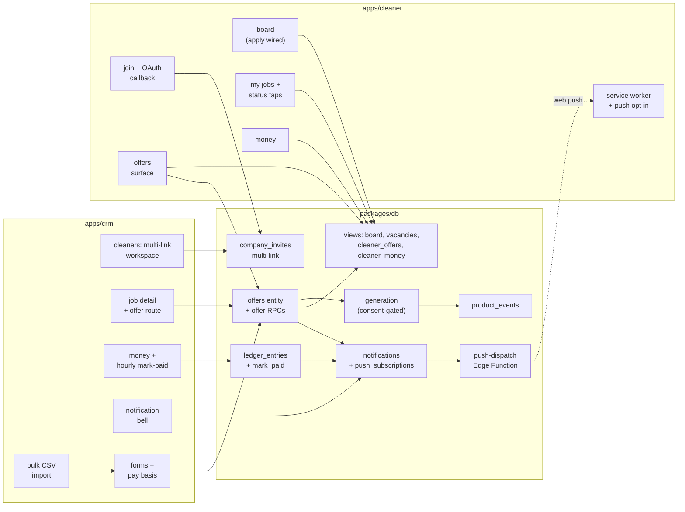

# Phase A — company onboarding and cleaner adoption (alpha) — LLD

## Scope

This document set describes how the components of the [Phase A HLD](hld.md) work inside,
at the level an implementer codes from. It is split by component, which matches the HLD's
component responsibilities and the team topology (`packages/db` is the contract between
the two app tracks):

- **This file** — scope, the delivered-vs-design gap map, and the cross-cutting decision
  log.
- **[lld-db.md](lld-db.md)** — `packages/db`: schema, RPC contracts, views, generation.
- **[lld-crm.md](lld-crm.md)** — `apps/crm` internals.
- **[lld-cleaner.md](lld-cleaner.md)** — `apps/cleaner` internals.

Constraints inherited from the HLD (they bind every part): all flow mutations are
security-definer RPCs; cleaners read through dedicated views only; "offered" and
"vacancy" are projections, never stored statuses (HLD decisions 10, 14); pay is always
admin-stated (HLD decision 12); every table gets explicit grants and company-scoped RLS;
all schedule computation in `Australia/Brisbane`.

## Component delta

What this LLD set adds or changes, and how the new pieces relate — delivered components
in plain boxes, new components bold. Details per component in the part files.

*The offers entity is the hub of the delta: both apps write to it, the generation job
and every projection read from it, and notifications fan out from its transitions.*

## Gap map — delivered vs design

The delivered system on `origin/main` (2026-08-16) against the HLD. "Delivered" facts
come from the migration set `cle_5`–`cle_49` and the app source; each row names the
stories it serves and where the filling design lives.

| Area (stories) | Delivered | Gap to the design |
|---|---|---|
| Company, clients, sites, defaults, preferred cleaners (S1–S4) | `companies`, `clients`, `sites` (+ defaults, all-or-none check), `site_preferred_cleaners`, CRM screens and RPCs | Site defaults carry `default_rate_cents` only — no pay basis (see pay row) |
| Service catalogue (S3) | `service_catalogue`, platform-owned, 4 seeded rows | None — aligned |
| Recurring assignments + generation (S5, S6) | `recurring_assignments` (+ named-cleaner side table), reconcile/generate RPCs, pg_cron 00:05 Brisbane, idempotent per (rule, service date) | Generation auto-assigns named cleaners with no consent check; must become consent-gated (HLD decision 9); pay basis missing |
| Roster, jobs list, job detail (S7, S31, S22) | CRM roster week view, jobs list, job detail with applicant assign | Roster/board must show the **offered** projection once offers exist |
| Cleaner invite (S8) | One active code per company; `rotate_company_invite`; no cap, no attribution, no offer details | Replace with multi-link model: details + pay shape, optional expiry/cap, revoke, per-link attribution (HLD decision 11) |
| Cleaner join + credential (S9, S10, S27) | `join_company_pool` (email + password only), invite preview RPC, PKCE client; `member_status` is `('active','removed')` and the join inserts an active membership | Add Google OAuth + callback route, webview steering, dead-link states for cap/expiry; add the admission gate — a join carries an optional note and produces a join request, not a membership, and a rejection blocks a new request from any link (PRD decisions #22–#29) |
| Join request review (S36) | Absent | New CRM Staff surface: waiting list with name, phone, suburb, note, time, and admitting link; multi-select admit/reject with no "admit all"; count on the Staff navigation item; push on each decision. The link registration limit counts registrations, not admissions (PRD decision #27) |
| Board (S12, S16) | `cleaner_job_board` view + board screen; `apply_to_job` / `withdraw_application` RPCs exist with **no app call site** | Wire apply/withdraw into the board UI; exclude offered slots; order soonest-first, drop past-start |
| Directed offers (S28, S29) | Absent | New `offers` entity, RPCs, consent mark, CRM offer actions, cleaner offers surface (HLD decisions 9, 10, 14) |
| My jobs, status taps, gated address (S17, S18) | `cleaner_my_jobs` view, `update_job_status`, `get_cleaner_job_access` RPCs exist with **no app call site** | Build the cleaner screens over the delivered contract |
| Money (S19, S24) | Nothing — no `ledger_entries`; CRM money page is a placeholder | New ledger table, mark-paid RPC (admin-stated amount for hourly), money screens in both apps (HLD decision 12) |
| Pay basis (S3, S5, S23) | Single `cleaner_pay_cents` on sites/rules/jobs | Add (basis, value) pair through the chain; forms, views, board card |
| Push (S11, S20) | `notifications` table (3 types), in-database only | Web-push: subscriptions, VAPID, dispatch, PWA opt-in; new notification types (offer, mark-paid) |
| PWA install prompt (S11) | Absent | Install prompt + skippable opt-in in `apps/cleaner` |
| Bulk CSV import (S30) | Absent | CRM client-side parse + preview over existing write RPCs (HLD decision 13) |
| Cleaner profile (S21) | Absent | Profile screen with joined companies |
| Instrumentation (S26) | Absent | `product_events` table + writes from both apps and RPCs |
| Job cancel notification (S25) | `cancel_job` emits `job_cancelled` notifications | Delivered in-database; joins push delivery when push lands |

## Open questions

- None yet.

## Decision log

### 1. The LLD splits by component (2026-08-16)

`lld.md` holds scope and the gap map; `lld-db.md`, `lld-crm.md`, `lld-cleaner.md` hold
component internals. This matches the HLD component split and the contract-first team
topology: each app track reads its own file plus the db contract. Considered option:
split by gap area (vertical files) — rejected because both tracks would edit every file,
and the db contract would have no single home.

### 2. Forward migrations only; squashing is considered at alpha ship (2026-08-16)

Every schema gap lands as a new timestamped migration on top of the delivered set
(`cle_5`–`cle_49`); delivered migration files are never edited. The per-ticket pgTAP
suites and concurrency harnesses stay green and new tests come with new migrations.
Considered option: rewrite the migration set in place for a clean baseline — rejected
now (it breaks teammates mid-branch and rewrites the test set), but a squash of the full
set is planned for consideration at the end of the project, when the alpha version
ships.
