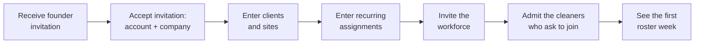
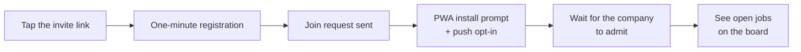

# Phase A — company onboarding and cleaner adoption (alpha) — PRD

## 1. Project specifics

- **Product owner:** Leonardo Pinheiro
- **Team:** Leonardo (CRM track), Dotto (cleaner track)
- **Status:** in delivery
- **Stage:** alpha
- **Journeys:** CA-1, CL-1 designed end-to-end; CA-2…CA-5 and CL-2…CL-4 served at
  prototype parity (capability re-housed into the monorepo apps, not redesigned).
  OP-1 (concierge onboarding) was removed from the alpha on 2026-08-15 — CA-1 is
  self-serve (decision log #12)
- **Features:** F10 (clients, sites, recurring assignments, roster), F11 (cleaners, board,
  dispatch — parity port), F1 (company record with ABN), F4/F5 (consent and availability
  explicitly deferred — see What we're not doing)
- **Project:** https://linear.app/cleanerapp/project/phase-a-company-onboarding-and-pool-adoption-fa89a1783aad
- **Design reference:** see [User interaction and design](#6-user-interaction-and-design)
- **Date:** 2026-08-08 grilling session with Leonardo; split into `prd.md` + `hld.md`
  2026-08-15
- **Companion document:** [hld.md](hld.md) — architecture, data flow, and the technical
  decisions of this cycle

## 2. Goals and business objectives

A real cleaning company can be put into the app in one sitting: company details, clients
and their sites, the recurring schedule, and its existing cleaners. The next
morning, the roster shows the company's actual week — assigned regulars, and gaps as
vacancies — and cleaners see and take open work. This is the decisive adoption moment of
PRODUCT.md §3.2 Phase A. The cycle delivers it entirely on the monorepo apps: the deployed
prototype is reference material, not runtime.

## 3. Background and strategic fit

This is the first build cycle of the internal alpha (PRODUCT.md §3.4). At session time the
repo was scaffold-only. The sibling prototype (`../clean-app`) proves the matching loop and
supplies the visual reference and mechanics patterns; authority runs PRODUCT.md → this
repo → prototype, and the prototype's "boss" jargon never enters UI, docs, or identifiers
(see `docs/glossary.md`). Mid-session, the plan pivoted from "the prototype runs
unmodified alongside the CRM" to "monorepo apps only"
([ADR 0002](../../decisions/0002-alpha-runs-on-monorepo-apps-only.md)); that pivot
dissolved the compatibility constraints the early decisions had worked around. The
prototype findings that shaped the design are recorded in the HLD's Current state.

## 4. Assumptions

Both assumptions come from PRODUCT.md §5.1; this cycle is the test of the first one.

- Companies will move their roster into the app if onboarding is light: the admin
  registers clients, cleaners, and the roster himself in one sitting, with a small first
  sample and bulk CSV import for larger sets.
- Cleaners will register from a link and will accept PWA push as the offer channel.

## 5. User stories

Story IDs are stable; the HLD maps each ID to components, and Linear Milestones slice the
map into releases.

### CA-1 · Set up the company (Thiago, self-serve) — designed end-to-end

The admin onboards his own company through the app and can start with a small sample of
jobs and cleaners.

- **S1** — A founder invites the first company admin through a trusted repository command.
  Sending the invitation approves that company for the alpha. The invited person verifies
  the invited e-mail, sets a password, and enters their name, company name, ABN, contact
  phone, and locale. The app then creates the approved company and the first active owner
  membership in one transaction. The admin confirms or corrects these details in the skippable
  onboarding flow. There is no public signup. Service areas and logo (F1) arrive at MVP;
  no alpha surface consumes them.
- **S2** — Create clients and their sites as separate records: at least one multi-site
  client and single-site clients; address and access notes per site.
- **S3** — Set per-site defaults: service type, duration, and default pay — a pay basis
  (fixed amount per slot, or hourly rate) plus its value. Service types come from a fixed
  platform catalogue (seeded from the F5 examples); companies do not define their own
  types in alpha.
- **S4** — Set an ordered preferred-cleaners list per site.
- **S5** — Create recurring assignments that cover the company's regular week, with crew
  size, named cleaners, and pay (basis + value, seeded from the site default), and at
  least one crew-size-2 job. Generated jobs inherit the assignment's pay.
- **S6** — Generated job instances appear on the schedule. Instances of an **accepted**
  recurring assignment with a named cleaner are created already assigned — the series
  acceptance is standing consent, and no per-instance re-acceptance happens. Instances of
  a series the named cleaner has not yet accepted show as **offered**, not assigned.
  Instances with no named cleaner are posted as vacancies.
- **S7** — The roster week view shows the actual week: pivots per cleaner and per site,
  week navigation, unfilled slots highlighted with a count ("2 unfilled slots this
  week"), on mobile and desktop. States: empty (pre-onboarding), loading, populated week,
  gap-highlighted.
- **S30** — Bulk import from CSV, with a published column format that states exactly
  which fields are needed, as an alternative to one-by-one entry for clients, sites, and
  recurring assignments. A cleaner e-mail send list can be entered directly, one address
  at a time with controls to add further recipients, or supplied by a CSV containing
  `email` and an optional `name`. Both paths produce one case-insensitive, deduplicated
  send list, not accounts or cleaner memberships. Each recipient still registers and joins
  through the invite link. The alpha accepts at most 500 unique recipients in one send.
- **S8** — Create a Cleaner staff invitation, ready to post into the company's WhatsApp group.
  The invitation carries the details of what the cleaner applies for — the work on offer
  and its pay shape (hourly rate or fixed amount), described so the link is a real offer,
  not a bare signup URL. A person who accepts the invitation asks to join the company's Cleaner staff;
  the company admits that person before they become one of its cleaners (S36).
  When the admin creates a link, they can optionally set an expiry time and a maximum
  number of registrations — the count of people who may ask to join through that link,
  whether the company admits them or not; the admin can revoke a link at any time. The flow is: generate
  → send → watch who joins. There is no in-place regeneration — a revoked link is dead,
  and the admin creates a new link when needed. For each link the admin sees its state
  (active / expired / revoked / limit reached) and its registration count; each
  registration attributes to the link that admitted it. No tap tracking in alpha — link
  performance analytics are F12 (MVP). For an existing workforce, the admin can also
  send the selected active link to the S30 cleaner send list. The browser shows the
  exact recipient count and recipient-facing copy before the admin confirms the send.
  The admin must confirm that the recipients are existing workers who expect the
  invitation.
- **S36** — Review the join requests the company's links produced. The Staff screen lists
  each waiting request with the person's name, phone, suburb, the optional note they
  wrote, the time of the request, and the invitation link that carried it. The Staff
  navigation item shows a count of waiting requests; the CRM sends no other alert. The
  admin admits or rejects each request. Admission creates the cleaner membership and
  attributes it to the link. Rejection closes the request and records no reason, and that
  person cannot ask the same company again from any link. The screen keeps rejected
  requests, so the admin can admit a person rejected by mistake. Both owner and staff can
  admit and reject: the company's cleaners are day-to-day operations, not employee
  administration (decision #17). Each decision notifies the person by push (S20). The
  admin can select several waiting requests and decide them together; no control admits
  or rejects every waiting request at once. The list can be filtered by the invitation
  link that carried each request, which separates the workers the admin invited by e-mail
  from people who arrived through a forwarded link.

### CL-1 · Join a company (Ana) — designed end-to-end

From the WhatsApp invite link to a sent join request in under two minutes, all inside
`apps/cleaner`. Open jobs follow when the company admits the request. This surface is the
seed of F12's magic-link registration (MVP).

- **S9** — Register from the invite link with Google social login or email + password.
  Name, phone, and suburb are required profile fields regardless of credential. The flow
  detects an in-app browser (the link opens inside WhatsApp's webview, where Google
  blocks OAuth) and steers OAuth users to the system browser; email + password is the
  path that always works in the webview. A link that is expired, revoked, or at its
  registration limit shows an "invite no longer active" state instead of the form.
  Registration also offers one optional free-text note, which the person uses to say
  where they saw the link or anything else the company should know. The note is part of
  the join request and is not a profile field.
- **S10** — Registration creates a join request, not a cleaner membership. The person
  then waits for the company to admit them. A waiting screen names the company the person
  asked to join and shows the state of the request. Before admission there is no board and
  no vacancy data. The person sees three states: waiting, admitted, and rejected. A
  rejected request shows that the company closed it, with no reason given. The state
  belongs to one company, not to the account: a cleaner who is already admitted at one
  company keeps that company's board while a request at a second company waits.
- **S11** — PWA install prompt and push opt-in. Both are skippable: a cleaner who
  declines still reaches the board — "the PWA is an upgrade, not a gate" (PRODUCT.md
  §3.7).
- **S12** — The board lists the company's open vacancies after the company admits the
  join request, and not before.
- **S27** — Sign in on return visits with the same credential (Google or
  email + password); standard email-based password reset.

*(S13–S15 retired 2026-08-15: they belonged to OP-1 concierge onboarding, which decision
log #12 removed from the alpha. The bulk-import idea survives as S30 under CA-1.)*

### Parity port · `apps/cleaner` (serves CL-2, CL-3, CL-4 at prototype parity)

The prototype's cleaner loop, re-housed at capability parity with visual fidelity.

- **S16** — Board of open vacancies across every joined company with one-tap apply, withdraw, and
  a visible waiting state. A vacancy card shows the pay as posted — a fixed lump sum per
  slot or an hourly rate — and the description may indicate days/hours; some offers are
  deliberately flexible. The board never computes an amount the admin did not state. The
  board orders by start time, soonest first, and drops jobs whose start time has passed;
  preference/availability ordering (F11 v0.4) reorders on top of this baseline in
  cycle 2.
- **S17** — My jobs, with assignment-gated address and access notes, and a maps handoff.
- **S18** — Job status taps: on the way / in progress / done.
- **S19** — Money view: to receive / received.
- **S20** — Push opt-in and web-push delivery. Alpha push events, assembled from the
  settled decisions: a manually posted vacancy notifies the company's cleaners (never generated
  instances — decision #2); a directed offer notifies its cleaner (S28); an accepted
  application notifies the assigned cleaner (PRODUCT.md CA-3); mark-paid notifies the
  cleaner (PRODUCT.md CL-4, "push on settlement"); an admitted or a rejected join request
  notifies the person who asked (S36).
- **S21** — Profile with joined companies.

### Parity port · `apps/crm` dispatch (serves CA-2…CA-5 and CL-4 at prototype parity)

These serve the middle journeys at parity until the Phase B/C cycle designs them properly.

- **S22** — Job detail with applicant list and per-slot assignment (admin picks;
  first-accept-wins enters with the cascade in cycle 2). An application is the cleaner's
  consent: assigning an applicant completes without a further acceptance step. Giving the
  job to a non-applicant goes through a directed offer (S28/S29).
- **S23** — One-off job creation: client → site, service, time, crew size, pay. The
  admin picks the pay basis per job — a fixed amount per slot, or an hourly rate —
  prefilled from the site default and editable.
- **S24** — Money list with mark-paid.
- **S25** — Job cancel. A cancel of an assigned job notifies its assigned cleaners —
  found by the persona walk: without it, Ana's job disappears from her list silently.
- **S31** — Jobs list in the CRM (today and upcoming, with statuses) — found by the
  persona walk: CA-5 ("run the day") has no surface without it; the job detail (S22)
  needs a list to be reached from.

### Employee memberships (extends CA-1)

The multi-membership account model (decisions #16–#18): a company has employees beyond
the first owner, and one account can belong to more than one company.

- **S32** — An owner invites an employee by e-mail and picks the role — owner or
  staff — at send time. The invitee receives an e-mail link with a fixed 7-day expiry.
  A new e-mail sets up the account first; an existing account signs in and accepts.
  Acceptance creates the employee membership atomically. The owner sees each
  invitation's state (pending / accepted / expired / revoked) and can revoke a pending
  invitation. There is no resend and no bulk invitation in alpha. Employee invitations
  never create a company's first owner: that owner comes from the trusted founder bootstrap
  (S1) or authenticated in-CRM company creation (S35). Every active employee can open
  Settings, change self-only account preferences such as language, and view the active
  company's Business Identity. Staff cannot change company identity, inspect employee or
  invitation records, or perform employee administration; every other CRM capability in
  this cycle is available to both roles.

- **S33** — The CRM is always scoped to one active company. The active company is visible
  in a persistent header switcher beside The Clean Crew product identity, separate from
  the personal account menu. The switcher is present even for a single membership so the
  data boundary and the S35 creation entry point remain discoverable. A switch swaps the
  whole CRM context and returns to the roster. The last-active company is stored on the
  profile and restored at sign-in. An account
  with no employee membership sees a "no company access" screen that tells the person
  to ask an owner for an invitation and links to the cleaner app. The cleaner app has
  no switcher — the board already aggregates every joined company.

- **S34** — Settings applies permissions per capability rather than gating the whole
  route. Every active employee can change their own language preference and view the
  active company's name, logo, ABN, and timezone. Only owners can edit that Business
  Identity or see the Company access and Invitations sections. Company access shows each
  employee membership with name, e-mail, role, and joined date. An owner can change any
  employee's role and
  remove any employee, including themselves — but the database refuses any change that
  would leave the company with zero owners. Removal ends the membership (the record is
  kept, not deleted, so history keeps its references), and the removed person's CRM
  access to that company dies on their next request — the S33 no-access or switcher
  logic catches them. Staff have no self-service "leave company" in alpha; removal is
  owner-initiated only.

- **S35** — Any authenticated CRM employee can create a separate company from the
  persistent company switcher, including a person who is Staff in the currently active
  company. Creation collects a company name and ABN, validates both before mutation, and
  refuses an ABN already attached to another company with guidance to request an invitation
  from that company's owner. One atomic mutation creates an approved company, creates the
  caller's active Owner membership, and persists the new company as the caller's active
  context. Cancellation and failed validation create nothing. The successful flow enters
  the locale-preserving onboarding handoff for the new company (which currently forwards
  to its roster), where Business Identity can add its logo and the normal onboarding
  surfaces can add clients, sites, work, and employees. This is available only
  to an account that already has an active employee membership; it does not add public
  signup or let a pool-only/no-company account bootstrap CRM access.

### Directed offers (serves CA-3/CA-4 with acceptance)

An admin who gives work to a specific cleaner sends an offer; acceptance is the
confirmation that the cleaner saw the work and confirmed availability.

- **S28** — The admin offers a job or a recurring assignment to one of the company's
  cleaners. The offer notifies that cleaner only, and the slot does not appear on the
  board while the offer is pending — the admin chose the directed route.
- **S29** — The cleaner accepts or declines the offer. Acceptance completes the
  assignment the admin chose. For a recurring assignment, one acceptance grants standing
  consent for all follow-up generated instances — the admin never re-offers the series.
  A decline notifies the admin, and the slot becomes a vacancy on the board
  immediately; the admin can direct a new offer at any time, which takes it off the
  board again (decision log #13). The dropout flow stays cycle 2. Pending offers reach the cleaner as push and live on a
  visible in-app surface, so an offer missed on the lock screen is still findable.

### Instrumentation

- **S26** — `product_events` records: company onboarded, client/site created, recurring
  assignment created, jobs generated, cleaner joined, application, assignment, completion.

### Success metrics

Instrumentation makes two PRODUCT.md metrics computable from day one, as design input
rather than a gate (product decision 2026-08-10):

- §6.1 activation: ≥ 1 client + ≥ 1 recurring assignment + ≥ 3 cleaners within 14
  days.
- Schedule depth: jobs from recurring assignments ÷ completed jobs.

### Acceptance for the cycle

The three designed journeys pass their stages above, and every §3.4 "kept at prototype
parity" capability demonstrably works across the two monorepo apps: auth and roles, cleaner
memberships and invites, job creation, post/assign, one-tap apply, address gating, job-done, pay
ledger recording, push. F15 also applies at alpha: first-party interface copy is complete
in `en-AU` and `pt-BR`, an explicit language choice persists per profile, and names or
notes entered by users are never translated. The CRM lands first; the profile contract is
shared by both roles, while the cleaner-interface translation remains a separate
implementation slice required before the alpha launch.

## 6. User interaction and design

Parity screens in `apps/cleaner` (board, my jobs, money) keep visual fidelity to the
prototype. New screens (CRM roster, clients, company setup, the join/registration flow) go
through design-explore, governed by `DESIGN.md` and seeded from the prototype's tokens.

Approved Stitch references:

- Stitch `clean-app-crm` (stitch.withgoogle.com/projects/14703266792285619940):
  CA-1-roster `3af77dd5…`, CA-1-clients `f956011f…`, CA-1-client-detail `771d4b52…`,
  CA-1-company-settings `312d2c03…`. CA-1-recurring-assignments timed out at the MCP layer
  twice — check the project UI for a completed copy, or regenerate from the prompt on
  record.
- Stitch `clean-app-cleaner` (stitch.withgoogle.com/projects/11393108481758850289):
  CL-1-join `931ca756…` (Poppins correction of `9efcc6c3…`). Caveat: the cleaner project's
  derived design-system asset mis-picked Plus Jakarta Sans; re-derive from DESIGN.md
  before more cleaner screens are generated.

## 7. Open questions

| Question | Owner | Answer |
|---|---|---|
| Co-founder alignment (PRODUCT.md Appendix B q1): the alpha does not depend on their code or deployment, but the adaptation of the prototype's schema and UI patterns into this repo belongs in the IP/roles conversation. Have it before the cohort (their employers) onboards. | Leonardo | Open |
| Does any alpha company need daily-frequency recurring assignments? Weekly/fortnightly covers the known cohort. | Leonardo | Extend on evidence (feeds Appendix B q3 sizing) |
| What does cleaner e-mail entry or CSV import produce, given cleaners must register themselves (credential + consent)? | Leonardo | Resolved 2026-08-18: both produce one send list. Direct entry accepts multiple addresses; CSV accepts `email` and optional `name`. Neither creates an account or cleaner membership. |
| Facebook login for cleaners: enable when the cohort shows demand (decision log #9 defers it) | Leonardo | Open |
| PRODUCT.md CL-7 (MVP, register from a group post) says the person "joins the company's cleaners with the job open, and applies". The admission gate makes that sequence impossible: without a membership there is no board and no application. The MVP share-link cycle must redesign the journey. | Leonardo | Open — CL-7 left unedited on 2026-08-25 so the cycle that owns it can grill it |
| CA-1 order: S5 recurring assignments carry named cleaners, but nobody is a cleaner until the company admits them, and the backbone puts "Enter recurring assignments" before "Invite the workforce". The gate adds a review step between the two. Does the admin enter the workforce first, or create assignments without named cleaners and add the names after admission? Found by the validation walk on 2026-08-25. | Leonardo | Open |
| Decision #28 gives the CRM a count on the Staff navigation item because the CRM had no notification surface. The `codex/cle-86-application-approval-flow` branch adds one — a header notification bell on a realtime subscription to `application_received`, with unread counts. If that branch merges, does the join request reuse the bell instead of a count? | Leonardo | Open |
| The `staff-the-work` PRD states its delivered baseline as "cleaner invitations and join". The admission gate changes what that sentence describes, so the CA-3/CA-4/CL-2 cycle must restate it when this document merges. | Leonardo | Open |
| How long does a company keep the name, phone, suburb, and note of a person it rejected? Rejected join requests are kept so that a rejection stays final (decision #26), so the records accumulate with no rule to remove them. | Leonardo | Open |
| Sync of PRODUCT.md revisions (v0.4) with decisions 0002 and 2026-08-10 | Leonardo | Resolved 2026-08-12: `docs/PRODUCT.md` is canonical in this repo; §3.2/§3.4 reworded per decision 0002; exit criteria replaced by qualitative partner validation |

Technical open questions (generation horizon, notification discipline) live in the
[HLD](hld.md#open-questions).

## 8. What we're not doing

Not in this cycle (cycle 2, same stage):

- Availability toggle and staleness (CL-5).
- Dropout and urgent backfill (CA-6/CL-6).
- First-job marker and outcome capture (CA-9).
- First-accept-wins assignment (enters with the cascade).
- A richer cleaner profile: photo and structured experience. Decision #25 keeps the alpha
  profile at name, phone, and suburb. A photo also needs a storage and sensitive-data
  decision that this cycle did not take.

Not in the alpha (MVP/P1 per PRODUCT.md §3.4):

- Structured reviews, public share links, vetting, general messaging, AI, and WhatsApp
  automation. The one-time S30 e-mail invitation is the only provider-backed alpha
  message. It has no reminders, contact list, delivery tracking, or funnel analytics.
- Public company signup: a person's first CRM company remains founder-invited. S35 permits
  an existing authenticated CRM employee to create another approved company from inside
  the product; onboarding itself remains self-serve.
- Operator journeys and the operator console: OP-1 was removed from the alpha
  (decision log #12). A trusted founder command sends the first-admin invitation; it is
  not an operator application. Operator journeys start at MVP (OP-2, vetting).

Partial journeys: CA-2…CA-5 and CL-2…CL-4 are served at prototype parity only; the Phase
B/C cycle designs them properly.

## 9. Decision log

Architecture decisions live in the [HLD's log](hld.md#decision-log). The standalone ADRs
0001–0004 in `docs/decisions/` are a frozen archive; this log records the product and
scope decisions of the 2026-08-08 session.

### 1. Auto-assign without acceptance (2026-08-08)

Instances generated from a recurring assignment with a named cleaner are created already
assigned — the roster records reality; Maria does not re-accept her Tuesdays. A decline is
the dropout flow (cycle 2). The alternative — offer/accept for regulars — would make the
roster show pending states for work that is, in reality, settled.

### 2. Push discipline for generated instances (2026-08-08)

Auto-assignments and generated postings do not fire per-instance push; only manually
posted jobs notify the pool in this cycle. Without this rule, the nightly generation run
would send every cleaner a month of job notifications.

### 3. CL-1 join is link-first (2026-08-08)

The Cleaner staff invitation is a real link into `apps/cleaner`: one-minute registration (name,
phone, suburb), staff joined, PWA install prompt and push opt-in, board immediately visible. This
follows PRODUCT.md CL-1 and replaces the prototype's signup-plus-manual-code-entry join.
The surface is the seed of F12's magic-link registration (MVP).

### 4. Recurrence is weekly or fortnightly only (2026-08-08)

Weekly/fortnightly covers the known cohort; daily frequency is added only on evidence
(open question above). This bounds the recurrence model for the cycle.

### 5. UI fidelity split (2026-08-08)

Parity screens in `apps/cleaner` (board, my jobs, money) keep visual fidelity to the
prototype; new screens (CRM roster, clients, company setup, join/registration) go through
design-explore governed by `DESIGN.md`, seeded from the prototype's tokens. This keeps the
parity port cheap and puts design effort where the product is new.

### 6. Concierge tooling is CSV plus seed scripts (2026-08-08)

OP-1 uses CSV templates and service-role seed scripts — "direct tooling, no console" per
PRODUCT.md §3.2. No operator console is built in the alpha.

### 7. The platform owns the service-type catalogue (2026-08-15)

Service types are a fixed platform catalogue, seeded from the F5 examples; companies do
not define their own types in alpha. The alternative — per-company services — would mirror
each company's own vocabulary, but F5 job-type preferences (cycle 2+) need types that mean
the same thing across every pool a cleaner joins, and company-invented vocabulary would
need a mapping migration later.

### 8. Invite links carry optional limits and are revocable, never regenerated (2026-08-15)

An invite link optionally carries an expiry time and a maximum number of registrations,
set at creation; the admin can revoke a link at any time. There is no in-place
regeneration: the flow is generate → send → watch who joins, and a new need means a new
link. Considered option: one standing link per company with rotate-in-place — rejected
because limits at creation match how the admin actually controls load, and rotation is
not a behaviour the flow expects.

### 9. Cleaner credential: Google social login or email + password (2026-08-15)

Cleaners register and sign in with Google OAuth or email + password; phone and suburb
stay required profile fields (PRODUCT.md CL-1 captures phone as the contact channel, not
as the credential). Facebook login is deferred until the cohort shows demand — it adds a
developer app, business verification, and app review for little alpha gain. Constraint
that shaped this: the invite link opens inside WhatsApp's in-app browser, where Google
blocks OAuth (`disallowed_useragent`), so email + password is the fallback that always
works there and the flow steers OAuth users to the system browser. SMS one-time codes
were rejected for alpha: per-message cost and an SMS-provider dependency on a free
product.

### 10. Pay basis is configurable per job (2026-08-15)

Every job carries a pay basis the admin picks: a fixed amount per slot (typical for
one-off jobs), or an hourly rate (typical for standing contracts with many assignments).
Site defaults seed the basis and value; recurring assignments carry them; generated jobs
inherit them. A single forced model was rejected: real contracts in the cohort come in
both shapes, and the admin must be able to specify either.

### 11. Admin-given work requires acceptance; recurring consent is series-level (2026-08-15)

Supersedes: #1 (refines it). Any work the admin gives to a specific cleaner is an offer;
acceptance confirms the cleaner saw the work and confirmed availability. For a recurring
assignment, acceptance happens once, at the first offer of the series; that consent
stands for every follow-up generated instance — the admin never re-offers, and "Maria
does not re-accept her Tuesdays" holds per instance, not for the series itself. A board
application is itself the cleaner's consent, so assigning an applicant needs no further
acceptance. PRODUCT.md CA-4 is corrected from "assigned and notified" to offered and
accepted.

### 12. Alpha onboarding is self-serve; the concierge model is removed (2026-08-15)

Supersedes: #6. There is no concierge onboarding and no seeded data in the alpha: the
founder-admin registers his own clients, cleaners, and roster through the app, and can
start with a small sample of jobs and cleaners. Journey OP-1 is removed from PRODUCT.md;
operator journeys start at MVP (OP-2). The CSV idea survives re-framed: not operator
tooling, but an admin-facing bulk import with a published column format (S30).
Consequence: with no seeded data there is no pre-accepted work — every recurring
assignment the admin creates goes out as a series offer under decision #11.

### 13. A decline posts the slot to the board by default (2026-08-15)

Refines #11. When a cleaner declines an offer, the admin is notified and the slot
becomes a visible vacancy on the board immediately — the admin does not act first. The
admin stays in control: a new directed offer takes the slot off the board again.
Considered option: hold the declined slot until the admin chooses — rejected because it
hides unfilled work while the admin is away, and the vacancy model exists to make gaps
visible (found by the HLD validation walk; HLD decision 14).

### 14. Direct entry or a cleaner CSV produces a one-time invitation send list (2026-08-18)

The admin can type one or more cleaner e-mail addresses directly or upload a cleaner CSV.
The browser combines these inputs into a case-insensitive, deduplicated e-mail send list.
It never creates cleaner accounts or pool memberships. Each recipient uses the existing link-first
registration flow. The company admin confirms that all recipients are existing workers
who expect the invitation. The message identifies the cleaning company and The Clean
Crew, uses the authenticated admin e-mail as Reply-To, and tells unexpected recipients to
ignore the message or reply to the company. It has no unsubscribe system because this
alpha path is a one-time operational invitation, not a marketing list. One confirmed send
is limited to 500 unique recipients so the synchronous alpha action remains bounded.

### 15. A founder invitation approves the first company admin (2026-08-18)

A founder sends one first-admin invitation from a trusted repository command. The invited
person verifies the invited e-mail before the app creates an approved company, promotes the
profile, and creates the first active membership in one transaction. A platform operator
application and invitations for additional company admins remain out of scope. This keeps
the alpha invite-only without restoring the concierge model or adding public signup.

### 16. Employees are memberships; the roles are owner and staff (2026-08-19)

Partly supersedes #15 (which kept additional company-admin invitations out of scope).
The identity model becomes the standard multi-membership account model: one user
account can hold memberships in more than one company, and each membership carries one
company-side role. The alpha has exactly two roles: **owner** — everything, including
company identity changes and employee administration — and **staff** — day-to-day operations
(clients, sites, recurring assignments, roster, jobs, dispatch, pool), self-only account
preferences, and read-only Business Identity, with no company mutation or employee data.
All of it is alpha-usable: an owner invites
employees and picks the role, one person can belong to more than one company, and the
CRM has a company switcher. Considered option: make only the schema ready and defer the
switcher — rejected; the product owner wants the cohort to exercise the full model. The
founder-invited first admin becomes the first owner. Finer roles (for example a money
boundary) are added only when a cohort company asks for one.

### 17. One account, two membership kinds (2026-08-19)

Refines #16. A user account can hold an employee membership (role owner or staff,
created by an owner's invitation) and a pool membership (cleaner in a company's pool,
created through an invite link) at the same time — within the same company or across
different companies. The supervisor who also cleans holds one login. The two kinds stay separate
concepts: they have different creators, different lifecycles, and different privacy
consequences. Considered option: one membership object with a third role `cleaner` —
rejected because pool joining (link attribution, registration caps) and employee
management would share a table that every RLS policy must then disambiguate row by row.
An existing account signs in from the cleaner invitation, returns to the same invite,
completes any missing cleaner profile fields, and joins without creating another Auth identity.

### 18. Employee invitation: owner-sent, e-mail-verified, minimal (2026-08-19)

Delivers #16 at the flow level. Only an owner invites, by e-mail, and picks the role at
send time. The invitee verifies the e-mail through the invitation link (7-day fixed
expiry, matching the first-admin invitation). A new e-mail sets up an account first; an
existing account signs in and accepts — this path is required, because multi-membership
makes "the invited e-mail already has an account" the normal case. Acceptance creates
the employee membership atomically. The owner sees invitation state (pending /
accepted / expired / revoked) and can revoke. No resend, no bulk, no invitee-picks-role
step. The founder command remains the only source of a company's first owner.

### 19. One active company scopes the CRM; the switcher is membership-gated (2026-08-19)

Delivers #16 at the session level, as amended by decision #21. The CRM always operates in
exactly one active company. The last-active company persists on the profile and is restored
at sign-in. An account with no employee membership
gets a deliberate "no company access" screen, not an error. The cleaner app gets no
switcher: the board aggregates all joined pools already, so cleaners never pick a
company. Considered option: a per-session company picker at every sign-in — rejected
because almost every cohort account holds one membership.

### 20. Owners manage employees; the last owner is protected (2026-08-19)

Completes #16–#18. Owners see an employees list in company settings and can change
roles and remove employees, themselves included. The database refuses any role change
or removal that would leave a company with zero owners — with no public signup and
first owners made only by the founder command, a zero-owner company is locked out
permanently. Removal ends the membership but keeps the record for history. Considered
option: no post-acceptance management in alpha — rejected because a departed employee
would keep company access.

### 21. Company context is persistent and authenticated employees can create companies (2026-08-21)

Amends #15, #18, and #19. The active company moves out of the personal account menu into
the persistent CRM header and remains visible for one or many memberships. Its menu lists
the caller's companies, switches the whole CRM context, and ends with Create new company;
there is no cross-company "all companies" view. Any account that already holds an active
employee membership may create a separate company and becomes that company's first Owner,
regardless of the role held in the previous company. The database creates the approved
company, Owner membership, and active-company preference atomically and rejects duplicate
ABNs. The trusted founder invitation remains the only way to bootstrap a person's first
CRM company, so this does not introduce public signup. Considered option: keep creation in
Settings or the personal account menu — rejected because company scope is persistent
workspace context, not a personal preference.

### 22. Every cleaner join needs company approval (2026-08-25)

Partly supersedes #3 (which joined the Cleaner staff at registration). A cleaner
invitation link admits nobody by itself. A person who registers from a link does not
become one of the company's cleaners. A company admin must approve that person first,
and only approval creates the cleaner membership. This applies to every link, with no
per-link exception. Considered option: make review a setting on each link, so a link
sent to an existing workforce admits immediately — rejected because a recipient can
forward the link to anybody. The admin does not control who receives a link, so the link
cannot be the gate.

### 23. No board access before approval (2026-08-25)

Refines #22, and partly supersedes #3 (which showed the board immediately after
registration). A person who waits for approval sees a waiting screen. That person does
not see the cleaner board. The board shows the company's vacancies with their sites,
times, service types, and pay. A person who holds a forwarded link is the person the
approval gate stops, so that person must not read the company's schedule. Consequence:
PRODUCT.md CL-1 can no longer use "the board shows open jobs immediately" as the moment
that makes a cleaner stay, and push notification becomes the way the person comes back
after approval.

### 24. The vocabulary is join request, admit, and reject (2026-08-25)

A person who registers from a cleaner invitation link creates a **join request**. A
company admin **admits** or **rejects** that request. Considered options: *application*
and *applicant* — rejected because a board application is a cleaner who applies to a job,
so a CRM that shows "3 applications waiting" would carry two meanings at once;
*candidate* — rejected because PRODUCT.md F4/F6 keeps that word for the MVP recruitment
pipeline; *approve/deny* and *accept/decline* — rejected because accept and decline are
what a cleaner does to an offer (S29). The documents already used *admit* for entry into
the Cleaner staff ("the link that admitted it").

### 25. One optional note on the join request; the cleaner profile stays global and minimal (2026-08-25)

Registration keeps its three required profile fields — full name, phone, and suburb — and
adds one optional free-text note. The note belongs to the join request, not to the
profile. The cleaner profile stays global: one profile for each account, which every
company the person joins can see. A later cycle extends that global profile with a photo
and structured experience, in the F5 direction; both are additive and neither is needed
now.

- **Considered option:** put the note on the profile — rejected because a person who asks
  to join two companies writes something different to each one, and a profile-level note
  would show one company what the person wrote to another.
- **Consequence:** the note is the only field that a later, richer profile does not
  absorb. Everything else the alpha collects stays on the profile and grows there.

### 26. Rejection is visible, reasonless, and final for the person (2026-08-25)

A company admin rejects a join request and records no reason. The person sees that the
company closed the request. That person cannot create a new join request for the same
company from any link. The company can still admit the person later from the CRM, which
is the way back from a rejection made by mistake. This is the same shape as removal
today: `join_company_pool` already refuses a removed cleaner, so an old link cannot undo
a company decision.

- **Considered options:** leave the request silent — rejected because a person who hears
  nothing cannot tell a rejection from a broken app, and the admin cannot tell a rejected
  request from one nobody has read yet; let the person ask again — rejected because a
  link the admin does not control would reopen the request every day.
- **Consequence:** no free-text reason is stored. AGENTS.md keeps company-authored text
  about a cleaner out of the product because of the defamation boundary, and a stored
  rejection reason is that kind of text.

### 27. An invitation link's limit counts registrations, not admissions (2026-08-25)

A registration and an admission were the same event before this cycle, so a link's limit
had only one meaning. They are now separate events, and the limit counts registrations:
how many people may ask to join through that link. A link that reaches its limit stops
accepting registrations and shows the "invite no longer active" state (S9).

- **Considered option:** count admissions, so the limit means "at most N cleaners join
  from this link" — rejected because the admin does not control who holds the link. A
  link forwarded into a job group would then produce an unbounded number of join requests
  to review. A link that reaches its limit is a visible problem that one new link fixes
  (decision #8); a thousand waiting requests is not.
- **Consequence:** the limit is a bound on review work, not a headcount for the Cleaner
  staff. Cleaners the admin actually invited can be locked out by a forwarded link, and
  the admin's remedy is to create a new link and send it.

### 28. Both decisions notify the person; the CRM gets a count only (2026-08-25)

An admitted join request and a rejected join request each send push to the person who
asked. The gate removed the reason to open the cleaner app — a person who registers now
sees a waiting screen and no work — so push is what brings that person back. Rejection
sends push for the same reason as decision #26: a person who is waiting for an answer and
never gets one cannot tell a rejection from a broken app. Push opt-in stays skippable
(S11), so the waiting screen always shows the state at sign-in as well.

- **Consequence:** the CRM gets a count of waiting requests on its Staff navigation item
  and nothing more. The CRM has no notification surface today, and building one is
  infrastructure this cycle was not asked for.

### 29. Admission is multi-select; no control decides every request at once (2026-08-25)

The admin selects one or more waiting join requests and admits or rejects the selection
together. The CRM has no "admit all" and no "reject all". The bulk send list (S30) can
produce dozens of registrations in one night, so a decision on a whole workforce must
cost about the same as a decision on one person.

- **Considered option:** an "admit all" control — rejected because a link forwarded out
  of the company's group puts those requests in the same list, and one tap would admit
  those people together with the invited workers. Selection keeps every admission an act
  the admin performed on a name the admin read.
- **Consequence:** the request list can be filtered by the invitation link that carried
  each request. This is what separates a workforce invited by e-mail from people who
  arrived through a forwarded link.
