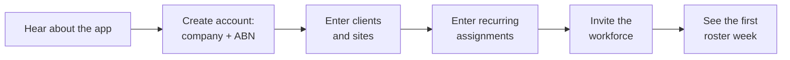
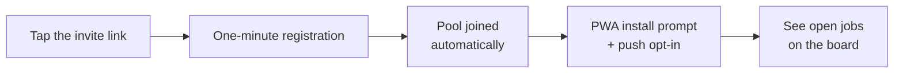

# Phase A — company onboarding and pool adoption (alpha) — PRD

## 1. Project specifics

- **Product owner:** Leonardo Pinheiro
- **Team:** Leonardo (CRM track), Dotto (cleaner track)
- **Status:** in delivery
- **Stage:** alpha
- **Journeys:** CA-1, CL-1 designed end-to-end; CA-2…CA-5 and CL-2…CL-4 served at
  prototype parity (capability re-housed into the monorepo apps, not redesigned).
  OP-1 (concierge onboarding) was removed from the alpha on 2026-08-15 — CA-1 is
  self-serve (decision log #12)
- **Features:** F10 (clients, sites, recurring assignments, roster), F11 (pool, board,
  dispatch — parity port), F1 (company record with ABN), F4/F5 (consent and availability
  explicitly deferred — see What we're not doing)
- **Project:** https://linear.app/cleanerapp/project/phase-a-company-onboarding-and-pool-adoption-fa89a1783aad
- **Design reference:** see [User interaction and design](#6-user-interaction-and-design)
- **Date:** 2026-08-08 grilling session with Leonardo; split into `prd.md` + `hld.md`
  2026-08-15
- **Companion document:** [hld.md](hld.md) — architecture, data flow, and the technical
  decisions of this cycle

## 2. Goals and business objectives

A real cleaning company can be put into the app in one sitting: company details, clients
and their sites, the recurring schedule, and its existing cleaners in the pool. The next
morning, the roster shows the company's actual week — assigned regulars, and gaps as
vacancies — and cleaners see and take open work. This is the decisive adoption moment of
PRODUCT.md §3.2 Phase A. The cycle delivers it entirely on the monorepo apps: the deployed
prototype is reference material, not runtime.

## 3. Background and strategic fit

This is the first build cycle of the internal alpha (PRODUCT.md §3.4). At session time the
repo was scaffold-only. The sibling prototype (`../clean-app`) proves the matching loop and
supplies the visual reference and mechanics patterns; authority runs PRODUCT.md → this
repo → prototype, and the prototype's "boss" jargon never enters UI, docs, or identifiers
(see `docs/glossary.md`). Mid-session, the plan pivoted from "the prototype runs
unmodified alongside the CRM" to "monorepo apps only"
([ADR 0002](../../decisions/0002-alpha-runs-on-monorepo-apps-only.md)); that pivot
dissolved the compatibility constraints the early decisions had worked around. The
prototype findings that shaped the design are recorded in the HLD's Current state.

## 4. Assumptions

Both assumptions come from PRODUCT.md §5.1; this cycle is the test of the first one.

- Companies will move their roster into the app if onboarding is light: the admin
  registers clients, cleaners, and the roster himself in one sitting, with a small first
  sample and bulk CSV import for larger sets.
- Cleaners will register from a link and will accept PWA push as the offer channel.

## 5. User stories

Story IDs are stable; the HLD maps each ID to components, and Linear Milestones slice the
map into releases.

### CA-1 · Set up the company (Thiago, self-serve) — designed end-to-end

The admin onboards his own company through the app and can start with a small sample of
jobs and cleaners.

- **S1** — Create the company record: name, ABN, and contact details — nothing more.
  Alpha companies are approved by us (invite-only; no public signup), and the admin signs
  in with email + password. Service areas and logo (F1) arrive at MVP; no alpha surface
  consumes them.
- **S2** — Create clients and their sites as separate records: at least one multi-site
  client and single-site clients; address and access notes per site.
- **S3** — Set per-site defaults: service type, duration, and default pay — a pay basis
  (fixed amount per slot, or hourly rate) plus its value. Service types come from a fixed
  platform catalogue (seeded from the F5 examples); companies do not define their own
  types in alpha.
- **S4** — Set an ordered preferred-cleaners list per site.
- **S5** — Create recurring assignments that cover the company's regular week, with crew
  size, named cleaners, and pay (basis + value, seeded from the site default), and at
  least one crew-size-2 job. Generated jobs inherit the assignment's pay.
- **S6** — Generated job instances appear on the schedule. Instances of an **accepted**
  recurring assignment with a named cleaner are created already assigned — the series
  acceptance is standing consent, and no per-instance re-acceptance happens. Instances of
  a series the named cleaner has not yet accepted show as **offered**, not assigned.
  Instances with no named cleaner are posted as vacancies.
- **S7** — The roster week view shows the actual week: pivots per cleaner and per site,
  week navigation, unfilled slots highlighted with a count ("2 unfilled slots this
  week"), on mobile and desktop. States: empty (pre-onboarding), loading, populated week,
  gap-highlighted.
- **S30** — Bulk import from CSV, with a published column format that states exactly
  which fields are needed, as an alternative to one-by-one entry for clients, sites, and
  recurring assignments. Cleaner data is not imported into accounts — cleaners register
  themselves through the invite link (see Open questions for what a cleaner CSV could
  produce).
- **S8** — Create a pool invite link, ready to post into the company's WhatsApp group.
  The invitation carries the details of what the cleaner applies for — the work on offer
  and its pay shape (hourly rate or fixed amount), described so the link is a real offer,
  not a bare signup URL. A cleaner who accepts the invitation joins the pool.
  When the admin creates a link, they can optionally set an expiry time and a maximum
  number of registrations; the admin can revoke a link at any time. The flow is: generate
  → send → watch who joins. There is no in-place regeneration — a revoked link is dead,
  and the admin creates a new link when needed. For each link the admin sees its state
  (active / expired / revoked / limit reached) and its registration count; each
  registration attributes to the link that admitted it. No tap tracking in alpha — link
  performance analytics are F12 (MVP).

### CL-1 · Join the pool (Ana) — designed end-to-end

From the WhatsApp invite link to open jobs in under two minutes, all inside
`apps/cleaner`. This surface is the seed of F12's magic-link registration (MVP).

- **S9** — Register from the invite link with Google social login or email + password.
  Name, phone, and suburb are required profile fields regardless of credential. The flow
  detects an in-app browser (the link opens inside WhatsApp's webview, where Google
  blocks OAuth) and steers OAuth users to the system browser; email + password is the
  path that always works in the webview. A link that is expired, revoked, or at its
  registration limit shows an "invite no longer active" state instead of the form.
- **S10** — The pool membership is created automatically at registration.
- **S11** — PWA install prompt and push opt-in. Both are skippable: a cleaner who
  declines still reaches the board — "the PWA is an upgrade, not a gate" (PRODUCT.md
  §3.7).
- **S12** — The board lists open vacancies immediately after registration.
- **S27** — Sign in on return visits with the same credential (Google or
  email + password); standard email-based password reset.

*(S13–S15 retired 2026-08-15: they belonged to OP-1 concierge onboarding, which decision
log #12 removed from the alpha. The bulk-import idea survives as S30 under CA-1.)*

### Parity port · `apps/cleaner` (serves CL-2, CL-3, CL-4 at prototype parity)

The prototype's cleaner loop, re-housed at capability parity with visual fidelity.

- **S16** — Board of open vacancies across joined pools with one-tap apply, withdraw, and
  a visible waiting state. A vacancy card shows the pay as posted — a fixed lump sum per
  slot or an hourly rate — and the description may indicate days/hours; some offers are
  deliberately flexible. The board never computes an amount the admin did not state. The
  board orders by start time, soonest first, and drops jobs whose start time has passed;
  preference/availability ordering (F11 v0.4) reorders on top of this baseline in
  cycle 2.
- **S17** — My jobs, with assignment-gated address and access notes, and a maps handoff.
- **S18** — Job status taps: on the way / in progress / done.
- **S19** — Money view: to receive / received.
- **S20** — Push opt-in and web-push delivery. Alpha push events, assembled from the
  settled decisions: a manually posted vacancy notifies the pool (never generated
  instances — decision #2); a directed offer notifies its cleaner (S28); an accepted
  application notifies the assigned cleaner (PRODUCT.md CA-3); mark-paid notifies the
  cleaner (PRODUCT.md CL-4, "push on settlement").
- **S21** — Profile with joined pools.

### Parity port · `apps/crm` dispatch (serves CA-2…CA-5 and CL-4 at prototype parity)

These serve the middle journeys at parity until the Phase B/C cycle designs them properly.

- **S22** — Job detail with applicant list and per-slot assignment (admin picks;
  first-accept-wins enters with the cascade in cycle 2). An application is the cleaner's
  consent: assigning an applicant completes without a further acceptance step. Giving the
  job to a non-applicant goes through a directed offer (S28/S29).
- **S23** — One-off job creation: client → site, service, time, crew size, pay. The
  admin picks the pay basis per job — a fixed amount per slot, or an hourly rate —
  prefilled from the site default and editable.
- **S24** — Money list with mark-paid.
- **S25** — Job cancel. A cancel of an assigned job notifies its assigned cleaners —
  found by the persona walk: without it, Ana's job disappears from her list silently.
- **S31** — Jobs list in the CRM (today and upcoming, with statuses) — found by the
  persona walk: CA-5 ("run the day") has no surface without it; the job detail (S22)
  needs a list to be reached from.

### Directed offers (serves CA-3/CA-4 with acceptance)

An admin who gives work to a specific cleaner sends an offer; acceptance is the
confirmation that the cleaner saw the work and confirmed availability.

- **S28** — The admin offers a job or a recurring assignment to a specific cleaner from
  the pool. The offer notifies that cleaner only, and the slot does not appear on the
  board while the offer is pending — the admin chose the directed route.
- **S29** — The cleaner accepts or declines the offer. Acceptance completes the
  assignment the admin chose. For a recurring assignment, one acceptance grants standing
  consent for all follow-up generated instances — the admin never re-offers the series.
  A decline notifies the admin, and the slot becomes a vacancy on the board
  immediately; the admin can direct a new offer at any time, which takes it off the
  board again (decision log #13). The dropout flow stays cycle 2. Pending offers reach the cleaner as push and live on a
  visible in-app surface, so an offer missed on the lock screen is still findable.

### Instrumentation

- **S26** — `product_events` records: company onboarded, client/site created, recurring
  assignment created, jobs generated, pool joined, application, assignment, completion.

### Success metrics

Instrumentation makes two PRODUCT.md metrics computable from day one, as design input
rather than a gate (product decision 2026-08-10):

- §6.1 activation: ≥ 1 client + ≥ 1 recurring assignment + ≥ 3 pool members within 14
  days.
- Schedule depth: jobs from recurring assignments ÷ completed jobs.

### Acceptance for the cycle

The three designed journeys pass their stages above, and every §3.4 "kept at prototype
parity" capability demonstrably works across the two monorepo apps: auth and roles, pools
and invites, job creation, post/assign, one-tap apply, address gating, job-done, pay
ledger recording, push. F15 also applies at alpha: first-party interface copy is complete
in `en-AU` and `pt-BR`, an explicit language choice persists per profile, and names or
notes entered by users are never translated. The CRM lands first; the profile contract is
shared by both roles, while the cleaner-interface translation remains a separate
implementation slice required before the alpha launch.

## 6. User interaction and design

Parity screens in `apps/cleaner` (board, my jobs, money) keep visual fidelity to the
prototype. New screens (CRM roster, clients, company setup, the join/registration flow) go
through design-explore, governed by `DESIGN.md` and seeded from the prototype's tokens.

Approved Stitch references:

- Stitch `clean-app-crm` (stitch.withgoogle.com/projects/14703266792285619940):
  CA-1-roster `3af77dd5…`, CA-1-clients `f956011f…`, CA-1-client-detail `771d4b52…`,
  CA-1-company-settings `312d2c03…`. CA-1-recurring-assignments timed out at the MCP layer
  twice — check the project UI for a completed copy, or regenerate from the prompt on
  record.
- Stitch `clean-app-cleaner` (stitch.withgoogle.com/projects/11393108481758850289):
  CL-1-join `931ca756…` (Poppins correction of `9efcc6c3…`). Caveat: the cleaner project's
  derived design-system asset mis-picked Plus Jakarta Sans; re-derive from DESIGN.md
  before more cleaner screens are generated.

## 7. Open questions

| Question | Owner | Answer |
|---|---|---|
| Co-founder alignment (PRODUCT.md Appendix B q1): the alpha does not depend on their code or deployment, but the adaptation of the prototype's schema and UI patterns into this repo belongs in the IP/roles conversation. Have it before the cohort (their employers) onboards. | Leonardo | Open |
| Does any alpha company need daily-frequency recurring assignments? Weekly/fortnightly covers the known cohort. | Leonardo | Extend on evidence (feeds Appendix B q3 sizing) |
| What does a cleaner CSV import produce, given cleaners must register themselves (credential + consent)? Candidate idea: pre-staged names/phones that match up at registration. | Leonardo | Open |
| Facebook login for cleaners: enable when the cohort shows demand (decision log #9 defers it) | Leonardo | Open |
| Sync of PRODUCT.md revisions (v0.4) with decisions 0002 and 2026-08-10 | Leonardo | Resolved 2026-08-12: `docs/PRODUCT.md` is canonical in this repo; §3.2/§3.4 reworded per decision 0002; exit criteria replaced by qualitative partner validation |

Technical open questions (generation horizon, notification discipline) live in the
[HLD](hld.md#open-questions).

## 8. What we're not doing

Not in this cycle (cycle 2, same stage):

- Availability toggle and staleness (CL-5).
- Dropout and urgent backfill (CA-6/CL-6).
- First-job marker and outcome capture (CA-9).
- First-accept-wins assignment (enters with the cascade).

Not in the alpha (MVP/P1 per PRODUCT.md §3.4):

- Structured reviews, share links, vetting, messaging, AI, WhatsApp automation. The pool
  invite link is the seed of F12, not its delivery: no tap tracking and no funnel
  analytics in alpha.
- Public company signup: alpha companies are invited and approved by us; onboarding
  itself is self-serve.
- Operator journeys and the operator console: OP-1 was removed from the alpha
  (decision log #12); operator journeys start at MVP (OP-2, vetting).

Partial journeys: CA-2…CA-5 and CL-2…CL-4 are served at prototype parity only; the Phase
B/C cycle designs them properly.

## 9. Decision log

Architecture decisions live in the [HLD's log](hld.md#decision-log). The standalone ADRs
0001–0004 in `docs/decisions/` are a frozen archive; this log records the product and
scope decisions of the 2026-08-08 session.

### 1. Auto-assign without acceptance (2026-08-08)

Instances generated from a recurring assignment with a named cleaner are created already
assigned — the roster records reality; Maria does not re-accept her Tuesdays. A decline is
the dropout flow (cycle 2). The alternative — offer/accept for regulars — would make the
roster show pending states for work that is, in reality, settled.

### 2. Push discipline for generated instances (2026-08-08)

Auto-assignments and generated postings do not fire per-instance push; only manually
posted jobs notify the pool in this cycle. Without this rule, the nightly generation run
would send every cleaner a month of job notifications.

### 3. CL-1 join is link-first (2026-08-08)

The pool invite is a real link into `apps/cleaner`: one-minute registration (name, phone,
suburb), pool joined, PWA install prompt and push opt-in, board immediately visible. This
follows PRODUCT.md CL-1 and replaces the prototype's signup-plus-manual-code-entry join.
The surface is the seed of F12's magic-link registration (MVP).

### 4. Recurrence is weekly or fortnightly only (2026-08-08)

Weekly/fortnightly covers the known cohort; daily frequency is added only on evidence
(open question above). This bounds the recurrence model for the cycle.

### 5. UI fidelity split (2026-08-08)

Parity screens in `apps/cleaner` (board, my jobs, money) keep visual fidelity to the
prototype; new screens (CRM roster, clients, company setup, join/registration) go through
design-explore governed by `DESIGN.md`, seeded from the prototype's tokens. This keeps the
parity port cheap and puts design effort where the product is new.

### 6. Concierge tooling is CSV plus seed scripts (2026-08-08)

OP-1 uses CSV templates and service-role seed scripts — "direct tooling, no console" per
PRODUCT.md §3.2. No operator console is built in the alpha.

### 7. The platform owns the service-type catalogue (2026-08-15)

Service types are a fixed platform catalogue, seeded from the F5 examples; companies do
not define their own types in alpha. The alternative — per-company services — would mirror
each company's own vocabulary, but F5 job-type preferences (cycle 2+) need types that mean
the same thing across every pool a cleaner joins, and company-invented vocabulary would
need a mapping migration later.

### 8. Invite links carry optional limits and are revocable, never regenerated (2026-08-15)

An invite link optionally carries an expiry time and a maximum number of registrations,
set at creation; the admin can revoke a link at any time. There is no in-place
regeneration: the flow is generate → send → watch who joins, and a new need means a new
link. Considered option: one standing link per company with rotate-in-place — rejected
because limits at creation match how the admin actually controls load, and rotation is
not a behaviour the flow expects.

### 9. Cleaner credential: Google social login or email + password (2026-08-15)

Cleaners register and sign in with Google OAuth or email + password; phone and suburb
stay required profile fields (PRODUCT.md CL-1 captures phone as the contact channel, not
as the credential). Facebook login is deferred until the cohort shows demand — it adds a
developer app, business verification, and app review for little alpha gain. Constraint
that shaped this: the invite link opens inside WhatsApp's in-app browser, where Google
blocks OAuth (`disallowed_useragent`), so email + password is the fallback that always
works there and the flow steers OAuth users to the system browser. SMS one-time codes
were rejected for alpha: per-message cost and an SMS-provider dependency on a free
product.

### 10. Pay basis is configurable per job (2026-08-15)

Every job carries a pay basis the admin picks: a fixed amount per slot (typical for
one-off jobs), or an hourly rate (typical for standing contracts with many assignments).
Site defaults seed the basis and value; recurring assignments carry them; generated jobs
inherit them. A single forced model was rejected: real contracts in the cohort come in
both shapes, and the admin must be able to specify either.

### 11. Admin-given work requires acceptance; recurring consent is series-level (2026-08-15)

Supersedes: #1 (refines it). Any work the admin gives to a specific cleaner is an offer;
acceptance confirms the cleaner saw the work and confirmed availability. For a recurring
assignment, acceptance happens once, at the first offer of the series; that consent
stands for every follow-up generated instance — the admin never re-offers, and "Maria
does not re-accept her Tuesdays" holds per instance, not for the series itself. A board
application is itself the cleaner's consent, so assigning an applicant needs no further
acceptance. PRODUCT.md CA-4 is corrected from "assigned and notified" to offered and
accepted.

### 12. Alpha onboarding is self-serve; the concierge model is removed (2026-08-15)

Supersedes: #6. There is no concierge onboarding and no seeded data in the alpha: the
founder-admin registers his own clients, cleaners, and roster through the app, and can
start with a small sample of jobs and cleaners. Journey OP-1 is removed from PRODUCT.md;
operator journeys start at MVP (OP-2). The CSV idea survives re-framed: not operator
tooling, but an admin-facing bulk import with a published column format (S30).
Consequence: with no seeded data there is no pre-accepted work — every recurring
assignment the admin creates goes out as a series offer under decision #11.

### 13. A decline posts the slot to the board by default (2026-08-15)

Refines #11. When a cleaner declines an offer, the admin is notified and the slot
becomes a visible vacancy on the board immediately — the admin does not act first. The
admin stays in control: a new directed offer takes the slot off the board again.
Considered option: hold the declined slot until the admin chooses — rejected because it
hides unfilled work while the admin is away, and the vacancy model exists to make gaps
visible (found by the HLD validation walk; HLD decision 14).
