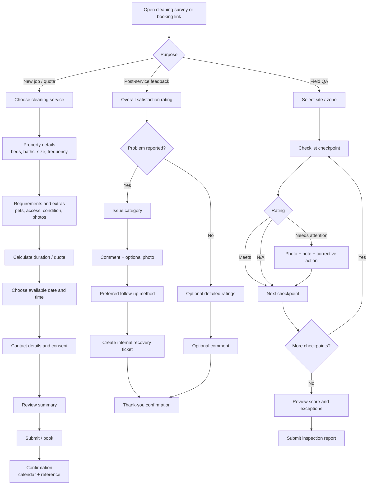

# Survey, Booking and Feedback Apps for Cleaning Companies

iturn6image2turn6image0turn7image0turn7image1

## Executive summary

The cleaning-software market does not have one dominant “survey app” pattern. Instead, the products reviewed fall into three overlapping UX categories: **customer booking and job-intake systems** such as Jobber, Housecall Pro, ZenMaid, BookingKoala, MaidCentral, ServiceM8, Workiz, and ResponsiBid; **field quality-control and inspection systems** such as Swept, OrangeQC, and CleanGuru; and **general-purpose form/survey platforms** such as Jotform. Jobber and Housecall Pro increasingly merge intake, pricing, availability and booking into one flow, while cleaning-specific products such as ZenMaid and MaidCentral encode cleaning concepts—bedrooms, bathrooms, frequency and property size—directly into the interaction model. citeturn18search1turn15search6turn16search0turn17search12

Across the sample, the strongest recurring visual model is **a light or white surface, one saturated trust/cleanliness color, dark blue-gray text, sans-serif typography, rounded cards or sectioned forms, and a prominent single primary CTA**. Blues, teals and greens dominate; orange is a recurring action/inspection accent. Most customer experiences are either vertically sectioned forms or short steppers, while staff-facing products depend more heavily on calendars, card/list views, inspection checklists and persistent navigation. BookingKoala is a major exception because its customer-facing forms are deliberately themeable—including colors, fonts, button styles and custom CSS—so there is no meaningful fixed customer-facing BookingKoala palette. citeturn15search7turn18search10turn16search6turn17search1

The most useful product-specific interaction ideas are:

- **ZenMaid:** cleaning-native bedroom/bathroom controls and a quote-first experience. citeturn16search0turn22search4
- **Housecall Pro:** dynamic pricing forms using quantity, numerical ranges, multi-select and single-select fields, with cleaning-specific templates. citeturn15search6
- **BookingKoala:** configurable one-, two- or multi-step forms plus deep theme customization. citeturn15search7
- **ResponsiBid:** guided quote funnel and Good/Better/Best package presentation. citeturn17search21turn17search30
- **Swept:** exceptionally clear quality-status semantics and photo-backed inspection workflows. citeturn16search6turn16search15
- **OrangeQC:** checklist items that connect ratings directly to comments, photos and corrective actions. citeturn16search3turn22search2
- **CleanGuru:** exception-oriented inspections in which ratings are pre-populated and inspectors change only problem areas, reducing repetitive taps. citeturn19search0turn19search6
- **Jotform:** the broadest menu of survey primitives—ratings, conditional logic, file uploads, signatures, appointment fields and Classic versus Card layouts. citeturn18search0turn18search10

For a new cleaning survey application, the strongest strategic direction is **not** to copy a generic CRM. It should combine the frictionless customer input of ZenMaid/Housecall Pro, the progressive disclosure and theming flexibility of BookingKoala/Jotform, and the evidence-oriented QA model of Swept/OrangeQC. A particularly defensible product would use the same core form engine for three modes: **pre-service quote/job intake, on-site QA inspection, and post-service customer feedback**.

The design measurements below should be interpreted correctly: values marked **≈** are my closest visual estimates from current official product imagery or App Store screenshots, **not vendor-published design tokens**. Font identifications are likewise nearest visual matches where vendors do not publicly document their type systems. Tenant-configurable products can look materially different after branding.

## Market landscape and research method

I reviewed the live official product sites, current help documentation and available Apple App Store listings on **August 16, 2026**. Priority was given to pages that actually expose customer forms, booking portals, inspections, checklists or mobile screens rather than generic marketing copy. The twelve-product set intentionally includes residential-cleaning software, commercial/janitorial software, general field-service software used by cleaners, and one generalized form platform to expose a wider range of design patterns.

The sample is therefore a **design benchmark rather than a market-share ranking**. Eight products primarily expose booking/job-intake patterns, three concentrate on field inspection/quality assurance, and Jotform provides a configurable survey/form baseline. Products frequently cross these boundaries: for example, MaidCentral also supports customer reviews, Housecall Pro includes automated review requests, and Jotform provides both cleaning booking and cleaning-feedback templates. citeturn17search25turn18search15turn18search2turn18search11

One important methodological limitation is customization. BookingKoala explicitly permits changes to fonts, font sizes, colors, backgrounds, buttons, media and general CSS, while Jotform allows branding and form-layout customization. Accordingly, fixed palettes in those rows describe the **product/platform brand or common default appearance**, not what every cleaner's end customer sees. citeturn15search7turn18search10

The linked UI pages below are useful as a visual reference library; where an App Store listing exists, it is included because its screenshots are often a better representation of current mobile UI than marketing illustrations.

## App-by-app UI and UX review

**Jobber.** Jobber's customer-side experience is a conventional but polished field-service intake model: request forms collect customer and job details, and booking options can be incorporated so the same form either creates a request for review or lets a customer select an available appointment. The current request-form UI uses explicit field labels, required indicators, large text areas, date controls, selectable availability and file/photo input rather than hiding information behind highly stylized widgets. The result is comparatively low-risk UX: users can scan the entire information hierarchy, while the data goes directly into an operational job workflow. Its design is better suited to “tell us what you need” than an emotionally engaging survey, but that is precisely why it works well for service intake. citeturn15search0turn15search2turn18search1turn19search2

[Official cleaning product](https://www.getjobber.com/industries/cleaning-business-software/) · [Requests & Bookings UI](https://help.getjobber.com/hc/en-us/articles/39026037947543-Requests-and-Bookings-Settings) · [App Store](https://apps.apple.com/au/app/jobber-field-service-software/id1014146758) · [Direct form screenshot](https://help.getjobber.com/hc/article_attachments/39085956637207)

| Colors | Typography | Iconography / imagery | Layout patterns | Common components | Target flows |
|---|---|---|---|---|---|
| ≈ lime green `#7DB00E`; deep navy `#012939`; white | ≈ Inter/SF Pro/Arial-like; 14–16 px form text | Minimal outline utility icons; uploaded job photos rather than decoration | Sectioned single-column form; dashboard/cards in admin | Text inputs, textarea, date picker, checkboxes, file upload, CTA | Customer request → job details → availability → booking/approval |

**Housecall Pro.** Housecall Pro goes further toward a configurable commerce-style booking experience. Its Pricing Forms can calculate cleaning prices from quantities, square footage/ranges, frequency, add-ons and single/multiple-choice variables; current documentation includes industry-specific templates for home cleaning, carpet cleaning and window/exterior washing. The setup is organized as an onboarding flow with toggles, field-builder controls, booking rules and preview, while the customer sees services and pricing connected directly to Online Booking. The design therefore sits between a form builder and a scheduling checkout. This is a strong reference for a cleaning survey product that also needs to convert survey answers into duration, staffing or price. citeturn15search6turn18search15turn19search15

[Cleaning product](https://www.housecallpro.com/industries/maid-service-software/) · [Pricing Forms/screenshots](https://help.housecallpro.com/en/articles/8774752-pricing-forms-setup-features-and-faqs) · [App Store](https://apps.apple.com/us/app/housecall-pro-scheduling-invoicing/id692833651)

| Colors | Typography | Iconography / imagery | Layout patterns | Common components | Target flows |
|---|---|---|---|---|---|
| ≈ bright blue `#2E6BFF`; navy `#0B1F33`; green appears as transactional state | ≈ Inter/SF Pro-like; 14–16 px | Rounded utility/field-service icons; optional service imagery | Admin left navigation + cards; customer booking sequence/expanded service forms | Toggles, quantity fields, ranges, multi-select, single-select, service cards, date/time slots, payment | Lead/job intake → dynamic price → slot → book/pay; reviews |

**ZenMaid.** ZenMaid has one of the most cleaning-specific customer experiences in the set. Its booking proposition centers on an embedded 24/7 quote/booking form rather than adapting a generic field-service form. Official imagery uses household attributes such as bedrooms and bathrooms as primary inputs, visually reducing the amount of typed information necessary before producing a quote and moving into scheduling. This makes the experience immediately understandable to residential-cleaning customers. The visual identity is also unusually distinctive for the category: deep pink/burgundy branding paired with bright teal controls rather than the category's more common blue-only palette. The trade-off is that slider-style numeric controls require particularly careful keyboard, screen-reader and touch implementation. citeturn16search0turn16search2turn22search4

[Booking UI/product](https://get.zenmaid.com/cleaning-booking-software) · [Official site](https://get.zenmaid.com/) · [App Store](https://apps.apple.com/au/app/zenmaid/id1357534769)

| Colors | Typography | Iconography / imagery | Layout patterns | Common components | Target flows |
|---|---|---|---|---|---|
| ≈ burgundy `#B01257`; aqua/teal `#22B8B5`; white | ≈ Poppins/Inter-like; friendly rounded sans, 14–18 px | Cleaning/property pictograms; bed/bath semantics; field photos in staff app | Narrow progressive quote form, strongly vertical | Address inputs, numeric/slider controls, date/schedule controls, CTA | Residential property intake → instant quote → booking |

**BookingKoala.** BookingKoala is best understood as a configurable booking-form system rather than a fixed visual design. Its form/site builder allows users to rearrange elements, edit text and media, adjust button styles, set global colors and fonts, change font size, choose backgrounds and inject custom CSS. That degree of branding freedom is strategically important for a white-label cleaning product. On the workflow side, BookingKoala supports service-business booking logic and provider-side views for appointments, checklists, job media, reviews and payments. A notable UX lesson is that customer booking should have a stable information architecture while visual branding remains tenant-configurable; the platform separates those concerns more aggressively than most competitors. citeturn15search7turn22search1

[Maid-service product](https://www.bookingkoala.com/maid-service-software/) · [Theme/form UI](https://help.bookingkoala.com/help/customize-the-look-of-your-forms) · [Provider App Store](https://apps.apple.com/us/app/bookingkoala-for-providers/id1446530801)

| Colors | Typography | Iconography / imagery | Layout patterns | Common components | Target flows |
|---|---|---|---|---|---|
| **Themeable**; admin/brand ≈ blue `#2F80ED`, orange `#F28C28`; customer colors user-defined | User-selectable family/size; neutral sans defaults | Generic line/UI icons; tenant-controlled images/video | Configurable sections; one/multi-step booking; mobile lists; customer summary | Service selectors, extras, calendar, buttons, checklist, media, reviews, payments | Customer quote/booking; provider appointment/checklist workflow |

**MaidCentral.** MaidCentral is more operationally dense than ZenMaid. It combines online quote requests and booking with availability, scheduling, CRM-style customer management and a client-facing portal. A website interaction can create a lead and quote inside MaidCentral while applying the company's configured pricing and availability rules. The resulting UI philosophy is closer to an “operating system for a cleaning company”: dashboards, records, schedules and portal controls take priority over minimalist survey presentation. This is useful inspiration for the administrative side of a new survey system—particularly when responses must become operational work—but a customer survey should probably abstract away much of that back-office density. citeturn17search0turn17search4turn17search12turn17search31

[Official product](https://maidcentral.com/) · [Feature/UI examples](https://maidcentral.com/maidcentral-feature-benefits/) · [Scheduling/booking documentation](https://support.maidcentral.com/docs/scheduling-customers) · [App Store](https://apps.apple.com/ca/app/maidcentral-technician/id6502119888)

| Colors | Typography | Iconography / imagery | Layout patterns | Common components | Target flows |
|---|---|---|---|---|---|
| ≈ medium blue `#1D6FA5`; dark blue-gray `#172A3A` *(lower-confidence estimate)* | ≈ Arial/Inter-like; data-oriented sans | Conventional dashboard/navigation icons; little decorative imagery | Dashboard, calendars, CRM records, client-portal screens | Tables, filters, calendar, quote fields, booking controls, payment actions | Quote request → lead → availability → booking; client self-service/feedback |

**ServiceM8.** ServiceM8's cleaning product links customer booking directly to operations: the customer can get an instant quote, choose a time and create the job in ServiceM8. Its UI evidence shows a more compact, productivity-oriented approach than newer SaaS products: scheduling and booking screens place selectors, suggested times, staff/avatar information and Save/Cancel-style actions close together. The aesthetic is functional and familiar rather than editorial. This is valuable for dispatcher efficiency, but for a greenfield customer survey I would preserve ServiceM8's information density only in staff views and use substantially more spacing and progressive disclosure for customers. citeturn17search1

[Cleaning product/UI](https://www.servicem8.com/au/industries/cleaning-software) · [App Store](https://apps.apple.com/us/app/servicem8-field-service-app/id378062736)

| Colors | Typography | Iconography / imagery | Layout patterns | Common components | Target flows |
|---|---|---|---|---|---|
| ≈ fresh green `#79C42B`; charcoal `#333333`; white | ≈ Helvetica/Arial-like; 14–16 px | Small monochrome operational icons, avatars, job photos | Compact modal/forms, schedule/list views, job cards | Selects, date/time options, suggested slots, Save/Cancel buttons, job records | Instant quote → time selection → booking → dispatch/job completion |

**Workiz.** Workiz exposes a customizable online booking portal that can be embedded into the business's website, while its broader product remains dispatcher/technician-oriented. The useful UX pattern here is separation between a simplified external booking surface and a richer operational application: customers select what they need through the portal, while staff work with jobs, technician skills, schedules and communications. Workiz's documentation also makes technician skills relevant to availability, meaning the form can connect the customer's service selection to downstream resource eligibility instead of merely recording a text answer. That is an important architectural precedent for cleaning companies with specialist teams, equipment requirements or geographically constrained crews. citeturn17search2turn17search6turn17search14turn17search20

[Booking portal UI](https://help.workiz.com/hc/en-us/articles/27355514111761-Customizing-your-booking-portal) · [Embedding guide](https://help.workiz.com/hc/en-us/articles/27354906469009-How-to-enable-and-use-online-booking) · [App Store](https://apps.apple.com/us/app/workiz-field-service-software/id1469769810)

| Colors | Typography | Iconography / imagery | Layout patterns | Common components | Target flows |
|---|---|---|---|---|---|
| ≈ violet `#5B43F4`; teal `#17B7A8`; dark slate `#1F2937` | ≈ Inter/SF Pro-like, 14–16 px | Rounded line/filled utility icons; service/technician imagery where relevant | Booking portal; cards/lists/calendar; mobile navigation | Service cards, date/time slots, chips, toggles, deposit/payment controls | Service selection → qualified availability → booking → job/lead |

**Swept.** Swept is one of the strongest references for the **survey-as-quality-inspection** side of the problem. Its inspection/checklist model organizes checkpoints by area, allows supervisors to rate each item, attaches timestamped photos or notes and produces client-ready reports. Crucially, the visual language does not depend on color alone: inspection states are paired with textual labels and recognizable status iconography, making scanning easier. The wider product also supports required/optional checklists, saved in-progress work and multilingual presentation; current checklist materials state that tasks can be translated into 100+ languages. This is materially closer to the reality of janitorial field work than a generic NPS form. citeturn16search6turn16search10turn16search15turn22search0

[Inspection UI](https://sweptworks.com/janitorial-inspection-software) · [Checklist UI](https://sweptworks.com/features/janitorial-checklist-software) · [App Store](https://apps.apple.com/us/app/swept-mobile/id1049960164)

| Colors | Typography | Iconography / imagery | Layout patterns | Common components | Target flows |
|---|---|---|---|---|---|
| ≈ teal `#0B7C86`; deep teal `#164E63`; semantic green/red/purple statuses | ≈ Inter/Arial-like; 15–18 px mobile labels | Check, star, warning, pencil, camera; real cleaning evidence photos | Area-grouped checklist; stacked rows/cards; report dashboard | Status/rating controls, checkbox tasks, notes, photo capture, save/continue | Cleaner checklist; supervisor QA inspection → score → proof/report |

**ResponsiBid.** ResponsiBid's distinguishing UX is a sales funnel rather than a generic booking form. Its live demonstration presents the process as discrete stages—general information, service details and quote—and it is explicitly used in maid service and carpet/tile/grout cleaning contexts. After collecting the job variables, the product can present Good/Better/Best combinations instead of reducing the interaction to one take-it-or-leave-it price. That makes ResponsiBid a useful precedent for survey answers that change downstream recommendations: for example, a cleaning intake could transform property conditions and priorities into “maintenance clean / deep clean / deep clean + appliances” cards. The risk is over-commercializing a feedback flow, so this pattern should be reserved for quotation and upsell contexts. citeturn17search3turn17search21turn17search30turn17search33

[Official product](https://responsibid.com/) · [Live industry demos](https://responsibid.com/try-it/) · [Customer quote-view example](https://responsibid.com/learn-more/)

| Colors | Typography | Iconography / imagery | Layout patterns | Common components | Target flows |
|---|---|---|---|---|---|
| ≈ green `#6FBF44`; dark slate `#1F2937` | ≈ Montserrat/Inter-like | Service-oriented line/marketing imagery; restrained in funnel | Guided multi-stage questionnaire → pricing cards | Choice controls, numerical inputs, progress, package cards, quote/schedule CTA | Service intake → calculated quote → Good/Better/Best → schedule/follow-up |

**OrangeQC.** OrangeQC is another strong reference for mobile field surveys, but with a particularly utilitarian inspection model. Current forms can contain custom line items, ratings, fields, numeric pickers, photos and signatures; inspectors can attach photos, create tickets/work orders and track corrective actions. Its official UI imagery uses a stacked inspection structure in which ratings, comments and photo actions are directly associated with the inspected item. That proximity is important: it prevents a common survey failure in which evidence is captured on a separate page and becomes ambiguous. The brand's orange accent also gives it one of the clearest visual identities in a category otherwise dominated by blue, green and teal. citeturn16search1turn16search3turn16search8turn22search2

[Official product/UI](https://www.orangeqc.com/) · [Inspection forms](https://www.orangeqc.com/features/inspections/) · [App Store](https://apps.apple.com/us/app/orangeqc/id324039524)

| Colors | Typography | Iconography / imagery | Layout patterns | Common components | Target flows |
|---|---|---|---|---|---|
| ≈ orange `#FF9800`; charcoal `#222222`; light gray/white | ≈ SF Pro/Roboto/system sans; 15–18 px | Simple utility icons; camera/gallery; real evidence photos | Stacked section/checklist rows; contextual action sheets | Ratings, N/A, comment, number picker, camera/gallery, signature, ticket | QA inspection → issue/evidence → corrective action → report |

**Jotform.** Jotform provides the most direct benchmark for a traditional customer survey. It has dedicated cleaning-service feedback, office-cleaning questionnaire, market-survey and booking templates, and its cleaning catalog covers appointment scheduling, inspections, checklists, ratings, uploads and signatures. More importantly from an interaction-design perspective, Jotform explicitly supports both **Classic Form**, where questions appear together, and **Card Form**, where the user advances through a guided question-by-question flow. That makes it useful for testing which presentation performs better without rebuilding the data model. The default appearance is deliberately neutral—white canvas, conventional labeled controls and generous vertical spacing—because tenant customization is expected. citeturn18search0turn18search2turn18search4turn18search10turn18search11

[Cleaning feedback UI](https://www.jotform.com/form-templates/cleaning-service-feedback-form) · [Cleaning template catalog](https://www.jotform.com/form-templates/services/cleaning-forms) · [Booking template](https://www.jotform.com/form-templates/book-cleaning-services-online) · [App Store](https://apps.apple.com/us/app/jotform-form-sign-survey/id1391524277)

| Colors | Typography | Iconography / imagery | Layout patterns | Common components | Target flows |
|---|---|---|---|---|---|
| Brand ≈ orange `#FF8A00`; navy `#0A1551`; forms typically white/neutral and customizable | ≈ Inter/Arial-like | Generic form-builder icons; generally little core-form imagery | Classic vertical form or one-question Card Form | Text, email, date, star/rating scales, checkbox/radio, upload, signature, payment | Customer feedback/survey; booking/job intake; staff checklist |

**CleanGuru / CleanQC.** CleanGuru's most interesting design decision is not graphical but behavioral. CleanQC can preload building types, areas/items and inspection ratings, and its “Easy Entry” model starts ratings in their expected/default state so the inspector changes only areas with problems. Scores recalculate as changes are made. For repetitive inspections across dozens or hundreds of checkpoints, this is potentially much faster than requiring a positive response on every item. Its interface is correspondingly pragmatic: forms, grading controls, inspection summaries and operational navigation rather than large marketing-style cards. For a new cleaning survey product, this pattern is particularly valuable for recurring commercial QA, though default answers must be made explicit enough that users do not accidentally certify work they never inspected. citeturn19search0turn19search3turn19search6turn19search12turn22search7

[CleanQC product](https://www.cleanguru.com/cleanqc) · [Rating UI screenshot page](https://www.cleanguru.com/cleanqc/features/easy-entry) · [App Store](https://apps.apple.com/us/app/cleanguru-janitorial-software/id673270069)

| Colors | Typography | Iconography / imagery | Layout patterns | Common components | Target flows |
|---|---|---|---|---|---|
| ≈ blue `#1E73BE`; warm yellow/orange `#F4A62A` *(lower-confidence estimate)* | ≈ Arial/Roboto-like | Utilitarian operational icons; little decoration | Forms/checklists, dashboard/schedule, one-page inspection summary | Pre-set ratings, grading controls, checklists, scores, work tickets | Commercial cleaning checklist → QC inspection → exception edits → score/report |

## Cross-market design synthesis

**Graphical language.** The market strongly favors a “clean operations” visual grammar: white/light-gray backgrounds, generous use of neutral surfaces, one main brand accent, dark blue-gray/charcoal typography and limited decorative imagery. This makes sense for interfaces whose core content is structured data—addresses, service types, appointment times, inspection results and photos. Even highly branded products such as ZenMaid generally reserve saturated color for controls, headings or emphasis rather than filling the working surface. Inspection products likewise keep the form background neutral so status colors retain meaning. citeturn16search0turn16search6turn16search8turn18search10

**Recurring color families.** The values below are an analytical range from the visual estimates above, not official industry standards:

| Palette family | Approximate observed range | Typical meaning |
|---|---|---|
| Deep navy / blue-gray | `#0A1551` → `#172A3A` | Text, headers, trust, navigation |
| Action blue | `#1D6FA5` → `#2F80ED` | Primary CTAs, active navigation |
| Teal | `#0B7C86` → `#22B8B5` | “Clean/fresh” brand expression, active controls |
| Green / lime | `#6FBF44` → `#7DB00E` | Booking/action, success, operational status |
| Orange | `#F28C28` → `#FF9800` | CTA emphasis, inspections, warnings/attention |
| Burgundy/magenta | around `#B01257` | Distinctive brand differentiation; ZenMaid is the notable sample deviation |

The main opportunity for a new entrant is therefore **not another generic bright blue SaaS palette**. Teal + deep navy is category-compatible without looking indistinguishable; alternatively, a restrained forest green combined with a warm amber accent could look more premium and less “software generic.”

**Typography.** All twelve products rely primarily on modern sans-serif forms. Based on the supplied UI imagery, the closest typographic families are the Inter/SF Pro/Roboto/Arial/Helvetica continuum, with products such as ZenMaid and ResponsiBid tending toward slightly friendlier geometric faces such as Poppins/Montserrat-like designs. The recurring hierarchy is roughly 14–16 px body/control text, 12–14 px metadata or helper text, 18–24 px form-section headings and 24–32 px high-level screen titles. These sizes are visual estimates rather than extracted CSS values. The practical implication is that novelty typography contributes little: clarity and compact numerical scanning matter more.

**Icons and imagery.** Calendar, camera, checkmark, pencil/edit, warning, navigation arrow and overflow-menu icons recur constantly. Photography in the actual workflows is overwhelmingly **functional evidence**—job photos, before/after images, inspection proof, technician photos—not lifestyle imagery. Swept and OrangeQC demonstrate this especially strongly. Cleaning-native pictograms are surprisingly underused; ZenMaid's bedroom/bathroom symbolism is therefore a useful differentiation opportunity. citeturn16search6turn16search8turn22search24

**Layout and navigation.** Customer-facing forms overwhelmingly benefit from a single narrow content column, progressive sections or a stepper, with a strong primary CTA. More complex platforms shift to side navigation and dashboard/calendar patterns after login. Field QA becomes a vertically scrolling area/checkpoint list. Jotform explicitly provides both all-at-once Classic Forms and one-question Card Forms, while Housecall Pro's booking setup combines a structured onboarding sequence with configurable dynamic fields. This suggests a responsive design should **change information density by role**, rather than merely shrinking the same desktop screen onto mobile. citeturn15search6turn18search10turn16search15

**Accessibility.** Several observed patterns are directionally good. Swept's quality states combine visual status treatment with words/icons rather than encoding meaning solely by color, and OrangeQC similarly keeps named ratings/actions alongside color. Jobber uses persistent field labels rather than placeholder-only forms. citeturn16search6turn16search15turn16search3turn15search0

There are nevertheless recurring risks. Touch sliders or closely packed numeric controls require adequate target size; customizable themes can produce weak contrast; icon-only photo/edit actions need accessible names; and rating stars should remain operable by keyboard and screen reader rather than functioning as five unlabeled graphics. WCAG 2.2 Level AA specifies at least **4.5:1 contrast for normal text and 3:1 for large text**, and its Target Size (Minimum) criterion generally requires a target of at least **24 × 24 CSS pixels**, subject to documented exceptions. Visible focus treatment must also provide distinguishable contrast. citeturn21search0turn20search0turn20search1

The most notable departures and innovations in the sample are therefore not ornamental; they simplify a specific cleaning task:

| Product | Notable deviation | Why it matters |
|---|---|---|
| ZenMaid | Cleaning-native room/property inputs | Replaces abstract generic form fields with the user's mental model. citeturn16search0 |
| Housecall Pro | Dynamic pricing-form primitives | Answers can alter cost/duration rather than merely being stored. citeturn15search6 |
| BookingKoala | Deep tenant themeability | Strong model for white-label cleaning brands. citeturn15search7 |
| ResponsiBid | Good/Better/Best results | Converts intake data into understandable alternatives. citeturn17search21 |
| Swept | Photo-backed, area-based inspection | Makes quality survey results evidential and client-shareable. citeturn16search6 |
| OrangeQC | Rating + evidence + corrective action at item level | Keeps diagnosis and resolution in context. citeturn16search3turn22search2 |
| CleanGuru | Pre-set/exception-based ratings | Dramatically reduces repetitive inspection interaction. citeturn19search0 |
| Jotform | Classic/Card dual layout model | Same questionnaire can be expressed as dense or guided UX. citeturn18search10 |

## Comparison matrix

| App | Cleaning specificity | Dominant flow | Main customer/input pattern | Staff/QA pattern | Visual character | Best lesson to borrow |
|---|---|---|---|---|---|---|
| **Jobber** citeturn18search1turn19search2 | High for configured cleaning accounts; broader FSM | Request / booking | Sectioned request + availability form | Jobs, quotes, scheduling | Lime/navy; conservative SaaS | Make job intake explicit and predictable |
| **Housecall Pro** citeturn15search6turn18search15 | High; cleaning templates | Dynamic booking / lead / review | Service + quantity/range/add-ons + schedule | Dispatcher/calendar/job workflow | Bright blue; polished FSM | Let survey answers compute price/duration |
| **ZenMaid** citeturn16search0turn22search4 | **Very high** | Quote / booking | Cleaning-native property questionnaire | Cleaning schedule/field assistant | Burgundy + teal; friendly | Use cleaning vocabulary, not generic CRM language |
| **BookingKoala** citeturn15search7turn22search1 | High | Booking | Highly configurable branded form | Appointments, checklists, media, reviews | Tenant-dependent | Separate UX structure from brand theme |
| **MaidCentral** citeturn17search12turn17search31 | **Very high** | Quote / booking / client portal | Online quote tied to availability | CRM/dashboard/scheduling | Enterprise/data-oriented | Connect customer intake directly to operations |
| **ServiceM8** citeturn17search1 | Medium-high | Quote / booking | Quote → slot → booking | Compact schedule/job screens | Lime green; utility-first | Fast slot selection and scheduling handoff |
| **Workiz** citeturn17search2turn17search20 | Medium-high | Booking / job | Embedded service booking portal | Skills, schedules, jobs, communications | Purple/teal SaaS | Filter availability using service requirements |
| **Swept** citeturn16search6turn22search0 | **Very high** for janitorial | QA inspection/checklist | Limited customer intake | Area/checkpoint ratings + photos + reports | Teal; semantic status system | Never rely on status color alone |
| **ResponsiBid** citeturn17search21turn17search33 | High for supported cleaning services | Quote / sales conversion | Guided intake → calculated offers | Quote/sales workflow | Green; funnel-oriented | Turn answers into useful service choices |
| **OrangeQC** citeturn16search3turn22search2 | **Very high** for janitorial QA | Inspection / corrective action | Not primarily customer booking | Checklist, rating, photo, ticket | Orange/white; highly functional | Attach evidence/actions directly to each response |
| **Jotform** citeturn18search2turn18search10 | Medium via templates | Survey / feedback / booking | Classic or Card Form | Builder/submission management | Neutral/customizable | One form engine can serve many survey modes |
| **CleanGuru** citeturn19search0turn22search7 | **Very high** for commercial janitorial | QA / checklist / operations | Limited end-customer intake | Preloaded ratings, scores, work tickets | Utility blue/warm accent | Use exception-based interaction for repetitive QA |

The clearest competitive whitespace is a product that is **as customer-friendly as ZenMaid, as flexible as Jotform/BookingKoala, and as operationally useful as OrangeQC/Swept**. Existing platforms tend to optimize one side of that triangle.

## Recommendations for a new cleaning survey app

**Visual direction.** Use a “calm operational utility” aesthetic: approximately 80% neutral surfaces, 15% brand color and 5% semantic/status color. Use 10–14 px corner radii, subtle 1 px borders, almost no decorative shadowing, and substantial whitespace in customer flows. Staff inspection screens can be denser, but the density should come from typography and grouping rather than smaller touch targets. Avoid excessive bubbles, gradients and “sparkle” graphics; cleaning users benefit more from clarity, evidence and state visibility.

Three good palette directions are:

| Option | Brand | Strong brand | Accent | Text/ink | Background | Strategic character |
|---|---|---|---|---|---|---|
| **Fresh Teal** | `#0F766E` | `#115E59` | `#14B8A6` | `#0F172A` | `#F8FAFC` | Closest to category “clean/fresh,” but more premium than cyan |
| **Trust Blue** | `#2563EB` | `#1E40AF` | `#06B6D4` | `#0F172A` | `#F8FAFC` | Broadly reassuring and SaaS-familiar |
| **Warm Clean** | `#1F7A5A` | `#0F4C5C` | `#F59E0B` | `#1F2937` | `#FFFCF7` | More human/service-oriented; stands apart from blue competitors |

Use dark text rather than white on bright yellow/amber accents where necessary, and validate every state—including disabled, hover and focus states—against WCAG rather than assuming a brand hex is accessible. citeturn21search0turn20search1

**Typography.** The safest primary system is:

```css
font-family:
  Inter,
  ui-sans-serif,
  system-ui,
  -apple-system,
  BlinkMacSystemFont,
  "Segoe UI",
  Arial,
  sans-serif;
```

For a slightly warmer brand, use:

```css
font-family:
  Manrope,
  Inter,
  ui-sans-serif,
  system-ui,
  -apple-system,
  "Segoe UI",
  Arial,
  sans-serif;
```

A good baseline scale is 16 px/1.5 for body and controls, 14 px for metadata/helper content, 18–20 px for section titles and 28–32 px for page titles. Make labels persistent. Place explanatory text below the label rather than inside a disappearing placeholder.

**Component library.** For a React web implementation, **Radix Primitives + shadcn/ui** is a particularly good fit. Radix implements WAI-ARIA-oriented semantics, keyboard interaction and focus-management behavior for its primitives; shadcn's current form documentation combines its field components with React Hook Form and Zod and demonstrates `aria-invalid`, explicit labels and accessible error treatment. That gives the project a stronger foundation than writing custom dialogs, selects and radio controls from scratch. citeturn15search1turn15search3turn20search6

The component set should include:

| Component | Cleaning-specific treatment |
|---|---|
| Service card | Icon + service name + starting duration/price; entire card selectable |
| Bedroom/bathroom count | Segmented `– 2 +` stepper plus direct numeric entry; preferable to slider-only control |
| Property size | Preset chips plus optional exact square-foot/m² input |
| Frequency selector | One-time / weekly / fortnightly / monthly cards with savings or duration context |
| Extras | Check cards with icon, description and price impact |
| Availability picker | Calendar → 2–4 large appointment-slot buttons, not a giant timetable |
| Photo input | Camera and gallery choices plus visible thumbnail, remove and caption actions |
| Satisfaction rating | Five large labelled options; don't make the stars themselves the only accessible name |
| QA rating | `Meets standard` / `Needs attention` / `N/A`, each with icon + text + color |
| Issue card | Rating, note, image and corrective action grouped into one contextual unit |
| Sticky summary | Service, frequency, estimated duration/price, appointment; expandable on small screens |

The **customer booking/intake pattern** should be a five-step progression:

`Service → Property → Requirements → Appointment → Contact & Review`

On mobile, expose one logical topic at a time rather than literally one tiny field per page. For example, “Property” can contain bedrooms, bathrooms and approximate size together because they form one mental task. On desktop, the same schema can render as two-column content with a sticky summary.

The **post-service survey** should start with a single overall rating, then progressively disclose optional dimensions such as punctuality, communication and cleaning quality. A low score should additionally expose an issue category, photo attachment and preferred follow-up method so the response can generate an internal service-recovery task. Do **not** hide public-review opportunities from unhappy respondents solely to manufacture better ratings; keep the service-recovery branch distinct from any optional external-review action.

The **field inspection pattern** should combine the best Swept, OrangeQC and CleanGuru ideas: group tasks by room/zone, use redundant status semantics, allow photos/comments on the affected checkpoint, remember/save progress offline where feasible, and offer an optional “assume standard / mark exceptions” operating mode only when the business deliberately enables it. Swept and OrangeQC demonstrate the value of photo-backed checkpoints, while CleanGuru demonstrates the efficiency of exception entry. citeturn16search6turn16search8turn19search0

For accessibility, target **at least 44 × 44 CSS px for important mobile tap controls** where space allows—the WCAG enhanced criterion uses 44 × 44, while Level AA Target Size (Minimum) establishes a 24 × 24 CSS px baseline subject to exceptions. Maintain visible keyboard focus, descriptive errors, programmatically associated labels and semantic fieldsets for rating groups. citeturn20search0turn20search2turn20search6

## Flow and palette reference

The following flow synthesizes the recurring intake/booking patterns in Jobber, Housecall Pro, ZenMaid and ResponsiBid with the post-job quality/evidence patterns in Jotform, Swept and OrangeQC. citeturn18search1turn15search6turn16search0turn17search30turn18search2turn16search6turn16search3



A practical CSS token set for the three recommended themes is:

```css
/* Fresh Teal — recommended default */
:root,
[data-theme="fresh-teal"] {
  --brand-600: #0F766E;
  --brand-700: #115E59;
  --accent-500: #14B8A6;

  --ink-950: #0F172A;
  --ink-700: #334155;
  --ink-500: #64748B;

  --surface-0: #FFFFFF;
  --surface-50: #F8FAFC;
  --border-200: #E2E8F0;

  --success-700: #15803D;
  --warning-600: #D97706;
  --danger-700: #B91C1C;

  --focus: #2563EB;
}

/* Trust Blue */
[data-theme="trust-blue"] {
  --brand-600: #2563EB;
  --brand-700: #1E40AF;
  --accent-500: #06B6D4;

  --ink-950: #0F172A;
  --ink-700: #334155;
  --ink-500: #64748B;

  --surface-0: #FFFFFF;
  --surface-50: #F8FAFC;
  --border-200: #E2E8F0;

  --success-700: #15803D;
  --warning-600: #D97706;
  --danger-700: #B91C1C;

  --focus: #0F766E;
}

/* Warm Clean */
[data-theme="warm-clean"] {
  --brand-600: #1F7A5A;
  --brand-700: #0F4C5C;
  --accent-500: #F59E0B;

  --ink-950: #1F2937;
  --ink-700: #374151;
  --ink-500: #6B7280;

  --surface-0: #FFFFFF;
  --surface-50: #FFFCF7;
  --border-200: #E7E2D8;

  --success-700: #15803D;
  --warning-700: #B45309;
  --danger-700: #B91C1C;

  --focus: #2563EB;
}
```

Of these, **Fresh Teal** is the strongest default for a new cleaning-specific brand: it fits the market's established “fresh/clean/trustworthy” color semantics without reproducing the saturated blue SaaS identity of Housecall Pro or the lime-green operational feel of Jobber/ServiceM8. The most important differentiation, however, should come from the interaction design rather than the palette: cleaning-native property controls, context-aware conditional questions, persistent quote/job summaries, photo-backed evidence, and a shared survey engine spanning intake, QA and post-job feedback. That combination is much less common than any individual visual treatment in the twelve products reviewed. citeturn15search6turn16search0turn16search6turn16search3turn18search10