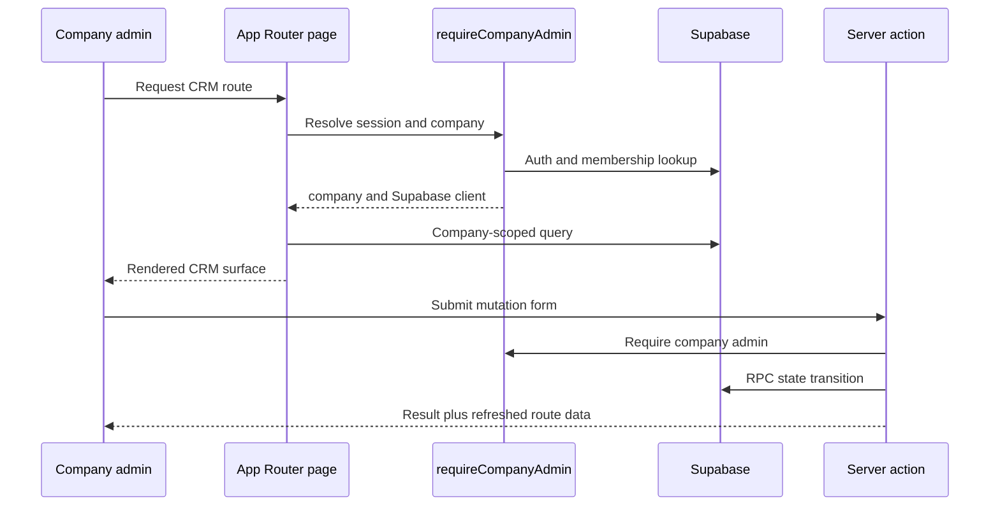

# CRM Runtime, Authentication, and Company Scope

## Entry points and lifecycle

`apps/crm` is a Next.js App Router application. Its `src/app/(auth)/` and `src/app/(crm)/` route groups separate authentication and company-admin experiences; `src/app/layout.tsx` provides the app root. The job screens follow the route hierarchy `/jobs`, `/jobs/new`, and `/jobs/[jobId]`. Each server-rendered job page first calls `requireCompanyAdmin` from `apps/crm/src/lib/auth/session.ts`, then reads only rows linked to the returned company.

The runtime delegates persistence invariants to [data and security](data-and-security.md); [job dispatch](../workflows/job-dispatch.md) documents the concrete action/RPC flow.

## Company scoping and mutations

`requireCompanyAdmin` is the authentication and authorization composition point for current CRM server pages and job actions. Pages use the returned `company.id` in their Supabase reads. For example, `apps/crm/src/app/(crm)/jobs/[jobId]/page.tsx` filters the job through `sites.clients.company_id`, and independently constrains cleaner membership to that company. This relationship prevents a valid authenticated user from selecting another company's record merely by altering a route parameter.

State changes use server actions in `apps/crm/src/app/actions/`, not client-issued database mutations. `createOneOffJob`, `assignJobSlot`, and `cancelJob` validate untrusted form data with `@/features/jobs/schema`, call `requireCompanyAdmin`, and then invoke their named RPC. The action layer owns stable, user-facing error translation and cache invalidation; the RPC layer owns atomic authorization and integrity.

### Change rules

1. For a new CRM route, establish its layout/role guard and add an explicit tenant/company predicate to every read. Do not use a client-side filter as a tenancy boundary.
2. For a new mutation, validate form data at the action boundary, authorize before the database call, and use an RPC for critical workflow transitions. Add the migration/RPC and database tests described in [data and security](data-and-security.md#rpc-and-policy-change-surface).
3. Revalidate every route whose cached view can be changed by the mutation. The current job actions refresh job detail plus `/jobs` and `/roster`; see [the dispatch workflow](../workflows/job-dispatch.md#cache-and-failure-handling).
4. If a query relies on a new field or enum, regenerate `packages/db/src/database.types.ts` and typecheck the actual CRM consumer. Defining a migration is not sufficient shipped-surface validation.

## Focused validation

- For action behaviour, use `pnpm --filter crm test:run -- src/app/actions/jobs.test.ts`; route/component changes should run the adjacent test file named beside the route.
- For changes to the session guard, start with `apps/crm/src/lib/auth/session.test.ts` using the same `test:run -- <path>` pattern.
- Run `pnpm --filter crm typecheck` when a route, generated database type, action signature, or cross-module type changes.
- Run `pnpm --filter crm build` only when the App Router build boundary, metadata, generated route types, or deployment-facing output is changed. It is broader than an ordinary unit test.
