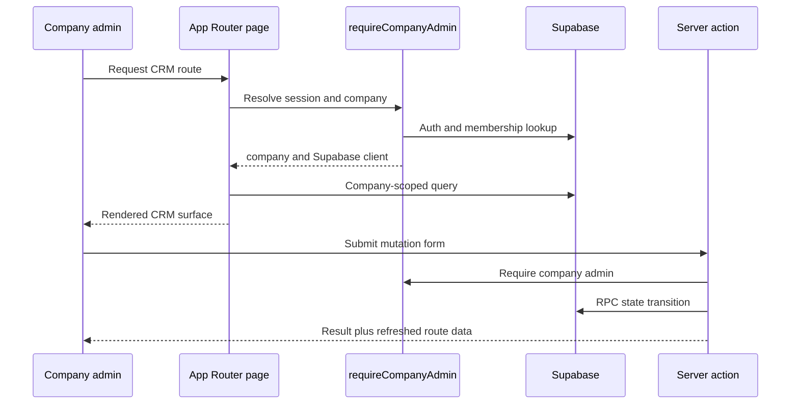

# CRM Runtime, Authentication, and Company Scope

## Entry points and lifecycle

`apps/crm` is a Next.js App Router application. Its only physical route tree is `src/app/[locale]/`: `(auth)` and `(crm)` route groups there separate authentication and company-admin experiences, while `src/app/[locale]/layout.tsx` validates the locale and provides its catalog. `src/app/layout.tsx` remains the document root. Every public CRM URL is locale-prefixed (for example `/en-AU/jobs` or `/pt-BR/jobs`); `src/proxy.ts` first applies `next-intl` routing/detection, then refreshes Supabase auth cookies for continuing requests. The job screens follow `/jobs`, `/jobs/new`, and `/jobs/[jobId]` below that prefix. Each server-rendered job page first calls `requireCompanyAdmin` from `apps/crm/src/lib/auth/session.ts`, then reads only rows linked to the returned company. See [bilingual CRM routing and locale preference](../workflows/crm-localization.md) for the locale lifecycle and language-selection contract.

The runtime delegates persistence invariants to [data and security](data-and-security.md); [job dispatch](../workflows/job-dispatch.md) documents the concrete action/RPC flow.

## Company scoping and mutations

`requireCompanyAdmin` is the authentication and authorization composition point for current CRM server pages and actions. It tolerates recoverable stale-session errors as an unauthenticated context and redirects denied contexts to localized login. Pages use the returned `company.id` in their Supabase reads. For example, `apps/crm/src/app/[locale]/(crm)/jobs/[jobId]/page.tsx` filters the job through `sites.clients.company_id`, and independently constrains cleaner membership to that company. This relationship prevents a valid authenticated user from selecting another company's record merely by altering a route parameter. `apps/crm/src/proxy.ts` refreshes Supabase auth cookies for non-static requests and applies the same recoverable-error distinction; it is session maintenance, not authorization. Locale detection and routing happen before that refresh, as documented in [the localization workflow](../workflows/crm-localization.md#route-and-selection-lifecycle).

State changes use server actions in `apps/crm/src/app/actions/`, not client-issued database mutations. `createOneOffJob`, `assignJobSlot`, and `cancelJob` validate untrusted form data with `@/features/jobs/schema`, call `requireCompanyAdmin`, and then invoke their named RPC. The action layer owns stable, user-facing error translation and cache invalidation; the RPC layer owns atomic authorization and integrity. The client/site import actions use the same boundary by validating one accepted row then delegating to `createClient` or `createSite`, as detailed in [client and site CSV import](../workflows/client-site-import.md). The read-only Money route uses the guard before querying `company_ledger_entries`; its complete-read and ledger invariants are detailed in [company pay ledger](../workflows/pay-ledger.md).

### Change rules

1. For a new CRM route, establish its layout/role guard and add an explicit tenant/company predicate to every read. Do not use a client-side filter as a tenancy boundary.
2. For a new mutation, validate form data at the action boundary, authorize before the database call, and use an RPC for critical workflow transitions. Add the migration/RPC and database tests described in [data and security](data-and-security.md#rpc-and-policy-change-surface).
3. Revalidate every route whose cached view can be changed by the mutation. Use `revalidateLocalizedPath`, which refreshes every locale-prefixed consumer; current job actions refresh job detail plus `/jobs` and `/roster`. See [the dispatch workflow](../workflows/job-dispatch.md#cache-and-failure-handling) and [localized cache invalidation](../workflows/crm-localization.md#formatting-messages-and-cache-invalidation).
4. If a query relies on a new field or enum, regenerate `packages/db/src/database.types.ts` and typecheck the actual CRM consumer. Defining a migration is not sufficient shipped-surface validation.

## Focused validation

- For action behaviour, use `pnpm --filter crm test:run -- src/app/actions/jobs.test.ts`; route/component changes should run the adjacent test file named beside the route.
- For changes to the session guard or proxy recovery, start with `apps/crm/src/lib/auth/session.test.ts` or `apps/crm/src/proxy.test.ts` using the same `test:run -- <path>` pattern.
- For locale route, catalog, switcher, or localized revalidation changes, use the focused suites and conditional E2E boundary in [bilingual CRM routing and locale preference](../workflows/crm-localization.md#change-recipe-and-validation).
- For import and Money route changes, use the focused suites named in [client and site CSV import](../workflows/client-site-import.md) or [company pay ledger](../workflows/pay-ledger.md).
- Run `pnpm --filter crm typecheck` when a route, generated database type, action signature, or cross-module type changes.
- Run `pnpm --filter crm build` only when the App Router build boundary, metadata, generated route types, or deployment-facing output is changed. It is broader than an ordinary unit test.
