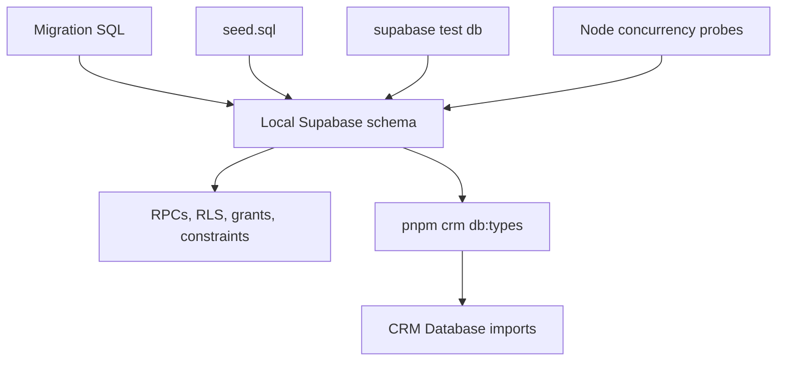

# Supabase Data, Security, and Generated Contract

## Ownership and flow

`packages/db` owns the Supabase CLI work directory. Its migrations evolve Postgres tables, functions, policies, and grants; `seed.sql` supplies deterministic local demo data; SQL files under `supabase/tests/` assert database contracts; scripts add concurrency probes; and `src/database.types.ts` is the generated TypeScript contract consumed by `apps/crm` through `@clean-app/db`.

This package supplies the integrity boundary used by [CRM runtime](crm-runtime.md). Its job-loop implementation is consumed by [job dispatch](../workflows/job-dispatch.md).

## Migration areas and contracts

The migration sequence establishes foundations, company identity, clients/sites/defaults/preferred cleaners, pool invitations, jobs and slots, recurring assignments and generation, loop foundations, and one-off jobs. Relevant change anchors include:

| Area | Canonical migration/test anchors | Contract to preserve |
|---|---|---|
| Jobs and crew slots | `20260809200000_cle_13_jobs_slots.sql`; `cle_13_jobs_slots.test.sql` | A job has a crew size and per-slot assignment records. |
| Recurrence and generated instances | `20260809210000_cle_14_recurring_assignments.sql`; `20260809220000_cle_15_recurring_job_generation.sql`; `cle_14_recurring_assignments.test.sql`; `cle_15_generation.test.sql` | Recurrence and generated jobs are database-owned lifecycle behaviour. |
| Dispatch loop foundations | `20260811130000_cle_49_loop_foundations.sql`; `cle_49_loop_foundations.test.sql` | Workflow functions and race-sensitive dispatch rules require SQL and concurrency evidence. |
| Cleaner joining and board | `20260810120000_cle_19_cleaner_join.sql`; `cle_19_cleaner_join.test.sql`; `cle_20_board_pools.test.sql` | Invitation preview reveals only company name and aggregate pool size; joining is atomic; the board is exposed through a dedicated privacy-minimized view. See [cleaner app workflow](../workflows/cleaner-app.md). |
| One-off jobs | `20260811150000_cle_23_one_off_jobs.sql`; `cle_23_one_off_jobs.test.sql` | Create/publish input is checked and returns the created job identity for CRM navigation. |
| Pay ledger | `20260812101000_cle_50_pay_ledger_foundations.sql`; `cle_50_pay_ledger.test.sql`; `scripts/test-pay-ledger-concurrency.mjs` | Completed jobs create one immutable owed entry per active assignment; settlement only moves from owed to paid. See [company pay ledger](../workflows/pay-ledger.md). |
| Profile locale | `20260817120000_f15_profile_locale.sql`; `f15_profile_locale.test.sql`; `f15_profile_locale_mutation.test.sql` | `profiles.preferred_locale` is nullable `app_locale` (`en-AU` or `pt-BR`); only `set_preferred_locale` can change the caller's preference. See [bilingual CRM routing](../workflows/crm-localization.md) and [cleaner app](../workflows/cleaner-app.md). |
| Membership and active company | `20260820090000_cle_81_membership_identity.sql`; `20260820100000_cle_82_active_company.sql`; `cle_81_membership_identity.test.sql`; `cle_82_active_company.test.sql` | Active CRM context derives from active `employee_memberships` and an approved company; `set_active_company` is authorization-checked. See [company membership](../workflows/company-membership.md). |
| Employee invitations and management | `20260820110000_cle_83_employee_invitations.sql`; `20260820120000_cle_84_employee_management.sql`; `cle_83_employee_invitations.test.sql`; `cle_84_employee_management.test.sql` | Owner-controlled invitation, role, and removal RPCs preserve at least one active owner. See [company membership](../workflows/company-membership.md). |
| Company creation | `20260821100000_company_creation.sql`; `company_creation.test.sql` | `create_company` supplies the company/membership creation contract consumed by the CRM onboarding flow. See [company membership](../workflows/company-membership.md). |
| Cleaner hardening and localized service views | `20260821130000_cleaner_existing_account_invites.sql`; `20260822090000_crew_size_upper_bound.sql`; `20260822091000_cleaner_invite_entropy.sql`; `20260822152000_cleaner_service_slug_views.sql`; `security_scan_hardening.test.sql` | Existing accounts can accept valid invites; crew size has a database upper bound; invitation tokens have increased entropy; cleaner views provide stable service slugs for localized labels. See [cleaner app](../workflows/cleaner-app.md). |
| Directed offers and recurring consent | `20260829090000_cle_51_offer_notification_types.sql`; `20260829091000_cle_51_job_offers.sql`; `20260829092000_cle_52_series_offers.sql`; `cle_51_job_offers.test.sql`; `cle_52_series_offers.test.sql` | Offer/accept/decline is an atomic cleaner-specific contract; recurring offers respect standing consent and open capacity. See [cleaner recruitment](../workflows/recruitment.md#directed-job-and-series-offers). |
| Public postings and applications | `20260830100000_cle_59_posting_types.sql`; `20260830101000_cle_59_postings_applications.sql`; `cle_59_postings_applications.test.sql` | `posting_preview`, `apply_to_posting`, review, admission, and hire are database-owned state transitions with privacy-limited preview data. See [cleaner recruitment](../workflows/recruitment.md#public-postings-and-applications). |
| Application review and notifications | `20260825101000_cle_86_application_approval.sql`; `20260826120000_cle_88_cleaner_notifications.sql`; `cle_86_application_approval.test.sql`; `cle_88_cleaner_notifications.test.sql` | Company approval fills a specified slot atomically; cleaner notifications expose only cleaner-addressed kinds. Application review is represented in the job-detail workspace; see [cleaner recruitment](../workflows/recruitment.md#public-postings-and-applications) and [cleaner app](../workflows/cleaner-app.md#directed-offers-notification-bell-and-optional-device-upgrades). |

The current action layer calls `create_one_off_job`, `assign_job_slot`, `cancel_job`, `set_preferred_locale`, posting functions, and offer functions. Treat an RPC name and its parameter/return shape as a cross-package contract: update the migration, regenerate types, retain the CRM or cleaner consumer, and test both the database rule and the consumer's response behaviour. The locale RPC is intentionally self-scoped: it uses `auth.uid()`, locks the caller profile, does not create a missing profile, and is not a general profile-update endpoint. Posting/application and offer contracts are summarized in [cleaner recruitment](../workflows/recruitment.md); they must keep dedicated cleaner projections rather than grant broad company-table access.

## Security and product constraints

The database is the right layer for authorization and concurrency-sensitive workflow outcomes. Keep RLS, security-definer function authorization, explicit grants, and tenant checks in migration code. Every new table requires explicit grants to `authenticated` and `service_role`; missing grants can manifest as `42501` failures. The CRM's company predicates supplement, but do not replace, database enforcement.

Product constraints represented by this boundary include company isolation, per-slot staffing, vacancy as a projection of open slots, and restricted cleaner disclosure. The broader product rationale—including assignment-gated cleaner information and later cleaner-surface requirements—is maintained in [the product model](../product/domain-model.md). The implemented cleaner app already reads dedicated views and calls dedicated RPCs; do not introduce direct cleaner reads of company tables. See [the cleaner app workflow](../workflows/cleaner-app.md) for the actual consumer contract.

## RPC and policy change surface

For a migration, RPC, RLS, or function change:

1. Change the canonical migration; never patch a generated `Database` type as the primary source.
2. Add or update the narrow SQL contract test in `packages/db/supabase/tests/`. For a race, add or update the relevant probe invoked by `packages/db/scripts/test-local.mjs`.
3. Run `pnpm crm db:types` (or `pnpm --dir packages/db db:types`) to regenerate `packages/db/src/database.types.ts`. This is the generated publish mirror for the CRM's `@clean-app/db` import.
4. Update the CRM action/page consumer if the callable contract changed; run its focused Vitest file and `pnpm --filter crm typecheck`.
5. Run `pnpm db:test` (Docker and local Supabase required) for all migration, policy, seed, or RPC changes. The command runs `supabase test db` and the invite, logo, job-assignment, loop, pay-ledger, recurring-assignment, and generation concurrency probes.

A UI-only component change normally does not require database tests. Conversely, a passing SQL test alone does not prove the consumer import path or server action is compatible. Use [job dispatch](../workflows/job-dispatch.md) for the user-facing action and cache consequences.
