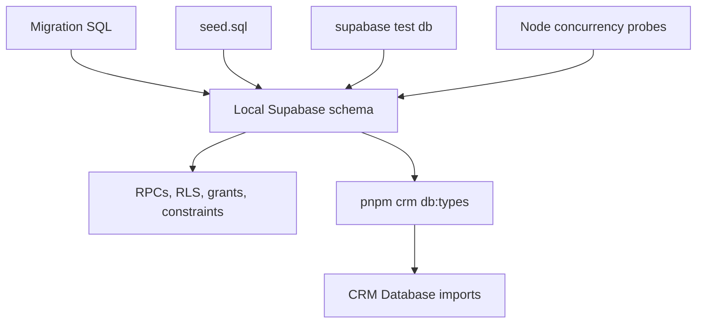

# Supabase Data, Security, and Generated Contract

## Ownership and flow

`packages/db` owns the Supabase CLI work directory. Its migrations evolve Postgres tables, functions, policies, and grants; `seed.sql` supplies deterministic local demo data; SQL files under `supabase/tests/` assert database contracts; scripts add concurrency probes; and `src/database.types.ts` is the generated TypeScript contract consumed by `apps/crm` through `@clean-app/db`.

This package supplies the integrity boundary used by [CRM runtime](crm-runtime.md). Its job-loop implementation is consumed by [job dispatch](../workflows/job-dispatch.md).

## Migration areas and contracts

The migration sequence establishes foundations, company identity, clients/sites/defaults/preferred cleaners, pool invitations, jobs and slots, recurring assignments and generation, loop foundations, and one-off jobs. Relevant change anchors include:

| Area | Canonical migration/test anchors | Contract to preserve |
|---|---|---|
| Jobs and crew slots | `20260809200000_cle_13_jobs_slots.sql`; `cle_13_jobs_slots.test.sql` | A job has a crew size and per-slot assignment records. |
| Recurrence and generated instances | `20260809210000_cle_14_recurring_assignments.sql`; `20260809220000_cle_15_recurring_job_generation.sql`; `cle_14_recurring_assignments.test.sql`; `cle_15_generation.test.sql` | Recurrence and generated jobs are database-owned lifecycle behaviour. |
| Dispatch loop foundations | `20260811130000_cle_49_loop_foundations.sql`; `cle_49_loop_foundations.test.sql` | Workflow functions and race-sensitive dispatch rules require SQL and concurrency evidence. |
| One-off jobs | `20260811150000_cle_23_one_off_jobs.sql`; `cle_23_one_off_jobs.test.sql` | Create/publish input is checked and returns the created job identity for CRM navigation. |

The current action layer calls `create_one_off_job`, `assign_job_slot`, and `cancel_job`. Treat an RPC name and its parameter/return shape as a cross-package contract: update the migration, regenerate types, retain the CRM action consumer, and test both the database rule and the action's response behaviour.

## Security and product constraints

The database is the right layer for authorization and concurrency-sensitive workflow outcomes. Keep RLS, security-definer function authorization, explicit grants, and tenant checks in migration code. Every new table requires explicit grants to `authenticated` and `service_role`; missing grants can manifest as `42501` failures. The CRM's company predicates supplement, but do not replace, database enforcement.

Product constraints represented by this boundary include company isolation, per-slot staffing, and vacancy as a projection of open slots. The broader product rationale—including assignment-gated cleaner information and later cleaner-surface requirements—is maintained in [the product model](../product/domain-model.md). Do not introduce direct cleaner reads of company tables when future cleaner code arrives; the stated contract is dedicated views plus RPCs.

## RPC and policy change surface

For a migration, RPC, RLS, or function change:

1. Change the canonical migration; never patch a generated `Database` type as the primary source.
2. Add or update the narrow SQL contract test in `packages/db/supabase/tests/`. For a race, add or update the relevant probe invoked by `packages/db/scripts/test-local.mjs`.
3. Run `pnpm crm db:types` (or `pnpm --dir packages/db db:types`) to regenerate `packages/db/src/database.types.ts`. This is the generated publish mirror for the CRM's `@clean-app/db` import.
4. Update the CRM action/page consumer if the callable contract changed; run its focused Vitest file and `pnpm --filter crm typecheck`.
5. Run `pnpm db:test` (Docker and local Supabase required) for all migration, policy, seed, or RPC changes. The command runs `supabase test db` and the invite, logo, job-assignment, loop, recurring-assignment, and generation concurrency probes.

A UI-only component change normally does not require database tests. Conversely, a passing SQL test alone does not prove the consumer import path or server action is compatible. Use [job dispatch](../workflows/job-dispatch.md) for the user-facing action and cache consequences.
