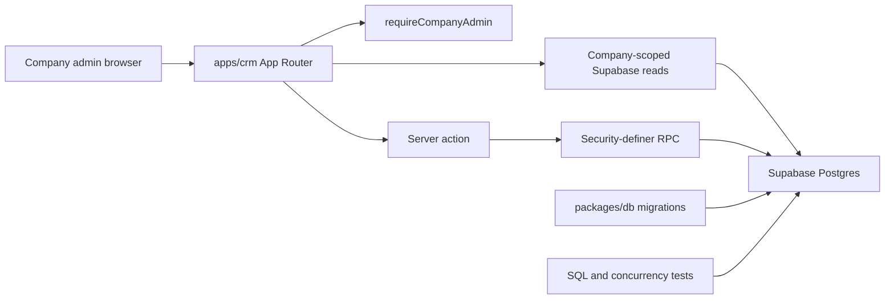

# Clean App CRM Architecture Overview

## Current components

The repository is no longer a scaffold. Its two implemented workspace components are a Next.js 16 CRM (`apps/crm`) and a Supabase owner package (`packages/db`). The CRM reads company-scoped records and invokes server actions; those actions call database RPCs for mutations. Migrations, SQL tests, seed data, and the generated `Database` type live in the database package. [CRM runtime](crm-runtime.md) and [data and security](data-and-security.md) are the canonical detailed pages.

The route/action boundary depends on [data and security](data-and-security.md) for persisted contracts, while the job-specific path is explained by [job dispatch](../workflows/job-dispatch.md).

| Component | Responsibility | Public/runtime boundary | Primary validation |
|---|---|---|---|
| `apps/crm` | Company-admin CRM: authentication, client/site and roster surfaces, job list/detail/new-job screens, and server actions. | Browser routes and Next server actions; its application imports database types through `@clean-app/db`. | Focused Vitest route/action/model tests; `pnpm typecheck`; `pnpm build` when shipped route/build surface changes. |
| `packages/db` | Supabase CLI owner for schema migrations, seed, generated `Database` type, SQL regression tests, and concurrency probes. | Database tables, policies, views, functions/RPCs, and generated type surface. | `pnpm db:test` with local Docker/Supabase. |
| `apps/cleaner` | Intended cleaner-facing consumer. | No package or runtime exists. ADR 0004 defines future constraints only. | Evidence-blocked; see [product direction](../product/domain-model.md#future-cleaner-surface-adr-0004). |
| `packages/ui` | Reserved shared UI owner. | No package or public exports exist. | Evidence-blocked. |

## Dependency and ownership rules

- UI/domain code belongs under `apps/crm/src`; current job types import `Database` from `@clean-app/db`, rather than duplicating database enums. A new database-facing type therefore crosses a shipped internal-package boundary: update the canonical generated type and verify the CRM consumer with type checking.
- `packages/db/supabase/migrations/` is canonical for database behaviour. Do not hand-edit `packages/db/src/database.types.ts`; regenerate it with `pnpm crm db:types` after schema changes, then validate its CRM consumers.
- CRM server mutations require `requireCompanyAdmin` before calling RPCs. Route reads must retain company scoping rather than relying on UI filtering. See [CRM runtime](crm-runtime.md#company-scoping-and-mutations).
- The database owns integrity and authorization contracts that cannot be trusted to a browser: RLS, grants, status transitions, slot uniqueness, and overlap checks. [Job dispatch](../workflows/job-dispatch.md) shows the application-facing effects.

## Change navigation

Consult this page when a change crosses a package or runtime boundary. Start in [CRM runtime](crm-runtime.md) for a route or authenticated read, in [data and security](data-and-security.md) for any schema/RPC/policy change, and in [job dispatch](../workflows/job-dispatch.md) for the current dispatch slice.

A database public-surface change is incomplete if its migration passes alone: regenerate the `Database` type, retain/update the `@clean-app/db` consumer import, and run the narrow CRM type or focused test that reaches the changed contract. A CRM-only rendering change normally does not need `pnpm db:test`; reserve the database suite for migration, RPC, RLS, seed, or generated-type changes. `pnpm check` is the broad conditional gate for changes spanning multiple layers or release readiness, not the default focused check.
