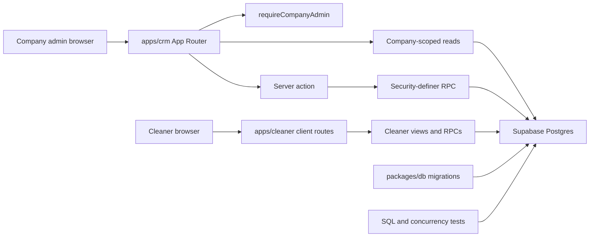

# Clean App CRM Architecture Overview

## Current components

The repository has three implemented workspace components: a Next.js 16 company-admin CRM (`apps/crm`), a client-first/static-exportable Next.js cleaner app (`apps/cleaner`), and the Supabase owner package (`packages/db`). The CRM reads company-scoped records and invokes server actions; critical CRM mutations call database RPCs. Its single physical App Router tree is locale-prefixed and currently supports `en-AU` and `pt-BR`; [bilingual CRM routing](../workflows/crm-localization.md) owns that cross-cutting behavior. The cleaner app authenticates, resolves the signed-in cleaner profile, and reads its dedicated views or invokes its dedicated RPCs from the browser. Migrations, SQL tests, seed data, and the generated `Database` type live in the database package. [CRM runtime](crm-runtime.md), [data and security](data-and-security.md), and [cleaner app workflow](../workflows/cleaner-app.md) are the canonical detailed pages.

The CRM route/action boundary and the cleaner browser boundary both depend on [data and security](data-and-security.md) for persisted contracts. The job-specific CRM path is explained by [job dispatch](../workflows/job-dispatch.md), while cleaner-facing invitation and board behavior is explained by [cleaner app workflow](../workflows/cleaner-app.md).

| Component | Responsibility | Public/runtime boundary | Primary validation |
|---|---|---|---|
| `apps/crm` | Company-admin CRM: authentication, client/site import and management, roster, job, and Money surfaces, plus server actions. | Browser routes and Next server actions; its application imports database types through `@clean-app/db`. | Focused Vitest route/action/model tests; `pnpm typecheck`; `pnpm build` when shipped route/build surface changes. |
| `apps/cleaner` | Cleaner-facing invitation, login, open-jobs application board, and assignment-gated My Jobs operations. It is client-first and static-exportable. | Browser-side Supabase auth, dedicated cleaner views, and cleaner RPCs; no server actions or proxy. | Focused Vitest tests; `pnpm --filter cleaner typecheck`; cleaner E2E only for affected flows. |
| `packages/db` | Supabase CLI owner for schema migrations, seed, generated `Database` type, SQL regression tests, and concurrency probes. | Database tables, policies, views, functions/RPCs, and generated type surface. | `pnpm db:test` with local Docker/Supabase. |
| `packages/ui` | Reserved shared UI owner. | No package or public exports exist. | Evidence-blocked. |

## Dependency and ownership rules

- UI/domain code belongs under its owning app. CRM types import `Database` from `@clean-app/db`, rather than duplicating database enums. A new database-facing type therefore crosses a shipped internal-package boundary: update the canonical generated type and verify every affected CRM or cleaner consumer with type checking.
- `packages/db/supabase/migrations/` is canonical for database behaviour. Do not hand-edit `packages/db/src/database.types.ts`; regenerate it with `pnpm crm db:types` or `pnpm cleaner db:types` after schema changes, then validate affected app consumers.
- CRM server mutations require `requireCompanyAdmin` before calling RPCs. Route reads must retain company scoping rather than relying on UI filtering. See [CRM runtime](crm-runtime.md#company-scoping-and-mutations).
- The database owns integrity and authorization contracts that cannot be trusted to a browser: RLS, grants, status transitions, slot uniqueness, and overlap checks. [Job dispatch](../workflows/job-dispatch.md) shows the application-facing effects.

## Change navigation

Consult this page when a change crosses a package or runtime boundary. Start in [CRM runtime](crm-runtime.md) for a CRM route or authenticated read, [cleaner app workflow](../workflows/cleaner-app.md) for a cleaner browser route or its privacy contract, [data and security](data-and-security.md) for any schema/RPC/policy change, and [job dispatch](../workflows/job-dispatch.md) for the current dispatch slice.

A database public-surface change is incomplete if its migration passes alone: regenerate the `Database` type, retain/update the affected consumer import, and run the narrow CRM or cleaner type/focused test that reaches the changed contract. An app-only rendering change normally does not need `pnpm db:test`; reserve the database suite for migration, RPC, RLS, seed, or generated-type changes. `pnpm check` is the broad conditional gate for changes spanning multiple layers or release readiness, not the default focused check.
