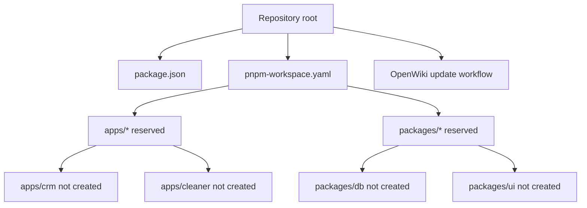

# Present Architecture and Intended Boundaries

## Status: scaffold, not an application

At inspection time, the Git repository has no commits or tracked files; the files described here are present only in the working tree. The working tree contains a root pnpm workspace, two empty placeholder directories (`apps/` and `packages/` each contain only `.gitkeep`), contributor guidance, and an OpenWiki refresh workflow. There are **no** package manifests below the root, Next.js files, TypeScript files, route handlers, React components, database schema, Supabase configuration, migrations, generated types, API endpoints, tests, or deploy configuration. Consequently, there is no current application request path, public API, persistence implementation, or executable CRM behaviour to trace.

`README.md` and `AGENTS.md` describe the intended system. Treat those documents as product and contributor direction, not evidence that the named services already run. [Workspace and commands](../workspace.md) documents the executable surface that does exist; [the proposed domain](../product/domain-model.md) is the canonical home for the product model and constraints.

## Present working-tree composition

This depicts workspace membership and planned ownership, not import or runtime relationships.

- Root `package.json` is private, requires Node `>=20`, selects `pnpm@9.15.3`, and exposes only the `crm` and `cleaner` pnpm filter aliases.
- `pnpm-workspace.yaml` includes `apps/*` and `packages/*`.
- `pnpm-lock.yaml` has an empty root importer; it records no installed application dependency graph.
- The only GitHub Actions workflow present is [OpenWiki automation](../operations/openwiki-automation.md); local editor hooks are a separate, non-portable development aid documented there.

## Intended application boundaries

The stated target is a company-side system of record for commercial cleaning operators. The repository is intended to converge the existing companion cleaner/boss prototype into one monorepo, but that sibling repository is outside this repository and was not inspected.

| Reserved owner | Intended responsibility | Current evidence |
|---|---|---|
| `apps/crm/` | Next.js App Router CRM for companies to manage clients, sites, schedules, rosters, and vacancies. | Planned path; not created. There is no app entrypoint or package manifest. |
| `apps/cleaner/` | Future home for the cleaner-facing application migrated from the sibling prototype. | Planned path; not created. There is no consumer UI or route surface. |
| `packages/db/` | Future shared Supabase schema, migrations, seed data, and generated types. | Planned path; not created. No SQL, types, RPCs, RLS, or schema ownership exists. |
| `packages/ui/` | Future shared design tokens and components. | Planned path; not created. No exports or consuming application exists. |

The companion `../clean-app` is described as the cleaner-facing vacancy-pickup consumer and migration source, but it is outside this repository and was not inspected. The README names a target stack—Next.js, React, TypeScript, Tailwind CSS v4, Supabase/Postgres/Auth, Web Push PWA, and Vercel—but no stack dependency or configuration is currently present in the working tree. Do not add or describe implementation-specific conventions as existing behaviour until their code and focused tests exist.

## Proposed deployment and trust split

Contributor guidance fixes several intended boundaries for future work:

- Supabase is planned to provide Postgres, authentication, migrations, RLS, and security-definer RPCs; Vercel is the intended application host.
- The eventual roles are `boss`, `cleaner`, and internal `admin`.
- Flow-changing mutations are intended to use atomic Postgres RPCs, with assignment races resolved first-accept-wins.
- Cleaners should read dedicated views and use RPCs rather than direct company-table queries. A site address and access notes should become visible only after assignment; client phone numbers, client charges, and internal notes must remain unavailable to cleaners.
- New future database tables must receive explicit grants to `authenticated` and `service_role`; the contributor guidance calls out otherwise-silent `42501` failures under the targeted Supabase PG17 image.

These are design constraints rather than implemented enforcement points. Their eventual source of truth should be migrations, policies, views, RPC definitions, generated contracts, and tests under `packages/db/`, with callers in applications. Until those exist, validation is limited to workspace-level checks described in [Workspace](../workspace.md).

## Change map

| Intent | Start with | Then locate when implemented |
|---|---|---|
| Add the CRM | [Workspace](../workspace.md) and [domain model](../product/domain-model.md) | `apps/crm` package manifest, App Router composition, route/layout guards, and its tests. |
| Add database-backed scheduling or dispatch | [Domain model](../product/domain-model.md) | `packages/db` migrations, RLS/views/RPCs, generated types, caller mutation path, and race/privacy tests. |
| Migrate cleaner-facing features | This page and [domain model](../product/domain-model.md) | `apps/cleaner` package/entrypoints and cross-app contracts. |
| Add shared UI | [Workspace](../workspace.md) | `packages/ui` public exports plus both consumer imports and focused rendering/interaction tests. |

## Scope boundary

The repository documents an internal-alpha product direction, including future notification behaviour and a later recruitment/AI roadmap. Those are not deployed or testable systems here. The [domain page](../product/domain-model.md) records the alpha boundary so planning does not become a false claim about implementation.
