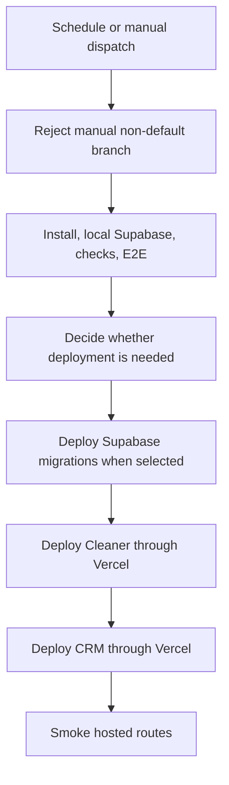

# Daily Internal Release

## Purpose and trigger

`.github/workflows/daily-production.yml` is the release pipeline for the two deployed applications and their Supabase schema. It runs daily at `07:17` in `Australia/Brisbane` and supports `workflow_dispatch`. A manually started workflow rejects a non-default branch before validation. Scheduled and manual runs both execute the full validation gate; a scheduled run deploys only when the current default-branch commit has not already completed this workflow successfully, while a manual run always deploys.

This is the workflow-owned release order when the decision selects deployment: no provider deployment begins until checks succeed, and the CRM does not deploy until the cleaner job completes.

## Validation and deployment boundary

The `checks` job pins its setup actions and CLI versions, installs the locked pnpm workspace, starts local Supabase, runs `pnpm check` and `pnpm test:e2e`, then attempts local Supabase shutdown even if a preceding step fails. These are deliberately broad release checks, not the default command for ordinary application changes; use the focused commands in [workspace guidance](../workspace.md#focused-validation-guidance) during development.

When deployment is selected, the workflow performs these provider writes in sequence:

1. `supabase` links the hosted project, previews `packages/db` migrations, applies them, and runs a final dry-run. Database schema and migration constraints remain canonical in [data and security](../architecture/data-and-security.md).
2. `cleaner` pulls Vercel production settings, builds, and deploys the prebuilt Cleaner artifact. Its static-export and browser-data boundary is documented in [the cleaner app workflow](../workflows/cleaner-app.md).
3. `crm` performs the corresponding Vercel pull, build, and prebuilt deployment for the company-admin CRM, whose server route/action boundary is described in [CRM runtime](../architecture/crm-runtime.md).
4. `smoke` requests the localized CRM login and the legacy Cleaner login and join URLs, following redirects with retries. It does not authenticate a user or assert product behavior beyond hosted-route availability.

The `supabase`, `cleaner`, and `crm` jobs all declare GitHub environment `internal-deployment`. That environment holds the workflow's provider configuration boundary; its secret values must never be read, logged, copied into repository configuration, or documented here. The exact required variable and secret names, plus hosted setup procedure, are maintained in `README.md` under **Daily production release**.

## Change navigation and release safety

| Change | Start with | Preserve | Focused or conditional validation |
|---|---|---|---|
| Release trigger, default-branch guard, concurrency, or duplicate-deploy decision | `.github/workflows/daily-production.yml` `checks` job | Manual non-default runs fail; a scheduled run only skips writes after the same commit completed this workflow. | Review the workflow control flow. Run hosted workflow only when changing CI behavior. |
| Supabase release or migration sequencing | `supabase` job and [data/security](../architecture/data-and-security.md#rpc-and-policy-change-surface) | Preview before apply, idempotence dry-run after apply, and database deployment before either app. | `pnpm db:test` for database changes; `pnpm check` and hosted workflow are conditional release checks. |
| Cleaner or CRM deploy configuration | `cleaner` or `crm` job and the relevant [cleaner](../workflows/cleaner-app.md#change-navigation-and-validation) or [CRM](../architecture/crm-runtime.md#focused-validation) page | Cleaner deploy precedes CRM; Vercel build precedes `--prebuilt` production deploy; provider credentials remain environment-scoped. | App-focused tests/typecheck locally; use `pnpm check`, `pnpm test:e2e`, and a hosted run only for release-boundary changes. |
| Environment name or required provider configuration | `environment` declarations and `README.md` **Daily production release** | All three provider-facing jobs use `internal-deployment`; checks and smoke do not require that environment. | Review all three job declarations and their configuration guard messages; do not attempt to inspect secret values. |
| Hosted smoke coverage | `smoke` job | Requests remain public availability checks and retain redirects/retries; do not make this a substitute for acceptance tests. | Hosted workflow after changing deployed URLs or smoke semantics. |

Only backward-compatible hosted migrations belong in this automated route; `README.md` directs destructive or data-rewriting migrations to a manual release. Avoid hand-editing generated database types or treating a passing app build as evidence that a migration can safely deploy: migration/SQL checks, generated contracts, and application consumers have separate responsibilities described in [data and security](../architecture/data-and-security.md).