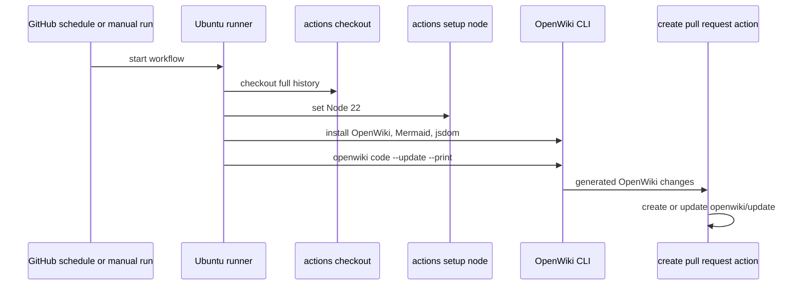

# OpenWiki Automation, Diagram Validation, and Connector Contract

## Working-tree automation

At inspection time, the Git repository has no commits or tracked files; this workflow is present in the working tree. `.github/workflows/openwiki-update.yml` is the only GitHub Actions workflow present. It can be run manually (`workflow_dispatch`) or daily at 08:00 UTC (`0 8 * * *`). It has `contents: write` and `pull-requests: write` permissions because its purpose is to regenerate OpenWiki documentation and open/update a documentation pull request.

This diagram shows the workflow configured in the repository; it does not imply that a local developer command will create a PR.

### Workflow contract

1. `actions/checkout` is pinned and uses `fetch-depth: 0`. Its comment explains that full history lets OpenWiki compare `HEAD` to the last documented commit; shallow history would otherwise produce an empty change summary.
2. `actions/setup-node` is pinned and configures Node 22 for the workflow.
3. The runner globally installs `openwiki@0.3.1`, `mermaid@11.16.0`, and `jsdom@29.1.1`. The workflow comment states Mermaid/jsdom enable high-fidelity diagram validation. This npm use is intentionally limited to global documentation tooling on an ephemeral runner; it does not change the pnpm-only workspace dependency-management rule.
4. It invokes `openwiki code --update --print` with `OPENWIKI_PROVIDER=openrouter` and `OPENWIKI_MODEL_ID=z-ai/glm-5.2`. Required secret-backed variables are `OPENROUTER_API_KEY` and `OPENWIKI_LANGSMITH_API_KEY`; the latter authenticates the LangSmith connector's code-mode pull. Optional tracing variables are `LANGSMITH_API_KEY`, `LANGCHAIN_PROJECT=openwiki`, and `LANGCHAIN_TRACING_V2=true`.
5. The pinned `peter-evans/create-pull-request` action adds `openwiki`, `AGENTS.md`, `CLAUDE.md`, and the workflow itself, targets branch `openwiki/update`, and uses `docs: update OpenWiki` for both the commit message and PR title. Its PR body is `Automated OpenWiki documentation update.`

<!-- openwiki: broken internal link [../workspace.md#development-rules-that-already-apply] heading anchor "development-rules-that-already-apply" does not exist in "../workspace.md". Fix the href or restore the target, then delete this comment. -->
The YAML exposes variable names only. Never place their values in source, wiki pages, logs, raw connector artefacts, test fixtures, or configuration. Repository `.gitignore` excludes normal `.env*` files; see [Workspace hygiene](../workspace.md#development-rules-that-already-apply).

## Local tool hooks

<!-- openwiki: broken internal link [../workspace.md#development-rules-that-already-apply] heading anchor "development-rules-that-already-apply" does not exist in "../workspace.md". Fix the href or restore the target, then delete this comment. -->
The working tree also contains untracked `.claude/settings.local.json`, `.codex/hooks.json`, and `.cursor/hooks.json`, plus `.impeccable/config.local.json`. Their hooks conditionally run external Impeccable UI-check scripts after editing or at agent stop; the Cursor hook runs before tool use. They are not CRM runtime, CI, or OpenWiki automation, and their host-specific script locations are not portable project dependencies. The `.gitignore` currently lists only specific `.claude` local settings, so contributors should decide whether Codex/Cursor configuration is deliberate portable tooling or local state to ignore; see [workspace hygiene](../workspace.md#development-rules-that-already-apply).

## Mermaid authoring and validation

`skills/mermaid-diagrams/SKILL.md` is a repository-local instruction contract for generated wiki pages. It requires grounded Mermaid diagrams where inspected source supports a meaningful runtime flow, request sequence, lifecycle/state machine, data model, or non-trivial control flow. It calls for a short caption directly below each diagram and directs authors to skip diagrams that would be merely decorative.

The skill’s syntax rules matter because OpenWiki validates Mermaid fences after generation and converts a parse failure to a plain text fence. In brief: use `sequenceDiagram`, `stateDiagram-v2`, `erDiagram`, or `flowchart` according to the represented relationship; avoid semicolons, pipes, and unescaped angle brackets in labels; quote punctuated flowchart labels; use aliases for spaced sequence participants; and avoid Mermaid reserved identifiers. The workflow’s Mermaid/jsdom installation is the operational counterpart to this instruction.

This repository currently has only wiki diagrams. There is no application runtime flow to diagram yet; the diagrams in [architecture](../architecture/overview.md) and [domain model](../product/domain-model.md) are explicitly marked as present workspace structure or documented product direction.

## Connector extension contract

`skills/write-connector/SKILL.md` describes how to add an OpenWiki **built-in** source connector to the OpenWiki OSS codebase. It is instruction-only evidence in this repository: no `src/connectors`, connector runtime, registry, connector configuration, or connector tests are checked in here. Do not represent a connector as part of this repository’s implementation.

If a task explicitly asks to implement that extension in its owning OpenWiki codebase, the prescribed complete change surface is:

| Surface | Required prescribed change |
|---|---|
| Type and registry | Add the connector to `src/connectors/types.ts` and `src/connectors/registry.ts`. |
| Implementation | Add `src/connectors/sources/<connector>.ts` exposing `ConnectorRuntime` with identity/display metadata, backend, required environment names, discovery capability, and `ingest()`. |
| Storage | Write raw JSON/manifests below `~/.openwiki/connectors/<id>/raw/<run-id>/`; use `state.json` for state and `config.json` for configuration below the connector directory. |
| Secrets | Keep secret values only in `~/.openwiki/.env`, referenced by environment-variable name. Never read, hardcode, print, return, log, or persist them. |
| Ingestion | Use deterministic credentialed fetching; retain provenance/IDs/timestamps/content hashes and cursor/pagination state where the source supports them. Local Git sources should write compact manifests and let agents inspect local source. |
| Safety | Validate connector IDs and raw paths to retain filesystem confinement. MCP integrations are read-only and limited to configured allowlisted read/dump operations; untrusted manifests must not launch arbitrary commands/endpoints. |
| Tests and finish | Add normal source tests for the extension without credentials; report changed files, required environment names/configuration, update command, and provider scopes. |

The `~` paths above are literal locations specified by the instruction contract; they are not repository paths and are not read or managed by this wiki run. The contract forbids credentials in connector config, raw data, state, logs, and tests.

## Change routing

| Intent | Start here | Focused verification |
|---|---|---|
| Change the scheduled wiki workflow | `.github/workflows/openwiki-update.yml` and this page | Review triggers, least necessary permissions, pinned actions, add paths, and secret names; test through the hosted workflow when appropriate. |
| Add/repair a generated Mermaid diagram | `skills/mermaid-diagrams/SKILL.md` and its destination wiki page | Ensure every participant/state/edge is source-grounded; validate Mermaid syntax through the workflow toolchain. |
| Implement an OpenWiki connector | The owning OpenWiki source repository and `skills/write-connector/SKILL.md` | Exercise new connector tests and validate storage confinement/no-secret behaviour. It is outside the current CRM scaffold. |

## Scope boundary

The workflow contains environment names for OpenWiki provider and tracing/connector integrations, but this does not create CRM-facing integrations, a LangSmith service, or an implemented source connector in the application repository. Application operations—deployments, Supabase lifecycle, Web Push, database jobs, and monitoring—have not been implemented or configured here.
