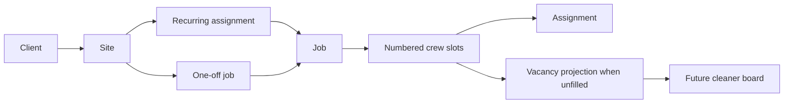

# Cleaning CRM Product Model and Roadmap Guardrails

## Sources and status

`docs/PRODUCT.md` is the canonical product strategy in this repository; the root `PRODUCT.md` is its compact product record. Product v0.4 adds F14 and updates product direction, while current source/tests establish what actually runs. The implemented job slice is documented in [job dispatch](../workflows/job-dispatch.md) and the database contracts in [data and security](../architecture/data-and-security.md). The sibling `../clean-app` prototype is reference material only—not a runtime dependency or authority—and the alpha is intended to run on monorepo apps.

## Implemented job loop and product direction

The current CRM/database model includes clients and sites, jobs with `crew_size`, per-slot `job_assignments`, application/pool-related foundations, recurring-assignment/generation migrations, and direct one-off-job creation. The definitive runtime lifecycle is [the dispatch workflow](../workflows/job-dispatch.md#crew-slot-lifecycle).

The diagram distinguishes present scheduling/persistence concepts from the future cleaner-board consumer. Vacancy is a view/projection over unfilled crew slots, not a table; roster and future board consumers must not introduce a bypassing outbound object.

### Product laws

- Jobs have `crew_size >= 1` and per-slot assignments. A vacancy is an unfilled slot, and released history remains meaningful for dispatch presentation.
- The ledger records agreed amounts and settlement state; it never moves money. No worker payment surface or fee is allowed.
- Cleaner access is assignment-gated: future cleaner views/RPCs must not expose client phone, client charge, or internal notes, and address/access notes appear only after assignment.
- Reviews are structured rather than public free-text ratings. Vetting/identity material is minimised and restricted.
- Critical workflow mutations belong in atomic database RPCs with first-accept-wins handling where the workflow requires it. See [data/security](../architecture/data-and-security.md#security-and-product-constraints).
<!-- openwiki: broken internal link [../workflows/crm-localization.md#product-boundary-and-invariants] heading anchor "product-boundary-and-invariants" does not exist in "../workflows/crm-localization.md". Fix the href or restore the target, then delete this comment. -->
- F15 language choice is explicit and persistent. It changes labels and locale-aware presentation only: AUD and `Australia/Brisbane` remain fixed, `The Clean Crew` remains literal, and names, addresses, access instructions, and notes remain as written rather than automatically translated. See [the CRM localization workflow](../workflows/crm-localization.md#product-boundary-and-invariants).

## v0.4 and v0.5 product changes

Product v0.4 makes `docs/PRODUCT.md` canonical locally and replaces alpha exit criteria with qualitative partner-company validation. The cleaner app now implements invitation/pool joining and a privacy-minimized open-jobs board, documented in [the cleaner app workflow](../workflows/cleaner-app.md); the following requirements remain future direction rather than proof of an implemented feature. Product v0.5 adds cross-cutting F15: alpha first-party surfaces are intended to support `en-AU` and `pt-BR`, with explicit persistent selection. The CRM implementation is documented in [bilingual CRM routing and locale preference](../workflows/crm-localization.md); no cleaner-app F15 implementation is established by the inspected source.

| Direction | Product meaning | Implementation status |
|---|---|---|
| F11 cleaner weekly agenda | A cleaner sees accepted assignments from all joined pools in one week view; each entry opens its job card. | Planned; the existing board shows open jobs, not an agenda. |
| F5 job-type preferences | Cleaner preferences order board jobs alongside availability; later they become a search/shortlist signal. | Planned; not in the current consumer UI. |
| F14 job chat and field events | Assigned cleaner and company have a per-job thread; structured can't-attend, issue, lost-and-found, and extra-charge events are prioritised. Can't-attend enters the dropout/vacancy flow; free text is MVP and AI assistance is P1. | Planned; no chat tables, storage, RPCs, or UI are implemented. |
| Qualitative alpha validation | Partner feedback supports design; it is not analytics or a quantified exit gate. | Product process direction. |

F14's design principle is that the job card carries logistics while the thread absorbs exceptions. Structured events must trigger visible workflow handling rather than becoming free text an administrator can miss. Event participants are assignment-gated; pay stays structured and human-approved; photos would require restricted job-record storage; client contact details must not surface in the thread.

## Future cleaner surface: ADR 0004

ADR 0004 specifies the wrapper-ready `apps/cleaner`: client-first, static-exportable, PKCE client authentication, client Supabase access through cleaner views/RPCs, a narrow push-registration abstraction, and service-worker app-shell caching. `apps/cleaner/next.config.ts` enforces static export. The acquisition path remains web/link-first. A Capacitor shell is conditional on alpha evidence that iOS web push does not reliably reach real cleaners; it is a retention option, not the front door. CRM remains web/SSR-capable.

When extending this surface, consult the ADR, [the cleaner app workflow](../workflows/cleaner-app.md), and [data/security](../architecture/data-and-security.md) before creating a route: do not add server actions, proxy code, or dynamic route handlers that defeat static export; do not access company tables directly; and isolate Web Push/native push differences behind the specified abstraction. Add focused cleaner tests and use the package validation commands documented in the workflow.

## Change navigation

For a current job/slot change, begin with [job dispatch](../workflows/job-dispatch.md) and its tests. For a schema/RLS/RPC change, begin with [data and security](../architecture/data-and-security.md). For a roadmap change, read the relevant F-number and journey in `docs/PRODUCT.md` before changing this page or code; do not turn a later MVP/P1 requirement into alpha scope without product evidence.
