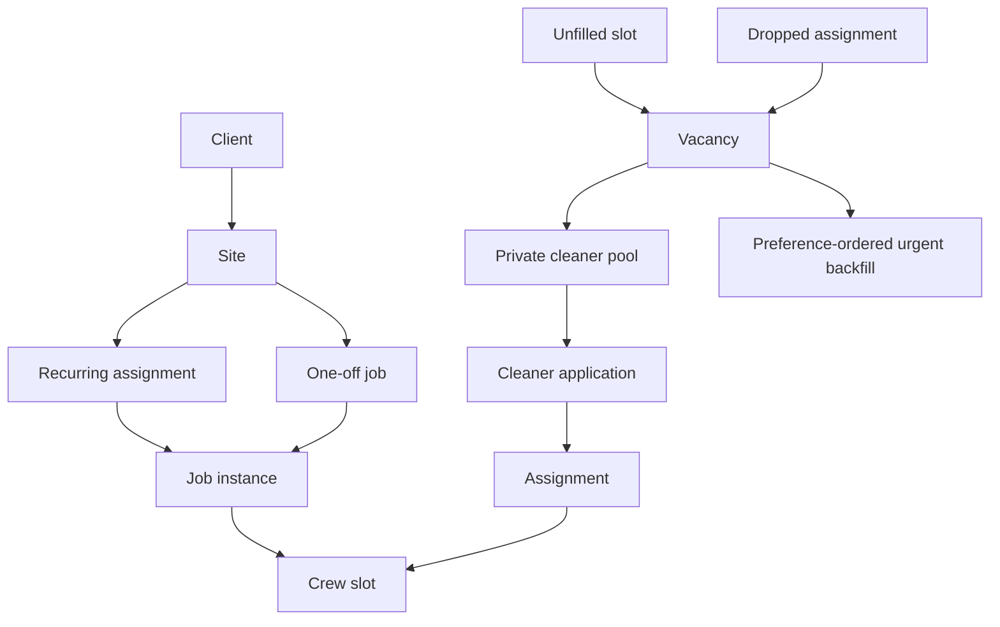
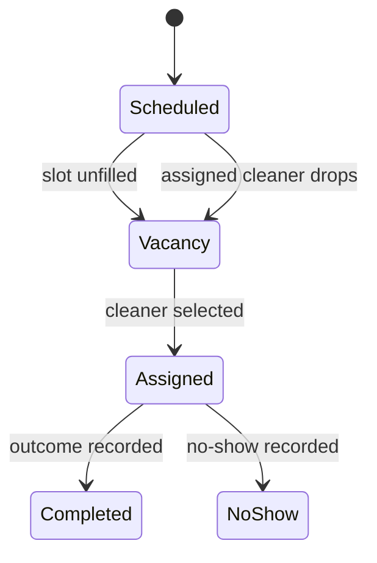

# Cleaning CRM Product Model and Guardrails

## Evidence and status

This is the canonical interpretation of the product model stated in `README.md` and `AGENTS.md`. No table, migration, RPC, API, UI, or test implementing these concepts exists in this repository yet. Names such as `Client`, `Site`, `RecurringAssignment`, `Job`, and `Vacancy` are product-model names from the README, not current exported types. For the actual repository layout, see [Present Architecture](../architecture/overview.md).

The target is a company-side CRM and system of record for commercial cleaning operators in Gold Coast, Queensland. Product guidance specifies English UI, AUD currency, and `Australia/Brisbane` timezone. The current planned release is an internal alpha for the founding team's companies.

## Core scheduling chain

This diagram expresses the intended product relationship: schedule-derived gaps and dropouts become vacancies, which the private cleaner pool consumes. A job can be generated by recurrence or directly scheduled as a one-off job. The urgent-backfill branch is documented direction, not specified implementation. This is not an implemented database model.

### Entities and responsibilities

| Concept | Intended responsibility | Constraints or detail stated in repository guidance |
|---|---|---|
| Client | Commercial customer record. | Client contact and internal information must not be exposed to cleaners. |
| Site | Service location owned by a client. | Carries address, access notes, default service, duration, rate, and an ordered preferred-cleaner list. Full address/access notes are assignment-gated for cleaners. |
| Recurring assignment | Repeated planned work at a site. | Generates job instances rather than being the job instance itself. |
| One-off job | A directly scheduled, non-recurring cleaning instance. | The README identifies one-off jobs as company-managed scheduling records. An uncovered staffing need must still be represented through a vacancy. |
| Job | A concrete scheduled cleaning instance. | Covers recurring-generated instances and directly created one-off jobs. Has crew size of at least one and per-slot assignment; it is the source for agreed pay figures in future automation. |
| Crew slot | One staffing position within a job. | A job may have multiple slots; unfilled slots are roster gaps. |
| Vacancy | The connecting object for staffing/distribution. | Roster gaps, uncovered instances, and dropouts all produce a vacancy. Outbound features must consume it rather than bypass it. |
| Private cleaner pool | Company-private audience for vacancies. | Planned to support one-tap applications and urgent backfill; no implemented board or push service exists. |
| Preference-ordered urgent backfill | Documented dropout response direction. | A vacancy may be cascaded through the site's ordered preferred-cleaner list. The alpha backlog commits only to urgent pool-board reposting and a push blast, not detailed cascade mechanics. |
| Cleaner profile | Worker identity and availability context. | Alpha plans an “available today” indicator and first-job marker. |
| Completion outcome | Result captured after a job. | Alpha includes completion outcome and no-show capture. |

## Alpha outcomes and lifecycle

The README’s alpha backlog defines the intended end-to-end slice:

1. Manage clients and sites as first-class records.
2. Create recurring assignments that generate job instances with crew size at least one.
3. Render a week-ahead roster by cleaner and site, surfacing unfilled slots as vacancies.
4. Mark a dropout and urgently re-post the resulting vacancy to the pool board with a push blast. The broader documented direction includes a preference-ordered urgent-backfill cascade; its mechanics are not an alpha implementation commitment.
5. Show the cleaner profile’s “available today” state on applicant lists.
6. Capture first-job status and completion/no-show outcomes.

This is the documented alpha behaviour at a product level. It intentionally does not invent unmentioned states, persistence fields, or HTTP/RPC endpoints. The contributor contract additionally intends first-accept-wins resolution for assignment races when atomic Postgres RPCs are implemented.

## Roles, visibility, and safety rules

Future authentication roles are `boss`, `cleaner`, and `admin` (internal). The intended cleaner privacy boundary is particularly important:

- cleaner reads use dedicated views and writes use RPCs, not direct selects from company tables;
- full site address and access notes are disclosed only after assignment, and access should be logged;
- cleaners must not see client phone numbers, client charges, or internal notes.

Other product laws from `AGENTS.md` are:

- **No money movement:** a pay ledger may record agreed amounts and settlement state but must never transfer funds. There is no candidate payment surface or worker fee.
- **Structured reviews only:** do not build free-text public ratings of cleaners. The intended structured records accumulate per cleaner and per client–cleaner pair.
- **Sensitive records minimised:** criminal-history/vetting information should be status plus expiry rather than raw records; ID documents belong in restricted storage.
- **Future AI autonomy is server-enforced:** capability limits must be enforced server-side; outbound content uses templates or approved drafts; pay figures come from the job record.

These rules should become testable database and application invariants when implementation begins. See [Present Architecture](../architecture/overview.md) for the proposed enforcement layers and [Workspace](../workspace.md) for the currently available validation surface.

## Boundary of the alpha

The following are explicitly out of alpha scope: public signup, share links, vetting, structured reviews, messaging, AI features, WhatsApp integration, and payments. The README frames pool offers, push notifications, and recruitment posts as potential consumers of vacancies; only the alpha’s private-pool/push direction is planned. Nothing in this repository currently implements notification delivery, PWA registration, WhatsApp, payments, or AI.

## Implementation checklist when code begins

A change that introduces one of these concepts should establish all relevant surfaces instead of adding an isolated UI:

1. Define the schema/migration and explicit grants in the future `packages/db` owner.
2. Implement RLS, privacy-filtered views, and atomic RPCs for state-changing operations where appropriate.
3. Generate and export shared database types; make application callers use them.
4. Add application route/layout role guards and assignment-gated presentation.
5. Add focused tests for crew-size minimum, recurring-instance generation, vacancy derivation, first-accept-wins behaviour, and cleaner visibility boundaries as applicable.
6. Update this page only once source and tests establish the actual names and lifecycle.
