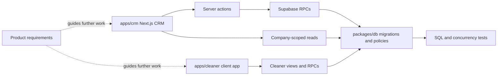

# Clean App CRM Wiki Quickstart

## What this knowledge base covers

The Clean Crew is a pnpm monorepo for a commercial-cleaning system of record. The working implementation includes a bilingual Next.js company-admin CRM, a client-first/static-exportable bilingual Next.js cleaner app, and a Supabase-backed data package. Current slices cover company membership and team administration, one-off jobs and crew slots, cleaner invitation joining, the open-jobs application board, assignment-gated My Jobs operations, client/site CSV import, and a read-only company pay ledger. Both apps support Australian English (`en-AU`) and Brazilian Portuguese (`pt-BR`) through locale-prefixed routes and persistent preference selection. Product requirements in `docs/PRODUCT.md` are canonical direction, while source and tests establish current behaviour.

This is the implemented app-to-database boundary plus product direction; it does not imply that every product feature is shipped.

## Main sections

- [Architecture overview](architecture/overview.md) explains the workspace components, runtime boundaries, and current scope.
- [CRM runtime](architecture/crm-runtime.md) is the entry point for routes, authentication, company scoping, and app-level validation.
- [Data and security](architecture/data-and-security.md) covers migration ownership, RLS/RPC contracts, generated types, and database tests.
- [Job dispatch workflow](workflows/job-dispatch.md) is canonical for one-off job creation, crew-slot lifecycle, assignment, cancellation, and cache invalidation.
- [Cleaner recruitment](workflows/recruitment.md) covers public postings and applications, CRM review/hire decisions, directed one-off/series offers, their cleaner-facing projections, and recruitment-specific database contracts.
- [Cleaner app workflow](workflows/cleaner-app.md) covers bilingual localized/legacy routing, posting-based joining, the client-side access gate, the privacy-minimized open-jobs application board, assignment-gated My Jobs operations, offers, notifications, and install/push upgrades.
- [Company membership and team administration](workflows/company-membership.md) covers identity derived from memberships, active-company selection, company creation, employee invitations, and owner-only team management.
- [Client and site CSV import](workflows/client-site-import.md) covers template contracts, preview classification, independent row recovery, and protected persistence delegation.
- [Company pay ledger](workflows/pay-ledger.md) covers completed-job ledger creation, immutable settlement history, company projection reads, and focused database checks.
- [Bilingual CRM routing and locale preference](workflows/crm-localization.md) covers `en-AU`/`pt-BR` route ownership, catalog parity, locale switching, persisted preferences, and localized cache invalidation.
- [Product model and roadmap guardrails](product/domain-model.md) separates implemented job-loop and cleaner-app facts from planned agenda, preferences, and field events/chat.
- [Workspace and commands](workspace.md) documents package scripts and validation tiers.
- [Daily internal release](operations/daily-release.md) covers the checked default-branch release sequence, `internal-deployment` provider environment, and hosted smoke boundary.
- [OpenWiki automation](operations/openwiki-automation.md) covers repository wiki tooling rather than product runtime.

## Task routing

| Change area or user intent | Relevant wiki page | Exact source entry points | Important symbols or types | Focused tests | Minimal validation command |
|---|---|---|---|---|---|
| Add or alter a CRM route, auth guard, or company-scoped server read | [CRM runtime](architecture/crm-runtime.md) | `apps/crm/src/app/`; `apps/crm/src/lib/auth/session.ts` | `requireCompanyAdmin`, `getCompanyAdminContext` | adjacent `*.test.tsx`; `apps/crm/src/lib/auth/session.test.ts` | `pnpm --filter crm test:run -- <test-file>` |
| Change active company, company creation, employee invites, or employee roles | [Company membership](workflows/company-membership.md) | `apps/crm/src/lib/auth/session.ts`; `src/app/actions/{active-company,company-creation,employee-invitations,employee-management}.ts` | `set_active_company`, `create_company`, `requireCompanyOwner`, `change_employee_role`, `remove_employee` | action/component tests; `cle_81`–`cle_84`; `company_creation.test.sql` | CRM: `pnpm --filter crm test:run -- src/app/actions/employee-management.test.ts`; database: `pnpm db:test` |
| Change one-off creation, dispatch, slot assignment, or cancellation | [Job dispatch workflow](workflows/job-dispatch.md) | `apps/crm/src/app/actions/jobs.ts`; `apps/crm/src/features/jobs/` | `createOneOffJob`, `assignJobSlot`, `cancelJob`, `buildJobSlots` | `apps/crm/src/app/actions/jobs.test.ts`; `apps/crm/src/features/jobs/{schema,model}.test.ts`; job route tests | `pnpm --filter crm test:run -- src/app/actions/jobs.test.ts` |
| Add/revoke a public posting, process its applications, or change directed job/series offers | [Cleaner recruitment](workflows/recruitment.md) | `apps/crm/src/app/actions/{postings,offers}.ts`; `apps/crm/src/features/postings/`; `apps/cleaner/src/features/offers/` | `createPosting`, `posting_preview`, `apply_to_posting`, `hire_posting_application`, `offerJob`, `accept_offer` | `postings.test.ts`; `offers.test.ts`; `cle_59_postings_applications.test.sql`; `cle_51_job_offers.test.sql`; `cle_52_series_offers.test.sql` | CRM: `pnpm --filter crm test:run -- src/app/actions/postings.test.ts src/app/actions/offers.test.ts`; database: `pnpm db:test` |
| Change job persistence, constraints, RLS, or RPC semantics | [Data and security](architecture/data-and-security.md), then [job dispatch](workflows/job-dispatch.md) or [recruitment](workflows/recruitment.md) | `packages/db/supabase/migrations/`; `packages/db/src/database.types.ts` | `create_one_off_job`, `assign_job_slot`, `cancel_job`, `create_posting`, `offer_job` | matching SQL contract test; `cle_49_loop_foundations.test.sql` | `pnpm db:test` (Docker/Supabase required); then `pnpm crm db:types` if contract changes |
| Change CRM language, locale-prefixed routes, messages, or saved language preference | [Bilingual CRM routing](workflows/crm-localization.md), then [data and security](architecture/data-and-security.md) | `apps/crm/src/i18n/`; `apps/crm/src/app/[locale]/`; `apps/crm/src/components/language-switcher.tsx`; `20260817120000_f15_profile_locale.sql` | `routing`, `LanguageSwitcher`, `setPreferredLocaleAction`, `set_preferred_locale`, `revalidateLocalizedPath` | `i18n-configuration.test.ts`; `i18n/catalogue.test.ts`; `components/language-switcher.test.tsx`; `f15_profile_locale_mutation.test.sql` | `pnpm --filter crm test:run -- src/i18n/catalogue.test.ts` (plus `pnpm db:test` for migration/RPC changes) |
| Change cleaner locale routes, posting join, access, board applications, offers, notifications, or My Jobs | [Cleaner app workflow](workflows/cleaner-app.md) | `apps/cleaner/src/app/(localized)/[locale]/`; `src/i18n/config.ts`; `src/features/{join,board,offers,my-jobs,notifications}/` | `JoinScreen`, `CallbackScreen`, `useCleaner`, `LegacyLocaleRedirect`, `posting_preview`, `apply_to_posting`, `accept_offer`, `update_job_status` | feature/component tests; `cle-19-join.spec.ts`; `cle-20-board.spec.ts`; `cle-21-apply.spec.ts`; `cle-24-my-jobs.spec.ts`; `cle-90-notification-bell.spec.ts`; `f15-cleaner-i18n.spec.ts` | `pnpm --filter cleaner test:run -- src/features/board/application.test.ts` |
| Change client/site CSV import | [Client and site CSV import](workflows/client-site-import.md) | `apps/crm/src/features/import/csv.ts`; `apps/crm/src/app/[locale]/(crm)/clients/import/`; `apps/crm/src/app/actions/import.ts` | `parseClientImportCsv`, `parseSiteImportCsv`, `importClientRow`, `importSiteRow` | `src/features/import/csv.test.ts`; import route/action/workspace tests | `pnpm --filter crm test:run -- src/features/import/csv.test.ts` |
| Change completed-job pay ledger or Money view | [Company pay ledger](workflows/pay-ledger.md), then [data and security](architecture/data-and-security.md) | `20260812101000_cle_50_pay_ledger_foundations.sql`; `apps/crm/src/app/[locale]/(crm)/money/` | `buildCompanyMoneyLedger`, `mark_ledger_paid`, `company_ledger_entries` | money model/page tests; `cle_50_pay_ledger.test.sql` | UI: `pnpm --filter crm test:run -- src/features/money/model.test.ts`; database: `pnpm db:test` |
| Change recurring generation, named cleaners, or roster-derived vacancies | [Data and security](architecture/data-and-security.md), [product model](product/domain-model.md) | `20260809210000_cle_14_recurring_assignments.sql`; `20260809220000_cle_15_recurring_job_generation.sql` | recurring assignment and generation RPCs | `cle_14_recurring_assignments.test.sql`; `cle_15_generation.test.sql` | `pnpm db:test` (Docker/Supabase required) |
| Change product scope for agenda, preferences, or chat/events | [Product model](product/domain-model.md) | `docs/PRODUCT.md`; `docs/decisions/0004-cleaner-surface-wrapper-ready-pwa.md` | F5, F11, F14; ADR 0004 | No agenda, preferences, or chat implementation tests exist | Documentation review only; add implementation checks with code |
| Change workspace scripts or package tooling | [Workspace](workspace.md) | `package.json`; `apps/{crm,cleaner}/package.json`; `packages/db/package.json` | root pnpm filter aliases | `scripts/run-local-dev.test.mjs` where launcher behaviour changes | `pnpm test:dev-setup` |
| Change scheduled release checks, deployment order, hosted migration behavior, or provider environment wiring | [Daily internal release](operations/daily-release.md) | `.github/workflows/daily-production.yml` | `checks`, `supabase`, `cleaner`, `crm`, `smoke`; `internal-deployment` | workflow review; affected app/database tests | Review workflow YAML; conditional hosted `workflow_dispatch` |

## Invariants worth preserving

- Job mutations are company-admin-only and delegate state-changing persistence to database RPCs; see [CRM runtime](architecture/crm-runtime.md) and [data/security](architecture/data-and-security.md).
- A job has numbered crew slots. `buildJobSlots` exposes open slots only while status is `draft` or `posted`; assignment history is retained for released slots. See [the dispatch lifecycle](workflows/job-dispatch.md#crew-slot-lifecycle).
- Assignment and cancellation refresh both the job detail and collection consumers (`/jobs`, `/roster`) so a stale UI is not treated as authoritative. See [cache and failure handling](workflows/job-dispatch.md#cache-and-failure-handling).
- Vacancy remains a projection of unfilled crew slots, not a separate persistence object. See [the product model](product/domain-model.md#implemented-job-loop-and-product-direction).
- Language selection is explicit in both apps; it changes locale-prefixed presentation, never the Australia/Brisbane schedule or AUD operating contract, and does not auto-translate user-authored content. See [bilingual CRM routing](workflows/crm-localization.md#formatting-messages-and-cache-invalidation) and [cleaner routing](workflows/cleaner-app.md#scope-and-runtime-boundary).
- CRM context is a selected approved active membership. Owner-only team mutations preserve at least one active owner; see [company membership](workflows/company-membership.md#employee-invitations-and-management).

## Backlog: evidence-blocked documentation

- F14 free-text job threads, photos, and AI assistance are product requirements, not current tables, RPCs, or UI. `docs/PRODUCT.md` §F14 is the source anchor.
- Job-type preference ordering and a cross-pool cleaner weekly agenda are product requirements; the current cleaner consumer implements pool joining, an open-jobs board, and directed offers, not either feature. `docs/PRODUCT.md` F5/F11 is the source anchor.
- `parseVisitorRelationship` identifies a visitor by company name because `posting_preview` omits `company_id`; it guards multi-match ambiguity but cannot resolve a single same-named company. `apps/cleaner/src/features/join/posting.ts` identifies CLE-111 as the complete identity-based follow-up.
