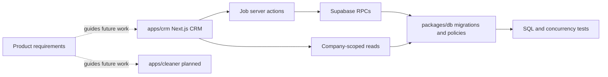

# Clean App CRM Wiki Quickstart

## What this knowledge base covers

Clean App CRM is a pnpm monorepo for a commercial-cleaning company system of record. The working implementation includes a Next.js company-admin CRM and a Supabase-backed data package; the current job slice supports one-off jobs, crew slots, assignment, and cancellation. The cleaner app remains planned rather than present. Product requirements in `docs/PRODUCT.md` are canonical direction, while source and tests establish current behaviour.

This is the implemented CRM-to-database boundary plus product direction; it does not imply that the cleaner app or all product features are shipped.

## Main sections

- [Architecture overview](architecture/overview.md) explains the workspace components, runtime boundaries, and current scope.
- [CRM runtime](architecture/crm-runtime.md) is the entry point for routes, authentication, company scoping, and app-level validation.
- [Data and security](architecture/data-and-security.md) covers migration ownership, RLS/RPC contracts, generated types, and database tests.
- [Job dispatch workflow](workflows/job-dispatch.md) is canonical for one-off job creation, crew-slot lifecycle, assignment, cancellation, and cache invalidation.
- [Product model and roadmap guardrails](product/domain-model.md) separates implemented job-loop facts from v0.4 requirements for agenda, preferences, field events/chat, and the future cleaner PWA.
- [Workspace and commands](workspace.md) documents package scripts and validation tiers.
- [OpenWiki automation](operations/openwiki-automation.md) covers repository wiki tooling rather than product runtime.

## Task routing

| Change area or user intent | Relevant wiki page | Exact source entry points | Important symbols or types | Focused tests | Minimal validation command |
|---|---|---|---|---|---|
| Add or alter a CRM route, auth guard, or company-scoped server read | [CRM runtime](architecture/crm-runtime.md) | `apps/crm/src/app/`; `apps/crm/src/lib/auth/session.ts` | `requireCompanyAdmin` | adjacent `*.test.tsx`; `apps/crm/src/lib/auth/session.test.ts` | `pnpm --filter crm test:run -- <test-file>` |
| Change one-off creation, dispatch, slot assignment, or cancellation | [Job dispatch workflow](workflows/job-dispatch.md) | `apps/crm/src/app/actions/jobs.ts`; `apps/crm/src/features/jobs/` | `createOneOffJob`, `assignJobSlot`, `cancelJob`, `buildJobSlots` | `apps/crm/src/app/actions/jobs.test.ts`; `apps/crm/src/features/jobs/{schema,model}.test.ts`; job route tests | `pnpm --filter crm test:run -- src/app/actions/jobs.test.ts` |
| Change job persistence, constraints, RLS, or RPC semantics | [Data and security](architecture/data-and-security.md), then [job dispatch](workflows/job-dispatch.md) | `packages/db/supabase/migrations/`; `packages/db/src/database.types.ts` | `create_one_off_job`, `assign_job_slot`, `cancel_job` | `packages/db/supabase/tests/cle_23_one_off_jobs.test.sql`; `cle_49_loop_foundations.test.sql` | `pnpm db:test` (Docker/Supabase required); then `pnpm crm db:types` if contract changes |
| Change recurring generation, named cleaners, or roster-derived vacancies | [Data and security](architecture/data-and-security.md), [product model](product/domain-model.md) | `20260809210000_cle_14_recurring_assignments.sql`; `20260809220000_cle_15_recurring_job_generation.sql` | recurring assignment and generation RPCs | `cle_14_recurring_assignments.test.sql`; `cle_15_generation.test.sql` | `pnpm db:test` (Docker/Supabase required) |
| Change product scope for agenda, preferences, chat/events, or cleaner surface | [Product model](product/domain-model.md) | `docs/PRODUCT.md`; `docs/decisions/0004-cleaner-surface-wrapper-ready-pwa.md` | F5, F11, F14; ADR 0004 | No cleaner implementation tests exist | Documentation review only; add implementation checks with code |
| Change workspace scripts or package tooling | [Workspace](workspace.md) | `package.json`; `apps/crm/package.json`; `packages/db/package.json` | root pnpm filter aliases | `scripts/run-local-dev.test.mjs` where launcher behaviour changes | `pnpm test:dev-setup` |

## Invariants worth preserving

- Job mutations are company-admin-only and delegate state-changing persistence to database RPCs; see [CRM runtime](architecture/crm-runtime.md) and [data/security](architecture/data-and-security.md).
- A job has numbered crew slots. `buildJobSlots` exposes open slots only while status is `draft` or `posted`; assignment history is retained for released slots. See [the dispatch lifecycle](workflows/job-dispatch.md#crew-slot-lifecycle).
- Assignment and cancellation refresh both the job detail and collection consumers (`/jobs`, `/roster`) so a stale UI is not treated as authoritative. See [cache and failure handling](workflows/job-dispatch.md#cache-and-failure-handling).
- Vacancy remains a projection of unfilled crew slots, not a separate persistence object. See [the product model](product/domain-model.md#implemented-job-loop-and-product-direction).

## Backlog: evidence-blocked documentation

- `apps/cleaner/` is specified by ADR 0004 but has no package, source, routes, PWA configuration, or tests. Its client-first/static-exportable constraints are documented as future direction in [the product model](product/domain-model.md#future-cleaner-surface-adr-0004).
- F14 free-text job threads, photos, and AI assistance are product requirements, not current tables, RPCs, or UI. `docs/PRODUCT.md` §F14 is the source anchor.
- Job-type preference ordering and a cross-pool cleaner weekly agenda are product requirements; no current cleaner consumer implements them. `docs/PRODUCT.md` F5/F11 is the source anchor.
