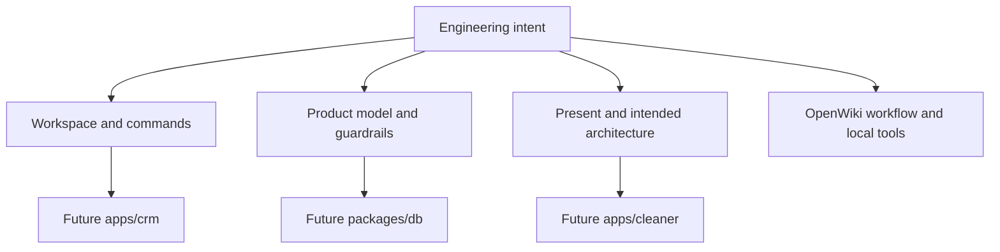

# Clean App CRM Wiki Quickstart

## Start with the repository's actual status

This is a **scaffolded pnpm workspace**, not a runnable CRM. At inspection time the Git repository has no commits or tracked files; the root manifest, contributor guidance, workflow, and placeholder directories are present in the working tree. There are no application packages, routes, database configuration/migrations, generated contracts, tests, or deployed-service configuration. Product descriptions are intentional direction, not implemented behaviour.

This is a navigation map of present evidence and planned ownership, not a runtime dependency graph.

## Main sections

| Page | Canonical use | Read it when |
|---|---|---|
| [Present Architecture and Intended Boundaries](architecture/overview.md) | Distinguishes working-tree facts from target application, deployment, trust, and package boundaries. | Planning the first CRM, database, cleaner migration, or shared-UI implementation. |
| [Cleaning CRM Product Model and Guardrails](product/domain-model.md) | Defines the intended scheduling chain, vacancy-centred dispatch model, roles, privacy, and alpha limits. | Changing clients/sites/jobs, staffing, vacancy handling, availability, outcome capture, or future policy/RPC design. |
| [pnpm Workspace and Development Surface](workspace.md) | Documents current root commands, Node/pnpm constraints, placeholders, hygiene, and what can actually be validated. | Adding a package, script, configuration, environment example, or development-tool convention. |
| [OpenWiki Automation, Diagram Validation, and Connector Contract](operations/openwiki-automation.md) | Documents the GitHub workflow, diagram validation, local editor hooks, and instruction-only connector contract. | Changing wiki automation, Mermaid diagrams, or repository-local developer tooling. |

## Task routing

| Change area or intent | Canonical wiki page | Current source entrypoints/symbols | Focused tests or validation | Current limit |
|---|---|---|---|---|
| Root workspace or package bootstrap | [Workspace](workspace.md) | `package.json` scripts `crm`/`cleaner`; `pnpm-workspace.yaml` member globs | `pnpm install`; then the new package’s own pnpm script once defined | No package-level scripts/tests exist. |
| Create the CRM app | [Architecture](architecture/overview.md), then [domain model](product/domain-model.md) | Intended path `apps/crm/`; no entrypoint exists | Add and run a focused app build/type/test command in the same implementation change | `apps/crm/` is not created. |
| Add scheduling, roster, job, or vacancy behaviour | [Domain model](product/domain-model.md) | Product concepts `Client`, `Site`, `RecurringAssignment`, `Job`, `Vacancy`; no exported types | Introduce migration/RPC/view/app tests for crew size, vacancy derivation, privacy, and races as applicable | No `packages/db/`, schema, RLS, RPCs, or tests exist. |
| Build a cleaner-facing surface or migrate the prototype | [Architecture](architecture/overview.md), [domain model](product/domain-model.md) | Intended path `apps/cleaner/`; sibling `../clean-app` is outside this repository | Define consumer contracts and add focused cleaner app tests after migration | The path is not created and the sibling repository was not inspected. |
| Add shared database or UI package | [Architecture](architecture/overview.md), [Workspace](workspace.md) | Intended `packages/db/` or `packages/ui/` | Verify public exports, consumer imports, and focused behaviour tests | Neither package path exists. |
| Change OpenWiki CI, Mermaid, or local hooks | [Operations](operations/openwiki-automation.md) | `.github/workflows/openwiki-update.yml`; `skills/mermaid-diagrams/SKILL.md`; local hook configuration | Review permissions, pins, secret names, and Mermaid source-grounding; use hosted workflow when appropriate | No local workflow test suite exists. |

## Concepts that govern future implementation

- **Vacancy is the connecting object.** Roster gaps, uncovered jobs, and dropouts must create a vacancy; outbound distribution should consume it rather than bypass it. See [the domain model](product/domain-model.md#core-scheduling-chain).
- **A job has crew size of at least one and per-slot staffing.** Recurrence generates job instances, while one-off jobs are directly scheduled. See [entities and responsibilities](product/domain-model.md#entities-and-responsibilities).
- **Cleaner visibility is assignment-gated.** Future implementation must use privacy-filtered views/RPCs, with address/access disclosure only after assignment and no client phone, charge, or internal notes exposed. See [roles, visibility, and safety rules](product/domain-model.md#roles-visibility-and-safety-rules).
- **The alpha is deliberately narrow.** Public signup, share links, vetting, reviews, messaging, AI, WhatsApp, and payments are not alpha work. See [boundary of the alpha](product/domain-model.md#boundary-of-the-alpha).

## Backlog: evidence-blocked documentation

The following must gain source code and focused tests before this wiki can document their real entrypoints, schemas, APIs, lifecycles, or validation commands:

- `apps/crm/` and `apps/cleaner/` are planned paths named in `README.md` and `AGENTS.md`, but do not exist in the working tree.
- `packages/db/` and `packages/ui/` are planned owners, but no package manifests, migrations, RLS policies, RPCs, exports, or test harnesses exist.
- The README describes aspirational `pnpm crm dev`, build, Supabase reset, and type-generation commands; root configuration has no corresponding CRM package/scripts.
- There are no product API endpoints, database contracts, auth implementation, notification implementation, deployment configuration, or test files to document.

When any item begins implementation, update the relevant canonical page with the composition root, public surface, upstream/downstream relationships, state/persistence boundaries, representative failure tests, and the narrowest validation command.
