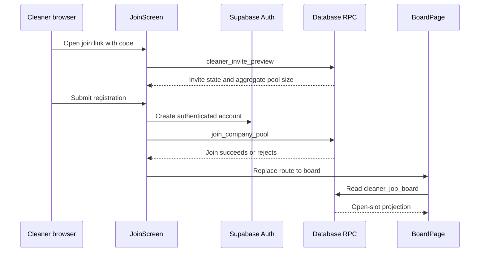

# Cleaner App Join and Open-Jobs Board

## Scope and runtime boundary

`apps/cleaner` is now an implemented Next.js application, not a future placeholder. It is deliberately client-first: routes use browser Supabase access and `next.config.ts` sets static export. The active slice is invitation-based cleaner registration at `/join?code=...`, login, and the protected `/board` of open jobs. [Data and security](../architecture/data-and-security.md) owns the database views and RPCs it consumes; [the product model](../product/domain-model.md) remains canonical for the future agenda, preferences, and job-thread scope.

This shows the implemented browser-to-Supabase flow. `cleaner_invite_preview` intentionally returns company name and aggregate pool size before sign-in; `join_company_pool` locks and validates the invite before changing pool membership.

## Join and access lifecycle

`JoinScreen` normalizes the `code` search parameter, calls `cleaner_invite_preview`, and renders a ready, missing-code, or problem state. It validates registration fields with `registrationSchema`, creates the Auth account, then calls `join_company_pool` with name, phone, and suburb. A sign-up without a session is treated as pending email confirmation rather than a pool join. The RPC rejects unauthenticated callers, non-cleaner roles, invalid/revoked/expired codes, and a previously removed membership; it records the supplied profile details and performs the membership insert atomically.

The `(cleaner)` layout uses `useCleaner` to resolve the authenticated user and a cleaner `profiles` row before rendering child routes. Its redirect is a navigation gate, not a security control: `useCleaner` documents that RLS, `cleaner_*` views, and security-definer RPCs enforce data access. On an error that `isStaleSessionError` recognizes, the hook signs out locally to prevent a rejected session from retrying indefinitely. The analogous CRM server-session recovery is documented in [CRM runtime](../architecture/crm-runtime.md).

## Open-jobs board and privacy contract

`BoardPage` reads only `cleaner_job_board`, orders by `scheduled_start`, and maps the database rows through `toVacancies`. Its explicit `boardColumns` contract includes job/company/site labels, suburb, service, time/duration, cleaner pay, crew size, and slot number. It deliberately omits address, access notes, client phone, and client charge. The board is therefore a cleaner-facing projection of the open numbered crew slots described in [job dispatch](job-dispatch.md), not a direct read of company tables.

The client must keep this limited select list when the card changes. If a new field is needed, first establish a cleaner-specific database projection or RPC and its RLS/grant behavior; do not broaden the board query to internal company tables. This keeps the product's assignment-gated information rule explained in [the product model](../product/domain-model.md#product-laws).

## Change navigation and validation

| Change | Start here | Preserve | Focused validation |
|---|---|---|---|
| Join form, invite messages, or field validation | `apps/cleaner/src/app/join/join-screen.tsx`; `src/features/join/{invite,schema}.ts` | Preview state is derived from the normalized code and a pool join happens only after a successful Auth session. | `pnpm --filter cleaner test:run -- src/features/join/invite.test.ts src/features/join/schema.test.ts`; run `cle-19-join.spec.ts` for user-journey changes. |
| Cleaner route gate or stale-session handling | `src/app/(cleaner)/layout.tsx`; `src/lib/auth/use-cleaner.ts`; `src/lib/auth/{access,session-error}.ts` | UX redirects do not replace RLS or RPC authorization. | `pnpm --filter cleaner test:run -- src/lib/auth/access.test.ts src/lib/auth/session-error.test.ts` |
| Board formatting, card content, or empty/error state | `src/app/(cleaner)/board/page.tsx`; `board/{model,format,types}.ts`; `vacancy-card.tsx` | `boardColumns` must remain privacy-minimized and vacancies remain slot projections. | `pnpm --filter cleaner test:run -- src/features/board/model.test.ts src/features/board/format.test.ts`; run `cle-20-board.spec.ts` when visible behavior changes. |
| Invite, membership, or board data contract | `packages/db/supabase/migrations/20260810120000_cle_19_cleaner_join.sql`; `20260811130000_cle_49_loop_foundations.sql`; generated `packages/db/src/database.types.ts` | RPC grants, invite status checks, active-pool filtering, and cleaner-only projection. | `pnpm db:test`; then `pnpm cleaner db:types && pnpm --filter cleaner typecheck` if the generated contract changes. |

Use `pnpm --filter cleaner build` only when static-export or deployment-facing route configuration changes. `pnpm test:e2e` and `pnpm check` are broader conditional checks, appropriate for cross-app release confidence rather than a local formatter or model change.
