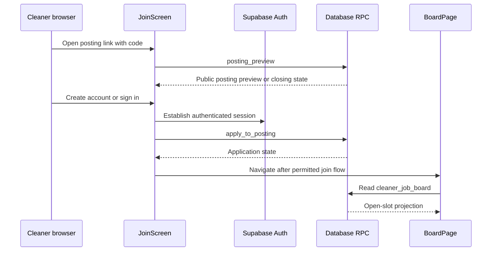
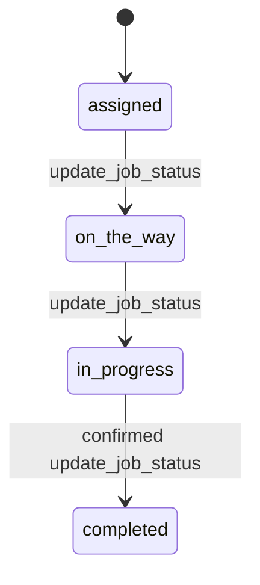

# Cleaner App Join, Work, Offers, and Notifications

## Scope and runtime boundary

`apps/cleaner` is an implemented client-first Next.js application with static export, not a future placeholder. Its canonical routes are under `src/app/(localized)/[locale]/` for `en-AU` and `pt-BR`: `/[locale]/join?code=...`, `/[locale]/login`, protected `/[locale]/board`, `/[locale]/offers`, and `/[locale]/my-jobs`. The legacy tree redirects unprefixed URLs after resolving a saved profile preference, locale cookie, or browser language. `CleanerIntlProvider` supplies each locale catalog and `DocumentMetadata` keeps document locale metadata aligned. [Cleaner recruitment](recruitment.md) owns the postings and offers lifecycle; [data and security](../architecture/data-and-security.md) owns the database views and RPCs it consumes; [the product model](../product/domain-model.md) states the operational boundaries and future agenda/preferences/chat scope.

This shows the current browser-to-Supabase entry flow. `posting_preview` has a deliberately limited public shape, and `apply_to_posting` records recruitment state rather than authorizing browser access by itself; [cleaner recruitment](recruitment.md#public-postings-and-applications) explains the resulting CRM decisions.

## Join and access lifecycle

`JoinScreen` now normalizes a posting code and calls `posting_preview`, which returns an active expression-of-interest, one-off, or regular-work preview, or a closed reason. It can create/sign into an account, supports OAuth via `/[locale]/auth/callback`, and submits `apply_to_posting`; for a non-member this creates or reuses a company join request with a linked application, not an immediate pool membership. Its relationship display compares the visitor's join-request and membership rows with the preview's company name; because that preview currently omits `company_id`, the implementation rejects multi-company same-name ambiguity but cannot fully disambiguate a single same-named company. Keep that limitation explicit until the identity-based contract changes. The earlier cleaner invitation RPCs remain migration compatibility code, not the current user entry path.

The `(cleaner)` layout uses `useCleaner` to resolve the authenticated user and a cleaner `profiles` row before rendering child routes. Its redirect is a navigation gate, not a security control: `useCleaner` documents that RLS, `cleaner_*` views, and security-definer RPCs enforce data access. On an error that `isStaleSessionError` recognizes, the hook signs out locally to prevent a rejected session from retrying indefinitely. The analogous CRM server-session recovery is documented in [CRM runtime](../architecture/crm-runtime.md).

## Open-jobs board, applications, and privacy contract

`BoardPage` reads only `cleaner_job_board`, orders by `scheduled_start`, and maps the database rows through `toVacancies`. Its explicit `boardColumns` contract includes job/company/site labels, suburb, localized service label inputs, time/duration, cleaner pay, crew size, slot number, and the caller's `my_application_status`. It deliberately omits address, access notes, client phone, and client charge. The board is therefore a cleaner-facing projection of the open numbered crew slots described in [job dispatch](job-dispatch.md), not a direct read of company tables.

A card invokes `apply_to_job` or `withdraw_application`, remains busy while the RPC is in flight, and then re-reads the board rather than assuming an optimistic result. Read tickets ensure that a slower older reload cannot overwrite a newer mutation's snapshot. An applied status survives a reload because it is held in the view's database projection. Error placement is state-aware: a disappeared job gets a page notice, an unchanged card gets an inline error, and a changed card presents the refreshed truth. SQL/RPC semantics and first-accept behavior remain owned by [data and security](../architecture/data-and-security.md).

The client must keep this limited select list when the card changes. If a new field is needed, first establish a cleaner-specific database projection or RPC and its RLS/grant behavior; do not broaden the board query to internal company tables. This keeps the assignment-gated information rule explained in [the product model](../product/domain-model.md#product-laws).

## Directed offers, notification bell, and optional device upgrades

The protected `/offers` route reads `cleaner_offers` with an explicit privacy allow-list: company/site/suburb/service, work time/duration, cleaner pay, crew size, status, and recurring schedule fields only. It invokes `accept_offer` or `decline_offer`, then re-reads with the same ticket ordering used by the board. Acceptance links the cleaner to `/my-jobs`; expected RPC failures distinguish lost access, a no-longer-pending offer, unavailable series, no open slot, and time conflict. The CRM creates and revokes these directed one-off and series offers through the lifecycle documented in [cleaner recruitment](recruitment.md#directed-job-and-series-offers).

The cleaner layout also hosts a notification bell. `toCleanerNotifications` accepts only cleaner-addressed `job_posted`, `job_assigned`, `job_cancelled`, and `payment_marked_paid` rows from `cleaner_notifications`; it deliberately excludes `application_received`, which is an employee notification even when an account also cleans for that company. The kind determines the destination: a posting opens `/board`, while assigned, cancelled, and payment news open `/my-jobs`. Unknown kinds are dropped rather than shown without localized copy.

`manifest.ts`, `InstallPrompt`, `src/lib/install.ts`, the service worker, and `src/lib/push.ts` provide progressive PWA/device capabilities. The install prompt is offered only after the browser emits `beforeinstallprompt` and a local decline suppresses repeat prompts. Push support checks browser capability and `NEXT_PUBLIC_VAPID_PUBLIC_KEY`, saves/removes subscriptions through `save_push_subscription`/`delete_push_subscription`, and treats permission, registration, storage, and persistence failures as non-blocking. These additions implement the optional wrapper-ready boundary described in [the product model](../product/domain-model.md#future-cleaner-surface-adr-0004), not a prerequisite for joining or working.

## My Jobs and operational access

`MyJobsPage` reads the similarly restricted `cleaner_my_jobs` view. It lists the cleaner's assigned jobs without address or access notes. A separate `get_cleaner_job_access` call is made only when the cleaner requests those details, so assignment-gated operational information is not preloaded with the list. `update_job_status` allows the card lifecycle mirrored by `toJobAction`: `assigned` to `on_the_way`, then `in_progress`, then confirmed `completed`. The final confirmation is deliberately required because completion writes the pay-ledger consequence in the database transaction. The UI arms only one completion confirmation at a time for four seconds and re-reads after all status mutations to surface concurrent changes.

This is the client-visible RPC transition subset; `draft` and `posted` assignments wait for a full crew, while cancelled and completed jobs do not remain in `cleaner_my_jobs` cards.

## Change navigation and validation

| Change | Start here | Preserve | Focused validation |
|---|---|---|---|
| Locale-prefixed routes, legacy redirects, messages, or language switcher | `src/app/(localized)/[locale]/`; `src/app/(legacy)/`; `src/i18n/{config,provider,messages}.ts`; `components/{language-switcher,legacy-locale-redirect}.tsx` | Canonical links retain the current locale; a legacy redirect chooses profile preference, then cookie, then browser language. | `pnpm --filter cleaner test:run -- src/i18n/config.test.ts src/i18n/catalogue.test.ts`; conditional journey check: `pnpm cleaner test:e2e -- f15-cleaner-i18n.spec.ts`. |
| Join form, posting preview/application, OAuth callback, or field validation | `src/app/(localized)/[locale]/join/join-screen.tsx`; `src/app/(localized)/[locale]/(auth)/callback/`; `src/features/join/{posting,schema}.ts` | Preview state is derived from the normalized posting code; a successful application is not an admission. Preserve the explicit same-named-company ambiguity limitation until the RPC supplies identity. | `pnpm --filter cleaner test:run -- src/features/join/posting.test.ts src/features/join/schema.test.ts`; run `cle-19-join.spec.ts` for user-journey changes. |
| Cleaner route gate or stale-session handling | `src/app/(localized)/[locale]/(cleaner)/layout.tsx`; `src/lib/auth/use-cleaner.ts`; `src/lib/auth/{access,session-error}.ts` | UX redirects do not replace RLS or RPC authorization. | `pnpm --filter cleaner test:run -- src/lib/auth/access.test.ts src/lib/auth/session-error.test.ts` |
| Board cards, applications, formatting, or empty/error state | `src/app/(localized)/[locale]/(cleaner)/board/`; `board/{application,model,format,types}.ts` | `boardColumns` remains privacy-minimized; mutation completion re-reads the database and rejects stale response ordering. | `pnpm --filter cleaner test:run -- src/features/board/application.test.ts src/features/board/model.test.ts`; run `cle-20-board.spec.ts` or `cle-21-apply.spec.ts` for visible journey changes. |
| Directed offers, accept/decline state, or offer card fields | `src/app/(localized)/[locale]/(cleaner)/offers/`; `src/features/offers/{application,format,types}.ts` | Keep the privacy allow-list and re-read after each resolution; only database RPCs decide availability. | `pnpm --filter cleaner test:run -- src/features/offers/application.test.ts`; run the adjacent page test for UI changes. |
| Notification kind, destination, or bell UI | `src/features/notifications/model.ts`; `components/notification-bell.tsx`; cleaner layout | A kind—not shared account identity—decides whether cleaner UI sees a row; unknown kinds are not rendered. | `pnpm --filter cleaner test:run -- src/features/notifications/model.test.ts`; conditional journey: `pnpm cleaner test:e2e -- cle-90-notification-bell.spec.ts`. |
| Install prompt, manifest, service worker, or push subscription | `src/app/manifest.ts`; `components/{install-prompt,push-opt-in-prompt}.tsx`; `src/lib/{install,push}.ts`; `public/sw.js` | Device upgrades cannot gate board/join flow; never document or expose VAPID secret material. | `pnpm --filter cleaner test:run -- src/lib/install.test.ts src/lib/push.test.ts src/service-worker.test.ts`; run `pnpm --filter cleaner build` only for static-export/deploy output changes. |
| Posting, offer, membership, board, application, or My Jobs data contract | `packages/db/supabase/migrations/`; generated `packages/db/src/database.types.ts` | RPC grants, posting/application state checks, active membership filtering, first-accept semantics, and cleaner-only projections. | `pnpm db:test`; then `pnpm cleaner db:types && pnpm --filter cleaner typecheck` if the generated contract changes. |

Use `pnpm --filter cleaner build` only when static-export or deployment-facing route configuration changes. `pnpm test:e2e` and `pnpm check` are broader conditional checks, appropriate for cross-app release confidence rather than a local formatter or model change.
