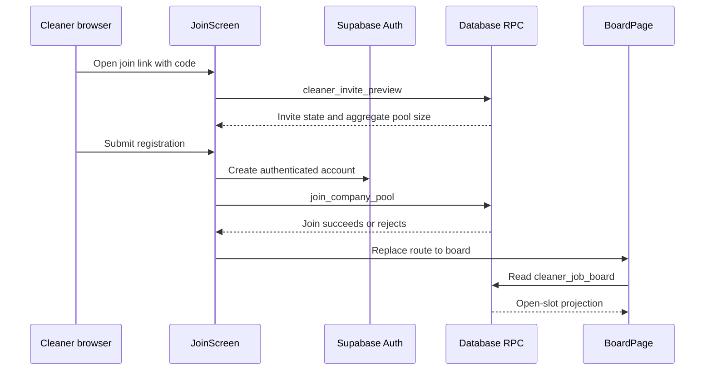
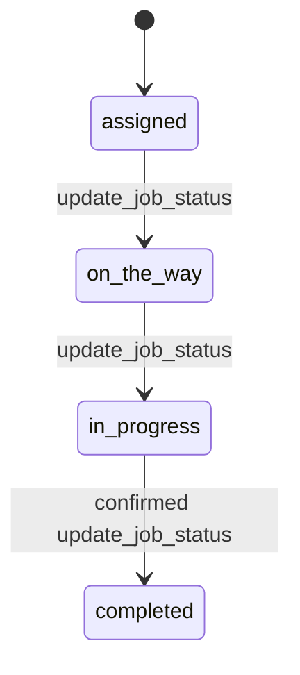

# Cleaner App Join and Open-Jobs Board

## Scope and runtime boundary

`apps/cleaner` is an implemented client-first Next.js application with static export, not a future placeholder. Its canonical routes are under `src/app/(localized)/[locale]/` for `en-AU` and `pt-BR`: `/[locale]/join?code=...`, `/[locale]/login`, protected `/[locale]/board`, and protected `/[locale]/my-jobs`. The legacy tree redirects unprefixed URLs after resolving a saved profile preference, locale cookie, or browser language. `CleanerIntlProvider` supplies each locale catalog and `DocumentMetadata` keeps document locale metadata aligned. [Data and security](../architecture/data-and-security.md) owns the database views and RPCs it consumes; [the product model](../product/domain-model.md) states the operational boundaries and future agenda/preferences/chat scope.

This shows the implemented browser-to-Supabase flow. `cleaner_invite_preview` intentionally returns company name and aggregate pool size before sign-in; `join_company_pool` locks and validates the invite before changing pool membership.

## Join and access lifecycle

`JoinScreen` normalizes the `code` search parameter, calls `cleaner_invite_preview`, and renders a ready, missing-code, or problem state. It validates registration fields with `registrationSchema`, creates the Auth account, then calls `join_company_pool` with name, phone, and suburb. A sign-up without a session is treated as pending email confirmation rather than a pool join. The RPC rejects unauthenticated callers, non-cleaner roles, invalid/revoked/expired codes, and a previously removed membership; it records the supplied profile details and performs the membership insert atomically.

The `(cleaner)` layout uses `useCleaner` to resolve the authenticated user and a cleaner `profiles` row before rendering child routes. Its redirect is a navigation gate, not a security control: `useCleaner` documents that RLS, `cleaner_*` views, and security-definer RPCs enforce data access. On an error that `isStaleSessionError` recognizes, the hook signs out locally to prevent a rejected session from retrying indefinitely. The analogous CRM server-session recovery is documented in [CRM runtime](../architecture/crm-runtime.md).

## Open-jobs board, applications, and privacy contract

`BoardPage` reads only `cleaner_job_board`, orders by `scheduled_start`, and maps the database rows through `toVacancies`. Its explicit `boardColumns` contract includes job/company/site labels, suburb, localized service label inputs, time/duration, cleaner pay, crew size, slot number, and the caller's `my_application_status`. It deliberately omits address, access notes, client phone, and client charge. The board is therefore a cleaner-facing projection of the open numbered crew slots described in [job dispatch](job-dispatch.md), not a direct read of company tables.

A card invokes `apply_to_job` or `withdraw_application`, remains busy while the RPC is in flight, and then re-reads the board rather than assuming an optimistic result. Read tickets ensure that a slower older reload cannot overwrite a newer mutation's snapshot. An applied status survives a reload because it is held in the view's database projection. Error placement is state-aware: a disappeared job gets a page notice, an unchanged card gets an inline error, and a changed card presents the refreshed truth. SQL/RPC semantics and first-accept behavior remain owned by [data and security](../architecture/data-and-security.md).

The client must keep this limited select list when the card changes. If a new field is needed, first establish a cleaner-specific database projection or RPC and its RLS/grant behavior; do not broaden the board query to internal company tables. This keeps the assignment-gated information rule explained in [the product model](../product/domain-model.md#product-laws).

## My Jobs and operational access

`MyJobsPage` reads the similarly restricted `cleaner_my_jobs` view. It lists the cleaner's assigned jobs without address or access notes. A separate `get_cleaner_job_access` call is made only when the cleaner requests those details, so assignment-gated operational information is not preloaded with the list. `update_job_status` allows the card lifecycle mirrored by `toJobAction`: `assigned` to `on_the_way`, then `in_progress`, then confirmed `completed`. The final confirmation is deliberately required because completion writes the pay-ledger consequence in the database transaction. The UI arms only one completion confirmation at a time for four seconds and re-reads after all status mutations to surface concurrent changes.

This is the client-visible RPC transition subset; `draft` and `posted` assignments wait for a full crew, while cancelled and completed jobs do not remain in `cleaner_my_jobs` cards.

## Change navigation and validation

| Change | Start here | Preserve | Focused validation |
|---|---|---|---|
| Locale-prefixed routes, legacy redirects, messages, or language switcher | `src/app/(localized)/[locale]/`; `src/app/(legacy)/`; `src/i18n/{config,provider,messages}.ts`; `components/{language-switcher,legacy-locale-redirect}.tsx` | Canonical links retain the current locale; a legacy redirect chooses profile preference, then cookie, then browser language. | `pnpm --filter cleaner test:run -- src/i18n/config.test.ts src/i18n/catalogue.test.ts`; conditional journey check: `pnpm cleaner test:e2e -- f15-cleaner-i18n.spec.ts`. |
| Join form, invite messages, or field validation | `src/app/(localized)/[locale]/join/join-screen.tsx`; `src/features/join/{invite,schema}.ts` | Preview state is derived from the normalized code and a pool join happens only after a successful Auth session. | `pnpm --filter cleaner test:run -- src/features/join/invite.test.ts src/features/join/schema.test.ts`; run `cle-19-join.spec.ts` for user-journey changes. |
| Cleaner route gate or stale-session handling | `src/app/(localized)/[locale]/(cleaner)/layout.tsx`; `src/lib/auth/use-cleaner.ts`; `src/lib/auth/{access,session-error}.ts` | UX redirects do not replace RLS or RPC authorization. | `pnpm --filter cleaner test:run -- src/lib/auth/access.test.ts src/lib/auth/session-error.test.ts` |
| Board cards, applications, formatting, or empty/error state | `src/app/(localized)/[locale]/(cleaner)/board/`; `board/{application,model,format,types}.ts` | `boardColumns` remains privacy-minimized; mutation completion re-reads the database and rejects stale response ordering. | `pnpm --filter cleaner test:run -- src/features/board/application.test.ts src/features/board/model.test.ts`; run `cle-20-board.spec.ts` or `cle-21-apply.spec.ts` for visible journey changes. |
| My Jobs cards, address reveal, or status transitions | `src/app/(localized)/[locale]/(cleaner)/my-jobs/`; `features/my-jobs/{access,status,model}.ts` | Address/access notes arrive only through `get_cleaner_job_access`; completion is confirmed and database-backed. | `pnpm --filter cleaner test:run -- src/features/my-jobs/access.test.ts src/features/my-jobs/status.test.ts`; run `cle-24-my-jobs.spec.ts` for the journey. |
| Invite, membership, board, application, or My Jobs data contract | `packages/db/supabase/migrations/`; generated `packages/db/src/database.types.ts` | RPC grants, invite status checks, active membership filtering, first-accept semantics, and cleaner-only projections. | `pnpm db:test`; then `pnpm cleaner db:types && pnpm --filter cleaner typecheck` if the generated contract changes. |

Use `pnpm --filter cleaner build` only when static-export or deployment-facing route configuration changes. `pnpm test:e2e` and `pnpm check` are broader conditional checks, appropriate for cross-app release confidence rather than a local formatter or model change.
