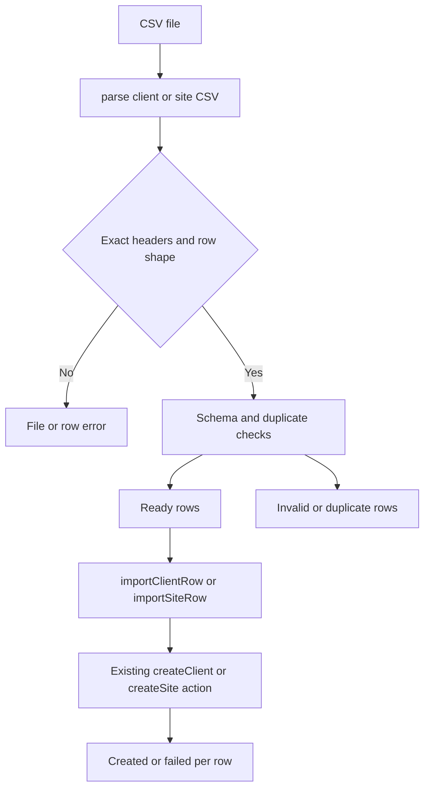

# Client and Site CSV Import

## Purpose and flow

The protected `/clients/import` page loads the complete company-scoped client list and its site names before rendering `ImportWorkspace`. Import is a safety-oriented preview flow: it parses a local CSV, labels each row ready, duplicate, or invalid, and submits only ready rows. This is an onboarding convenience over the existing client/site creation behavior, not a bulk database API. It depends on [CRM runtime](../architecture/crm-runtime.md) for `requireCompanyAdmin` and delegated create actions, and creates the client/site prerequisites consumed by [job dispatch](job-dispatch.md).

The preview prevents known bad rows from reaching the server, but server actions revalidate every submitted row. A failure in one ready row is reported independently and does not prevent later rows from being attempted.

## File contract and duplicate rules

`parseClientImportCsv` requires, in order, `name, contact_name, phone, notes`. `parseSiteImportCsv` requires `client_name, name, address, suburb, access_notes`. The parser accepts quoted CSV cells and escaped quotes, rejects unclosed quotes, strips a UTF-8 BOM from the first header, ignores empty lines, and requires the exact header list and exact number of columns.

Both parsers use the normal client/site schemas after trimming field values. Client names are compared case-insensitively using the `en-AU` locale against company data and earlier file rows. Site import additionally resolves `client_name` to exactly one loaded client; a missing or ambiguous name is invalid. A site is duplicate when that client already has the normalized site name or the same client-and-site pair appeared earlier in the file. `serialiseImportRows` escapes values while creating the failure/download CSV with the same header contract.

Templates at `apps/crm/public/templates/clients-import.csv` and `sites-import.csv` are public file contracts. Change templates, the parser header constants, UI column descriptions, and `csv.test.ts` together when adding or renaming a column.

## Authorization and persistence boundary

The page uses `requireCompanyAdmin`, then scopes its client query by `company_id` and its site query through `clients!inner(company_id)`. `importClientRow` and `importSiteRow` only adapt typed preview inputs back to `FormData`; they validate using `createClientSchema` or `createSiteSchema` and delegate to `createClient` or `createSite`. Those established actions own final authorization, persistence, error shape, and cache effects. Do not replace this with a browser-side table write or assume the preview's initial company snapshot is still current when submit occurs.

## Change navigation and validation

| Change | Implementation surface | Focused tests | Minimal validation |
|---|---|---|---|
| CSV grammar, headers, duplicate classification, or failure-file serialization | `apps/crm/src/features/import/csv.ts` | `src/features/import/csv.test.ts` includes quoted cells, malformed files, existing/in-file duplicates, ambiguous clients, and serialized output. | `pnpm --filter crm test:run -- src/features/import/csv.test.ts` |
| Preview, progress, per-row recovery, or download UI | `src/app/[locale]/(crm)/clients/import/import-workspace.tsx` | `import-workspace.test.tsx` covers preview and import interaction; retain its independent-row recovery cases. | `pnpm --filter crm test:run -- "src/app/[locale]/(crm)/clients/import/import-workspace.test.tsx"` |
| Server adaptation or action result mapping | `src/app/actions/import.ts` | `src/app/actions/import.test.ts` | `pnpm --filter crm test:run -- src/app/actions/import.test.ts` |
| Company-scoped initial data or route behavior | `src/app/[locale]/(crm)/clients/import/page.tsx` | `import/page.test.tsx` | `pnpm --filter crm test:run -- "src/app/[locale]/(crm)/clients/import/page.test.tsx"` |

Run `pnpm --filter crm typecheck` if import types, action signatures, or route data change. A CSV/UI-only change does not normally need `pnpm db:test`; escalate only when the delegated client/site persistence contract or its migration changes.
