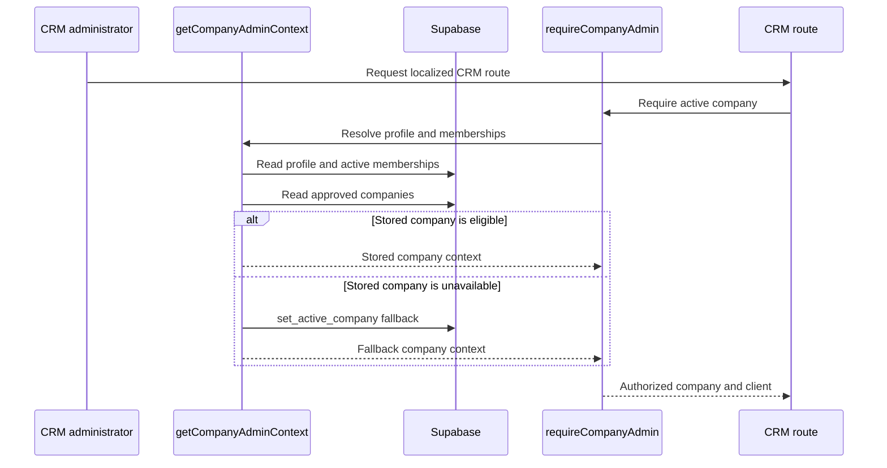

# Company Membership, Active Context, and Team Administration

## Runtime ownership

The CRM's tenant boundary is membership-based. `getCompanyAdminContext` in `apps/crm/src/lib/auth/session.ts` resolves the authenticated profile, its active `employee_memberships`, and the corresponding approved `companies`. It selects `profiles.last_active_company` when it remains active and approved, otherwise falls back to the first eligible membership and persists that selection through `set_active_company`. `requireCompanyAdmin` turns a missing, inactive, or unapproved context into the localized `/no-company-access` route; `requireCompanyOwner` adds the owner-role requirement.

This context is consumed by [CRM runtime](../architecture/crm-runtime.md): its pages must use the returned `company.id` as an explicit read predicate, while [data and security](../architecture/data-and-security.md) supplies the RLS/RPC enforcement beneath that application guard.

## Switching and creating companies

`CompanySwitcher` submits to `switchActiveCompany` in `apps/crm/src/app/actions/active-company.ts`. The action validates a UUID, calls `set_active_company`, invalidates the root layout, then redirects to the localized roster. The RPC, not the client control, decides whether the profile can select that company.

The `/companies/new` route uses `CompanyCreationForm` and `createCompanyAction`. After `parseCompanyCreation` validates name and ABN, the action requires an existing company-admin context and calls `create_company`; a successful response invalidates the layout and redirects to onboarding. The owning migration is `20260821100000_company_creation.sql`, with `company_creation.test.sql` covering the database contract. First company access is bootstrapped separately through `invite:first-admin`, the localized acceptance/confirmation routes, and the CLE-80 migration/tests; it is an operator-controlled invitation path rather than public company signup. This is a shipped membership surface: changing an RPC or schema also requires regenerated `packages/db/src/database.types.ts` and the consumer typecheck described in [data and security](../architecture/data-and-security.md#rpc-and-policy-change-surface).

## Employee invitations and management

Settings separates invitation delivery from membership changes. `createEmployeeInvitationAction` in `apps/crm/src/app/actions/employee-invitations.ts` requires an owner, prepares the database invitation, and sends localized delivery through `sendResendEmailBatches`; the acceptance route completes the membership-side flow. Existing accounts receive a sign-in/acceptance link; new accounts use the localized path-shaped confirmation route `/{locale}/auth/confirm/{invitationId}` so Auth can append its token safely. The acceptance UI names pending, accepted, expired, replaced, and revoked states, supports requesting a fresh link, and allows a failed acceptance to retry toward the same invitation outcome. A delivery failure revokes the prepared invitation rather than presenting it as usable; a usable login means a confirmed address and password, not merely an existing Auth row.

Hosted Auth configuration is dashboard-managed, so `scripts/check-hosted-auth.mjs` is a read-only release guard rather than a config-push mechanism. It checks the deployed settings against local non-secret expectations, including OTP expiry, signup mode, mailer behavior/rate limit, production site URL, locale confirmation redirects, and localized template subjects. [Daily internal release](../operations/daily-release.md) runs this guard in its broad check tier.

`changeEmployeeRoleAction` and `removeEmployeeAction` require an owner and call `change_employee_role` or `remove_employee` with the resolved active company. Both invalidate localized `/settings`. Their stable user-facing special case is the database constraint that a company must retain at least one active owner; do not replace this RPC-level check with UI-only disabling.

## Change recipe and focused checks

| Change | Start with | Preserve | Focused checks |
|---|---|---|---|
| Session selection, no-company handling, or company-scoped route context | `src/lib/auth/session.ts`, `src/lib/auth/access.ts` | Only active memberships of approved companies form a context; fallback selection is persisted. | `pnpm --filter crm test:run -- src/lib/auth/session.test.ts src/lib/auth/guard.test.ts` |
| Company switcher or company creation form/action | `components/company-switcher.tsx`, `app/actions/{active-company,company-creation}.ts`, `features/company-creation/` | UUID/input validation occurs before the RPC; layout invalidation makes the new selection visible. | Adjacent action/component test, then `pnpm --filter crm typecheck` if signatures/types change. |
| Employee invitation composition, delivery, confirmation, or acceptance | `app/actions/employee-invitations.ts`, `app/[locale]/(auth)/auth/confirm/[[...invitation]]/`, `app/[locale]/(auth)/invite/accept/`, `lib/resend.ts` | Owner authorization; path-shaped locale-aware confirmation redirects; named lifecycle states; delivery failure does not leave a live invitation; existing Auth record is not enough without a usable login. | `pnpm --filter crm test:run -- src/app/actions/employee-invitations.test.ts src/app/[locale]/(auth)/auth/confirm/[[...invitation]]/route.test.ts`; conditional journey checks: `pnpm crm test:e2e -- cle-83-employee-invitations.spec.ts cle-106-invitation-journeys.spec.ts`. |
| Hosted Auth expectation or redirect allow-list guard | `scripts/check-hosted-auth.mjs`, `scripts/check-hosted-auth.test.mjs`, non-secret `packages/db/supabase/config.toml` | The script reads hosted state and never pushes local config; all actual app redirect shapes remain covered. | `pnpm test:hosted-auth`; run the hosted release workflow only when changing deployed Auth/release configuration. |
| Role/removal semantics or membership schema | `app/actions/employee-management.ts`, `features/employee-management/`, migrations `20260820120000_cle_84_employee_management.sql` and `20260820090000_cle_81_membership_identity.sql` | Owner-only management and the at-least-one-active-owner constraint. | `pnpm --filter crm test:run -- src/app/actions/employee-management.test.ts`; `pnpm db:test` for RPC/RLS/schema changes. |

Run the acceptance suites only for the consumer-visible login, switching, invitation, or settings journey. A component change ordinarily does not require `pnpm check`; an RPC, migration, or generated contract change does require the database workflow and type generation from [data and security](../architecture/data-and-security.md).
