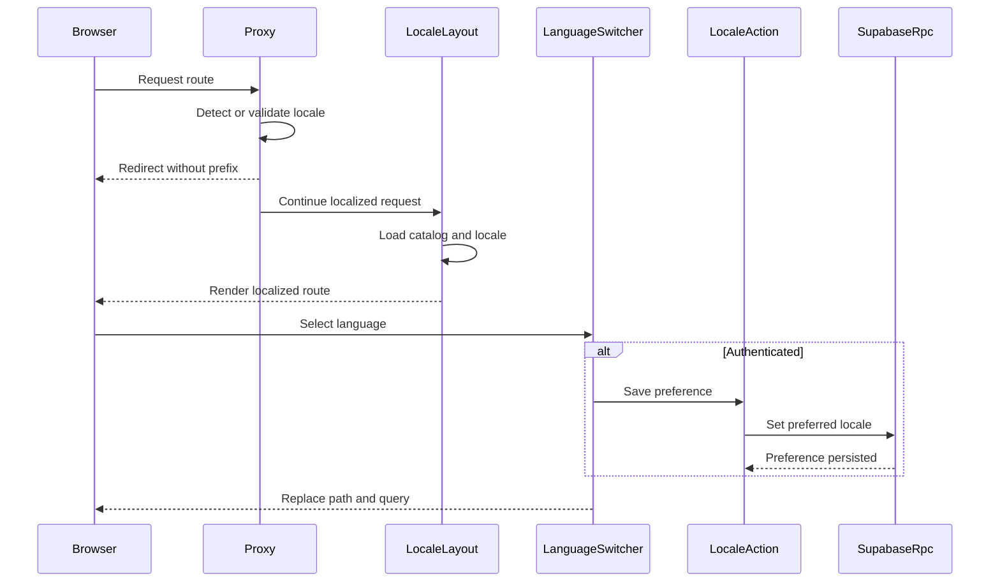

# Bilingual CRM Routing and Locale Preference

## When to consult this page

Use this page for CRM copy, routes, translated errors, date/number formatting, locale selection, or persisted-language changes. The request/runtime boundary is owned by [CRM runtime](../architecture/crm-runtime.md); the preference enum, RPC, authorization, and generated database contract are owned by [data and security](../architecture/data-and-security.md). Product-level non-negotiables are canonical in [the product model](../product/domain-model.md), while command ownership and validation tiers are maintained in [the workspace reference](../workspace.md).

## Route and selection lifecycle

`apps/crm/src/i18n/config.ts` defines the complete supported set: `en-AU` is the default and `pt-BR` is the other supported locale. `routing` in `src/i18n/routing.ts` uses `localePrefix: "always"`, a one-year `NEXT_LOCALE` cookie, and locale detection. Thus the physical CRM routes live only under `apps/crm/src/app/[locale]/`: unprefixed paths are not a second route tree.



This sequence shows locale routing ahead of auth-cookie refresh, then the optional authenticated preference write. `proxy` performs locale routing before creating the Supabase client; a locale redirect therefore does not attempt an auth refresh. On a continuing request it refreshes Supabase cookies and only treats known stale/missing-session errors as recoverable. `LocaleLayout` validates the route locale, calls `setRequestLocale`, loads the matching file in `apps/crm/messages/`, and provides it through `NextIntlClientProvider`. The root layout sets `<html lang>` from the request locale.

## Switcher and login contracts

`LanguageSwitcher` is present before sign-in on `...[locale]/(auth)/login` and, for company admins, in `...[locale]/(crm)/settings`. It uses locale-aware `usePathname`/`useRouter` imports so `router.replace` preserves the current logical pathname and query while changing only the locale prefix. Before replacement it captures named inputs, selects, textareas, checkboxes/radios, and file inputs; after remount it restores values and dispatches input/change events. Do not replace this with a raw full-page URL assignment without retaining that usability contract.

For an unauthenticated selection, next-intl writes the routing cookie; no profile write occurs. For an authenticated settings selection, `setPreferredLocaleAction` rejects unsupported values locally and calls `set_preferred_locale`. It leaves the current view intact and reports an error if the RPC fails. The RPC locks and updates only `auth.uid()`'s profile, is idempotent for unchanged values, rejects anonymous/missing-profile callers, and is the only supported mutation path.

`signInAction` reads `profiles.preferred_locale` after successful authentication. It redirects an authorized administrator to the saved valid locale; otherwise it retains the request locale when valid, then falls back to `en-AU`. Sign-out keeps the current valid locale for its login redirect. These action decisions connect locale preference to the [company-admin access guard](../architecture/crm-runtime.md#company-scoping-and-mutations), but do not weaken it.

## Formatting, messages, and cache invalidation

`src/i18n/request.ts` loads the catalog dynamically and fixes the request timezone to `Australia/Brisbane`. F15 requires translation of first-party CRM text, validation, and error surfaces, but **not** changes to the Australian operating contract: monetary values remain AUD; schedule time remains `Australia/Brisbane`; `The Clean Crew` stays literal; and names, addresses, access instructions, and notes remain as entered. Add parallel keys with matching ICU argument shapes to both `messages/en-AU.json` and `messages/pt-BR.json`; do not automatically translate stored data.

State-changing CRM actions use `revalidateLocalizedPath` rather than `revalidatePath` directly. For a non-root logical path it invalidates one page per supported locale—for example, both `/en-AU/jobs` and `/pt-BR/jobs`. The root layout is intentionally invalidated once. A new mutation must retain this localized cache behavior; see [job dispatch](job-dispatch.md#cache-and-failure-handling) for the current job-action consumers.

## Change recipe and validation

1. For a new visible string, add semantically identical catalog keys in both JSON files, preserve every ICU placeholder/type, and use `getTranslations` or `useTranslations` at the server/client boundary. Keep brand and user-authored values literal.
2. For a route, add it below `src/app/[locale]/`; use locale-aware navigation exports from `@/i18n/navigation`, not bare Next links/redirects when generating internal CRM URLs.
3. For a new mutation, translate user-facing errors through the existing i18n helpers and call `revalidateLocalizedPath` for each changed logical route. A localized cache refresh is part of mutation correctness.
4. For a new locale or preference behavior, update `config.ts`, routing, both complete catalogs, the `app_locale` migration/RPC and generated `Database` type, all format assumptions, and tests. This is a cross-package/public runtime boundary, not a copy-only edit.

Start with quiet focused checks:

```sh
pnpm --filter crm test:run -- src/i18n-configuration.test.ts src/i18n/catalogue.test.ts src/i18n/revalidate.test.ts src/components/language-switcher.test.tsx
```

Run `pnpm --filter crm test:run -- src/app/actions/{auth,locale}.test.ts` when login redirect or preference-action behavior changes. Run `pnpm --filter crm typecheck` after route, component, message typing, or navigation changes. For database preference changes run `pnpm db:test`, then `pnpm crm db:types && pnpm --filter crm typecheck`; this verifies both the authoritative SQL contract and its CRM import surface. `pnpm --filter crm test:e2e -- f15-crm-i18n.spec.ts` is conditional: use it for cross-route language switching, browser form preservation, or translated error/404 behavior. Use `pnpm --filter crm build` only when changing deployment-facing routing or Next configuration.
