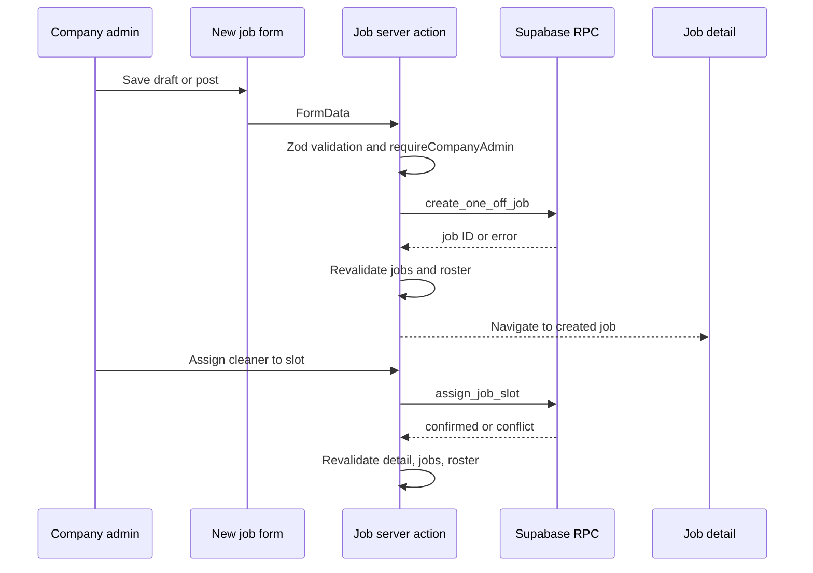
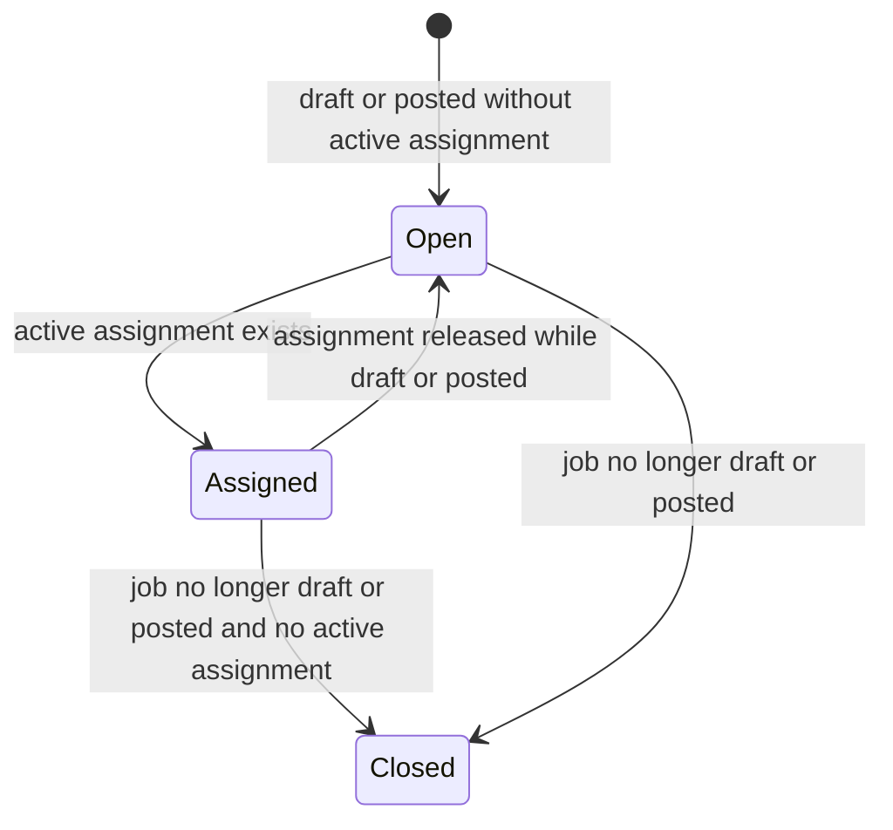

# One-Off Job Creation and Crew-Slot Dispatch

## What is implemented

Company admins can create one-off jobs from `/jobs/new`, choose a client/site/service, customise site defaults, save as draft or post immediately, view the job at `/jobs/[jobId]`, assign a cleaner to a numbered crew slot, and cancel a job. The CRM action layer delegates persistence and concurrency-sensitive rules to Supabase RPCs. This workflow depends on [CRM runtime](../architecture/crm-runtime.md) for authorization/company scope and [data and security](../architecture/data-and-security.md) for database contracts.

## Creation contract

`apps/crm/src/app/[locale]/(crm)/jobs/new/page.tsx` loads company-owned clients/sites plus active services and gives `NewJobForm` the site defaults. The page blocks creation when no site or active service exists. `createOneOffJob` in `apps/crm/src/app/actions/jobs.ts` parses browser `FormData` with `oneOffJobSchema` and invokes `create_one_off_job` with site, service, local date/time, duration in minutes, cleaner pay in cents, crew size, draft/post mode, and optional charge/notes.

`apps/crm/src/features/jobs/schema.ts` is the browser trust boundary. It requires valid identifiers and date/time, duration greater than zero, cleaner pay greater than zero, `crewSize >= 1`, and at most 2,000 note characters. It converts AUD strings to integer cents and duration hours to rounded minutes before the RPC. If form validation evolves, keep this conversion contract, the RPC parameters, and the SQL test in sync; client-side validation does not replace database authorization or constraints.

A mutation with an uncertain transport result (`catch`, status `0`, or no returned ID) deliberately reports that save/assignment confirmation failed and revalidates consumers where applicable. It must not claim success from an unconfirmed response.

## Crew-slot lifecycle

`buildJobSlots` is the canonical presentation projection in `apps/crm/src/features/jobs/model.ts`. It creates slots `1..crewSize`, finds the active assignment (`unassignedAt === null`) for each number, and preserves the latest released assignment as history. A slot state is:

The projection has two important boundaries: it does not invent a new slot beyond `crewSize`, and it only marks an empty slot `open` while the job status is `draft` or `posted`; empty slots on another status are `closed`. The detail page reads assignment history, applications, active company-pool cleaners, and site preference ranks; it removes currently assigned cleaners from the pool candidates and deterministically orders applicants/candidates by preferred rank, then time/name/id as appropriate.

`assignJobSlot` validates `jobId`, slot number, and cleaner UUID, authorizes with `requireCompanyAdmin`, then calls `assign_job_slot`. It maps known database outcomes—unavailable cleaner, already-assigned slot/cleaner, or non-open job—to a refreshed-conflict message. The database must remain the authority on time overlap, slot availability, and status under concurrent calls; application sorting/presentation cannot enforce those rules. CRM review can also fill a named slot through the distinct `approve_job_application` flow, and directed offers can result in assignment; those recruitment routes are documented in [cleaner recruitment](recruitment.md) rather than being alternative implementations of direct dispatch.

## Cache and failure handling

`revalidateJobConsumers` calls `revalidateLocalizedPath` for `/jobs/[jobId]`, `/jobs`, and `/roster`; `createOneOffJob` refreshes `/jobs` and `/roster` before an uncertain result and all three consumers after confirmed creation. Each logical consumer is therefore invalidated under every supported locale. `cancelJob` follows the same authorization/RPC/revalidation pattern. If adding another mutation that changes a job's status, crew, or assignment, include every derived screen that can display it. If a new consumer is introduced, make its invalidation relationship explicit and add a focused test; [bilingual CRM routing](crm-localization.md#formatting-messages-and-cache-invalidation) explains this localization boundary.

## Change recipe and validation

For a dispatch extension such as a new job status, slot transition, or assignment source:

1. Start with the database migration/RPC/policy and SQL test in [data and security](../architecture/data-and-security.md#rpc-and-policy-change-surface); do not encode critical transition logic only in React.
2. Regenerate `Database` types with `pnpm crm db:types`, update `JobStatus`/related types and action parameters, then prove the CRM import path with `pnpm --filter crm typecheck`.
3. Update `buildJobSlots` when the externally visible slot lifecycle changes; cover active assignment, released history, unchanged assignment, every relevant job status, and independent slots in `apps/crm/src/features/jobs/model.test.ts`.
4. Update `oneOffJobSchema` and `apps/crm/src/features/jobs/schema.test.ts` if input shape or numeric conversion changes. Update `apps/crm/src/app/actions/jobs.test.ts` for RPC arguments, expected error mapping, and revalidation.
5. Run the narrow CRM action test: `pnpm --filter crm test:run -- src/app/actions/jobs.test.ts`. Add the model/schema test path when that layer changed. Run `pnpm db:test` for migration/RPC/RLS/seed changes (Docker/Supabase required).

A form styling-only change normally needs its component test, not the full database suite. Conversely, an RPC change is incomplete after an SQL pass until the action and the `@clean-app/db` type consumer are validated.
