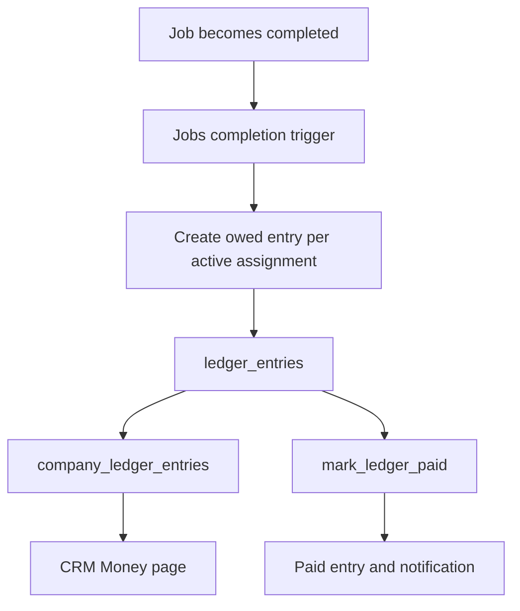

# Company Pay Ledger

## What the ledger records

The CRM `/money` route is read-only. `MoneyPage` requires a company administrator, retrieves the `company_ledger_entries` projection in count-checked pages, and passes the complete result to `buildCompanyMoneyLedger`. The model validates every row, then totals positive amounts by `owed` and `paid` status. The page explicitly states the product boundary: The Clean Crew records settlement and never moves money. That law is also maintained in [the product model](../product/domain-model.md#product-laws).

The job completion transition owns entry creation. The Money page consumes a company-admin projection; it does not calculate or mutate payments in the browser.

## Database lifecycle and integrity

`20260812101000_cle_50_pay_ledger_foundations.sql` creates `ledger_entries` with a unique `(job_id, cleaner_id)` key, a positive `amount_cents`, and settlement fields consistent with the enum status. `backfill_completed_job_ledger_entries` inserts one owed record for every still-active assignment on a completed job; the completion trigger calls it, and the migration backfills already-completed jobs. The conflict rule makes this idempotent under repeat processing.

`protect_ledger_entry_history` prohibits changes to identity and amount. It also prevents `paid` returning to `owed` and freezes `paid_at` and `payment_note` once an entry is paid. `mark_ledger_paid` locks the entry, verifies company-admin access through its job/site/client ownership chain, accepts only `owed`, sets its settlement time/note, and creates one `payment_marked_paid` notification. The notification's ledger foreign key and partial unique index prevent duplicate settlement notifications.

The `ledger_entries` table itself is not a browser write surface. `company_ledger_entries` is a security-barrier, company-admin view for CRM reads; `cleaner_ledger_entries` is a separate cleaner projection. Altering ledger access means updating [data and security](../architecture/data-and-security.md), including grants and the generated `Database` contract, rather than adding direct table access.

## CRM read contract

The route requests an exact count and loops in batches of 1,000 until it has the full ordered collection. It fails rather than render a partial ledger if a read errors, no exact count arrives, or the count changes during the traversal. `buildCompanyMoneyLedger` repeats the complete-set assertion and schema validation. Preserve this behavior when changing pagination or adding a filter: totals must never silently represent an incomplete company ledger.

## Change navigation and validation

| Change | Start here | Required evidence | Focused validation |
|---|---|---|---|
| CRM display, validation, grouping, or totals | `apps/crm/src/app/[locale]/(crm)/money/{page,money-list}.tsx`; `src/features/money/{model,format,types}.ts` | Keep the complete-read assertion and positive amount/status schema. | `pnpm --filter crm test:run -- src/features/money/model.test.ts "src/app/[locale]/(crm)/money/page.test.tsx"` |
| Entry creation, history protection, settlement, notification, or views | `packages/db/supabase/migrations/20260812101000_cle_50_pay_ledger_foundations.sql` | Update SQL cases for completion/backfill, idempotence, transitions, authorization, and notification uniqueness. | `pnpm db:test` (includes `cle_50_pay_ledger.test.sql` and the registered concurrency probe) |
| Database projection/type shape consumed by CRM | Migration plus `packages/db/src/database.types.ts` generated from local schema | Regenerate types and verify `company_ledger_entries` consumer compilation. | `pnpm crm db:types && pnpm --filter crm typecheck` |

A Money-page presentation change normally needs no database suite. Any trigger, view, RPC, policy, grant, or generated type change does: `pnpm db:test` is the narrow database boundary, while `pnpm check` is reserved for cross-surface or release validation.
