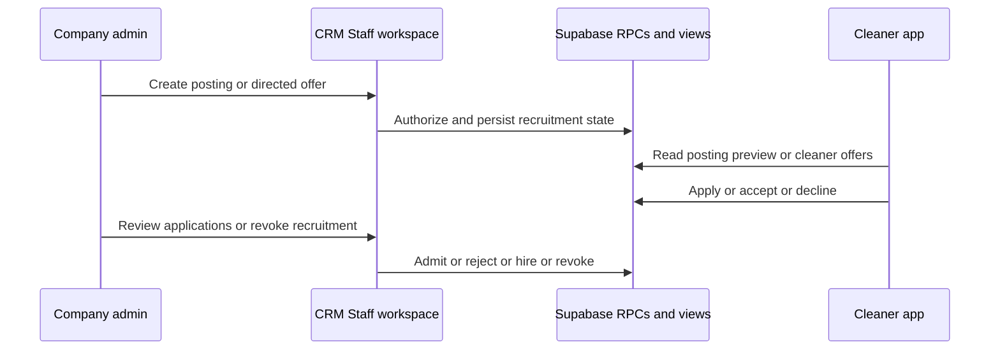

# Cleaner Recruitment: Postings, Applications, and Directed Offers

## Two recruitment paths

The CRM Staff workspace offers two complementary ways to fill work. A **posting** is a shareable public recruitment link: it may be an expression of interest, a future one-off vacancy, or an under-filled recurring assignment. A **directed offer** is work sent to a specific eligible cleaner, for a one-off job or a recurring series. Both paths ultimately depend on the job and assignment rules documented in [job dispatch](job-dispatch.md) and on the database contracts in [data and security](../architecture/data-and-security.md).

This diagram shows the separate CRM and cleaner surfaces meeting at database-owned recruitment state. Public posting access is intentionally narrower than authenticated cleaner offers.

## Public postings and applications

`/cleaners/postings/new` is a company-admin route. `PostingComposerPage` reads company-scoped upcoming `vacancies` and active under-filled `recurring_assignments`, then `PostingComposer` sends a discriminated `CreatePostingInput` to `createPosting`. `createPostingSchema` permits `expression_of_interest`, `one_time`, or `regular`; it validates an optional positive application cap, an optional Brisbane-offset expiry, and a public description limited to 2,000 characters. The server action calls `create_posting` with the resolved company ID and revalidates `/cleaners`; `revokePosting` uses `revoke_posting` and revalidates the same workspace.

A cleaner opens `/[locale]/join?code=...`. `JoinScreen` calls the public `posting_preview` RPC and parses only the active posting fields appropriate to its intent: company name and public description for expressions of interest; additionally suburb, service, duration, cleaner pay, and schedule for work. It never treats the preview as an authorization grant. An authenticated caller submits `apply_to_posting`: an existing active cleaner creates a work application where eligible, while a non-member creates or reuses a join request and its linked application. The Staff workspace can use `admit_join_request` or `reject_join_request` for pool admission, or `hire_posting_application` when hiring a candidate against work. The migration's `posting_closing_reason` produces the effective active/dead state, including expiry, revocation, capacity, completed recruitment, or unavailable work.

The public preview and cleaner recruitment UX must remain privacy-minimized. Do not add address, access notes, client identity/contact data, internal notes, or client charge to `posting_preview` or its client parser. The board and assigned-work disclosure rules remain canonical in [the cleaner app workflow](cleaner-app.md).

## Directed job and series offers

On a job detail, `offerJob` validates `jobOfferSchema`, requires company-admin context, calls `offer_job`, and always invalidates the job detail, jobs collection, and roster. `revokeJobOffer` follows the same pattern through `revoke_offer`. The job detail presents pending offers alongside crew-slot assignment/application information; its visible assignment lifecycle is documented in [job dispatch](job-dispatch.md#crew-slot-lifecycle).

The database also supports `offer_series` for recurring work. The cleaner `/[locale]/offers` route reads the dedicated `cleaner_offers` view with the explicit `offerColumns` allow-list. It separates pending offers from history and calls `accept_offer` or `decline_offer`; after either response it re-reads the view, uses request tickets to avoid old responses overwriting newer state, and maps known RPC conflicts rather than assuming success. The projection includes company/site/suburb, service, schedule, duration, cleaner pay, and crew size—never private client or operational-access fields.

Offer acceptance is not a browser-side reservation. The database decides whether the offer is still pending, the series remains available, a slot remains open, and the cleaner is available. A failure or unknown transport result must leave the UI dependent on a fresh read.

## Change recipe and validation

| Change | Start with | Preserve | Focused validation |
|---|---|---|---|
| Posting intent, composer input, target eligibility, cap, expiry, or public wording | `features/postings/{schema,model,types}.ts`; posting composer route; `app/actions/postings.ts` | The composer only lists the company’s future one-off vacancies and active under-filled series; public descriptions are bounded and previews stay minimal. | `pnpm --filter crm test:run -- src/app/actions/postings.test.ts src/features/postings/model.test.ts`; route test for UI changes. |
| Posting preview, application, admission, rejection, hire, or closing state | `20260830101000_cle_59_postings_applications.sql`; `cle_59_postings_applications.test.sql` | The server/RPC—not the preview—authorizes transitions; posting state and closing reason agree. | `pnpm db:test`; then regenerate types and typecheck the real app consumer if the contract changes. |
| One-off directed offer or its cache consumers | `app/actions/offers.ts`; job detail workspace; `20260829091000_cle_51_job_offers.sql` | Validate before RPC, revalidate `/jobs/[jobId]`, `/jobs`, and `/roster` after every outcome, and let the database decide availability. | `pnpm --filter crm test:run -- src/app/actions/offers.test.ts`; `pnpm db:test` for SQL/RPC changes. |
| Cleaner offer card, parser, accept/decline, or session failure | cleaner offers route; `features/offers/{types,application,format}.ts` | `offerColumns` remains the privacy boundary; every mutation re-reads rather than trusting optimistic state. | `pnpm --filter cleaner test:run -- src/features/offers/application.test.ts`; run the adjacent offers-page test for route/UI changes. |
| Recurring offer capacity or acceptance | `20260829092000_cle_52_series_offers.sql`; `cle_52_series_offers.test.sql` | A series offer cannot bypass recurring-assignment capacity or cleaner availability. | `pnpm db:test`; use its concurrency probes when modifying race-sensitive SQL. |

A CRM-only component adjustment normally does not require a database suite. A public or cleaner-facing RPC/view change is not complete until the canonical migration, generated `packages/db/src/database.types.ts`, CRM/cleaner consumer, and focused consumer test all agree; [data and security](../architecture/data-and-security.md#rpc-and-policy-change-surface) gives that shipped-surface sequence.
